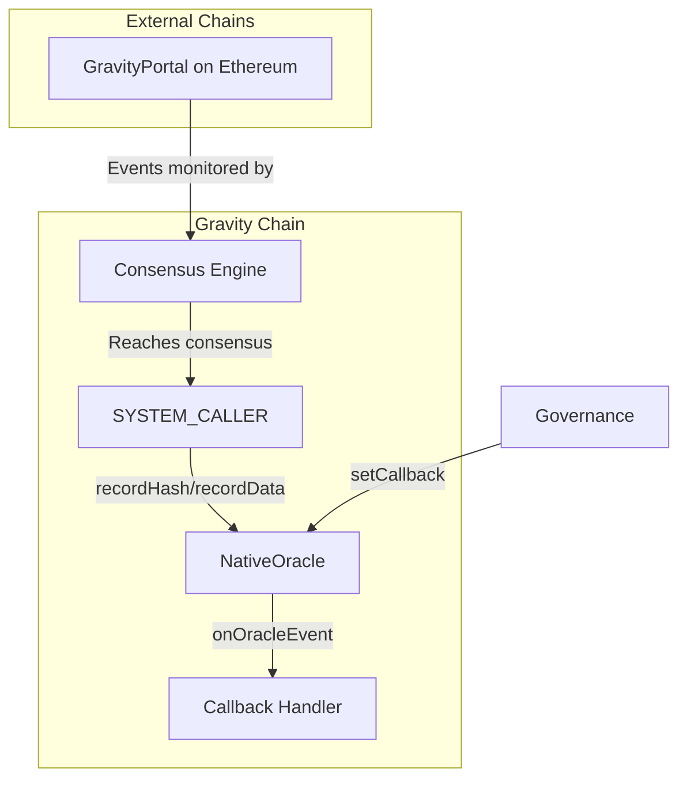

# Native Oracle Module — Build Progress

**Last Updated**: 2026-01-02  
**Status**: ✅ Complete (Spec + Implementation + Tests)

---

## Overview

The Native Oracle module stores and verifies data from external sources (blockchains, JWK providers, DNS records).
Data is recorded by the consensus engine via SYSTEM_CALLER after validators reach consensus. Supports hash-only mode
(storage-efficient) and data mode (direct access).

---

## Specification Status

| Document | Status | Location |
|----------|--------|----------|
| Oracle Spec | ✅ Complete | `spec_v2/oracle.spec.md` |

---

## Implementation Status

| Contract | Status | Location | Notes |
|----------|--------|----------|-------|
| `INativeOracle.sol` | ✅ Complete | `src/oracle/` | Interface with events, errors, structs |
| `NativeOracle.sol` | ✅ Complete | `src/oracle/` | Core implementation |

---

## Test Status

| Test File | Status | Tests |
|-----------|--------|-------|
| `NativeOracle.t.sol` | ✅ Pass | 39 tests (incl. 4 fuzz tests) |

**Total: 39 tests passed**

### Test Coverage

- Initialization (3 tests)
- Hash Recording (6 tests)
- Data Recording (2 tests)
- Batch Operations (4 tests)
- Callback System (6 tests)
- Verification (5 tests)
- Helper Functions (1 test)
- Fuzz Tests (4 tests)
- Event Tests (6 tests)
- Edge Cases (2 tests)

---

## Design Decisions Log

| Date | Decision | Rationale |
|------|----------|-----------|
| 2026-01-02 | Use existing `HASH_ORACLE` address (renamed to `NATIVE_ORACLE`) | Reuse allocated system address |
| 2026-01-02 | SYSTEM_CALLER calls NativeOracle directly | Consistent with Blocker pattern, no GravityPortal needed on Gravity chain |
| 2026-01-02 | Governance (GOVERNANCE) only for callback registration | Maximum security for callback control |
| 2026-01-02 | Simple callback interface, routers built later | Focus on core oracle, avoid over-engineering |
| 2026-01-02 | Callback gas limit of 500,000 | Prevents DOS while allowing reasonable callback logic |
| 2026-01-02 | Callbacks failures do NOT revert oracle recording | Critical for availability |

---

## Files Created

```
src/oracle/
├── INativeOracle.sol   # Interface (198 lines)
└── NativeOracle.sol    # Implementation (296 lines)

test/unit/oracle/
└── NativeOracle.t.sol  # Tests (583 lines)

spec_v2/
└── oracle.spec.md      # Specification
```

---

## Files Modified

| File | Changes |
|------|---------|
| `src/foundation/Errors.sol` | Added 4 oracle-specific errors |
| `src/foundation/SystemAddresses.sol` | Renamed `HASH_ORACLE` to `NATIVE_ORACLE` with updated comment |
| `test/unit/foundation/SystemAddresses.t.sol` | Updated to use `NATIVE_ORACLE` |

---

## Resolved Questions

| Question | Answer |
|----------|--------|
| System address for oracle | Use existing 0x1625F2023, renamed from HASH_ORACLE to NATIVE_ORACLE |
| GravityPortal on Gravity chain | Not needed, SYSTEM_CALLER calls oracle directly |
| Callback registration access | Governance (GOVERNANCE) only |
| G Token Bridge | Deferred to future implementation |

---

## Dependencies

```
Native Oracle depends on:
├── Foundation Layer
│   ├── SystemAddresses.sol (for SYSTEM_CALLER, GENESIS, GOVERNANCE)
│   ├── SystemAccessControl.sol (for requireAllowed)
│   └── Errors.sol (for custom errors)

Future dependents:
├── JWK Registry (will use oracle for JWK data storage)
├── Blockchain Event Router (will be callback handler)
├── G Token Bridge (will use oracle for cross-chain deposits)
└── DNS Verification (will use oracle for DNS records)
```

---

## Architecture



---

## Key Features

### Storage Modes

1. **Hash Mode** (`recordHash`): Store only keccak256(payload)
   - Storage-efficient
   - Users provide pre-image as calldata for verification
   - Use case: Cross-chain events

2. **Data Mode** (`recordData`): Store full payload
   - Direct contract access
   - Use case: JWK keys, DNS records

### Callback System

- Register callbacks per source via governance
- Callbacks invoked with 500k gas limit
- Failures caught (do NOT revert oracle recording)
- Events emitted for success/failure

### Source Management

- Each source identified by `sourceName = keccak256(eventType, sourceId)`
- Independent sync tracking per source
- Sync ID must be strictly increasing

---

## Next Steps

1. [ ] Implement JWK Registry (uses oracle for data storage)
2. [ ] Implement BlockchainEventRouter (callback handler for cross-chain events)
3. [ ] Implement G Token Bridge (uses oracle for deposits)
4. [ ] Integration tests with full flow

---

## Changelog

### 2026-01-02

- Created Native Oracle specification (`spec_v2/oracle.spec.md`)
- Added oracle-specific errors to `Errors.sol`:
  - `SyncIdNotIncreasing`
  - `ArrayLengthMismatch`
  - `DataRecordNotFound`
  - `OracleNotInitialized`
- Created interface `src/oracle/INativeOracle.sol`
- Implemented `src/oracle/NativeOracle.sol`
- Renamed `HASH_ORACLE` to `NATIVE_ORACLE` in SystemAddresses
- Wrote comprehensive test suite with 39 tests
- All tests pass

