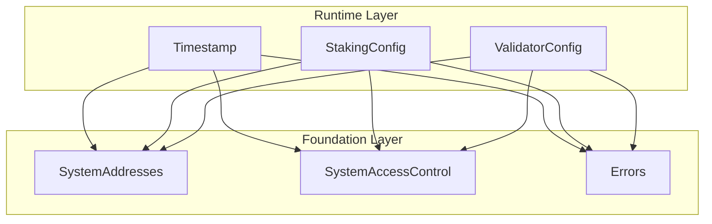

# Runtime Layer Build Log

## Overview

The Runtime layer provides mutable parameters and time infrastructure for all higher layers.

| Contract | Status | Tests | Description |
|----------|--------|-------|-------------|
| `Timestamp.sol` | ✅ Complete | 25 pass | On-chain time oracle |
| `StakingConfig.sol` | ✅ Complete | 26 pass | Governance staking parameters |
| `ValidatorConfig.sol` | ✅ Complete | 54 pass | Validator registry parameters |

**Total Tests**: 105 pass, 0 fail

---

## Files Created

### Source Files
- `src/runtime/Timestamp.sol` - On-chain time oracle with microsecond precision
- `src/runtime/StakingConfig.sol` - Governance staking configuration
- `src/runtime/ValidatorConfig.sol` - Validator registry configuration

### Test Files
- `test/unit/runtime/Timestamp.t.sol` - 25 tests (unit + fuzz)
- `test/unit/runtime/StakingConfig.t.sol` - 26 tests (unit + fuzz)
- `test/unit/runtime/ValidatorConfig.t.sol` - 54 tests (unit + fuzz)

### Documentation
- `spec_v2/runtime.spec.md` - Complete specification

### Modified Files
- `src/foundation/Errors.sol` - Added CONFIG ERRORS section:
  - `AlreadyInitialized()`
  - `InvalidLockupDuration()`
  - `InvalidUnbondingDelay()`
  - `InvalidMinimumBond()`
  - `InvalidVotingPowerIncreaseLimit(uint64 value)`
  - `InvalidValidatorSetSize(uint256 value)`
  - `MinimumBondExceedsMaximum(uint256 minimum, uint256 maximum)`

---

## Design Decisions

### 1. Time Convention
**Decision**: All time values use microseconds (uint64)

**Rationale**: Consistent with Aptos consensus engine and Timestamp contract. Provides sufficient precision for financial operations without overflow concerns (~584,000 years range).

### 2. No Initialize Function for Timestamp
**Decision**: Timestamp starts at 0, first `updateGlobalTime` sets initial time

**Rationale**: Simplifies deployment. Block contract sets time during first block prologue. No special genesis handling required.

### 3. Access Control Pattern
| Function Type | Allowed Caller | Example |
|---------------|----------------|---------|
| Read (view) | Anyone | `nowMicroseconds()`, `minimumStake()` |
| Initialize | GENESIS | `initialize()` |
| Update time | BLOCK | `updateGlobalTime()` |
| Update config | TIMELOCK | `setMinimumStake()` |

**Rationale**: 
- Genesis initialization is one-time during chain setup
- Only Block contract should update time (called by VM)
- Config changes require governance (via Timelock)

### 4. NIL Block Support
**Decision**: NIL blocks are detected via `proposer == SYSTEM_CALLER`

**Rationale**: Matches Aptos behavior. NIL blocks occur when no transactions need processing, time should not advance.

### 5. Validation Constraints

| Contract | Parameter | Constraint |
|----------|-----------|------------|
| StakingConfig | lockupDurationMicros | > 0 |
| StakingConfig | minimumStake | >= 0 (can be 0) |
| StakingConfig | minimumProposalStake | >= 0 (can be 0) |
| ValidatorConfig | minimumBond | > 0 |
| ValidatorConfig | maximumBond | >= minimumBond |
| ValidatorConfig | unbondingDelayMicros | > 0 |
| ValidatorConfig | votingPowerIncreaseLimitPct | 1-50 |
| ValidatorConfig | maxValidatorSetSize | 1-65536 |

---

## Test Coverage

### Timestamp Tests
- ✅ Initial state (microseconds = 0)
- ✅ Normal block time advancement
- ✅ NIL block time equality
- ✅ Revert on time going backwards (normal block)
- ✅ Revert on time mismatch (NIL block)
- ✅ Access control (only BLOCK can update)
- ✅ `nowSeconds()` conversion accuracy
- ✅ Event emission
- ✅ Fuzz tests for time advancement

### StakingConfig Tests
- ✅ Initial state (all zeros)
- ✅ Initialize with valid parameters
- ✅ Revert on double initialization
- ✅ Revert on invalid lockup duration (0)
- ✅ All setters with TIMELOCK caller
- ✅ Revert on non-TIMELOCK caller
- ✅ Events emitted correctly
- ✅ Fuzz tests for parameter updates

### ValidatorConfig Tests
- ✅ Initial state (all zeros)
- ✅ Constants (MAX_VOTING_POWER_INCREASE_LIMIT, MAX_VALIDATOR_SET_SIZE)
- ✅ Initialize with all parameter combinations
- ✅ Revert on invalid parameters during init
- ✅ All setters with validation
- ✅ Access control for all setters
- ✅ Events emitted correctly
- ✅ Fuzz tests for parameter updates

---

## Dependencies



---

## Next Steps

The Runtime layer is complete. Higher layers can now be built:

1. **Layer 2 (Staking)**: Will use `Timestamp` for time and `StakingConfig` for parameters
2. **Layer 3 (ValidatorRegistry)**: Will use `Timestamp` for time and `ValidatorConfig` for parameters
3. **Layer 4 (Block)**: Will call `Timestamp.updateGlobalTime()` in block prologue

---

## Build Commands

```bash
# Compile
forge build

# Run Runtime tests only
forge test --match-path "test/unit/runtime/*.t.sol" -v

# Run all tests
forge test

# Run with gas report
forge test --gas-report
```

---

## Changelog

### 2026-01-01
- Initial implementation of Runtime layer
- Added Timestamp.sol with NIL block support
- Added StakingConfig.sol with governance parameters
- Added ValidatorConfig.sol with validator parameters
- Added 105 tests (all passing)
- Created spec_v2/runtime.spec.md
- Added config errors to Errors.sol

