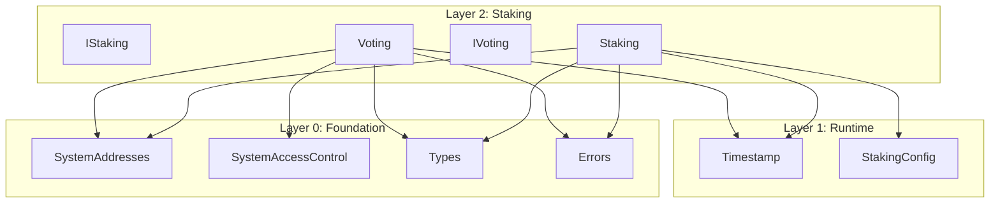

# Staking Layer Build Log

## Overview

The Staking layer (Layer 2) provides governance staking and voting infrastructure for Gravity.

| Contract | Status | Tests | Description |
|----------|--------|-------|-------------|
| `Staking.sol` | ✅ Complete | 26 pass | Governance staking (anyone can stake) |
| `Voting.sol` | ✅ Complete | 32 pass | Generic voting engine |

**Total Tests**: 58 pass, 0 fail

---

## Files Created

### Source Files
- `src/staking/IStaking.sol` - Interface for governance staking
- `src/staking/Staking.sol` - Implementation with lockup-only model
- `src/staking/IVoting.sol` - Interface for voting engine
- `src/staking/Voting.sol` - Implementation with early resolution support

### Test Files
- `test/unit/staking/Staking.t.sol` - 26 tests (unit + fuzz)
- `test/unit/staking/Voting.t.sol` - 32 tests (unit + fuzz)

### Documentation
- `spec_v2/staking.spec.md` - Complete specification

### Modified Files
- `src/foundation/SystemAddresses.sol` - Added `STAKING` and `VOTING` addresses:
  - `STAKING = 0x0000000000000000000000000001625F2012`
  - `VOTING = 0x0000000000000000000000000001625F2014`

---

## Design Decisions

### 1. Unstake Model: Lockup-Only

**Decision**: Use lockup-only model (Option C from analysis)

**Alternatives Considered**:
- Option A: Immediate withdrawal when lockup expires
- Option B: Two-step (requestUnstake → unbonding delay → claimUnstaked)
- **Option C: Lockup-only** (selected)

**Rationale**: 
- Simpler than two-step model
- Single parameter (`lockupDurationMicros` already exists in StakingConfig)
- The lockup duration serves as the unbonding period
- Voting power = locked stake only (protects against flash-unstake after voting)

### 2. System Addresses

**Decision**: Add fixed system addresses for STAKING and VOTING

**Addresses Assigned**:
- `STAKING = 0x...2012` (between STAKE_CONFIG and VALIDATOR_MANAGER)
- `VOTING = 0x...2014` (after VALIDATOR_MANAGER)

**Rationale**: Consistent with the `0x1625F2xxx` pattern used throughout the codebase.

### 3. Time Units

**Decision**: All time values use microseconds (uint64)

**Rationale**: Consistent with Timestamp contract and all other Gravity contracts.

### 4. Voting Model

**Decision**: Generic voting engine called by governance

| Design Choice | Selected |
|---------------|----------|
| Who calls createProposal | Governance contract (or anyone) |
| Who calls vote | Governance contract (or anyone) |
| Vote tracking | Per-call accumulation (no duplicate prevention) |
| Early resolution | Optional via threshold |

**Rationale**: 
- Keep Voting.sol as a generic primitive
- Higher-level governance contract handles:
  - Proposal stake requirements
  - Vote delegation
  - Double-vote prevention
  - Execution

---

## Test Coverage

### Staking Tests (26 total)

**Unit Tests:**
- ✅ `test_stake_createsNewPosition`
- ✅ `test_stake_addsToExistingPosition`
- ✅ `test_stake_extendsLockup`
- ✅ `test_stake_emitsStakedEvent`
- ✅ `test_stake_revertsOnZeroAmount`
- ✅ `test_getVotingPower_returnsStakeWhenLocked`
- ✅ `test_getVotingPower_returnsZeroWhenLockupExpired`
- ✅ `test_getVotingPower_returnsZeroForNonStaker`
- ✅ `test_isLocked_returnsTrueWhenLocked`
- ✅ `test_isLocked_returnsFalseWhenExpired`
- ✅ `test_unstake_withdrawsPartialAmount`
- ✅ `test_unstake_emitsUnstakedEvent`
- ✅ `test_unstake_revertsWhenLocked`
- ✅ `test_unstake_revertsOnZeroAmount`
- ✅ `test_unstake_revertsOnInsufficientStake`
- ✅ `test_unstake_revertsOnNoStakePosition`
- ✅ `test_withdraw_withdrawsFullAmount`
- ✅ `test_withdraw_revertsWhenLocked`
- ✅ `test_withdraw_revertsOnNoStakePosition`
- ✅ `test_extendLockup_extendsLockup`
- ✅ `test_extendLockup_emitsLockupExtendedEvent`
- ✅ `test_extendLockup_revertsOnNoStakePosition`
- ✅ `test_extendLockup_revertsIfNotExtending`

**Fuzz Tests:**
- ✅ `testFuzz_stake_variousAmounts`
- ✅ `testFuzz_unstake_afterLockup`
- ✅ `testFuzz_multipleStakers`

### Voting Tests (32 total)

**Unit Tests:**
- ✅ `test_createProposal_createsNewProposal`
- ✅ `test_createProposal_incrementsProposalId`
- ✅ `test_createProposal_emitsProposalCreatedEvent`
- ✅ `test_vote_castsYesVote`
- ✅ `test_vote_castsNoVote`
- ✅ `test_vote_accumulatesVotes`
- ✅ `test_vote_emitsVoteCastEvent`
- ✅ `test_vote_revertsOnNonExistentProposal`
- ✅ `test_vote_revertsAfterVotingPeriod`
- ✅ `test_getProposalState_pendingDuringVoting`
- ✅ `test_getProposalState_succeededWhenPassed`
- ✅ `test_getProposalState_failedWhenNotEnoughVotes`
- ✅ `test_getProposalState_failedWhenMoreNoVotes`
- ✅ `test_getProposalState_revertsOnNonExistent`
- ✅ `test_isVotingClosed_falseBeforeExpiration`
- ✅ `test_isVotingClosed_trueAfterExpiration`
- ✅ `test_isVotingClosed_trueWhenResolved`
- ✅ `test_resolve_resolvesSucceededProposal`
- ✅ `test_resolve_resolvesFailedProposal`
- ✅ `test_resolve_emitsProposalResolvedEvent`
- ✅ `test_resolve_revertsBeforeVotingEnds`
- ✅ `test_resolve_revertsOnAlreadyResolved`
- ✅ `test_resolve_revertsOnNonExistent`
- ✅ `test_setEarlyResolutionThreshold_setsThreshold`
- ✅ `test_setEarlyResolutionThreshold_revertsUnauthorized`
- ✅ `test_canBeResolvedEarly_falseWhenThresholdZero`
- ✅ `test_canBeResolvedEarly_trueWhenYesExceedsThreshold`
- ✅ `test_canBeResolvedEarly_trueWhenNoExceedsThreshold`
- ✅ `test_resolve_earlyWithThreshold`

**Fuzz Tests:**
- ✅ `testFuzz_createProposal_variousThresholds`
- ✅ `testFuzz_vote_variousAmounts`
- ✅ `testFuzz_multipleProposals`

---

## Dependencies



---

## Next Steps

The Staking layer is complete. The following layers can now be built:

1. **Layer 3 (ValidatorRegistry)** - Validator registration, bonding, set management
2. **Layer 4 (Block)** - Block prologue/epilogue
3. **Layer 5 (Reconfiguration)** - Epoch transitions
4. **Layer 6 (Governance)** - Full governance using Staking + Voting

---

## Build Commands

```bash
# Compile
forge build

# Run Staking layer tests only
forge test --match-path "test/unit/staking/*.t.sol" -v

# Run all tests
forge test

# Run with gas report
forge test --gas-report
```

---

## Changelog

### 2026-01-01

- Initial implementation of Staking layer
- Added IStaking.sol and Staking.sol with lockup-only model
- Added IVoting.sol and Voting.sol with early resolution support
- Added STAKING and VOTING to SystemAddresses.sol
- Created 58 tests (all passing)
- Created spec_v2/staking.spec.md

