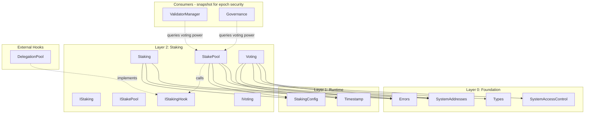

# Staking Layer Build Log

## Overview

The Staking layer (Layer 2) provides generic staking infrastructure for Gravity. It is **decoupled from validator management** — anyone can create a StakePool for any purpose (governance voting, delegation, validator bonding, etc.).

| Contract | Status | Tests | Description |
|----------|--------|-------|-------------|
| `Staking.sol` | ✅ Complete | 75 pass | Factory that creates StakePools via CREATE2 |
| `StakePool.sol` | ✅ Complete | (tested via Staking.t.sol) | Individual stake pool per owner |
| `IStakingHook.sol` | ✅ Complete | (tested via Staking.t.sol) | Optional callback interface |
| `Voting.sol` | ✅ Complete | (unchanged) | Generic voting engine |

**Total Tests**: 75 pass (staking), 0 fail

---

## Architecture (v2 - Factory Pattern)

```
src/staking/
├── IStaking.sol       # Factory interface
├── Staking.sol        # Factory implementation (creates StakePools via CREATE2)
├── IStakePool.sol     # Individual pool interface
├── StakePool.sol      # Individual pool implementation
├── IStakingHook.sol   # Optional callback interface for extensibility
├── IVoting.sol        # Voting engine interface (unchanged)
└── Voting.sol         # Voting engine implementation (unchanged)
```

---

## Files Created/Modified

### Source Files
- `src/staking/IStaking.sol` - Factory interface (rewritten)
- `src/staking/Staking.sol` - Factory implementation (rewritten)
- `src/staking/IStakePool.sol` - Individual pool interface (NEW)
- `src/staking/StakePool.sol` - Individual pool implementation (NEW)
- `src/staking/IStakingHook.sol` - Optional callback interface (NEW)
- `src/staking/IVoting.sol` - Voting interface (unchanged)
- `src/staking/Voting.sol` - Voting implementation (unchanged)

### Test Files
- `test/unit/staking/Staking.t.sol` - 56 tests (unit + fuzz + invariant)

### Modified Files
- `src/foundation/Errors.sol` - Added new staking errors:
  - `InsufficientStakeForPoolCreation(uint256 sent, uint256 required)`
  - `PoolIndexOutOfBounds(uint256 index, uint256 total)`
  - `InvalidPool(address pool)` - SECURITY: For invalid pool queries
  - `LockupDurationTooShort(uint64 provided, uint64 minimum)`
  - `LockupOverflow(uint64 current, uint64 addition)`

---

## Design Decisions

### 1. Factory Pattern (v2)

**Previous Design**: Single `Staking.sol` contract with mapping of staker → stake position.

**New Design**: Factory pattern where each user creates their own `StakePool` contract.

**Rationale**:
- Individual contracts are more flexible (can be transferred, have custom logic)
- Enables hook extensibility for delegation pools, liquid staking, etc.
- Follows Aptos's stake.move design with role separation
- CREATE2 ensures deterministic addresses

### 2. Role Separation (Aptos-inspired)

| Role | Controlled By | Can Do |
|------|--------------|--------|
| **Owner** | `owner` address | Add/withdraw stake, set operator/voter/hook, increase lockup |
| **Operator** | `operator` address | Reserved for validator operations (future) |
| **Voter** | `voter` address | Cast governance votes using pool's voting power |

Initially all three roles default to the pool creator (owner).

### 3. Pool Validation (Security Critical)

**Only pools created by the Staking factory are trusted.**

The factory maintains:
- `_isPool` mapping to track valid pools
- `isPool(address)` function for validators to verify pool validity
- All pool query functions (`getPoolVotingPower`, etc.) revert for invalid pools

**Security Implication**: Validators MUST call `isPool(pool)` before trusting any pool's voting power. This prevents attackers from deploying fake StakePool contracts that report arbitrary voting power.

### 4. Simple Lockup Model

- Single stake amount + lockup timestamp
- **Immediate effect**: Stake changes affect voting power immediately
- **Lockup protection**: Only locked stake counts for voting power
- **Consumers snapshot**: ValidatorManager/Governance can snapshot at epoch/proposal creation

```
votingPower = (lockedUntil > now) ? stake : 0
```

### 4. Hook Extensibility

Optional `IStakingHook` interface allows custom logic during stake lifecycle:
- `onStakeAdded(uint256 amount)` - Called when stake added
- `onStakeWithdrawn(uint256 amount)` - Called when stake withdrawn
- `onLockupIncreased(uint64 newLockedUntil)` - Called when lockup extended

Use cases: Delegation pools, liquid staking tokens, notification services, vesting contracts.

---

## Test Coverage

### Staking Factory Tests (32 tests)
- ✅ `test_createPool_createsNewPool`
- ✅ `test_createPool_setsCorrectOwner`
- ✅ `test_createPool_setsInitialStake`
- ✅ `test_createPool_setsInitialLockup`
- ✅ `test_createPool_emitsPoolCreatedEvent`
- ✅ `test_createPool_incrementsNonce`
- ✅ `test_createPool_allowsMultiplePoolsPerOwner`
- ✅ `test_createPool_anyoneCanCreate`
- ✅ `test_RevertWhen_createPool_insufficientStake`
- ✅ `test_RevertWhen_createPool_zeroStake`
- ✅ `test_getPool_revertsOnInvalidIndex`
- ✅ `test_getAllPools_returnsAllPools`
- ✅ `test_getMinimumStake_returnsConfigValue`

**Pool Validation & Status Queries (19 tests):**
- ✅ `test_isPool_returnsTrueForValidPool`
- ✅ `test_isPool_returnsFalseForInvalidPool`
- ✅ `test_isPool_returnsFalseForArbitraryContract`
- ✅ `test_getPoolVotingPower_returnsCorrectValue`
- ✅ `test_getPoolVotingPower_returnsZeroWhenUnlocked`
- ✅ `test_RevertWhen_getPoolVotingPower_invalidPool`
- ✅ `test_getPoolStake_returnsCorrectValue`
- ✅ `test_RevertWhen_getPoolStake_invalidPool`
- ✅ `test_getPoolOwner_returnsCorrectValue`
- ✅ `test_RevertWhen_getPoolOwner_invalidPool`
- ✅ `test_getPoolVoter_returnsCorrectValue`
- ✅ `test_RevertWhen_getPoolVoter_invalidPool`
- ✅ `test_getPoolOperator_returnsCorrectValue`
- ✅ `test_RevertWhen_getPoolOperator_invalidPool`
- ✅ `test_getPoolLockedUntil_returnsCorrectValue`
- ✅ `test_RevertWhen_getPoolLockedUntil_invalidPool`
- ✅ `test_isPoolLocked_returnsTrueWhenLocked`
- ✅ `test_isPoolLocked_returnsFalseWhenUnlocked`
- ✅ `test_RevertWhen_isPoolLocked_invalidPool`

### StakePool Tests (35 tests)

**Basic Operations:**
- ✅ `test_addStake_increasesStake`
- ✅ `test_addStake_extendsLockupIfNeeded`
- ✅ `test_addStake_emitsStakeAddedEvent`
- ✅ `test_RevertWhen_addStake_zeroAmount`
- ✅ `test_RevertWhen_addStake_notOwner`

**Voting Power:**
- ✅ `test_getVotingPower_returnsStakeWhenLocked`
- ✅ `test_getVotingPower_returnsZeroWhenUnlocked`
- ✅ `test_isLocked_returnsTrueWhenLocked`
- ✅ `test_isLocked_returnsFalseWhenUnlocked`
- ✅ `test_getRemainingLockup_returnsCorrectValue`
- ✅ `test_getRemainingLockup_returnsZeroWhenExpired`

**Withdraw:**
- ✅ `test_withdraw_withdrawsStake`
- ✅ `test_withdraw_emitsStakeWithdrawnEvent`
- ✅ `test_RevertWhen_withdraw_locked`
- ✅ `test_RevertWhen_withdraw_zeroAmount`
- ✅ `test_RevertWhen_withdraw_insufficientStake`
- ✅ `test_RevertWhen_withdraw_notOwner`

**Lockup Management:**
- ✅ `test_increaseLockup_extendsLockup`
- ✅ `test_increaseLockup_emitsLockupIncreasedEvent`
- ✅ `test_increaseLockup_restoresVotingPower`
- ✅ `test_RevertWhen_increaseLockup_durationTooShort`
- ✅ `test_RevertWhen_increaseLockup_overflow`
- ✅ `test_RevertWhen_increaseLockup_notOwner`

**Role Separation:**
- ✅ `test_defaultRoles_setToOwner`
- ✅ `test_setOperator_changesOperator`
- ✅ `test_setOperator_emitsOperatorChangedEvent`
- ✅ `test_RevertWhen_setOperator_notOwner`
- ✅ `test_setVoter_changesVoter`
- ✅ `test_setVoter_emitsVoterChangedEvent`
- ✅ `test_RevertWhen_setVoter_notOwner`

**Hook Integration:**
- ✅ `test_setHook_setsHook`
- ✅ `test_setHook_emitsHookChangedEvent`
- ✅ `test_hook_calledOnAddStake`
- ✅ `test_hook_calledOnWithdraw`
- ✅ `test_hook_calledOnIncreaseLockup`
- ✅ `test_RevertWhen_setHook_notOwner`

### Fuzz Tests (4 tests)
- ✅ `testFuzz_createPool_variousAmounts`
- ✅ `testFuzz_addStake_variousAmounts`
- ✅ `testFuzz_withdraw_afterLockup`
- ✅ `testFuzz_multiplePools_concurrentOperations`

### Invariant Tests (3 tests)
- ✅ `test_invariant_votingPowerMatchesLockedStake`
- ✅ `test_invariant_lockupNeverDecreases`
- ✅ `test_invariant_withdrawOnlyWhenUnlocked`

---

## Dependencies



---

## Usage Examples

### Creating a StakePool and Staking

```solidity
// 1. Create a stake pool with initial stake (must meet minimum)
address pool = staking.createPool{value: 100 ether}(msg.sender);

// 2. Add more stake later (voting power increases immediately)
IStakePool(pool).addStake{value: 50 ether}();

// 3. Check voting power (150 ether if locked)
uint256 power = IStakePool(pool).getVotingPower();

// 4. Delegate voting to another address
IStakePool(pool).setVoter(delegatee);

// 5. Extend lockup by 30 days (must be >= minLockupDuration)
IStakePool(pool).increaseLockup(30 days * 1_000_000); // microseconds

// 6. Wait for lockup to expire, then withdraw
IStakePool(pool).withdraw(50 ether);
```

### Setting Up a Delegation Pool

```solidity
// 1. Create stake pool with initial stake
address pool = staking.createPool{value: 100 ether}(msg.sender);

// 2. Deploy delegation hook
DelegationHook hook = new DelegationHook(pool);

// 3. Set hook on pool
IStakePool(pool).setHook(address(hook));

// 4. Now delegators interact with hook contract
hook.delegate{value: 10 ether}();
```

---

## Next Steps

The Staking layer is complete. The following layers can now be built:

1. **Layer 3 (ValidatorRegistry)** - Validator registration, bonding, set management
2. **Layer 4 (Block)** - Block prologue/epilogue
3. **Layer 5 (Reconfiguration)** - Epoch transitions
4. **Layer 6 (Governance)** - Full governance using Staking + Voting

---

## Build Commands

```bash
# Compile
forge build

# Run Staking layer tests only
forge test --match-path "test/unit/staking/*.t.sol" -v

# Run all tests
forge test

# Run with gas report
forge test --gas-report
```

---

## Changelog

### 2026-01-01 (v2 - Factory Pattern Rewrite)

- Rewrote staking module to use factory pattern (CREATE2)
- Added IStakePool.sol and StakePool.sol for individual pools
- Added IStakingHook.sol for extensibility
- Rewrote IStaking.sol and Staking.sol as factory
- Updated Errors.sol with new staking errors
- Created 56 tests (all passing)
- Updated spec_v2/staking.spec.md

### 2026-01-01 (v1 - Initial Implementation)

- Initial implementation of Staking layer
- Added IStaking.sol and Staking.sol with lockup-only model
- Added IVoting.sol and Voting.sol with early resolution support
- Added STAKING and VOTING to SystemAddresses.sol
- Created 58 tests (all passing)
- Created spec_v2/staking.spec.md
