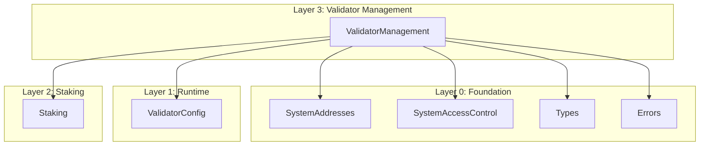

# Validator Management Build Log

## Overview

The Validator Management layer (Layer 3) provides validator lifecycle management for Gravity's consensus. Validators must have a StakePool with sufficient voting power to register and participate in consensus.

| Contract | Status | Tests | Description |
|----------|--------|-------|-------------|
| `IValidatorManagement.sol` | ✅ Complete | - | Interface definition |
| `ValidatorManagement.sol` | ✅ Complete | 38 pass | Validator lifecycle management |

**Total Tests**: 38 pass, 0 fail

---

## Architecture

```
src/staking/
├── IValidatorManagement.sol   # Interface
└── ValidatorManagement.sol    # Implementation
```

---

## Files Created/Modified

### Source Files
- `src/staking/IValidatorManagement.sol` - Interface with events and function signatures (NEW)
- `src/staking/ValidatorManagement.sol` - Full implementation (NEW)
- `src/foundation/SystemAddresses.sol` - Added `VALIDATOR_CONFIG` address
- `src/foundation/Errors.sol` - Added `ValidatorIndexOutOfBounds` error

### Test Files
- `test/unit/staking/ValidatorManagement.t.sol` - 38 tests (unit + fuzz + invariant)

### Documentation
- `spec_v2/validator_management.spec.md` - Specification document
- `build_logs/validator_management.md` - This build log

---

## Design Decisions

### 1. StakePool Integration

**Decision**: Validators must have a StakePool created by the Staking factory.

**Rationale**:
- Reuses existing staking infrastructure
- StakePool's voting power determines eligibility
- Clear separation: Staking manages stake, ValidatorManager manages validator lifecycle

### 2. ValidatorManager ↔ Staking Only

**Decision**: ValidatorManager only calls the Staking factory contract, never StakePool directly.

**Rationale**:
- Cleaner separation of concerns
- Single point of trust for pool validation
- Consistent interface for all pool queries

### 3. Aptos-Style Index Assignment

**Decision**: Validators get indices assigned at each epoch boundary.

**Rationale**:
- Consensus protocol references validators by index (not address)
- Indices must be contiguous (0 to n-1)
- Re-assigned every epoch to maintain contiguity after validators leave

### 4. Operator-Controlled Operations

**Decision**: All validator operations require the stake pool's operator.

**Rationale**:
- Follows Aptos's role separation pattern
- Operator can be different from owner
- Allows delegation of validator operations

### 5. Epoch-Based Transitions

**Decision**: All status transitions happen at epoch boundaries via `onNewEpoch()`.

**Rationale**:
- Prevents flash-stake attacks
- Provides stable validator set within an epoch
- Allows voting power limit enforcement

---

## Test Coverage

### Registration Tests (6 tests)
- ✅ `test_registerValidator_success`
- ✅ `test_registerValidator_emitsEvent`
- ✅ `test_RevertWhen_registerValidator_invalidPool`
- ✅ `test_RevertWhen_registerValidator_notOperator`
- ✅ `test_RevertWhen_registerValidator_alreadyExists`
- ✅ `test_RevertWhen_registerValidator_insufficientBond`
- ✅ `test_RevertWhen_registerValidator_monikerTooLong`

### Join Validator Set Tests (5 tests)
- ✅ `test_joinValidatorSet_success`
- ✅ `test_joinValidatorSet_emitsEvent`
- ✅ `test_RevertWhen_joinValidatorSet_notInactive`
- ✅ `test_RevertWhen_joinValidatorSet_validatorNotFound`
- ✅ `test_RevertWhen_joinValidatorSet_notOperator`
- ✅ `test_RevertWhen_joinValidatorSet_setChangesDisabled`

### Leave Validator Set Tests (3 tests)
- ✅ `test_leaveValidatorSet_success`
- ✅ `test_leaveValidatorSet_emitsEvent`
- ✅ `test_RevertWhen_leaveValidatorSet_notActive`

### Epoch Processing Tests (10 tests)
- ✅ `test_onNewEpoch_activatesPendingValidator`
- ✅ `test_onNewEpoch_deactivatesPendingInactive`
- ✅ `test_onNewEpoch_assignsIndicesCorrectly`
- ✅ `test_onNewEpoch_reassignsIndicesAfterLeave`
- ✅ `test_onNewEpoch_updatesTotalVotingPower`
- ✅ `test_onNewEpoch_capsVotingPowerAtMaxBond`
- ✅ `test_onNewEpoch_emitsEpochProcessedEvent`
- ✅ `test_RevertWhen_onNewEpoch_notReconfiguration`
- ✅ `test_onNewEpoch_respectsVotingPowerLimit`
- ✅ `test_onNewEpoch_activatesWithinLimit`

### Operator Function Tests (4 tests)
- ✅ `test_rotateConsensusKey_success`
- ✅ `test_rotateConsensusKey_emitsEvent`
- ✅ `test_setFeeRecipient_success`
- ✅ `test_setFeeRecipient_appliedAtEpoch`

### View Function Tests (3 tests)
- ✅ `test_getActiveValidatorByIndex_success`
- ✅ `test_RevertWhen_getActiveValidatorByIndex_outOfBounds`
- ✅ `test_getValidatorStatus_allStatuses`

### Fuzz Tests (2 tests)
- ✅ `testFuzz_registerValidator_variousBondAmounts`
- ✅ `testFuzz_multipleValidators`

### Invariant Tests (3 tests)
- ✅ `test_invariant_indicesAreContiguous`
- ✅ `test_invariant_totalVotingPowerMatchesSum`
- ✅ `test_invariant_onlyActiveHasValidIndex`

---

## Dependencies



---

## Key Implementation Details

### Validator Identity
- StakePool address serves as the validator identity
- One StakePool can only register one validator

### Voting Power Calculation
```solidity
power = min(StakePool.votingPower, ValidatorConfig.maximumBond)
```

### Voting Power Increase Limit
- New validators can only add up to X% of current total per epoch
- Validators exceeding limit remain in PENDING_ACTIVE for next epoch

### Fee Recipient Updates
- Changes are stored as `pendingFeeRecipient`
- Applied at next epoch in `onNewEpoch()`

---

## Build Commands

```bash
# Compile
forge build

# Run ValidatorManagement tests only
forge test --match-contract ValidatorManagementTest -v

# Run all tests
forge test

# Run with gas report
forge test --gas-report
```

---

## Next Steps

The Validator Management layer is complete. The following layers can now be built:

1. **Layer 4 (Block)** - Block prologue/epilogue
2. **Layer 5 (Reconfiguration)** - Epoch lifecycle and reconfiguration
3. **Layer 6 (Governance)** - Full governance using Staking + Voting

---

## Changelog

### 2026-01-01

- Created `IValidatorManagement.sol` interface
- Implemented `ValidatorManagement.sol` with full lifecycle management
- Added `VALIDATOR_CONFIG` to SystemAddresses (0x1625F2015)
- Added `ValidatorIndexOutOfBounds` error to Errors.sol
- Created 38 tests (all passing)
- Created `spec_v2/validator_management.spec.md`
- Created `build_logs/validator_management.md`

