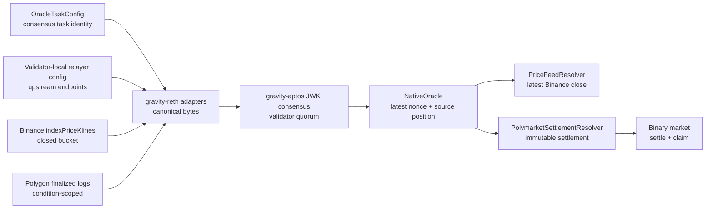

# Oracle Production Readiness

This branch is organized around two capabilities: Binance closed-bucket price
feeds and Polygon Polymarket settlement mirrors.

## Component ownership



The execution client does not discover markets or providers dynamically. Stable
tasks are installed through genesis or governance/epoch configuration. Provider
URLs stay local to each validator.

## Required invariants

Price feed:

- every validator requests the same pair, interval, and exact bucket range
- only a closed bucket with exact `openTime` and `closeTime` is accepted
- delivery nonce is sequential; market round id is time-derived
- one feed id has one immutable continuous bucket origin
- HTTP responses are streamed into a bounded buffer and request duration is capped
- fixed tasks reject buckets older than confirmed feed history
- callback success and source progress advancement are atomic
- only the latest price is retained; no historical rounds accumulate on-chain

Polymarket mirror:

- RPC endpoint must report Polygon chain id `137`
- every task must bind one CTF address and one `conditionId`
- only finalized blocks are scanned
- malformed filtered logs fail without cursor advancement
- source events are ordered by block, log index, and transaction hash
- mirror configuration and accepted settlement are immutable
- callback success and source progress advancement are atomic
- one terminal settlement is retained per configured mirror

Market contracts:

- governance creates markets with deployed collateral and resolver contracts
- unknown market ids revert
- non-exact collateral deposits and payouts are rejected by balance-delta checks
- split payout vectors do not choose an arbitrary winner
- no-winning-stake and oracle-timeout paths refund users

## Recovery model

The relayer caches a fetched payload until `NativeOracle.latestNonce` catches up.
This lets a validator repeatedly gossip byte-identical data while JWK consensus
is pending. Persisted progress may be ahead after a crash; startup reconciliation
rolls it back to the confirmed on-chain nonce and source position.

The execution adapter accepts only canonical ABI encoding of the UnsupportedJWK
wrapper before constructing `NativeOracle.recordBatch`.

Callback execution and progress advancement happen in one transaction. A missing,
out-of-gas, malformed, or reverting callback reverts the delivery, leaves the
nonce unchanged, and allows consensus to retry the same canonical payload. No
new raw payload history is stored in `NativeOracle`.

## Test gates

Before review:

```bash
# contracts
forge test --skip DeployBridgeHandoff --match-path 'test/unit/oracle/*.t.sol'

# relayer and execution mapping
cargo test -p reth-pipe-exec-layer-relayer
cargo test -p reth-pipe-exec-layer-ext-v2 --lib jwk_oracle

# local combined chain E2E
./gravity_e2e/run_test.sh oracle_demo --force-init
```

Live provider probes are separate, explicit tests. They are not part of the
default deterministic CI gate.

See [Oracle Security Review](oracle_security_review.md) for completed hardening
and the remaining product decisions required before a real-money launch.
