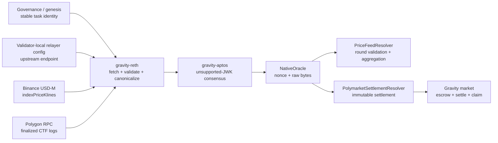
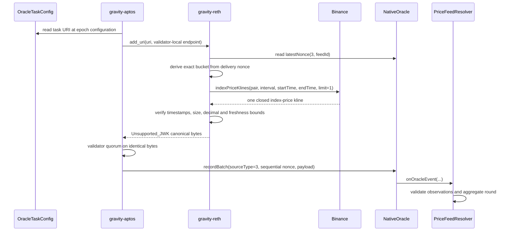
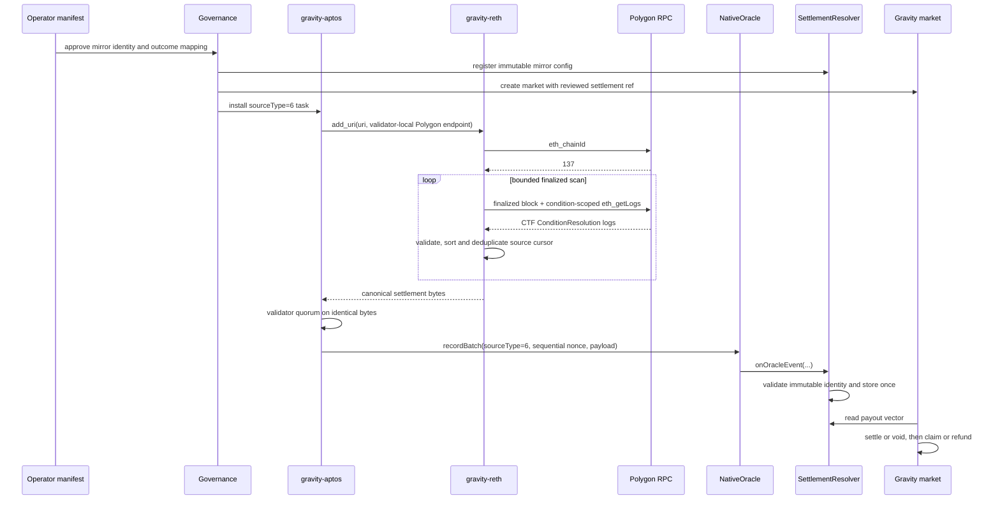

# Oracle Workflow: Binance Price Feed and Polymarket Mirror

## Scope

This branch has two production-candidate oracle products:

| source type | Product | External identity |
| --- | --- | --- |
| `3` | Binance index-price feed | pair + interval + exact closed bucket |
| `6` | Polymarket settlement mirror | Polygon CTF + condition id + finalized log cursor |

Both products reuse the existing unsupported-JWK consensus transport. Direct
HTTP sports-score and news adapters are outside this scope.

Related documents:

- [Oracle Production Readiness](oracle_production_readiness.md)
- [Polymarket Mirror Runbook](runbooks/polymarket-match-market-runbook.md)
- [Polymarket Market Contract Design](plans/polymarket-match-market-oracle-spec.md)

## Ownership Boundaries



`OracleTaskConfig` stores public, deterministic task parameters. Provider URLs,
credentials, tenant paths, and failover endpoints stay in validator-local
relayer configuration. The exact `gravity://` URI is the lookup key joining
those two layers.

The execution client does not discover Polymarket markets or Binance products.
Operators first review the external identity, then governance installs a stable
task. Dynamic one-off request discovery is a separate feature.

## Price Feed Workflow

Example task identity:

```text
gravity://3/1001/price_feed
  ?provider=binance_index_kline_v1
  &pair=TSLAUSDT
  &interval=1m
  &bucketStartMs=<aligned-start>
  &continuous=true
  &decimals=8
  &aggregationMode=2
  &minSourceCount=1
  &minTotalWeight=1
  &maxStaleness=180000
  &graceMs=120000
```



For continuous feeds, Gravity delivery nonce is not the market round id:

```text
bucketStart(n) = configuredStart + (n - 1) * intervalMs
bucketEnd(n)   = bucketStart(n) + intervalMs - 1
roundId(n)     = bucketStart(n) / intervalMs
resolvedAt(n)  = bucketEnd(n)
```

This mapping lets validators that poll at different wall-clock instants request
the same immutable bucket. `provider=inline_fixture_v1` exists only for local
deterministic tests and must be explicit; a missing provider is rejected.
The configured bucket origin is immutable for one `feedId`; a new origin must
use a new feed id so historical nonces keep one time mapping.

## Polymarket Mirror Workflow

An operator-reviewed manifest must freeze at least:

- Polymarket title, rules, slug, and metadata snapshot hash
- Polygon chain id `137`
- CTF address, `conditionId`, `questionId`, and outcome slot count
- Gravity `mirrorId`, outcome labels, and `slotToOutcome`
- safe `fromBlock` and oracle deadline

Example task identity:

```text
gravity://6/7202626/polymarket_settlement
  ?ctf=<CTF-address>
  &condition=<condition-id>
  &fromBlock=<safe-exclusive-cursor>
  &maxBlocksPerPoll=1000
```



A Polygon event proves settlement, but it does not contain enough product
metadata to create a safe Gravity market automatically. Market discovery and
manifest review remain off-chain operator responsibilities.

`fromBlock` is an exclusive cursor: choose a reviewed block before the expected
settlement. Malformed filtered logs fail the poll without cursor advancement,
and one mirror stops scanning after its single immutable settlement.

## Idempotency and Recovery

There are two independent cursors:

| Cursor | Meaning |
| --- | --- |
| source cursor | Binance bucket or Polygon `(block, logIndex, txHash)` progress |
| delivery nonce | sequential `NativeOracle` nonce for `(sourceType, sourceId)` |

The relayer returns a canonical payload once and advances its in-memory source
cursor. The SDK-side observer caches that complete poll result. Until
`NativeOracle.latestNonce` catches up, retries gossip the same cached bytes
instead of fetching a new external value.

Persisted progress records fetched data, so it can be ahead of chain state after
a crash. Startup reconciliation compares it with `NativeOracle.latestNonce`:

- chain ahead: fast-forward local progress;
- equal: restore the persisted cursor;
- local ahead: roll back to the confirmed nonce and source block;
- no state: start from the configured cursor.

`NativeOracle` stores raw bytes even when a callback fails. After fixing the
callback cause, anyone can call `replayPrice(feedId, nonce)` or
`replaySettlement(mirrorId, nonce)`; both functions read the consensus-approved
record from `NativeOracle` rather than accepting caller-provided bytes. Price
replay can fill a missing historical round without moving `latestPrice`
backward.

## Test Gates

```bash
# gravity_chain_core_contracts
forge test --skip DeployBridgeHandoff --match-path 'test/unit/oracle/*.t.sol'

# gravity-reth
cargo test -p reth-pipe-exec-layer-relayer
cargo test -p reth-pipe-exec-layer-ext-v2 --lib jwk_oracle

# gravity-sdk, deterministic local chain
./gravity_e2e/run_test.sh oracle_demo --force-init
```

The deterministic combined E2E starts local Binance and Polygon fixtures and
sends no public traffic. Live Binance or Polygon checks are explicit manual
tests and require operator approval.
