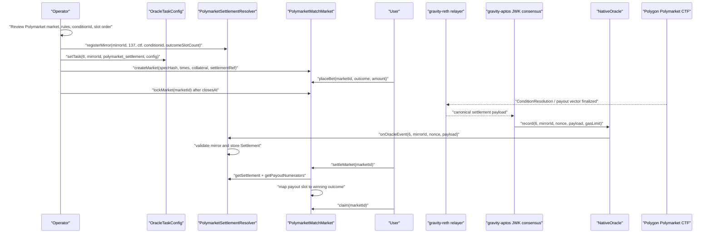

# Polymarket Match Market Oracle Spec

## Status

V1 implementation spec for Gravity-side Polymarket mirror market contracts.

This document covers the contract-side design for settling a Gravity match betting market from a Polymarket-resolved condition, using the existing Gravity oracle path:

```text
Polygon Polymarket CTF settlement log
  -> gravity-reth mirror task
  -> gravity-aptos JWK consensus bytes
  -> NativeOracle.record(sourceType = 6, sourceId = mirrorId, payload)
  -> PolymarketSettlementResolver
  -> Gravity betting market settlement
```

No live Polymarket IDs are assumed in this spec. Real market IDs, condition IDs, slot order, and rule text must be filled from a reviewed market snapshot before deployment.

For the operator-facing checklist and live-market replication steps, see
[`docs/runbooks/polymarket-match-market-runbook.md`](../runbooks/polymarket-match-market-runbook.md).

## Goals

- Support a concrete market such as "Portugal vs Colombia match result" on Gravity.
- Support a direct binary mirror such as "Will the Fed cut rates in July?" or
  "Will Team A win?" when Polymarket exposes one reviewed binary condition.
- Use Polymarket only as an external settlement source, not as Gravity's user-facing market ledger.
- Keep user bets, escrow, payouts, void/refund behavior, and claim logic inside Gravity contracts.
- Reuse the existing `SOURCE_TYPE_POLYMARKET_SETTLEMENT = 6` resolver path.
- Make the oracle input deterministic enough that validators can mirror the same Polygon settlement event and agree on identical bytes.

## Non-Goals

- No AMM or central-limit-order-book implementation in V1.
- No live web/API fetching inside this contracts repo.
- No dynamic request watcher design in this spec.
- No price-feed aggregation changes here. Price rounds are owned by
  `PriceFeedResolver`; this design uses the dedicated Polymarket settlement
  resolver.

## Existing Primitives

### `OracleTaskConfig`

Stores long-lived validator tasks keyed by:

```text
(sourceType, sourceId, taskName) -> config bytes
```

For Polymarket settlement mirroring:

```text
sourceType = 6
sourceId = mirrorId
taskName = "polymarket_settlement"
config = encoded relayer config
```

The config should tell the validator-side relayer which Polygon contract and event range to monitor. The exact ABI of this off-chain config can be owned by gravity-reth/gravity-sdk, but it must include enough data to prevent ambiguous discovery.

### `NativeOracle`

Receives the consensus bytes and routes them to a callback. For this design:

```text
NativeOracle.record(6, mirrorId, nonce, abi.encode(PolymarketSettlementPayload), callbackGasLimit)
```

`NativeOracle` keeps the raw agreed payload for auditability and calls the registered callback.

### `PolymarketSettlementResolver`

Current resolver responsibilities:

- Registers a mirror config with `registerMirror(mirrorId, 137, ctf, conditionId, outcomeSlotCount)`.
- Exposes that immutable config through `getMirrorConfig(mirrorId)` so a market can bind to it before accepting stake.
- Accepts only `sourceType = 6`.
- Decodes `PolymarketSettlementPayload`.
- Validates mirror ID, Polygon chain ID, CTF address, condition ID, outcome slot count, settlement kind, and non-empty payout.
- Stores application-ready `Settlement` state indexed by `(mirrorId, conditionId)`.

This match-market contract should read the resolver's stored settlement state. It should not try to settle directly from a raw `NativeOracle.DataRecorded` event.

## Product Semantics

The Gravity market must freeze its own event semantics before it references Polymarket.

Example:

```text
marketKind: MATCH_RESULT_3WAY
event: Portugal vs Colombia
competition: <competition name>
scheduledKickoff: <unix timestamp>
settlementScope: regular time plus stoppage only
outcomes:
  0 = PORTUGAL_WIN
  1 = DRAW
  2 = COLOMBIA_WIN
voidPolicy:
  - void if the referenced Polymarket condition is cancelled, invalid, ambiguous, or unresolved after oracleDeadline
  - void if the Polymarket rules do not match the frozen Gravity market semantics
```

Important rule: do not infer one outcome from the negation of another outcome. For example, "Portugal does not win" is not equivalent to "Colombia wins" because draw may be possible.

For binary markets, the same rule means the Gravity question must match the
reviewed Polymarket question exactly enough that `YES` and `NO` have the same
meaning on both systems.

## Polymarket Mapping Models

### Preferred: Single 3-Outcome CTF Condition

Use one Polymarket condition whose payout vector has exactly three slots matching the Gravity outcomes after an explicit slot mapping.

```text
Polymarket slot 0 -> Gravity outcome PORTUGAL_WIN
Polymarket slot 1 -> Gravity outcome DRAW
Polymarket slot 2 -> Gravity outcome COLOMBIA_WIN
```

Settlement rule:

- `payoutNumerators.length == 3`
- exactly one payout numerator is positive
- positive slot maps to the winning Gravity outcome
- zero positive slots, multiple positive slots, scalar payouts, or split payouts are not auto-settled in v1

### Fallback: Multiple Binary Conditions

If Polymarket exposes separate binary markets, the contract can support this later, but it is not the recommended V1 path.

Example binary conditions:

```text
Condition A: Portugal wins? YES/NO
Condition B: Draw? YES/NO
Condition C: Colombia wins? YES/NO
```

Auto-settlement requires:

- every configured condition has resolver state
- every condition has two payout slots
- exactly one configured positive `YES` condition resolves true
- no condition resolves into a split, invalid, or ambiguous payout

This adds more failure modes and more oracle task configuration. Prefer the single-condition model when available.

## Metadata Snapshot

Each Gravity market should store a compact immutable snapshot hash, with reviewable metadata kept off-chain or in an event payload.

Recommended metadata fields:

```text
gravityMarketId
marketKind
teamA
teamB
competition
scheduledKickoff
settlementScope
voidPolicy
polymarketTitleSnapshot
polymarketRulesHash
polymarketMarketId
conditionId
questionId
ctf
oracle
outcomeSlotCount
slotToOutcome
sourceChainId = 137
mirrorId
reviewedAt
```

The contract should at minimum store:

- `specHash`: hash of the frozen Gravity market semantics and reviewed Polymarket snapshot.
- `settlementRef`: the resolver/mirror configuration needed for settlement.
- `slotToOutcome`: mapping from Polymarket payout slot to local outcome.

## Proposed Contract

Three-way match contract:

```text
PolymarketMatchMarket
```

Binary market contract:

```text
PolymarketBinaryMarket
```

Both implementations are simple pari-mutuel markets:

- users stake collateral on one outcome
- funds stay escrowed in the market contract
- after settlement, winning users split the losing side's pool pro rata
- if the market is voided, users can refund their original stake

`PolymarketBinaryMarket` is the recommended first live-like mirror for Fed-rate
or other YES/NO questions because it references one CTF condition and only needs
a reviewed two-slot `slotToOutcome` mapping.

### Core Types

```solidity
enum MarketStatus {
    Open,
    Locked,
    Settled,
    Voided
}

enum MatchOutcome {
    HomeWin,
    Draw,
    AwayWin
}

enum SettlementMode {
    SingleConditionThreeWay,
    MultipleBinaryConditions
}

struct SettlementRef {
    uint32 sourceType;          // must be 6
    uint256 mirrorId;
    bytes32 conditionId;
    address resolver;
    address ctf;
    uint256 polygonChainId;     // must be 137
    uint8 outcomeSlotCount;
    uint8[] slotToOutcome;      // payout slot -> local outcome
    SettlementMode mode;
}

struct Market {
    bytes32 specHash;
    uint64 opensAt;
    uint64 closesAt;
    uint64 oracleDeadline;
    address collateral;
    MarketStatus status;
    uint8 outcomeCount;
    uint8 winningOutcome;
    uint256 totalPool;
}

struct CreateMarketParams {
    bytes32 specHash;
    uint64 opensAt;
    uint64 closesAt;
    uint64 oracleDeadline;
    address collateral;
    SettlementRef settlementRef;
}
```

### Storage Sketch

```solidity
mapping(uint256 marketId => Market market) public markets;
mapping(uint256 marketId => SettlementRef settlementRef) public settlementRefs;
mapping(uint256 marketId => mapping(uint8 outcome => uint256 total)) public outcomeTotal;
mapping(uint256 marketId => mapping(address user => mapping(uint8 outcome => uint256 amount))) public userStake;
mapping(uint256 marketId => mapping(address user => bool claimed)) public claimed;
```

### External Interface

```solidity
function createMarket(CreateMarketParams calldata params) external returns (uint256 marketId);
function placeBet(uint256 marketId, uint8 outcome, uint256 amount) external;
function lockMarket(uint256 marketId) external;
function settleMarket(uint256 marketId) external;
function claim(uint256 marketId) external returns (uint256 amount);
function voidMarket(uint256 marketId) external;
function refund(uint256 marketId) external returns (uint256 amount);

function getMarket(uint256 marketId) external view returns (Market memory);
function getSettlementRef(uint256 marketId) external view returns (SettlementRef memory);
function claimable(uint256 marketId, address user) external view returns (uint256 amount);
```

### Events

```solidity
event MarketCreated(uint256 indexed marketId, bytes32 indexed specHash, uint256 indexed mirrorId);
event BetPlaced(uint256 indexed marketId, address indexed user, uint8 indexed outcome, uint256 amount);
event MarketLocked(uint256 indexed marketId);
event MarketSettled(uint256 indexed marketId, uint8 indexed winningOutcome, bytes32 settlementTxHash, uint256 settlementLogIndex);
event MarketVoided(uint256 indexed marketId, bytes32 reason);
event Claimed(uint256 indexed marketId, address indexed user, uint256 amount);
event Refunded(uint256 indexed marketId, address indexed user, uint256 amount);
```

### Errors

```solidity
error InvalidMarketTime();
error InvalidOutcome();
error InvalidSettlementRef();
error MarketNotOpen();
error MarketNotLocked();
error MarketAlreadyFinalized();
error SettlementUnavailable();
error SettlementMismatch();
error AmbiguousPayout();
error OracleDeadlineNotReached();
error NothingToClaim();
error NothingToRefund();
```

## Settlement Algorithm

For the v1 single-condition 3-way market:

1. At market creation, load `getMirrorConfig(mirrorId)` and require its chain ID, CTF, condition ID, and outcome slot count exactly match `SettlementRef`.
2. Load `Market` and require status is `Locked`.
3. Load `SettlementRef` and require `sourceType == 6`.
4. Call `PolymarketSettlementResolver.getSettlement(mirrorId, conditionId)`.
5. Require `exists == true`.
6. Validate returned fields:
   - `polygonChainId == 137`
   - `ctf == settlementRef.ctf`
   - `outcomeSlotCount == settlementRef.outcomeSlotCount`
   - `settlementKind == 1`
7. Call `getPayoutNumerators(mirrorId, conditionId)`.
8. Require length equals `outcomeSlotCount`.
9. Count positive payout slots.
10. Require exactly one positive slot.
11. Map positive slot through `slotToOutcome`.
12. Set market status to `Settled` and store `winningOutcome`.
13. Emit `MarketSettled`.

If any validation fails, `settleMarket` should revert. Settlement timing uses
the consensus record timestamp: `recordedAt < oracleDeadline` is timely, while
equality is late. A timely valid payload pending resolver replay blocks void and
may settle after replay using its original timestamp. After `oracleDeadline`,
governance may void only when there is no timely valid pending or resolved
observation, unless a manual emergency path is explicitly added.

## Payout Algorithm

For a pari-mutuel pool:

```text
claimable = userStake[winningOutcome] * totalPool / outcomeTotal[winningOutcome]
```

Implementation notes:

- Use pull-based `claim`.
- Mark `claimed` before transferring collateral.
- Use `SafeERC20` for ERC20 collateral.
- If native token support is needed, add it later behind a separate path.
- If nobody bet on the winning outcome, V1 voids rather than sending the whole pool to an operator.

## End-to-End Workflow



## Oracle Task Config Shape

The contract only treats `config` as opaque bytes, but the relayer should use a deterministic typed shape. A suggested off-chain schema:

```text
PolymarketSettlementTaskConfig {
  uint256 polygonChainId;       // 137
  address ctf;
  bytes32 conditionId;
  uint256 outcomeSlotCount;
  uint64 fromBlock;
  uint64 confirmations;
  uint64 maxBlocksPerPoll;
  bytes32 expectedSpecHash;     // optional guard for reviewed metadata
}
```

Governance call shape:

```text
PolymarketSettlementResolver.registerMirror(
  mirrorId,
  137,
  ctf,
  conditionId,
  outcomeSlotCount
)

OracleTaskConfig.setTask(
  6,
  mirrorId,
  bytes32("polymarket_settlement"),
  abi.encode(PolymarketSettlementTaskConfig)
)
```

The relayer should fetch the Polygon settlement log and serialize the payload as:

```solidity
PolymarketSettlementPayload({
    mirrorId: mirrorId,
    polygonChainId: 137,
    ctf: ctf,
    oracle: oracle,
    conditionId: conditionId,
    questionId: questionId,
    outcomeSlotCount: outcomeSlotCount,
    payoutNumerators: payoutNumerators,
    txHash: txHash,
    logIndex: logIndex,
    settlementKind: 1
})
```

The payload hash should be deterministic across validators. Validators should not include local fetch time, non-canonical JSON, UI text, or API response ordering in the consensus payload.

## Portugal vs Colombia Example

This is a placeholder example. Values must be filled from a reviewed real Polymarket condition.

```text
Gravity market:
  marketKind = MATCH_RESULT_3WAY
  title = Portugal vs Colombia
  outcomes = [Portugal win, Draw, Colombia win]
  settlementScope = regular time plus stoppage only

Polymarket reviewed source:
  polygonChainId = 137
  ctf = <reviewed CTF address>
  conditionId = <reviewed condition id>
  questionId = <reviewed question id>
  outcomeSlotCount = 3
  slotToOutcome = [0, 1, 2]
  rulesHash = keccak256(<reviewed rules text>)
```

If the real Polymarket market is instead a binary "Will Portugal win?" market, it is not enough for the above 3-way Gravity market unless the design also references draw and Colombia-win conditions.

## Security and Failure Modes

- Wrong market mapping: mitigated by freezing `specHash`, `conditionId`, rules hash, and slot mapping before bets open.
- Slot-order mismatch: mitigated by explicit `slotToOutcome` and tests for each slot.
- Ambiguous Polymarket payout: v1 should revert and require manual void/review.
- Cancelled or postponed match: handled by configured void policy and `oracleDeadline`.
- Relayer or validator lag: market remains `Locked` until resolver state exists.
- Resolver overwrite: market should not allow settlement changes after it is already `Settled`.
- Callback failure: market must read resolver state, not assume raw oracle storage means application settlement succeeded.
- No winning stake: V1 voids and refunds rather than assigning the pool to an operator.
- ERC20 transfer risk: use `SafeERC20`, pull payments, and reentrancy protection around claim/refund.

## Test Plan

### Contract Unit Tests

1. Market creation
   - accepts valid `SettlementRef`
   - rejects zero `specHash`, invalid times, non-137 chain ID, zero CTF, zero condition ID, wrong source type, empty slot mapping
   - rejects an unregistered mirror or any `SettlementRef` that differs from the resolver's immutable mirror config
   - emits `MarketCreated`

2. Betting
   - accepts bets only while `Open`
   - rejects invalid outcome indexes
   - updates `userStake`, `outcomeTotal`, and `totalPool`
   - rejects after `closesAt` or after `lockMarket`

3. Locking
   - transitions `Open -> Locked`
   - rejects locking before close
   - rejects duplicate lock

4. Settlement happy paths
   - payout `[1, 0, 0]` settles to Portugal win
   - payout `[0, 1, 0]` settles to draw
   - payout `[0, 0, 1]` settles to Colombia win
   - emits `MarketSettled` with resolver tx hash and log index

5. Settlement rejection paths
   - resolver state missing
   - wrong CTF
   - wrong Polygon chain ID
   - wrong condition ID
   - wrong outcome slot count
   - zero positive payouts
   - multiple positive payouts
   - market not locked
   - already settled

6. Claims
   - winners receive pro-rata share of total pool
   - losers receive zero
   - duplicate claim reverts
   - rounding behavior is deterministic and tested
   - transfer is pull-based and protected against reentrancy

7. Void/refund
   - cannot void before `oracleDeadline` under the normal path
   - after void, each user can refund original stake
   - duplicate refund reverts
   - cannot refund after settlement

### Resolver Integration Tests

1. Register mirror through governance actor.
2. Configure NativeOracle callback for `sourceType = 6` or the exact source ID callback path used by deployment.
3. Call `NativeOracle.record(6, mirrorId, nonce, abi.encode(payload), gasLimit)`.
4. Assert:
   - `PolymarketConditionResolved` emitted
   - resolver `getSettlement` returns expected fields
   - market `settleMarket` reads resolver state and finalizes

Negative integration cases:

- `sourceId != payload.mirrorId`
- unregistered mirror
- non-137 chain ID
- mismatched CTF
- mismatched condition ID
- invalid settlement kind
- payout vector length mismatch

### SDK / E2E Tests For Later

The later implementation agent should add an E2E fixture around a mock Polymarket settlement source:

```text
1. Deploy NativeOracle, OracleTaskConfig, PolymarketSettlementResolver, and PolymarketMatchMarket.
2. Register mirror and task config.
3. Create Portugal vs Colombia match market.
4. Place at least three user bets across all outcomes.
5. Inject a mocked canonical Polymarket settlement payload through the oracle path.
6. Settle the market.
7. Assert only winning users can claim.
8. Repeat for each winning outcome slot.
```

Expected emitted-event chain:

```text
MirrorRegistered
TaskSet
MarketCreated
BetPlaced
MarketLocked
DataRecorded
PolymarketConditionResolved
MarketSettled
Claimed
```

### Manual Review Checklist Before Live Use

- Team names, kickoff time, competition, and market title match.
- The Gravity settlement scope matches the Polymarket rule text.
- Draw handling is explicit.
- Cancellation/postponement behavior is documented.
- CTF address, condition ID, question ID, and outcome labels are captured.
- Slot order is reviewed against actual payout vector semantics.
- `fromBlock` is before the relevant market resolution window.
- `mirrorId` is unique for this condition.
- `specHash` can be recomputed from the reviewed metadata.
- The market is created before user betting opens, and no mutable off-chain metadata is trusted after creation.

## Implementation Handoff

Recommended first implementation slice:

1. Add `PolymarketMatchMarket` with 3-way pari-mutuel settlement only.
2. Add an interface for `PolymarketSettlementResolver`.
3. Add Foundry unit tests with a mock resolver.
4. Add resolver integration tests using `NativeOracle.record` and the real resolver.
5. Add one SDK/E2E mock flow after unit tests pass.

Open design decisions before mainnet-like deployment:

- Whether to support multiple binary Polymarket conditions in v1.
- Whether split payouts should void, settle proportionally, or require manual review.
- Whether `voidMarket` is governance-only, permissionless after deadline, or both.
- Whether collateral is ERC20-only in v1.
- Whether the resolver should reject overwriting an already stored settlement.
- Whether a post-resolution challenge delay is needed before Gravity users can claim.
