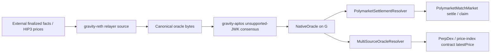
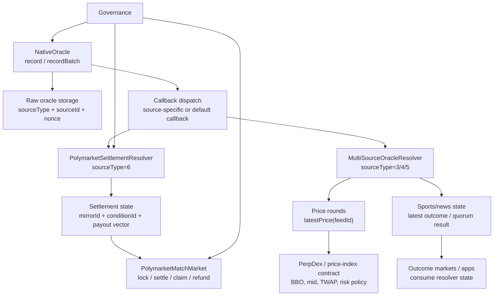
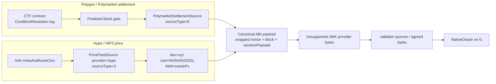

# Gravity Oracle PoC Demo

> Archived historical deck. It describes the superseded Hype and direct
> sports/news experiments and is not an implementation reference. Use
> [Oracle Workflow](../oracle_workflow.md) and
> [Oracle Production Readiness](../oracle_production_readiness.md) for the
> current Binance + Polygon architecture.

## One-Line Story

Gravity can turn finalized external facts and HIP3 price observations into
contract-readable state on G.

This PoC proves two rails:

- Polymarket-like settlement: finalized Polygon CTF resolution -> Gravity
  settlement resolver -> match market settle / claim.
- HIP3 price feed: `xyz:NVDA` / `xyz:GOOGL` price observation -> Gravity price
  resolver -> PerpDex or price-index contract consumption.

## What We Are Demonstrating

The demo is not a full Polymarket clone and not a complete oracle network. It
demonstrates the core closed loop:

```text
External source
-> gravity-reth relayer source
-> canonical oracle bytes
-> unsupported-JWK consensus path
-> NativeOracle
-> resolver
-> product contract
```

## Architecture



Key separation:

- Relayer fetches and canonicalizes.
- Validator consensus agrees on bytes.
- `NativeOracle` records the agreed payload.
- Resolver converts raw bytes into product-ready state.
- Product contracts own escrow, settlement, BBO, mid, TWAP, risk, and claims.

## Contract Architecture On G

The execution layer deliberately keeps the oracle entry point small. Product
semantics live behind resolvers and product contracts.



Important contract boundaries:

- `NativeOracle` verifies caller permissions, nonce ordering, storage, and
  callback dispatch.
- Resolvers validate payload structure and store domain-ready state.
- `PolymarketMatchMarket` owns betting, escrow, settlement, claim, and refund.
- PerpDex or a versioned resolver policy owns BBO, local mid, TWAP, funding, and
  risk logic.

## Relayer Fetch Architecture

The PoC has two external fetch families that converge into the same canonical
bytes and consensus path.



Relayer rules:

- Polygon path polls finalized CTF logs and includes source identity
  (`blockNumber`, `txHash`, `logIndex`) inside the resolver payload.
- Hype path fetches `metaAndAssetCtxs`, selects a configured field, and converts
  decimal strings into fixed-point integers.
- On-chain task URIs describe public task shape; validator-local config supplies
  secret-bearing or provider-specific URLs.
- Both paths must produce byte-identical payloads for the same external fact.

## Demo Track A: Polymarket-Like Match Settlement

### Product Story

Gravity can mirror a reviewed, finalized Polymarket CTF condition and use it to
settle a G-native match market.

```text
Reviewed Polymarket market snapshot
-> Gravity market specHash
-> Polygon CTF ConditionResolution finalized
-> gravity-reth sourceType=6 mirror
-> unsupported-JWK consensus
-> NativeOracle.recordBatch
-> PolymarketSettlementResolver
-> PolymarketMatchMarket settle / claim / refund
```

### V1 Supported Shape

- One reviewed Polymarket CTF condition.
- Finalized Polygon CTF `ConditionResolution`.
- Outcome slots map explicitly to Gravity outcomes.
- Gravity market semantics are frozen before betting opens.
- Contract rejects missing, mismatched, or ambiguous settlement.

### Not Automatic Yet

- Multiple binary markets combined into one 3-way market.
- Scalar or partial payout vectors.
- Disputed, cancelled, postponed, ambiguous, or unresolved markets.
- Markets whose Polymarket rules do not match Gravity's frozen scope.
- Automatic market discovery from Polymarket UI or Gamma API.

### Demo Command

Run from `gravity-sdk`:

```bash
make BINARY=gravity_node MODE=quick-release
make BINARY=gravity_cli MODE=quick-release
PATH="$HOME/.foundry/bin:$PWD/target/quick-release:$PWD/target/release:$PATH" \
  ./gravity_e2e/run_test.sh polymarket_mock --force-init
```

Expected signal:

```text
Released mock Polymarket settlement: winning_slot=<slot> payout=<vector>
Polymarket match market resolved and claimed: marketId=1 winningSlot=<slot> totalPool=600000000000000000000
PASSED
Suite polymarket_mock PASSED
All suites passed!
```

### How To Explain It

The mock simulates the finalized Polygon/Polymarket settlement. The interesting
part is the G-side flow: `DataRecorded`, `PolymarketConditionResolved`,
`MarketSettled`, and `Claimed`.

We mirror settlement truth, not the Polymarket UI or order book.

## Demo Track B: HIP3 Price Feed For PerpDex

### Product Story

Gravity can consume HIP3-style stock-like price observations and expose them as
`latestPrice(feedId)` for PerpDex or price-index contracts.

```text
Hype /info metaAndAssetCtxs
-> provider=hype URI
-> gravity-reth Hype adapter
-> canonical PricePayload
-> unsupported-JWK consensus
-> NativeOracle
-> MultiSourceOracleResolver.latestPrice(feedId)
-> PerpDex / price-index contract
```

### Feed Shape

Example task coordinates:

```text
gravity://3/1001/price_feed?provider=hype&dex=xyz&coin=NVDA&field=oraclePx&round=1&resolvedAt=2010&decimals=8
gravity://3/1002/price_feed?provider=hype&dex=xyz&coin=GOOGL&field=oraclePx&round=1&resolvedAt=2010&decimals=8
```

Important policy:

- The relayer reads HIP3/Hype `metaAndAssetCtxs`.
- The PoC uses `oraclePx`.
- Values are normalized to fixed-point decimals.
- The resolver exposes `latestPrice(feedId)`.
- BBO, local mid, TWAP, funding, and risk policy should live in PerpDex or a
  separately versioned resolver policy.

### Demo Command

Run from `gravity-sdk`:

```bash
make BINARY=gravity_node MODE=quick-release
make BINARY=gravity_cli MODE=quick-release
PATH="$HOME/.foundry/bin:$PWD/target/quick-release:$PWD/target/release:$PATH" \
  ./gravity_e2e/run_test.sh hype_price_feed --force-init
```

Expected signal:

```text
Mock Hype /info server running at http://127.0.0.1:18547/info
Hype price feed resolved: feedId=1001 roundId=1 price=19538000000
Hype price feed resolved: feedId=1002 roundId=1 price=35364400000
PASSED
Suite hype_price_feed PASSED
All suites passed!
```

### How To Explain It

This is not just static bytes. The E2E registers `provider=hype` URIs, starts a
deterministic local Hype `/info` mock, makes the relayer fetch
`metaAndAssetCtxs`, canonicalizes price bytes, reaches oracle consensus, records
through `NativeOracle`, and verifies `MultiSourceOracleResolver.latestPrice`.

The live smoke separately confirmed that real Hype can return `xyz:NVDA` and
`xyz:GOOGL` fields. The E2E stays local so validator bytes are reproducible.

## What Is Already Proved

- Contract layer:
  - `NativeOracle`
  - `MultiSourceOracleResolver`
  - `PolymarketSettlementResolver`
  - `PolymarketMatchMarket`
- Relayer layer:
  - sports score source
  - price feed source
  - Hype/HIP3 provider adapter
  - Polymarket settlement mirror source
- SDK E2E:
  - Polymarket-like settlement mock
  - Hype/HIP3 price feed into G
- Docs:
  - Polymarket mirror runbook
  - dynamic request workflow
  - oracle architecture notes

## What Is Not Done Yet

- Real Polygon historical replay against selected Polymarket conditions.
- Market metadata registry and `rulesHash` / `specHash` builder.
- Multi-condition settlement mode.
- Provider allowlist and governance config.
- Dynamic request watcher.
- Retry / expiry / Pending / Unknown / Expired response model.
- Multi-validator heterogeneous source config tests.
- PerpDex-side BBO / mid / TWAP / risk integration.

## Suggested Live Demo Order

1. Show the architecture.
2. Run `hype_price_feed`.
3. Explain `latestPrice(feedId)` as the PerpDex-facing interface.
4. Run `polymarket_mock`.
5. Explain settlement resolver and match market claim flow.
6. Close with limits and roadmap.

## Q&A

### Can we mirror any Polymarket match?

Not automatically. V1 can mirror direct-fit finalized CTF conditions. Complex
UI markets need a metadata/rules registry and more settlement modes.

### Is HIP3 price the same as official Nasdaq spot?

No. Treat `xyz:NVDA` and `xyz:GOOGL` as HIP3/perp-derived price observations.
That is fine for this oracle rail and PerpDex PoC, but production feed policy
must say exactly what price field is being consumed.

### Who calculates BBO or mid?

The PerpDex or a versioned resolver policy. Validators should not hide
product-specific BBO, mid, TWAP, funding, or risk logic inside the fetch adapter.

### Why reuse the unsupported-JWK path?

The existing validator consensus path can already agree on bytes payloads and
write them into the execution layer. Reusing that rail reduces the risk of
modifying consensus core logic for this PoC.

### Does dynamic request work now?

The current PoC is mostly epoch-config long-running feeds. Dynamic one-off
requests need a watcher with finality gate, watermark/backfill, deadline/expiry,
typed responses, retry, and request/config/payload hashes.
