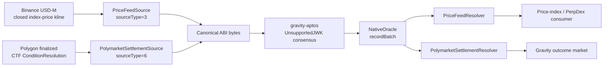

# Gravity Oracle PoC Demo

## One-Line Story

Gravity validators can agree on finalized external data and expose it as
contract-readable state through the existing UnsupportedJWK consensus path.

This PoC has two deliberately narrow products:

- Binance price feed: one exact closed index-price kline per feed round.
- Polymarket mirror: one reviewed Polygon CTF condition settlement.

## Architecture



Key separation:

- Relayer adapters fetch and canonicalize one externally anchored fact.
- Validator consensus agrees on the exact bytes.
- `NativeOracle` enforces delivery nonce ordering and preserves raw payloads.
- Resolvers validate domain state transitions and expose query-ready state.
- Product contracts own trading, escrow, settlement, claims, and risk policy.

## Binance Price Feed

### Task Identity

```text
gravity://3/1001/price_feed
  ?provider=binance_index_kline_v1
  &pair=TSLAUSDT
  &interval=1m
  &bucketStartMs=<aligned-start>
  &decimals=8
  &graceMs=120000
```

The accepted source-type-3 task contains no provider weights, source-count
thresholds, staleness aggregation window, or aggregation mode. Each feed round
is exactly one Binance close.

### Deterministic Mapping

```text
bucketStart(n) = configuredStart + (n - 1) * intervalMs
bucketEnd(n)   = bucketStart(n) + intervalMs - 1
roundId(n)     = bucketStart(n) / intervalMs
resolvedAt(n)  = bucketEnd(n)
```

Every validator requests:

```text
GET /fapi/v1/indexPriceKlines
  ?pair=<PAIR>
  &interval=<interval>
  &startTime=<bucketStart>
  &endTime=<bucketEnd>
  &limit=1
```

The adapter accepts the response only when it contains one row whose
`openTime` and `closeTime` exactly match the requested closed bucket. The
canonical payload is:

```solidity
struct PricePayload {
    uint256 feedId;
    uint64 roundId;
    uint64 resolvedAt;
    uint8 decimals;
    int256 price;
}
```

`PriceFeedResolver.latestPrice(feedId)` exposes the newest accepted close and
`priceRounds(feedId, roundId)` retains history.

## Polymarket Settlement Mirror

```text
Reviewed Polymarket market snapshot
-> finalized Polygon CTF ConditionResolution
-> sourceType=6 canonical payload
-> UnsupportedJWK consensus
-> NativeOracle
-> PolymarketSettlementResolver
-> Gravity market settle / claim / refund
```

Version 1 supports one reviewed CTF condition per mirror task. It does not copy
the Polymarket UI, order book, or arbitrary market metadata. Gravity freezes its
own market semantics before betting opens and consumes the mirrored settlement
truth only.

## Callback Recovery

If a resolver callback runs out of gas or rejects a payload, `NativeOracle`
still preserves the consensus-approved raw record. Permissionless replay reads
that immutable record and cannot replace it with caller-supplied bytes.

For price feeds, historical replay can backfill an older missing round without
rewinding `latestPrice`.

## Demo Commands

Run from `gravity-sdk` after building the node and CLI:

```bash
./gravity_e2e/run_test.sh binance_price_feed --force-init
./gravity_e2e/run_test.sh polymarket_mock --force-init
./gravity_e2e/run_test.sh oracle_demo --force-init
```

The combined `oracle_demo` suite drives both source types through the same
consensus and execution path, then leaves a local chain available to the demo
frontend.

## What This Proves

- Closed Binance bucket to `PriceFeedResolver.latestPrice`.
- Finalized Polygon CTF settlement to Gravity market settlement.
- Sequential delivery nonces independent from market round identifiers.
- Canonical payload transport through UnsupportedJWK consensus.
- Raw-record preservation and resolver replay.

## Production Gaps

- JWK QC verification at the execution boundary remains a known external
  blocker.
- Provider endpoint policy and coordinated activation require operational
  governance.
- Polymarket metadata review and Gravity market creation remain operator-led.
- Product-specific BBO, TWAP, funding, and risk rules belong in downstream
  contracts, not the Binance fetch adapter.
