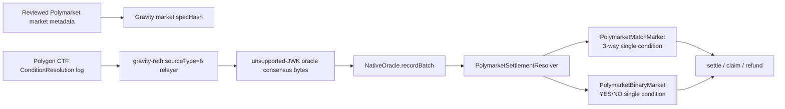

# Polymarket Match Market Replication Runbook

## Short Answer

Gravity can reuse the current Polymarket settlement rail for any Polymarket
condition that has a finalized Polygon CTF `ConditionResolution` event and a
reviewed, unambiguous mapping to a Gravity market.

Gravity cannot safely copy every Polymarket sports UI market automatically yet.
The current implementation is a settlement mirror, not a market-discovery engine or a
Polymarket order-book clone.

In particular, a Polygon CTF event is not enough to identify a Polymarket UI
market by itself. The CTF settlement log gives the mechanical settlement data
for a condition, but not the Polymarket slug, event grouping, displayed title,
rules text, image, tags, or human-readable outcome labels. Those fields must be
captured in a reviewed off-chain manifest before the Gravity market opens.

Current v1 direct-fit cases:

- one Gravity 3-way match market
- one reviewed Polymarket CTF condition
- exactly three payout slots
- exactly one positive payout slot at settlement
- explicit `slotToOutcome` mapping frozen before betting opens
- one Gravity binary market
- one reviewed Polymarket binary CTF condition
- exactly two payout slots
- exactly one positive payout slot at settlement
- explicit Polymarket slot -> Gravity `YES/NO` mapping frozen before betting
  opens

Cases that need more design before automatic settlement:

- Polymarket exposes the match as multiple binary Yes/No markets
- a binary question is used as the negation of another outcome
- split/scalar/partial payout vectors
- invalid, cancelled, postponed, ambiguous, or unresolved conditions
- markets whose Polymarket rule text does not match Gravity's frozen settlement
  scope
- dynamic market/request discovery from Polymarket UI or Gamma API

## Current Architecture



The important separation is:

- Polymarket resolves the real-world event and publishes a CTF settlement on
  Polygon.
- Gravity mirrors that finalized settlement payload for an already reviewed
  condition.
- Gravity owns its own user balances, market escrow, payout rules, void rules,
  and claims.

The safe mental model is:

```text
Reviewed Polymarket metadata snapshot -> Gravity market creation
Finalized Polygon CTF settlement log   -> Gravity market resolution
```

Do not invert that flow. A settlement log can resolve a registered mirror; it
must not create or reinterpret a Gravity market from scratch.

## Required Inputs

### Gravity Market Spec

Freeze these fields before users can bet:

```text
marketKind
title / question
event metadata, such as teams, competition, scheduled time, or Fed meeting
settlementScope
outcome labels
voidPolicy
opensAt
closesAt
oracleDeadline
collateral
slotToOutcome
```

Compute a `specHash` from the frozen Gravity semantics and reviewed Polymarket
snapshot. Do not depend on mutable UI text after market creation.

`closesAt` must be no later than the point at which the external result can
reasonably become known. Do not use the later Polygon settlement transaction as
the betting cutoff. The market contracts reject creation and new bets once the
configured resolver already contains a settlement, but they cannot detect a
source-chain result that has not reached Gravity yet.

### Polymarket Metadata Snapshot

Capture and review:

```text
event id / slug
market id
title / question
rules or resolution text
rulesHash
conditionId
questionId
outcome labels
short outcome labels, if present
CTF token ids
resolution source
end time / UMA end time
negative-risk grouping, if present
Gamma raw URL
Gamma raw body sha256
reviewedAt
```

Polymarket documentation treats a market as the fundamental tradable unit: each
market maps to a condition id, question id, and outcome token ids. Do not infer
market meaning from the payout vector alone; labels and rules come from the
reviewed metadata snapshot.

If a Polymarket event contains several markets, snapshot the event metadata and
each market separately. A Gravity `mirrorId` should point at one reviewed CTF
condition unless a future multi-condition resolver is explicitly used.

### Onboarding Manifest

Create a manifest for every mirror candidate. Keep the raw API responses
off-chain, but commit or governance-register the compact fields and hashes that
reviewers need to reproduce the decision.

Minimum fields:

```text
manifestVersion
source = "polymarket"
polygonChainId = 137
ctf
umaAdapter / oracle
eventId / eventSlug
marketId / marketSlug
question
rulesHash
conditionId
questionId
outcomeSlotCount
outcomeLabels
clobTokenIds
slotToOutcome
resolutionSource
metadataSnapshotHash
metadataSnapshotFetchedAt
metadataSnapshotUrls
onchainEvidenceBlockRange
reviewerSignoffHash
gravitySpecHash
```

Reject onboarding if `Gamma`, `CLOB`, `UMA adapter`, and `CTF` evidence cannot
be cross-checked against the same `conditionId` and `questionId`. When in
doubt, pause and ask for human review rather than guessing from labels.

### Polygon CTF Settlement Data

The relayer payload must ultimately contain:

```text
sourceType = 6
mirrorId / sourceId
polygonChainId = 137
ctf
oracle
conditionId
questionId
outcomeSlotCount
payoutNumerators
txHash
logIndex
settlementKind = 1
source blockNumber
source txHash
source logIndex
sequential delivery nonce
```

The source event identity (`blockNumber`, `txHash`, `logIndex`) stays inside the
resolver payload. The delivery nonce must be the sequential nonce expected by
`NativeOracle`.

Recommended source event identity:

```text
eventId = keccak256(
  polygonChainId,
  ctf,
  conditionId,
  blockHash or blockNumber,
  txHash,
  logIndex
)
```

The current payload records `blockNumber`, `txHash`, and `logIndex`; production
watchers should also treat the finalized block hash as part of their local
dedup and audit key when the RPC provider exposes it.

## Mapping Decision

### Preferred: Single Three-Outcome Condition

Use this only when one Polymarket CTF condition has exactly the three outcomes
needed by the Gravity market.

Checklist:

- the condition is unresolved in the Gravity resolver immediately before market creation
- `closesAt` precedes the expected real-world result and Polymarket resolution
- `outcomeSlotCount == 3`
- `payoutNumerators.length == 3`
- exactly one payout numerator is positive
- every payout slot maps to one Gravity outcome
- the Gravity settlement scope matches Polymarket rules

Example mapping:

```text
Polymarket slot 0 -> Gravity outcome HOME_WIN
Polymarket slot 1 -> Gravity outcome DRAW
Polymarket slot 2 -> Gravity outcome AWAY_WIN
```

### Not Direct-Fit: Multiple Binary Markets

Many Polymarket sports events are represented as separate Yes/No markets, such
as:

```text
Home wins? YES/NO
Draw? YES/NO
Away wins? YES/NO
```

The current `PolymarketMatchMarket` does not aggregate multiple binary
conditions into one 3-way market. That needs an explicit multi-condition
settlement mode with:

- all referenced conditions registered
- all conditions resolved
- exactly one positive `YES` condition
- no contradictory or partial payouts
- clear behavior for missing/invalid conditions

Until that exists, do not launch a 3-way Gravity market from multiple binary
Polymarket conditions.

### Safe Simpler Alternative: Binary Gravity Market

For a first live-like product, a binary Gravity market can mirror one binary
Polymarket condition more directly:

```text
Gravity: "Will Team A win?" or "Will the Fed cut rates in July?"
Polymarket: same binary question
Polymarket slot 0 -> Gravity YES or NO, from reviewed metadata
Polymarket slot 1 -> the other Gravity outcome
```

This is the lowest-friction V1 contract path:

```text
PolymarketBinaryMarket
  outcome 0 = NO
  outcome 1 = YES
  outcomeSlotCount = 2
  mode = SingleConditionBinary
```

Do not assume slot `0` is always YES. Polymarket metadata must provide the token
labels and the reviewed `slotToOutcome` mapping.

### What Can Be Mirrored Today

You can mirror a Polymarket market to Gravity today if all of the following are
true:

- the target is one reviewed CTF condition
- the condition has two slots for `PolymarketBinaryMarket`, or three slots for
  `PolymarketMatchMarket`
- the Gravity product's title, close time, rules, void behavior, and outcome
  labels are frozen before betting opens
- the reviewed Polymarket manifest maps each CTF slot to exactly one Gravity
  outcome
- the source settlement will appear as a Polygon CTF `ConditionResolution`
  event that validators can scan from a finalized block range

Examples that fit the current contract shape:

```text
Fed binary market:
  Gravity question: "Will the Fed cut rates at the July 2026 meeting?"
  Contract: PolymarketBinaryMarket
  Requirement: reviewed Polymarket binary CTF condition for the same question

Single-match binary market:
  Gravity question: "Will Team A beat Team B?"
  Contract: PolymarketBinaryMarket
  Requirement: reviewed binary condition and slotToOutcome mapping

Single-condition 3-way soccer market:
  Gravity question: "Team A win / draw / Team B win"
  Contract: PolymarketMatchMarket
  Requirement: one CTF condition with three payout slots
```

Examples that do not fit without more product logic:

```text
Three separate Polymarket YES/NO markets combined into one 3-way Gravity market
Negative-risk groups where outcomes are linked across markets
Markets with scalar, partial, or split payout vectors
Markets whose settlement rules changed after the reviewed snapshot
```

## Operator Runbook

### 1. Select Candidate

Pick a Polymarket sports market and decide whether the Gravity product should be
3-way or binary.

Reject or pause if:

- the Polymarket market is not resolved by CTF settlement on Polygon
- the rule text is missing or ambiguous
- the Gravity settlement scope differs from Polymarket
- draw/cancellation/postponement handling is unclear
- the market belongs to a negative-risk or linked-market group whose rules are
  not captured in the Gravity product

### 2. Freeze Gravity Semantics

Write down:

```text
title
teams
competition
start time
bet close time
oracle deadline
settlement scope
void/refund policy
outcome labels
collateral token
```

Then compute and store a `specHash`.

### 3. Review Polymarket Snapshot

Collect:

```text
event id / slug
market id
conditionId
questionId
outcome labels
token ids
rulesHash
resolution source
review timestamp
```

Save the raw snapshot off-chain for audit. The chain only needs compact fields
and hashes, but reviewers must be able to recompute them.

Cross-check:

- Gamma market `conditionId` and `questionId`
- CLOB market/token metadata and outcome labels
- CTF condition id and payout slot count
- UMA adapter/oracle address and ancillary question text, if available
- Polymarket rules, clarifications, or manual resolution notes

If the UI text changes after review, do not silently update the Gravity market.
Create a new manifest/signoff if the change affects settlement semantics.

### 4. Decide Mirror ID

For V1, use one source id per mirrored condition:

```text
sourceType = 6
sourceId / mirrorId = reviewed Polymarket market id or another unique id
taskName = "polymarket_settlement"
```

One condition per `mirrorId` keeps resolver validation strict and avoids
multiple conditions sharing one nonce stream.

Do not reuse a `mirrorId` across different CTF conditions. The relayer and
`NativeOracle` nonce stream are keyed by `(sourceType, sourceId)`, so reuse
would mix delivery order and make recovery harder to audit.

### 5. Register Resolver Mirror

Governance registers the expected Polygon CTF condition:

```text
PolymarketSettlementResolver.registerMirror(
  mirrorId,
  137,
  ctf,
  conditionId,
  outcomeSlotCount
)
```

The resolver will reject payloads with mismatched source id, chain id, CTF,
condition id, outcome slot count, settlement kind, or empty payout vector.

### 6. Configure Oracle Task

Configure an oracle task equivalent to:

```text
gravity://6/<mirrorId>/polymarket_settlement?ctf=<ctf>&fromBlock=<blockBeforeResolution>&condition=<conditionId>&maxBlocksPerPoll=<n>
```

Notes:

- `fromBlock` must be before the settlement log.
- `condition` should be set for one-condition mirrors.
- `maxBlocksPerPoll` must respect the provider's `eth_getLogs` range and log
  limits.
- URI query ordering matters if validator-local relayer config maps by exact
  URI string.
- Validators must use the same URI string, including query parameter spelling
  and ordering, because it is the relayer task identity.

Finality rule:

```text
commit_watermark = finalized Polygon block number - finalizedGuardBlocks
```

Prefer querying the finalized head first and then scanning numeric block ranges.
If the RPC provider does not support finalized Polygon blocks, use an explicit
degraded mode with a conservative confirmation depth and operator alerting; do
not silently treat `latest` as final for settlement.

Canonical log order:

```text
blockNumber ASC
transactionIndex ASC, if available
logIndex ASC
txHash as a final tie-breaker
```

Different validators may fetch different block ranges or retry at different
times. They must still derive the same ordered event list from the same
finalized source chain state.

### 7. Render Validator-Local RPC Mapping

Each validator needs a local relayer config mapping the exact Gravity URI to an
approved Polygon RPC URL.

Do not commit real RPC URLs or provider tokens.

Example shape:

```json
{
  "uri_mappings": {
    "gravity://6/1897398/polymarket_settlement?ctf=0x...&fromBlock=89222200&condition=0x...&maxBlocksPerPoll=20": "https://polygon-rpc.example.invalid/<redacted>"
  }
}
```

### 8. Create Gravity Market

For a binary mirror, governance creates `PolymarketBinaryMarket` with:

```text
specHash
opensAt
closesAt
oracleDeadline
collateral
settlementRef:
  sourceType = 6
  mirrorId
  conditionId
  resolver
  ctf
  polygonChainId = 137
  outcomeSlotCount = 2
  slotToOutcome = [YES, NO] or [NO, YES], based on reviewed Polymarket metadata
  mode = SingleConditionBinary
```

For a single-condition 3-way mirror, governance creates
`PolymarketMatchMarket` with:

```text
specHash
opensAt
closesAt
oracleDeadline
collateral
settlementRef:
  sourceType = 6
  mirrorId
  conditionId
  resolver
  ctf
  polygonChainId = 137
  outcomeSlotCount = 3
  slotToOutcome
  mode = SingleConditionThreeWay
```

The binary contract requires `outcomeSlotCount == 2` and rejects duplicate
`slotToOutcome` mappings. The 3-way contract requires `outcomeSlotCount == 3`
and `mode == SingleConditionThreeWay`.

### 9. Run Local E2E Before Live RPC

Use the SDK `polymarket_mock` suite before pointing validators at a real Polygon
RPC. The expected passing path is:

```text
Mock Polygon CTF settlement
-> relayer sourceType=6
-> unsupported-JWK/oracle consensus
-> NativeOracle DataRecorded
-> PolymarketSettlementResolver
-> PolymarketMatchMarket settle
-> winner claim
```

The SDK suite documents the exact command and expected output in
`gravity_e2e/cluster_test_cases/polymarket_mock/README.md`.

### 10. Operate and Monitor

Watch for:

```text
NativeOracle.DataRecorded(sourceType=6, sourceId=mirrorId)
PolymarketSettlementResolver.PolymarketConditionResolved
PolymarketBinaryMarket.MarketSettled
PolymarketBinaryMarket.Claimed
PolymarketBinaryMarket.MarketVoided
PolymarketBinaryMarket.Refunded
PolymarketMatchMarket.MarketSettled
PolymarketMatchMarket.Claimed
PolymarketMatchMarket.MarketVoided
PolymarketMatchMarket.Refunded
```

Before allowing claims, confirm:

- resolver settlement exists for `(mirrorId, conditionId)`
- `ctf`, chain id, outcome slot count, and settlement kind match the market ref
- payout vector has exactly one positive slot
- winning slot maps to the intended Gravity outcome

### 11. Verify Idempotency and Recovery

Gravity uses two identities for Polymarket settlement:

```text
source event identity = Polygon condition log position
delivery nonce        = NativeOracle sequential nonce for sourceType/sourceId
```

This is different from Gravity bridge messages, where the source contract emits
a business nonce that can be used directly. Polymarket CTF logs do not have a
per-mirror sequential nonce, so the relayer deterministically assigns delivery
nonces after sorting finalized source events.

Recovery expectations:

- Replaying an already accepted delivery nonce must fail in `NativeOracle`.
- If on-chain `NativeOracle` nonce is ahead of local state, the relayer should
  fast-forward to the on-chain block and nonce.
- If local persisted state is ahead of on-chain `NativeOracle`, treat it as
  fetched-but-not-accepted data and roll back to the on-chain block/nonce before
  polling again.
- If on-chain has no record for the mirror, restart from the configured
  `fromBlock` instead of trusting a local cursor that may have skipped a
  settlement before consensus.
- Keep enough overlap/backfill observability to detect RPC gaps, missing logs,
  or provider range truncation.

## Failure Handling

### Missing Settlement

If no resolver state exists yet:

- market remains `Locked`
- do not settle manually from UI metadata
- wait for relayer/consensus or investigate `fromBlock`, RPC mapping, and
  provider range limits

At `oracleDeadline`, inspect the resolver observation rather than transaction
ordering:

- `ResolvedValid` with `recordedAt < oracleDeadline` must settle, even if
  `settleMarket` is called after the deadline.
- `PendingValid` with `recordedAt < oracleDeadline` blocks void until
  `replaySettlement` succeeds; it then settles using the original record time.
- no observation, an invalid stored payload, or `recordedAt >= oracleDeadline`
  allows governance to void and users to refund.

Equality is late: an observation recorded exactly at `oracleDeadline` cannot
settle.

### Ambiguous or Split Payout

If zero or multiple payout slots are positive:

- v1 3-way market must not auto-settle
- use governance review and void/refund unless a future proportional settlement
  mode is explicitly implemented

### Wrong Metadata

If `conditionId`, rules, labels, or slot order were wrong:

- do not patch the market in place after users have bet
- void/refund if the market cannot be settled according to the frozen spec
- create a new market with a corrected `specHash`

### Provider or Validator Lag

The relayer should poll finalized Polygon blocks and use bounded
`maxBlocksPerPoll`. Slow validators can catch up if the task config, cursor, and
RPC mapping are deterministic. Missing or invalid local RPC config should fail
visibly; transient readiness should use retry/backoff.

If a validator sees a settlement before another validator, that is fine: the
faster node gossips its bytes candidate, while slower nodes eventually catch up
from the same finalized Polygon range. Consensus should only accept the bytes
payload once a quorum agrees on the same ordered event and delivery nonce.

If validators disagree because one RPC omitted a log or finalized head is
stale, the right behavior is to abstain/retry, not to synthesize a local answer.

## Production Gaps

These are not solved by the current implementation:

- automatic Polymarket market discovery
- canonical metadata registry and `specHash` builder
- generic market factory for arbitrary team names and outcome labels
- binary Gravity market contract
- multi-binary-condition aggregation
- split/scalar payout handling
- challenge delay after source settlement
- resolver overwrite/finality policy
- provider allowlists and RPC health monitoring
- block-hash anchored log polling and multi-RPC header agreement
- typed `Pending`, `Unknown`, and `Expired` states for dynamic oracle requests

## Decision Checklist

Use this before approving a live mirror:

```text
[ ] Gravity market semantics frozen and reviewed
[ ] Polymarket rules match Gravity settlement scope
[ ] conditionId and questionId captured
[ ] outcome labels and slot order reviewed
[ ] source chain is Polygon mainnet 137
[ ] CTF address reviewed
[ ] fromBlock is before the expected settlement event
[ ] mirrorId is unique
[ ] resolver mirror registered
[ ] oracle task configured
[ ] relayer URI mapping rendered locally without committing secrets
[ ] local mock E2E passed
[ ] live RPC polling plan approved
[ ] void/refund policy accepted before launch
```
