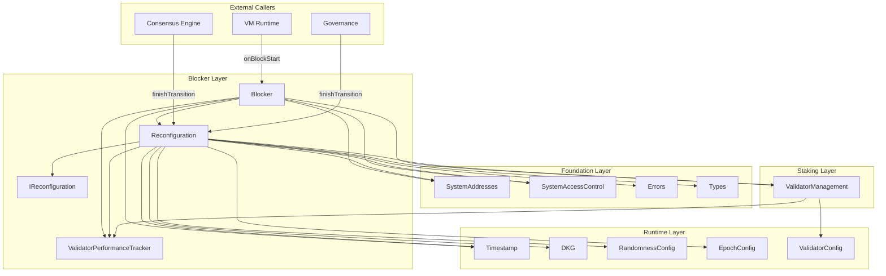

# Blocker Layer Specification

## Overview

The Blocker layer provides epoch lifecycle management and block prologue functionality for Gravity's consensus. It consists of three contracts:

- **Reconfiguration.sol** - Central orchestrator for epoch transitions with DKG coordination
- **Blocker.sol** - Block prologue entry point called by VM at each block start
- **ValidatorPerformanceTracker.sol** - Tracks per-validator proposal statistics within each epoch

Key design principles:

1. **Time-Based Epochs**: Epochs are defined by duration (default 2 hours), not block count
2. **DKG-Gated Transitions**: Epoch transitions are gated by DKG completion for randomness
3. **Single Orchestrator**: Reconfiguration owns the epoch transition lifecycle
4. **Two-Phase Transitions**: Start transition (from Blocker) and finish transition (from consensus/governance)

## Architecture

```
src/blocker/
├── IReconfiguration.sol              # Interface for Reconfiguration
├── Reconfiguration.sol               # Epoch lifecycle management
├── Blocker.sol                       # Block prologue entry point
├── IValidatorPerformanceTracker.sol   # Interface for performance tracker
└── ValidatorPerformanceTracker.sol    # Per-epoch validator performance tracking
```

### Dependency Graph



## System Addresses

| Constant | Address | Description |
|----------|---------|-------------|
| `BLOCK` | `0x0000000000000000000000000001625F2016` | Blocker contract |
| `RECONFIGURATION` | `0x0000000000000000000000000001625F2010` | Reconfiguration contract |
| `PERFORMANCE_TRACKER` | `0x0000000000000000000000000001625F2005` | Validator performance tracker |

---

## Contract: `Reconfiguration.sol`

### Purpose

Central orchestrator for epoch transitions. Coordinates with DKG, RandomnessConfig, and ValidatorManagement to manage the epoch lifecycle.

### State Machine

```
                checkAndStartTransition()
                (time elapsed && state == Idle)
    IDLE ────────────────────────────────────► DKG_IN_PROGRESS
     ▲                                              │
     │                                              │
     └──────────────────────────────────────────────┘
                 finishTransition()
```

### State Variables

```solidity
/// @notice Current epoch number (starts at 0)
uint64 public currentEpoch;

/// @notice Timestamp of last reconfiguration (microseconds)
uint64 public lastReconfigurationTime;

/// @notice Current transition state
TransitionState private _transitionState;

/// @notice Epoch when transition was started
uint64 private _transitionStartedAtEpoch;

/// @notice Whether the contract has been initialized
bool private _initialized;
```

> **Note**: `epochIntervalMicros` is now stored in `EpochConfig` (Runtime layer), not in Reconfiguration.

### Interface

```solidity
interface IReconfiguration {
    enum TransitionState {
        Idle,           // No transition in progress
        DkgInProgress   // DKG started, waiting for completion
    }

    // Events
    event EpochTransitionStarted(uint64 indexed epoch);
    event EpochTransitioned(uint64 indexed newEpoch, uint64 transitionTime);

    // Initialization
    function initialize() external;

    // Transition Control
    function checkAndStartTransition() external returns (bool started);
    function finishTransition(bytes calldata dkgResult) external;

    // View Functions
    function currentEpoch() external view returns (uint64);
    function lastReconfigurationTime() external view returns (uint64);
    function canTriggerEpochTransition() external view returns (bool);
    function isTransitionInProgress() external view returns (bool);
    function getTransitionState() external view returns (TransitionState);
    function getRemainingTimeSeconds() external view returns (uint64);
}
```

> **Note**: `epochIntervalMicros()` getter and `setEpochIntervalMicros()` moved to `EpochConfig` in the Runtime layer.

---

## Function Specifications

### `initialize()`

Initialize the contract at genesis.

**Access Control**: GENESIS only

**Behavior**:
1. Set `currentEpoch = 0`
2. Set `lastReconfigurationTime` to current timestamp
3. Set `transitionState = Idle`
4. Emit `EpochTransitioned(0, timestamp)`

> **Note**: `epochIntervalMicros` is no longer set here; it is initialized separately in `EpochConfig`.

**Reverts**:
- `AlreadyInitialized` - Contract already initialized

---

### `checkAndStartTransition()`

Check and start epoch transition if conditions are met.

**Access Control**: BLOCK (Blocker contract) only

**Behavior**:
1. If `transitionState == DkgInProgress`, return false (no-op)
2. Check if time has elapsed: `currentTime >= lastReconfigurationTime + EpochConfig.epochIntervalMicros()`
3. If not ready, return false
4. Get current validator set from ValidatorManagement
5. Get randomness config from RandomnessConfig
6. Clear any stale DKG session
7. Start DKG session with validators and config
8. Set `transitionState = DkgInProgress`
9. Emit `EpochTransitionStarted(currentEpoch)`
10. Return true

**Returns**: `bool started` - True if DKG was started

---

### `finishTransition(bytes dkgResult)`

Finish epoch transition after DKG completes.

**Access Control**: SYSTEM_CALLER (consensus engine) or GOVERNANCE (governance)

**Parameters**:
- `dkgResult` - DKG transcript (empty bytes for force-end or if DKG disabled)

**Behavior**:
1. Require `transitionState == DkgInProgress`
2. If `dkgResult` is non-empty, finish DKG session
3. Clear any incomplete DKG session
4. Apply pending RandomnessConfig
5. **Auto-evict underperforming validators** via `ValidatorManagement.evictUnderperformingValidators()`
6. **Call `ValidatorManagement.onNewEpoch()` BEFORE incrementing epoch** (Aptos pattern)
7. Reset `ValidatorPerformanceTracker.onNewEpoch(activeValidatorCount)`
8. Increment epoch: `currentEpoch++`
9. Update `lastReconfigurationTime`
10. Set `transitionState = Idle`
11. Emit `EpochTransitioned(newEpoch, timestamp)`

> **Important**: The ordering matters:
> - Config is applied first so that `autoEvictEnabled` reflects the latest governance decision
> - Auto-eviction runs after config apply and before `onNewEpoch()` so evicted validators go ACTIVE → PENDING_INACTIVE here, then PENDING_INACTIVE → INACTIVE in `onNewEpoch()` — all within one epoch transition
> - `ValidatorManagement.onNewEpoch()` is called before the epoch is incremented, matching Aptos's `reconfiguration.move`
> - Performance tracker is reset after `onNewEpoch()` so perf data is available during epoch processing

**Reverts**:
- `ReconfigurationNotInProgress` - No transition in progress

---

---

## Contract: `Blocker.sol`

### Purpose

Block prologue entry point. Called by VM runtime at the start of each block to update on-chain state.

### Interface

```solidity
contract Blocker {
    event BlockStarted(uint256 indexed blockHeight, uint64 indexed epoch, address proposer, uint64 timestampMicros);
    event ComponentUpdateFailed(address indexed component, bytes reason);

    function initialize() external;
    function onBlockStart(uint64 proposerIndex, uint64[] calldata failedProposerIndices, uint64 timestampMicros) external;
    function isInitialized() external view returns (bool);
}
```

> **Note**: The signature changed from `(bytes32 proposer, bytes32[] failedProposers, ...)` to `(uint64 proposerIndex, uint64[] failedProposerIndices, ...)` to align with Aptos's approach of using validator indices.

---

## Function Specifications

### `initialize()`

Initialize the contract at genesis.

**Access Control**: GENESIS only

**Behavior**:
1. Initialize Timestamp to 0
2. Emit `BlockStarted(0, 0, SYSTEM_CALLER, 0)`

---

### `onBlockStart(uint64 proposerIndex, uint64[] failedProposerIndices, uint64 timestampMicros)`

Called by VM runtime at the start of each block.

**Access Control**: SYSTEM_CALLER (VM runtime) only

**Parameters**:
- `proposerIndex` - Index of the block proposer in the active validator set (`type(uint64).max` for NIL blocks)
- `failedProposerIndices` - Indices of validators who failed to propose (for future performance tracking)
- `timestampMicros` - Block timestamp in microseconds

**Behavior**:
1. Resolve proposer address:
   - If `proposerIndex == type(uint64).max` (NIL block): use `SYSTEM_CALLER`
   - Otherwise: query `ValidatorManagement.getActiveValidatorByIndex(proposerIndex).validator`
2. Update global timestamp via `Timestamp.updateGlobalTime(validatorAddr, timestampMicros)`
3. Update `ValidatorPerformanceTracker.updateStatistics(proposerIndex, failedProposerIndices)`
4. Call `Reconfiguration.checkAndStartTransition()`
5. Get current epoch from Reconfiguration
6. Emit `BlockStarted(block.number, epoch, validatorAddr, timestampMicros)`

> **Note**: Using validator indices (instead of consensus public keys) aligns with Aptos's `block_prologue` approach where the consensus layer passes proposer indices.

---

## Access Control Matrix

| Function | Allowed Callers |
|----------|-----------------|
| `Reconfiguration.initialize()` | GENESIS only |
| `Reconfiguration.checkAndStartTransition()` | BLOCK only |
| `Reconfiguration.finishTransition()` | SYSTEM_CALLER or GOVERNANCE |
| `Reconfiguration` view functions | Anyone |
| `Blocker.initialize()` | GENESIS only |
| `Blocker.onBlockStart()` | SYSTEM_CALLER only |
| `Blocker.isInitialized()` | Anyone |
| `ValidatorPerformanceTracker.initialize()` | GENESIS only |
| `ValidatorPerformanceTracker.updateStatistics()` | BLOCK only |
| `ValidatorPerformanceTracker.onNewEpoch()` | RECONFIGURATION only |
| `ValidatorPerformanceTracker` view functions | Anyone |

> **Note**: `setEpochIntervalMicros()` is now in `EpochConfig`, not `Reconfiguration`.

---

## Epoch Transition Flow

```
┌─────────────────────────────────────────────────────────────────────────────┐
│                        EPOCH TRANSITION LIFECYCLE                            │
├─────────────────────────────────────────────────────────────────────────────┤
│                                                                              │
│  PHASE 1: DETECTION & DKG START                                              │
│  ─────────────────────────────                                               │
│                                                                              │
│    VM Runtime                                                                │
│       │                                                                      │
│       │ onBlockStart(proposer, failed, timestamp)                            │
│       ▼                                                                      │
│    Blocker                                                                   │
│       │                                                                      │
│       ├─► Timestamp.updateGlobalTime()                                       │
│       │                                                                      │
│       └─► Reconfiguration.checkAndStartTransition()                          │
│               │                                                              │
│               ├── Check: time elapsed && state == Idle?                      │
│               │     └── If NO → return false                                 │
│               │                                                              │
│               ├── ValidatorManagement.getActiveValidators()                  │
│               ├── RandomnessConfig.getCurrentConfig()                        │
│               ├── DKG.tryClearIncompleteSession()                            │
│               ├── DKG.start(epoch, config, validators, validators)           │
│               │     └── Emits DKGStartEvent                                  │
│               ├── transitionState = DkgInProgress                            │
│               └── Emit EpochTransitionStarted                                │
│                                                                              │
├─────────────────────────────────────────────────────────────────────────────┤
│                                                                              │
│  [OFF-CHAIN: Consensus Engine runs DKG]                                      │
│                                                                              │
├─────────────────────────────────────────────────────────────────────────────┤
│                                                                              │
│  PHASE 2: FINISH TRANSITION                                                  │
│  ─────────────────────────                                                   │
│                                                                              │
│    Consensus Engine / Governance                                             │
│       │                                                                      │
│       │ finishTransition(dkgResult)                                          │
│       ▼                                                                      │
│    Reconfiguration                                                           │
│       │                                                                      │
│       ├── Validate: state == DkgInProgress                                   │
│       ├── DKG.finish(dkgResult) (if result provided)                         │
│       ├── DKG.tryClearIncompleteSession()                                    │
│       ├── RandomnessConfig.applyPendingConfig()                              │
│       ├── GovernanceConfig.applyPendingConfig()                              │
│       ├── EpochConfig.applyPendingConfig()                                   │
│       ├── ValidatorManagement.evictUnderperformingValidators()  ◄── NEW      │
│       ├── ValidatorManagement.onNewEpoch() (BEFORE incrementing epoch)       │
│       ├── ValidatorPerformanceTracker.onNewEpoch(activeCount)                │
│       ├── currentEpoch++                                                     │
│       ├── lastReconfigurationTime = now                                      │
│       ├── transitionState = Idle                                             │
│       └── Emit EpochTransitioned + NewEpochEvent                             │
│                                                                              │
└─────────────────────────────────────────────────────────────────────────────┘
```

---

## Default Configuration

| Parameter | Default Value | Description |
|-----------|---------------|-------------|
| `currentEpoch` | 0 | Starting epoch number |
| `transitionState` | Idle | Initial state |

> **Note**: `epochIntervalMicros` is now configured in `EpochConfig` (default 7,200,000,000 = 2 hours).

---

## Time Convention

All timestamps in the Blocker layer use **microseconds** (uint64), consistent with:

- Timestamp contract
- RandomnessConfig
- ValidatorManagement timestamps

Conversion: `seconds * 1_000_000 = microseconds`

---

## Errors

| Error | When |
|-------|------|
| `AlreadyInitialized()` | Contract already initialized |
| `ReconfigurationInProgress()` | Transition already in progress |
| `ReconfigurationNotInProgress()` | No transition in progress to finish |
| `ReconfigurationNotInitialized()` | Contract not yet initialized |

> **Note**: `InvalidEpochInterval()` is now in `EpochConfig`, not `Reconfiguration`.

---

## NIL Block Handling

NIL blocks are special blocks where:
- No real proposer (system-generated block)
- Proposer index is `type(uint64).max` (max uint64 value)
- Timestamp must stay the same (enforced by Timestamp contract)
- Maps to `SYSTEM_CALLER` address

---

## Chain Downtime Handling

If the chain is down for extended periods spanning multiple epochs:

1. When resumed, `canTriggerEpochTransition()` returns true immediately
2. Only **one** epoch transition occurs (skips missed epochs)
3. `lastReconfigurationTime` is set to current time
4. Epoch counter increments by 1, not by missed epochs

This is acceptable behavior since the chain was down anyway.

---

## Invariants

1. **Monotonic Epoch**: `currentEpoch` only increases
2. **Timestamp Update**: `lastReconfigurationTime` updates only on transitions
3. **Minimum Interval**: Transitions occur at least `EpochConfig.epochIntervalMicros()` apart
4. **State Consistency**: `transitionState` is always Idle or DkgInProgress
5. **DKG Synchronization**: Transition only completes after DKG completes or is force-ended
6. **Transition Ordering**: `ValidatorManagement.onNewEpoch()` is called before epoch increment

---

## Security Considerations

1. **Single Orchestrator**: Only Reconfiguration controls epoch transitions
2. **Two Entry Points**: Only Blocker (start) and SYSTEM_CALLER/GOVERNANCE (finish) can trigger transitions
3. **DKG-Gated**: Cannot complete transition without DKG completion (unless force-ended)
4. **Explicit State Machine**: TransitionState prevents invalid state changes
5. **Time-based**: Uses on-chain timestamp, not manipulable block numbers
6. **Governance Escape Hatch**: GOVERNANCE can force-end epoch if DKG is stuck

---

## Testing Requirements

### Unit Tests (Implemented)

1. **Reconfiguration** (`test/unit/blocker/Reconfiguration.t.sol` - 28 tests)
   - [x] Initialize correctly
   - [x] State machine transitions (Idle → DkgInProgress → Idle)
   - [x] Time-based transition condition
   - [x] Access control (BLOCK, SYSTEM_CALLER, GOVERNANCE)
   - [x] Parameter updates (setEpochIntervalMicros)
   - [x] Error conditions
   - [x] Full epoch lifecycle
   - [x] Multiple epoch transitions

2. **Blocker** (`test/unit/blocker/Blocker.t.sol` - 16 tests)
   - [x] Initialize correctly
   - [x] Normal block processing
   - [x] NIL block handling (proposerIndex == type(uint64).max)
   - [x] Timestamp update
   - [x] Epoch transition triggering
   - [x] Proposer resolution via validator index
   - [x] Integration with Reconfiguration

### Fuzz Tests (Implemented)

- [x] Proposer index resolution (`testFuzz_onBlockStart_proposerConversion`)
- [x] Timestamp advances (`testFuzz_onBlockStart_timestampAdvances`)
- [x] Block sequences (`testFuzz_multipleBlocksSequence`)

> **Note**: Epoch interval fuzz tests moved to `EpochConfig.t.sol`.

### Integration Tests (Pending)

- [ ] Full epoch lifecycle with all dependent contracts
- [ ] Config application timing

### Invariant Tests (Pending)

- [ ] Epoch monotonicity
- [ ] Timing constraints
- [ ] State consistency

---

## Changelog

### 2026-01-04: Aptos Alignment - Proposer Index and Epoch Interval Refactoring

**Blocker Changes**:
- Changed `onBlockStart` signature from `(bytes32 proposer, bytes32[] failedProposers, uint64 timestampMicros)` to `(uint64 proposerIndex, uint64[] failedProposerIndices, uint64 timestampMicros)`
- NIL blocks now use `proposerIndex == type(uint64).max` instead of `bytes32(0)`
- Proposer resolution now queries `ValidatorManagement.getActiveValidatorByIndex(proposerIndex)`
- This aligns with Aptos's `block_prologue` approach using validator indices

**Reconfiguration Changes**:
- Removed `epochIntervalMicros` state variable (moved to `EpochConfig` in Runtime layer)
- Removed `setEpochIntervalMicros()` function (moved to `EpochConfig`)
- Removed `EpochDurationUpdated` event (now in `EpochConfig`)
- Now reads `epochIntervalMicros` from `EpochConfig` contract
- Fixed `finishTransition()` ordering: `ValidatorManagement.onNewEpoch()` is now called BEFORE incrementing epoch, matching Aptos's `reconfiguration.move` pattern
- `onNewEpoch()` no longer receives the new epoch as a parameter; ValidatorManagement reads it directly

**Rationale**:
- Using validator indices instead of consensus public keys matches Aptos's consensus layer design
- Moving epoch interval to `EpochConfig` follows the pattern of centralizing runtime configuration
- The epoch transition ordering fix ensures validator set changes are processed in the context of the current epoch before advancing

### 2026-02-10: ValidatorPerformanceTracker and Auto-Eviction Integration

**New Contract: `ValidatorPerformanceTracker.sol`**:
- Tracks per-validator successful and failed proposal counts within each epoch
- Called by `Blocker.onBlockStart()` every block to record proposer outcomes
- Reset by `Reconfiguration._applyReconfiguration()` at epoch boundaries
- Performance data consumed by `ValidatorManagement.evictUnderperformingValidators()`
- Follows Aptos `stake::ValidatorPerformance` pattern

**Reconfiguration Changes**:
- Added `evictUnderperformingValidators()` call between config apply and `onNewEpoch()`
- Added `ValidatorPerformanceTracker.onNewEpoch()` call after `onNewEpoch()` to reset perf counters
- Updated step numbering in `_applyReconfiguration()` to reflect new steps

**Blocker Changes**:
- Added `ValidatorPerformanceTracker.updateStatistics()` call in `onBlockStart()`

**Rationale**:
- Auto-eviction provides a mechanism to remove validators that fail to produce blocks
- The eviction step is placed after config apply (so `autoEvictEnabled` reflects latest governance) and before `onNewEpoch()` (so evicted validators transition to INACTIVE in the same epoch)

