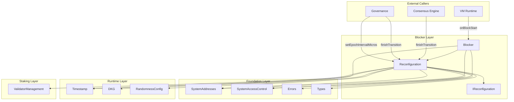

# Blocker Layer Specification

## Overview

The Blocker layer provides epoch lifecycle management and block prologue functionality for Gravity's consensus. It consists of two contracts:

- **Reconfiguration.sol** - Central orchestrator for epoch transitions with DKG coordination
- **Blocker.sol** - Block prologue entry point called by VM at each block start

Key design principles:

1. **Time-Based Epochs**: Epochs are defined by duration (default 2 hours), not block count
2. **DKG-Gated Transitions**: Epoch transitions are gated by DKG completion for randomness
3. **Single Orchestrator**: Reconfiguration owns the epoch transition lifecycle
4. **Two-Phase Transitions**: Start transition (from Blocker) and finish transition (from consensus/governance)

## Architecture

```
src/blocker/
├── IReconfiguration.sol  # Interface for Reconfiguration
├── Reconfiguration.sol   # Epoch lifecycle management
└── Blocker.sol           # Block prologue entry point
```

### Dependency Graph



## System Addresses

| Constant | Address | Description |
|----------|---------|-------------|
| `BLOCK` | `0x0000000000000000000000000001625F2016` | Blocker contract |
| `EPOCH_MANAGER` | `0x0000000000000000000000000001625F2010` | Reconfiguration contract |

---

## Contract: `Reconfiguration.sol`

### Purpose

Central orchestrator for epoch transitions. Coordinates with DKG, RandomnessConfig, and ValidatorManagement to manage the epoch lifecycle.

### State Machine

```
                checkAndStartTransition()
                (time elapsed && state == Idle)
    IDLE ────────────────────────────────────► DKG_IN_PROGRESS
     ▲                                              │
     │                                              │
     └──────────────────────────────────────────────┘
                 finishTransition()
```

### State Variables

```solidity
/// @notice Current epoch number (starts at 0)
uint64 public currentEpoch;

/// @notice Timestamp of last reconfiguration (microseconds)
uint64 public lastReconfigurationTime;

/// @notice Epoch interval in microseconds (default 2 hours)
uint64 public epochIntervalMicros;

/// @notice Current transition state
TransitionState private _transitionState;

/// @notice Epoch when transition was started
uint64 private _transitionStartedAtEpoch;

/// @notice Whether the contract has been initialized
bool private _initialized;
```

### Interface

```solidity
interface IReconfiguration {
    enum TransitionState {
        Idle,           // No transition in progress
        DkgInProgress   // DKG started, waiting for completion
    }

    // Events
    event EpochTransitionStarted(uint64 indexed epoch);
    event EpochTransitioned(uint64 indexed newEpoch, uint64 transitionTime);
    event EpochDurationUpdated(uint64 oldDuration, uint64 newDuration);

    // Initialization
    function initialize() external;

    // Transition Control
    function checkAndStartTransition() external returns (bool started);
    function finishTransition(bytes calldata dkgResult) external;

    // Governance
    function setEpochIntervalMicros(uint64 newIntervalMicros) external;

    // View Functions
    function currentEpoch() external view returns (uint64);
    function lastReconfigurationTime() external view returns (uint64);
    function epochIntervalMicros() external view returns (uint64);
    function canTriggerEpochTransition() external view returns (bool);
    function isTransitionInProgress() external view returns (bool);
    function getTransitionState() external view returns (TransitionState);
    function getRemainingTimeSeconds() external view returns (uint64);
}
```

---

## Function Specifications

### `initialize()`

Initialize the contract at genesis.

**Access Control**: GENESIS only

**Behavior**:
1. Set `currentEpoch = 0`
2. Set `epochIntervalMicros = 2 hours * 1_000_000`
3. Set `lastReconfigurationTime` to current timestamp
4. Set `transitionState = Idle`
5. Emit `EpochTransitioned(0, timestamp)`

**Reverts**:
- `AlreadyInitialized` - Contract already initialized

---

### `checkAndStartTransition()`

Check and start epoch transition if conditions are met.

**Access Control**: BLOCK (Blocker contract) only

**Behavior**:
1. If `transitionState == DkgInProgress`, return false (no-op)
2. Check if time has elapsed: `currentTime >= lastReconfigurationTime + epochIntervalMicros`
3. If not ready, return false
4. Get current validator set from ValidatorManagement
5. Get randomness config from RandomnessConfig
6. Clear any stale DKG session
7. Start DKG session with validators and config
8. Set `transitionState = DkgInProgress`
9. Emit `EpochTransitionStarted(currentEpoch)`
10. Return true

**Returns**: `bool started` - True if DKG was started

---

### `finishTransition(bytes dkgResult)`

Finish epoch transition after DKG completes.

**Access Control**: SYSTEM_CALLER (consensus engine) or GOVERNANCE (governance)

**Parameters**:
- `dkgResult` - DKG transcript (empty bytes for force-end or if DKG disabled)

**Behavior**:
1. Require `transitionState == DkgInProgress`
2. If `dkgResult` is non-empty, finish DKG session
3. Clear any incomplete DKG session
4. Apply pending RandomnessConfig
5. Increment epoch: `currentEpoch++`
6. Update `lastReconfigurationTime`
7. Call `ValidatorManagement.onNewEpoch(newEpoch)`
8. Set `transitionState = Idle`
9. Emit `EpochTransitioned(newEpoch, timestamp)`

**Reverts**:
- `ReconfigurationNotInProgress` - No transition in progress

---

### `setEpochIntervalMicros(uint64 newIntervalMicros)`

Update epoch interval via governance.

**Access Control**: GOVERNANCE only

**Behavior**:
1. Require `newIntervalMicros > 0`
2. Update `epochIntervalMicros`
3. Emit `EpochDurationUpdated(old, new)`

**Reverts**:
- `InvalidEpochInterval` - Interval is 0

---

## Contract: `Blocker.sol`

### Purpose

Block prologue entry point. Called by VM runtime at the start of each block to update on-chain state.

### Interface

```solidity
contract Blocker {
    event BlockStarted(uint256 indexed blockHeight, uint64 indexed epoch, address proposer, uint64 timestampMicros);
    event ComponentUpdateFailed(address indexed component, bytes reason);

    function initialize() external;
    function onBlockStart(bytes32 proposer, bytes32[] calldata failedProposers, uint64 timestampMicros) external;
    function isInitialized() external view returns (bool);
}
```

---

## Function Specifications

### `initialize()`

Initialize the contract at genesis.

**Access Control**: GENESIS only

**Behavior**:
1. Initialize Timestamp to 0
2. Emit `BlockStarted(0, 0, SYSTEM_CALLER, 0)`

---

### `onBlockStart(bytes32 proposer, bytes32[] failedProposers, uint64 timestampMicros)`

Called by VM runtime at the start of each block.

**Access Control**: SYSTEM_CALLER (VM runtime) only

**Parameters**:
- `proposer` - Block proposer's consensus public key (32 bytes, bytes32(0) for NIL blocks)
- `failedProposers` - Consensus pubkeys of validators who failed to propose (for future performance tracking)
- `timestampMicros` - Block timestamp in microseconds

**Behavior**:
1. Resolve proposer address:
   - If `proposer == bytes32(0)` (NIL block): use `SYSTEM_CALLER`
   - Otherwise: convert to address (placeholder for consensus key lookup)
2. Update global timestamp via `Timestamp.updateGlobalTime(validatorAddr, timestampMicros)`
3. Call `Reconfiguration.checkAndStartTransition()`
4. Get current epoch from Reconfiguration
5. Emit `BlockStarted(block.number, epoch, validatorAddr, timestampMicros)`

---

## Access Control Matrix

| Function | Allowed Callers |
|----------|-----------------|
| `Reconfiguration.initialize()` | GENESIS only |
| `Reconfiguration.checkAndStartTransition()` | BLOCK only |
| `Reconfiguration.finishTransition()` | SYSTEM_CALLER or GOVERNANCE |
| `Reconfiguration.setEpochIntervalMicros()` | GOVERNANCE only |
| `Reconfiguration` view functions | Anyone |
| `Blocker.initialize()` | GENESIS only |
| `Blocker.onBlockStart()` | SYSTEM_CALLER only |
| `Blocker.isInitialized()` | Anyone |

---

## Epoch Transition Flow

```
┌─────────────────────────────────────────────────────────────────────────────┐
│                        EPOCH TRANSITION LIFECYCLE                            │
├─────────────────────────────────────────────────────────────────────────────┤
│                                                                              │
│  PHASE 1: DETECTION & DKG START                                              │
│  ─────────────────────────────                                               │
│                                                                              │
│    VM Runtime                                                                │
│       │                                                                      │
│       │ onBlockStart(proposer, failed, timestamp)                            │
│       ▼                                                                      │
│    Blocker                                                                   │
│       │                                                                      │
│       ├─► Timestamp.updateGlobalTime()                                       │
│       │                                                                      │
│       └─► Reconfiguration.checkAndStartTransition()                          │
│               │                                                              │
│               ├── Check: time elapsed && state == Idle?                      │
│               │     └── If NO → return false                                 │
│               │                                                              │
│               ├── ValidatorManagement.getActiveValidators()                  │
│               ├── RandomnessConfig.getCurrentConfig()                        │
│               ├── DKG.tryClearIncompleteSession()                            │
│               ├── DKG.start(epoch, config, validators, validators)           │
│               │     └── Emits DKGStartEvent                                  │
│               ├── transitionState = DkgInProgress                            │
│               └── Emit EpochTransitionStarted                                │
│                                                                              │
├─────────────────────────────────────────────────────────────────────────────┤
│                                                                              │
│  [OFF-CHAIN: Consensus Engine runs DKG]                                      │
│                                                                              │
├─────────────────────────────────────────────────────────────────────────────┤
│                                                                              │
│  PHASE 2: FINISH TRANSITION                                                  │
│  ─────────────────────────                                                   │
│                                                                              │
│    Consensus Engine / Governance                                             │
│       │                                                                      │
│       │ finishTransition(dkgResult)                                          │
│       ▼                                                                      │
│    Reconfiguration                                                           │
│       │                                                                      │
│       ├── Validate: state == DkgInProgress                                   │
│       ├── DKG.finish(dkgResult) (if result provided)                         │
│       ├── DKG.tryClearIncompleteSession()                                    │
│       ├── RandomnessConfig.applyPendingConfig()                              │
│       ├── currentEpoch++                                                     │
│       ├── lastReconfigurationTime = now                                      │
│       ├── ValidatorManagement.onNewEpoch(newEpoch)                           │
│       ├── transitionState = Idle                                             │
│       └── Emit EpochTransitioned                                             │
│                                                                              │
└─────────────────────────────────────────────────────────────────────────────┘
```

---

## Default Configuration

| Parameter | Default Value | Description |
|-----------|---------------|-------------|
| `epochIntervalMicros` | 7,200,000,000 (2 hours) | Epoch duration in microseconds |
| `currentEpoch` | 0 | Starting epoch number |
| `transitionState` | Idle | Initial state |

---

## Time Convention

All timestamps in the Blocker layer use **microseconds** (uint64), consistent with:

- Timestamp contract
- RandomnessConfig
- ValidatorManagement timestamps

Conversion: `seconds * 1_000_000 = microseconds`

---

## Errors

| Error | When |
|-------|------|
| `AlreadyInitialized()` | Contract already initialized |
| `ReconfigurationInProgress()` | Transition already in progress |
| `ReconfigurationNotInProgress()` | No transition in progress to finish |
| `ReconfigurationNotInitialized()` | Contract not yet initialized |
| `InvalidEpochInterval()` | Epoch interval is 0 |

---

## NIL Block Handling

NIL blocks are special blocks where:
- No real proposer (system-generated block)
- Proposer consensus address is `bytes32(0)`
- Timestamp must stay the same (enforced by Timestamp contract)
- Maps to `SYSTEM_CALLER` address

---

## Chain Downtime Handling

If the chain is down for extended periods spanning multiple epochs:

1. When resumed, `canTriggerEpochTransition()` returns true immediately
2. Only **one** epoch transition occurs (skips missed epochs)
3. `lastReconfigurationTime` is set to current time
4. Epoch counter increments by 1, not by missed epochs

This is acceptable behavior since the chain was down anyway.

---

## Invariants

1. **Monotonic Epoch**: `currentEpoch` only increases
2. **Timestamp Update**: `lastReconfigurationTime` updates only on transitions
3. **Minimum Interval**: Transitions occur at least `epochIntervalMicros` apart
4. **State Consistency**: `transitionState` is always Idle or DkgInProgress
5. **DKG Synchronization**: Transition only completes after DKG completes or is force-ended

---

## Security Considerations

1. **Single Orchestrator**: Only Reconfiguration controls epoch transitions
2. **Two Entry Points**: Only Blocker (start) and SYSTEM_CALLER/GOVERNANCE (finish) can trigger transitions
3. **DKG-Gated**: Cannot complete transition without DKG completion (unless force-ended)
4. **Explicit State Machine**: TransitionState prevents invalid state changes
5. **Time-based**: Uses on-chain timestamp, not manipulable block numbers
6. **Governance Escape Hatch**: GOVERNANCE can force-end epoch if DKG is stuck

---

## Testing Requirements

### Unit Tests (Implemented)

1. **Reconfiguration** (`test/unit/blocker/Reconfiguration.t.sol` - 28 tests)
   - [x] Initialize correctly
   - [x] State machine transitions (Idle → DkgInProgress → Idle)
   - [x] Time-based transition condition
   - [x] Access control (BLOCK, SYSTEM_CALLER, GOVERNANCE)
   - [x] Parameter updates (setEpochIntervalMicros)
   - [x] Error conditions
   - [x] Full epoch lifecycle
   - [x] Multiple epoch transitions

2. **Blocker** (`test/unit/blocker/Blocker.t.sol` - 16 tests)
   - [x] Initialize correctly
   - [x] Normal block processing
   - [x] NIL block handling (bytes32(0) proposer)
   - [x] Timestamp update
   - [x] Epoch transition triggering
   - [x] Proposer resolution
   - [x] Integration with Reconfiguration

### Fuzz Tests (Implemented)

- [x] Variable epoch intervals (`testFuzz_setEpochIntervalMicros`, `testFuzz_epochTransitionWithVariableInterval`)
- [x] Proposer conversion (`testFuzz_onBlockStart_proposerConversion`)
- [x] Timestamp advances (`testFuzz_onBlockStart_timestampAdvances`)
- [x] Block sequences (`testFuzz_multipleBlocksSequence`)

### Integration Tests (Pending)

- [ ] Full epoch lifecycle with all dependent contracts
- [ ] Config application timing

### Invariant Tests (Pending)

- [ ] Epoch monotonicity
- [ ] Timing constraints
- [ ] State consistency

