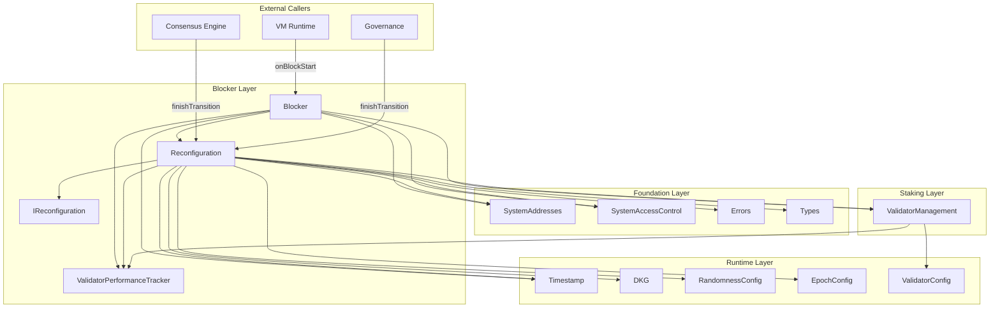

# Blocker Layer Specification

## Overview

The Blocker layer provides epoch lifecycle management and block prologue functionality for Gravity's consensus. It consists of three contracts:

- **Reconfiguration.sol** - Central orchestrator for epoch transitions with DKG coordination
- **Blocker.sol** - Block prologue entry point called by VM at each block start
- **ValidatorPerformanceTracker.sol** - Tracks per-validator proposal statistics within each epoch

Key design principles:

1. **Time-Based Epochs**: Epochs are defined by duration (default 2 hours), not block count
2. **DKG-Gated Transitions**: Epoch transitions are gated by DKG completion for randomness
3. **Single Orchestrator**: Reconfiguration owns the epoch transition lifecycle
4. **Two-Phase Transitions**: Start transition (from Blocker) and finish transition (from consensus/governance)

## Architecture

```
src/blocker/
├── IReconfiguration.sol              # Interface for Reconfiguration
├── Reconfiguration.sol               # Epoch lifecycle management
├── Blocker.sol                       # Block prologue entry point
├── IValidatorPerformanceTracker.sol   # Interface for performance tracker
└── ValidatorPerformanceTracker.sol    # Per-epoch validator performance tracking
```

### Dependency Graph


```mermaid
flowchart TD
    subgraph BlockerLayer[Blocker Layer]
        B[Blocker]
        R[Reconfiguration]
        IR[IReconfiguration]
        VPT[ValidatorPerformanceTracker]
    end
    
    subgraph Foundation[Foundation Layer]
        SA[SystemAddresses]
        SAC[SystemAccessControl]
        E[Errors]
        T[Types]
    end
    
    subgraph Runtime[Runtime Layer]
        TS[Timestamp]
        DKG[DKG]
        RC[RandomnessConfig]
        EC[EpochConfig]
        VC[ValidatorConfig]
    end
    
    subgraph Staking[Staking Layer]
        VM[ValidatorManagement]
    end
    
    B --> SA
    B --> SAC
    B --> R
    B --> TS
    B --> VM
    B --> VPT
    
    R --> IR
    R --> SA
    R --> SAC
    R --> E
    R --> T
    R --> TS
    R --> DKG
    R --> RC
    R --> EC
    R --> VM
    R --> VPT
    
    VM --> VC
    VM --> VPT
    
    subgraph Callers[External Callers]
        RUNTIME[VM Runtime]
        CONSENSUS[Consensus Engine]
        GOV[Governance]
    end
    
    RUNTIME -->|onBlockStart| B
    CONSENSUS -->|finishTransition| R
    GOV -->|finishTransition| R
```

## System Addresses

| Constant | Address | Description |
|----------|---------|-------------|
| `RECONFIGURATION` | `0x0000000000000000000000000001625F2003` | Reconfiguration contract |
| `BLOCK` | `0x0000000000000000000000000001625F2004` | Blocker contract |
| `PERFORMANCE_TRACKER` | `0x0000000000000000000000000001625F2005` | Validator performance tracker |

---

## Contract: `Reconfiguration.sol`

### Purpose

Central orchestrator for epoch transitions. Coordinates with DKG, RandomnessConfig, and ValidatorManagement to manage the epoch lifecycle.

### State Machine

```
                checkAndStartTransition()
                (time elapsed && state == Idle)
    IDLE ────────────────────────────────────► DKG_IN_PROGRESS
     ▲                                              │
     │                                              │
     └──────────────────────────────────────────────┘
                 finishTransition()
```

### State Variables

```solidity
/// @notice Current epoch number (starts at 1 after genesis initialization)
uint64 public currentEpoch;

/// @notice Timestamp of last reconfiguration (microseconds)
uint64 public lastReconfigurationTime;

/// @notice Current transition state
TransitionState private _transitionState;

/// @notice Epoch when transition was started
uint64 private _transitionStartedAtEpoch;

/// @notice Whether the contract has been initialized
bool private _initialized;
```

> **Note**: `epochIntervalMicros` is stored in `EpochConfig` (Runtime layer), not in Reconfiguration. On genesis, `initialize()` sets `currentEpoch = 1` and emits `EpochTransitioned(0, timestamp)` for the genesis block.

### Interface

```solidity
interface IReconfiguration {
    enum TransitionState {
        Idle,           // No transition in progress
        DkgInProgress   // DKG started, waiting for completion
    }

    // Events
    event EpochTransitionStarted(uint64 indexed epoch);
    event EpochTransitioned(uint64 indexed newEpoch, uint64 transitionTime);
    event NewEpochEvent(
        uint64 indexed epoch,
        ValidatorConsensusInfo[] validators,
        uint256 totalVotingPower,
        uint64 timestampMicros
    );

    // Initialization
    function initialize() external;

    // Transition Control
    function checkAndStartTransition() external returns (bool started);
    function finishTransition(bytes calldata dkgResult) external;
    function governanceReconfigure() external;

    // View Functions
    function currentEpoch() external view returns (uint64);
    function lastReconfigurationTime() external view returns (uint64);
    function canTriggerEpochTransition() external view returns (bool);
    function isTransitionInProgress() external view returns (bool);
    function getTransitionState() external view returns (TransitionState);
    function getRemainingTimeSeconds() external view returns (uint64);
}
```

> **Note**: `epochIntervalMicros()` getter and `setEpochIntervalMicros()` moved to `EpochConfig` in the Runtime layer.

---

## Function Specifications

### `initialize()`

Initialize the contract at genesis.

**Access Control**: GENESIS only

**Behavior**:
1. Set `currentEpoch = 1` (post-genesis active epoch)
2. Set `lastReconfigurationTime` to current timestamp
3. Set `transitionState = Idle`
4. Emit `EpochTransitioned(0, timestamp)` (epoch 0 = genesis marker)

> **Note**: `epochIntervalMicros` is not set here; it is initialized separately in `EpochConfig`.

**Reverts**:
- `AlreadyInitialized` - Contract already initialized

---

### `checkAndStartTransition()`

Check and start epoch transition if conditions are met.

**Access Control**: BLOCK (Blocker contract) only

**Behavior**:
1. If `transitionState == DkgInProgress`, return false (no-op)
2. Check if time has elapsed: `currentTime >= lastReconfigurationTime + EpochConfig.epochIntervalMicros()`. If not, return false.
3. **Evict underperforming validators** via `ValidatorManagement.evictUnderperformingValidators()` (uses the closing epoch's performance data, which is still available because the perf tracker has not yet been reset).
4. Read randomness variant from `RandomnessConfig.getCurrentConfig()`.
5. Branch:
   - **If variant == Off (DKG disabled)**: call `_doImmediateReconfigure()` (clears any stale DKG session, then runs `_applyReconfiguration()` inline — no `EpochTransitionStarted` event, no state transition through `DkgInProgress`).
   - **If variant != Off**: call `_startDkgSession(config)` — fetch dealer/target consensus infos, clear stale DKG session, `DKG.start(...)`, set `transitionState = DkgInProgress`, emit `EpochTransitionStarted(currentEpoch)`.
6. Return true.

**Returns**: `bool started` - True if a transition was started (DKG path) or applied (immediate path).

---

### `finishTransition(bytes dkgResult)`

Finish epoch transition after DKG completes.

**Access Control**: SYSTEM_CALLER (consensus engine) or GOVERNANCE (force-end)

**Parameters**:
- `dkgResult` - DKG transcript (empty bytes = governance force-end without transcript)

**Behavior**:
1. Require `transitionState == DkgInProgress`.
2. If `dkgResult.length > 0`, call `DKG.finish(dkgResult)`.
3. `DKG.tryClearIncompleteSession()`.
4. Call `_applyReconfiguration()` (see below).

**Reverts**:
- `ReconfigurationNotInProgress` - No transition in progress

---

### `governanceReconfigure()`

Force an immediate reconfiguration from governance (bypasses the time check).

**Access Control**: GOVERNANCE only

**Behavior**:
1. Require `transitionState != DkgInProgress` (if one is in progress, governance should call `finishTransition` instead). Revert with `ReconfigurationInProgress` otherwise.
2. Evict underperforming validators.
3. Read randomness variant.
4. If `Off`, run `_doImmediateReconfigure()`; otherwise `_startDkgSession(config)` — governance must follow up with `finishTransition(...)`.

---

### `_applyReconfiguration()` (internal)

Core reconfiguration body shared by `finishTransition()` and `_doImmediateReconfigure()`:

1. **Apply pending configs** (order: RandomnessConfig → ConsensusConfig → ExecutionConfig → ValidatorConfig → VersionConfig → GovernanceConfig → StakingConfig → EpochConfig).
2. **`ValidatorManagement.onNewEpoch()`** (before epoch increment, matching Aptos).
3. **Reset performance tracker**: read `getActiveValidatorCount()` and call `PerformanceTracker.onNewEpoch(newCount)`. MUST happen after `onNewEpoch()` — it destructively erases the closing epoch's perf data.
4. Increment epoch: `currentEpoch++`.
5. `lastReconfigurationTime = now`.
6. `transitionState = Idle`.
7. Emit `EpochTransitioned(newEpoch, timestamp)` and `NewEpochEvent(newEpoch, validators, totalVotingPower, timestamp)`.

> **Important ordering notes**:
> - Eviction is performed in `checkAndStartTransition()` / `governanceReconfigure()` (before DKG starts), NOT inside `_applyReconfiguration()`. This ensures the closing epoch's performance data is consulted before the perf tracker is reset.
> - `onNewEpoch()` is called before the epoch number is incremented, matching Aptos's `reconfiguration.move`.
> - `NewEpochEvent` carries the finalized validator set for the consensus engine.

---

## Contract: `Blocker.sol`

### Purpose

Block prologue entry point. Called by VM runtime at the start of each block to update on-chain state.

### Interface

```solidity
contract Blocker {
    event BlockStarted(uint256 indexed blockHeight, uint64 indexed epoch, address proposer, uint64 timestampMicros);
    event ComponentUpdateFailed(address indexed component, bytes reason);

    function initialize() external;
    function onBlockStart(uint64 proposerIndex, uint64[] calldata failedProposerIndices, uint64 timestampMicros) external;
    function isInitialized() external view returns (bool);
}
```

> **Note**: The signature changed from `(bytes32 proposer, bytes32[] failedProposers, ...)` to `(uint64 proposerIndex, uint64[] failedProposerIndices, ...)` to align with Aptos's approach of using validator indices.

---

## Function Specifications

### `initialize()`

Initialize the contract at genesis.

**Access Control**: GENESIS only

**Behavior**:
1. Initialize Timestamp to 0
2. Emit `BlockStarted(0, 0, SYSTEM_CALLER, 0)`

---

### `onBlockStart(uint64 proposerIndex, uint64[] failedProposerIndices, uint64 timestampMicros)`

Called by VM runtime at the start of each block.

**Access Control**: SYSTEM_CALLER (VM runtime) only

**Parameters**:
- `proposerIndex` - Index of the block proposer in the active validator set (`type(uint64).max` for NIL blocks)
- `failedProposerIndices` - Indices of validators who failed to propose (for future performance tracking)
- `timestampMicros` - Block timestamp in microseconds

**Behavior** (in this exact order — perf tracker update MUST precede the reconfig check because the block that triggers the transition is the last block of the closing epoch):
1. `ValidatorPerformanceTracker.updateStatistics(proposerIndex, failedProposerIndices)` — record the closing epoch's proposal outcomes first.
2. Resolve proposer address:
   - If `proposerIndex == NIL_PROPOSER_INDEX (type(uint64).max)` (NIL block): use `SYSTEM_CALLER`.
   - Otherwise: `ValidatorManagement.getActiveValidatorByIndex(proposerIndex).validator` (returns the stake-pool address).
3. `Timestamp.updateGlobalTime(validatorAddr, timestampMicros)` — normal blocks must advance time; NIL blocks keep the same timestamp.
4. `Reconfiguration.checkAndStartTransition()` — may trigger auto-eviction + DKG/immediate reconfigure.
5. Read `Reconfiguration.currentEpoch()`.
6. Emit `BlockStarted(block.number, epoch, validatorAddr, timestampMicros)`.

> **Note**: Using validator indices (instead of consensus public keys) aligns with Aptos's `block_prologue` approach where the consensus layer passes proposer indices.

---

## Access Control Matrix

| Function | Allowed Callers |
|----------|-----------------|
| `Reconfiguration.initialize()` | GENESIS only |
| `Reconfiguration.checkAndStartTransition()` | BLOCK only |
| `Reconfiguration.finishTransition()` | SYSTEM_CALLER or GOVERNANCE |
| `Reconfiguration.governanceReconfigure()` | GOVERNANCE only |
| `Reconfiguration` view functions | Anyone |
| `Blocker.initialize()` | GENESIS only |
| `Blocker.onBlockStart()` | SYSTEM_CALLER only |
| `Blocker.isInitialized()` | Anyone |
| `ValidatorPerformanceTracker.initialize()` | GENESIS only |
| `ValidatorPerformanceTracker.updateStatistics()` | BLOCK only |
| `ValidatorPerformanceTracker.onNewEpoch()` | RECONFIGURATION only |
| `ValidatorPerformanceTracker` view functions | Anyone |

> **Note**: `setEpochIntervalMicros()` is now in `EpochConfig`, not `Reconfiguration`.

---

## Epoch Transition Flow

```
┌─────────────────────────────────────────────────────────────────────────────┐
│                        EPOCH TRANSITION LIFECYCLE                            │
├─────────────────────────────────────────────────────────────────────────────┤
│                                                                              │
│  PHASE 1: DETECTION, EVICTION, DKG START                                     │
│  ────────────────────────────────────                                        │
│                                                                              │
│    VM Runtime                                                                │
│       │                                                                      │
│       │ onBlockStart(proposerIndex, failed, timestamp)                       │
│       ▼                                                                      │
│    Blocker                                                                   │
│       │                                                                      │
│       ├─► PerformanceTracker.updateStatistics(proposer, failed)  (FIRST)    │
│       ├─► resolveProposer(proposerIndex) (NIL → SYSTEM_CALLER)               │
│       ├─► Timestamp.updateGlobalTime(validatorAddr, ts)                      │
│       │                                                                      │
│       └─► Reconfiguration.checkAndStartTransition()                          │
│               │                                                              │
│               ├── Check: time elapsed && state == Idle?                      │
│               │     └── If NO → return false                                 │
│               │                                                              │
│               ├── ValidatorManagement.evictUnderperformingValidators()       │
│               ├── RandomnessConfig.getCurrentConfig()                        │
│               │                                                              │
│               ├── IF variant == Off (DKG disabled):                          │
│               │     ├── DKG.tryClearIncompleteSession()                      │
│               │     └── _applyReconfiguration() ──► jump to Phase 2 body    │
│               │                                                              │
│               └── ELSE (DKG enabled):                                        │
│                     ├── ValidatorManagement.getCurValidatorConsensusInfos()  │
│                     ├── ValidatorManagement.getNextValidatorConsensusInfos() │
│                     ├── DKG.tryClearIncompleteSession()                      │
│                     ├── DKG.start(currentEpoch, config, dealers, targets)    │
│                     │     └── Emits DKGStartEvent                            │
│                     ├── transitionState = DkgInProgress                      │
│                     └── Emit EpochTransitionStarted                          │
│                                                                              │
├─────────────────────────────────────────────────────────────────────────────┤
│                                                                              │
│  [OFF-CHAIN: Consensus Engine runs DKG]                                      │
│                                                                              │
├─────────────────────────────────────────────────────────────────────────────┤
│                                                                              │
│  PHASE 2: FINISH TRANSITION (_applyReconfiguration body)                     │
│  ───────────────────────────────────────────────────                         │
│                                                                              │
│    Consensus Engine / Governance                                             │
│       │                                                                      │
│       │ finishTransition(dkgResult)                                          │
│       ▼                                                                      │
│    Reconfiguration                                                           │
│       │                                                                      │
│       ├── Validate: state == DkgInProgress                                   │
│       ├── DKG.finish(dkgResult) (if result provided)                         │
│       ├── DKG.tryClearIncompleteSession()                                    │
│       │                                                                      │
│       │  [ _applyReconfiguration() shared body ]                             │
│       ├── RandomnessConfig.applyPendingConfig()                              │
│       ├── ConsensusConfig.applyPendingConfig()                               │
│       ├── ExecutionConfig.applyPendingConfig()                               │
│       ├── ValidatorConfig.applyPendingConfig()                               │
│       ├── VersionConfig.applyPendingConfig()                                 │
│       ├── GovernanceConfig.applyPendingConfig()                              │
│       ├── StakingConfig.applyPendingConfig()                                 │
│       ├── EpochConfig.applyPendingConfig()                                   │
│       ├── ValidatorManagement.onNewEpoch() (BEFORE incrementing epoch)       │
│       ├── PerformanceTracker.onNewEpoch(getActiveValidatorCount())           │
│       ├── currentEpoch++                                                     │
│       ├── lastReconfigurationTime = now                                      │
│       ├── transitionState = Idle                                             │
│       └── Emit EpochTransitioned + NewEpochEvent(validators, totalPower)     │
│                                                                              │
└─────────────────────────────────────────────────────────────────────────────┘
```

---

## Default Configuration

| Parameter | Default Value | Description |
|-----------|---------------|-------------|
| `currentEpoch` | 0 | Starting epoch number |
| `transitionState` | Idle | Initial state |

> **Note**: `epochIntervalMicros` is now configured in `EpochConfig` (default 7,200,000,000 = 2 hours).

---

## Time Convention

All timestamps in the Blocker layer use **microseconds** (uint64), consistent with:

- Timestamp contract
- RandomnessConfig
- ValidatorManagement timestamps

Conversion: `seconds * 1_000_000 = microseconds`

---

## Errors

| Error | When |
|-------|------|
| `AlreadyInitialized()` | Contract already initialized |
| `ReconfigurationInProgress()` | Transition already in progress |
| `ReconfigurationNotInProgress()` | No transition in progress to finish |
| `ReconfigurationNotInitialized()` | Contract not yet initialized |

> **Note**: `InvalidEpochInterval()` is now in `EpochConfig`, not `Reconfiguration`.

---

## NIL Block Handling

NIL blocks are special blocks where:
- No real proposer (system-generated block)
- Proposer index is `type(uint64).max` (max uint64 value)
- Timestamp must stay the same (enforced by Timestamp contract)
- Maps to `SYSTEM_CALLER` address

---

## Chain Downtime Handling

If the chain is down for extended periods spanning multiple epochs:

1. When resumed, `canTriggerEpochTransition()` returns true immediately
2. Only **one** epoch transition occurs (skips missed epochs)
3. `lastReconfigurationTime` is set to current time
4. Epoch counter increments by 1, not by missed epochs

This is acceptable behavior since the chain was down anyway.

---

## Invariants

1. **Monotonic Epoch**: `currentEpoch` only increases
2. **Timestamp Update**: `lastReconfigurationTime` updates only on transitions
3. **Minimum Interval**: Transitions occur at least `EpochConfig.epochIntervalMicros()` apart
4. **State Consistency**: `transitionState` is always Idle or DkgInProgress
5. **DKG Synchronization**: Transition only completes after DKG completes or is force-ended
6. **Transition Ordering**: `ValidatorManagement.onNewEpoch()` is called before epoch increment

---

## Security Considerations

1. **Single Orchestrator**: Only Reconfiguration controls epoch transitions
2. **Two Entry Points**: Only Blocker (start) and SYSTEM_CALLER/GOVERNANCE (finish) can trigger transitions
3. **DKG-Gated**: Cannot complete transition without DKG completion (unless force-ended)
4. **Explicit State Machine**: TransitionState prevents invalid state changes
5. **Time-based**: Uses on-chain timestamp, not manipulable block numbers
6. **Governance Escape Hatch**: GOVERNANCE can force-end epoch if DKG is stuck

---

## Testing Requirements

### Unit Tests (Implemented)

1. **Reconfiguration** (`test/unit/blocker/Reconfiguration.t.sol` - 28 tests)
   - [x] Initialize correctly
   - [x] State machine transitions (Idle → DkgInProgress → Idle)
   - [x] Time-based transition condition
   - [x] Access control (BLOCK, SYSTEM_CALLER, GOVERNANCE)
   - [x] Parameter updates (setEpochIntervalMicros)
   - [x] Error conditions
   - [x] Full epoch lifecycle
   - [x] Multiple epoch transitions

2. **Blocker** (`test/unit/blocker/Blocker.t.sol` - 16 tests)
   - [x] Initialize correctly
   - [x] Normal block processing
   - [x] NIL block handling (proposerIndex == type(uint64).max)
   - [x] Timestamp update
   - [x] Epoch transition triggering
   - [x] Proposer resolution via validator index
   - [x] Integration with Reconfiguration

### Fuzz Tests (Implemented)

- [x] Proposer index resolution (`testFuzz_onBlockStart_proposerConversion`)
- [x] Timestamp advances (`testFuzz_onBlockStart_timestampAdvances`)
- [x] Block sequences (`testFuzz_multipleBlocksSequence`)

> **Note**: Epoch interval fuzz tests moved to `EpochConfig.t.sol`.

### Integration Tests (Pending)

- [ ] Full epoch lifecycle with all dependent contracts
- [ ] Config application timing

### Invariant Tests (Pending)

- [ ] Epoch monotonicity
- [ ] Timing constraints
- [ ] State consistency

---

## Changelog

### 2026-01-04: Aptos Alignment - Proposer Index and Epoch Interval Refactoring

**Blocker Changes**:
- Changed `onBlockStart` signature from `(bytes32 proposer, bytes32[] failedProposers, uint64 timestampMicros)` to `(uint64 proposerIndex, uint64[] failedProposerIndices, uint64 timestampMicros)`
- NIL blocks now use `proposerIndex == type(uint64).max` instead of `bytes32(0)`
- Proposer resolution now queries `ValidatorManagement.getActiveValidatorByIndex(proposerIndex)`
- This aligns with Aptos's `block_prologue` approach using validator indices

**Reconfiguration Changes**:
- Removed `epochIntervalMicros` state variable (moved to `EpochConfig` in Runtime layer)
- Removed `setEpochIntervalMicros()` function (moved to `EpochConfig`)
- Removed `EpochDurationUpdated` event (now in `EpochConfig`)
- Now reads `epochIntervalMicros` from `EpochConfig` contract
- Fixed `finishTransition()` ordering: `ValidatorManagement.onNewEpoch()` is now called BEFORE incrementing epoch, matching Aptos's `reconfiguration.move` pattern
- `onNewEpoch()` no longer receives the new epoch as a parameter; ValidatorManagement reads it directly

**Rationale**:
- Using validator indices instead of consensus public keys matches Aptos's consensus layer design
- Moving epoch interval to `EpochConfig` follows the pattern of centralizing runtime configuration
- The epoch transition ordering fix ensures validator set changes are processed in the context of the current epoch before advancing

### 2026-02-10: ValidatorPerformanceTracker and Auto-Eviction Integration

**New Contract: `ValidatorPerformanceTracker.sol`**:
- Tracks per-validator successful and failed proposal counts within each epoch
- Called by `Blocker.onBlockStart()` every block to record proposer outcomes
- Reset by `Reconfiguration._applyReconfiguration()` at epoch boundaries
- Performance data consumed by `ValidatorManagement.evictUnderperformingValidators()`
- Follows Aptos `stake::ValidatorPerformance` pattern

**Reconfiguration Changes**:
- Added `evictUnderperformingValidators()` call between config apply and `onNewEpoch()`
- Added `ValidatorPerformanceTracker.onNewEpoch()` call after `onNewEpoch()` to reset perf counters
- Updated step numbering in `_applyReconfiguration()` to reflect new steps

**Blocker Changes**:
- Added `ValidatorPerformanceTracker.updateStatistics()` call in `onBlockStart()`

**Rationale**:
- Auto-eviction provides a mechanism to remove validators that fail to produce blocks
- The eviction step is placed after config apply (so `autoEvictEnabled` reflects latest governance) and before `onNewEpoch()` (so evicted validators transition to INACTIVE in the same epoch)

