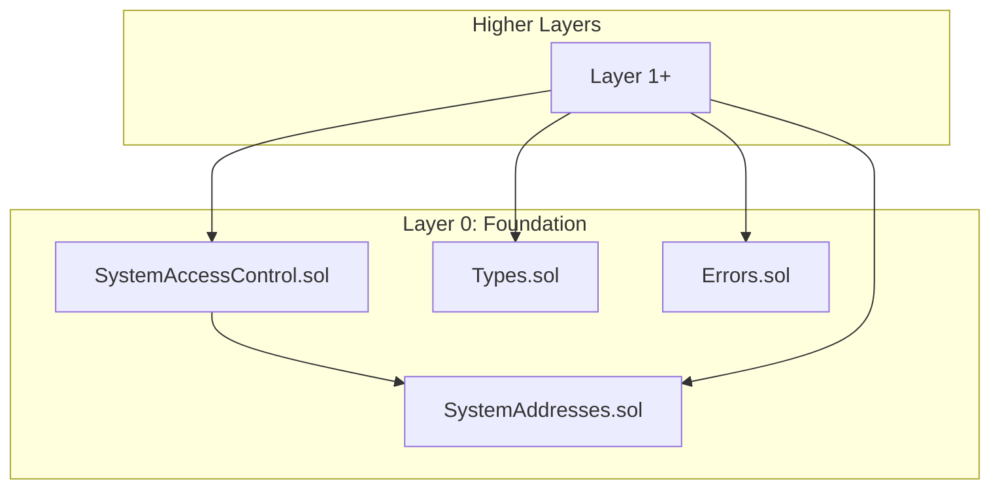

# Foundation Layer Specification

## Overview

The Foundation layer provides the bedrock for all Gravity system contracts. It contains no dependencies on other layers
and exports pure data types, constants, and utility functions that higher layers build upon.

## Design Goals

1. **Zero Dependencies**: No external imports beyond Solidity built-ins
2. **Compile-time Constants**: All system addresses are inlined at compile time (~3 gas vs ~2100 gas for SLOAD)
3. **Gas Efficient**: No storage reads for address lookups
4. **Type Safety**: Strong typing for all domain concepts
5. **Unified Error Handling**: Consistent custom errors across all contracts
6. **Microsecond Time**: All timestamps use `uint64` microseconds (consistent with Aptos/Timestamp contract)

---

## Architecture

```
src/foundation/
├── SystemAddresses.sol      # Compile-time address constants (library)
├── SystemAccessControl.sol  # Access control free functions
├── Types.sol                # Core data types (structs, enums)
└── Errors.sol               # Custom errors (library)
```

### Dependency Graph



---

## Contract: `SystemAddresses.sol`

A library containing compile-time constants for all Gravity system addresses. These addresses follow the `0x1625F2xxx`
pattern and are reserved at genesis.

### Address Table

| Constant            | Address                                        | Description                       |
| ------------------- | ---------------------------------------------- | --------------------------------- |
| `SYSTEM_CALLER`     | `0x0000000000000000000000000001625F2000`       | VM/runtime system calls           |
| `GENESIS`           | `0x0000000000000000000000000001625F2008`       | Genesis initialization contract   |
| `EPOCH_MANAGER`     | `0x0000000000000000000000000001625F2010`       | Epoch lifecycle management        |
| `STAKE_CONFIG`      | `0x0000000000000000000000000001625F2011`       | Staking configuration parameters  |
| `STAKING`           | `0x0000000000000000000000000001625F2012`       | Governance staking factory        |
| `VALIDATOR_MANAGER` | `0x0000000000000000000000000001625F2013`       | Validator set management          |
| `GOVERNANCE`        | `0x0000000000000000000000000001625F2014`       | Governance contract               |
| `VALIDATOR_CONFIG`  | `0x0000000000000000000000000001625F2015`       | Validator config parameters       |
| `BLOCK`             | `0x0000000000000000000000000001625F2016`       | Block prologue/epilogue handler   |
| `TIMESTAMP`         | `0x0000000000000000000000000001625F2017`       | On-chain time oracle              |
| `JWK_MANAGER`       | `0x0000000000000000000000000001625F2018`       | JWK management for keyless auth   |
| `NATIVE_ORACLE`     | `0x0000000000000000000000000001625F2023`       | Native oracle                     |
| `RANDOMNESS_CONFIG` | `0x0000000000000000000000000001625F2024`       | DKG threshold configuration       |
| `DKG`               | `0x0000000000000000000000000001625F2025`       | Distributed Key Generation        |
| `GOVERNANCE_CONFIG` | `0x0000000000000000000000000001625F2026`       | Governance voting parameters      |

### Implementation

```solidity
// SPDX-License-Identifier: MIT
pragma solidity ^0.8.30;

/// @title SystemAddresses
/// @notice Compile-time constants for Gravity system addresses
/// @dev Import this library to get zero-cost address access (inlined by compiler)
///      All addresses use the 0x1625F2xxx pattern reserved at genesis
library SystemAddresses {
    /// @notice VM/runtime system caller address
    /// @dev Used for block prologue, NIL blocks, and other system-initiated calls
    address internal constant SYSTEM_CALLER = 0x0000000000000000000000000001625F2000;

    /// @notice Genesis initialization contract
    /// @dev Only active during chain initialization
    address internal constant GENESIS = 0x0000000000000000000000000001625F2008;

    /// @notice Epoch lifecycle manager
    /// @dev Handles epoch transitions and reconfiguration
    address internal constant EPOCH_MANAGER = 0x0000000000000000000000000001625F2010;

    /// @notice Staking configuration contract
    /// @dev Stores staking parameters (lockup duration, minimum stake, etc.)
    address internal constant STAKE_CONFIG = 0x0000000000000000000000000001625F2011;

    /// @notice Governance staking contract
    /// @dev Anyone can stake tokens to participate in governance voting
    address internal constant STAKING = 0x0000000000000000000000000001625F2012;

    /// @notice Validator set management contract
    /// @dev Manages validator registration, bonding, and set transitions
    address internal constant VALIDATOR_MANAGER = 0x0000000000000000000000000001625F2013;

    /// @notice Governance contract
    /// @dev Handles proposals, voting, and execution of governance decisions
    address internal constant GOVERNANCE = 0x0000000000000000000000000001625F2014;

    /// @notice Validator configuration contract
    /// @dev Stores validator parameters (minimum/maximum bond, unbonding delay, etc.)
    address internal constant VALIDATOR_CONFIG = 0x0000000000000000000000000001625F2015;

    /// @notice Block prologue/epilogue handler
    /// @dev Called by VM at start/end of each block
    address internal constant BLOCK = 0x0000000000000000000000000001625F2016;

    /// @notice On-chain timestamp oracle
    /// @dev Provides microsecond-precision time, updated in block prologue
    address internal constant TIMESTAMP = 0x0000000000000000000000000001625F2017;

    /// @notice JWK (JSON Web Key) manager
    /// @dev Manages JWKs for keyless account authentication
    address internal constant JWK_MANAGER = 0x0000000000000000000000000001625F2018;

    /// @notice Native oracle contract
    /// @dev Stores verified data from external sources (blockchains, JWK providers, DNS).
    ///      Supports hash-only mode (storage-efficient) and data mode (direct access).
    ///      Data is recorded by consensus engine via SYSTEM_CALLER.
    address internal constant NATIVE_ORACLE = 0x0000000000000000000000000001625F2023;

    /// @notice Randomness configuration contract
    /// @dev Stores DKG threshold parameters for on-chain randomness
    address internal constant RANDOMNESS_CONFIG = 0x0000000000000000000000000001625F2024;

    /// @notice DKG (Distributed Key Generation) contract
    /// @dev Manages DKG session lifecycle for epoch transitions
    address internal constant DKG = 0x0000000000000000000000000001625F2025;

    /// @notice Governance configuration contract
    /// @dev Stores governance parameters (voting threshold, proposal stake, etc.)
    address internal constant GOVERNANCE_CONFIG = 0x0000000000000000000000000001625F2026;
}
```

### Gas Comparison

| Approach              | Gas Cost                           |
| --------------------- | ---------------------------------- |
| Compile-time constant | ~3 gas (PUSH opcode, inlined)      |
| Immutable storage     | ~100 gas                           |
| SLOAD (mapping)       | ~2100 gas (cold) / ~100 gas (warm) |
| External call + SLOAD | ~2600+ gas                         |

---

## Contract: `SystemAccessControl.sol`

Free functions for access control that can be imported and used directly. No inheritance required.

### Errors

```solidity
/// @notice Caller is not the allowed address
/// @param caller The actual msg.sender
/// @param allowed The expected address
error NotAllowed(address caller, address allowed);

/// @notice Caller is not in the allowed set
/// @param caller The actual msg.sender
/// @param allowed The array of allowed addresses
error NotAllowedAny(address caller, address[] allowed);
```

### Implementation

```solidity
// SPDX-License-Identifier: MIT
pragma solidity ^0.8.30;

import {SystemAddresses} from "./SystemAddresses.sol";

/// @notice Caller is not the allowed address
error NotAllowed(address caller, address allowed);

/// @notice Caller is not in the allowed set
error NotAllowedAny(address caller, address[] allowed);

/// @notice Reverts if msg.sender is not the allowed address
/// @param allowed The single allowed address
function requireAllowed(address allowed) view {
    if (msg.sender != allowed) {
        revert NotAllowed(msg.sender, allowed);
    }
}

/// @notice Reverts if msg.sender is not one of the two allowed addresses
/// @param a1 First allowed address
/// @param a2 Second allowed address
function requireAllowed(address a1, address a2) view {
    if (msg.sender != a1 && msg.sender != a2) {
        address[] memory allowed = new address[](2);
        allowed[0] = a1;
        allowed[1] = a2;
        revert NotAllowedAny(msg.sender, allowed);
    }
}

/// @notice Reverts if msg.sender is not one of the three allowed addresses
/// @param a1 First allowed address
/// @param a2 Second allowed address
/// @param a3 Third allowed address
function requireAllowed(address a1, address a2, address a3) view {
    if (msg.sender != a1 && msg.sender != a2 && msg.sender != a3) {
        address[] memory allowed = new address[](3);
        allowed[0] = a1;
        allowed[1] = a2;
        allowed[2] = a3;
        revert NotAllowedAny(msg.sender, allowed);
    }
}

/// @notice Reverts if msg.sender is not one of the four allowed addresses
/// @param a1 First allowed address
/// @param a2 Second allowed address
/// @param a3 Third allowed address
/// @param a4 Fourth allowed address
function requireAllowed(address a1, address a2, address a3, address a4) view {
    if (msg.sender != a1 && msg.sender != a2 && msg.sender != a3 && msg.sender != a4) {
        address[] memory allowed = new address[](4);
        allowed[0] = a1;
        allowed[1] = a2;
        allowed[2] = a3;
        allowed[3] = a4;
        revert NotAllowedAny(msg.sender, allowed);
    }
}

/// @notice Reverts if msg.sender is not in the allowed array
/// @param allowed Array of allowed addresses
function requireAllowedAny(address[] memory allowed) view {
    uint256 len = allowed.length;
    for (uint256 i; i < len;) {
        if (msg.sender == allowed[i]) return;
        unchecked { ++i; }
    }
    revert NotAllowedAny(msg.sender, allowed);
}
```

---

## Contract: `Types.sol`

Core data structures used across Gravity system contracts. These are defined as user-defined types, structs, and enums
that can be imported without inheritance.

### Staking Types

```solidity
/// @notice Stake position for governance voting
/// @dev Anyone can stake tokens and participate in governance.
///      All timestamps are in microseconds (from Timestamp contract).
struct StakePosition {
    /// @notice Staked token amount
    uint256 amount;
    /// @notice Lockup expiration timestamp (microseconds)
    uint64 lockedUntil;
    /// @notice When stake was first deposited (microseconds)
    uint64 stakedAt;
}
```

### Validator Types

```solidity
/// @notice Validator lifecycle status
enum ValidatorStatus {
    INACTIVE,           // 0: Not in validator set
    PENDING_ACTIVE,     // 1: Queued to join next epoch
    ACTIVE,             // 2: Currently validating
    PENDING_INACTIVE    // 3: Queued to leave next epoch
}

/// @notice Validator consensus info (packed for consensus engine)
struct ValidatorConsensusInfo {
    /// @notice Validator identity address
    address validator;
    /// @notice BLS public key for consensus
    bytes consensusPubkey;
    /// @notice Proof of possession for BLS key
    bytes consensusPop;
    /// @notice Voting power derived from bond
    uint256 votingPower;
}

/// @notice Full validator record
/// @dev All timestamps are in microseconds (from Timestamp contract).
struct ValidatorRecord {
    /// @notice Immutable validator identity address
    address validator;
    /// @notice Display name (max 31 bytes)
    string moniker;
    /// @notice Owner address (controls bond, can set operator)
    address owner;
    /// @notice Operator address (can rotate keys, request join/leave)
    address operator;
    /// @notice Current lifecycle status
    ValidatorStatus status;
    
    // === Bond Management (simplified - no 4-bucket model) ===
    /// @notice Current validator bond amount
    uint256 bond;
    /// @notice Pending unbond amount (effective next epoch)
    uint256 pendingUnbond;
    /// @notice When unbond becomes withdrawable (microseconds)
    uint64 unbondAvailableAt;
    
    // === Consensus Key Material ===
    /// @notice BLS consensus public key
    bytes consensusPubkey;
    /// @notice Proof of possession for BLS key
    bytes consensusPop;
    /// @notice Network addresses for P2P
    bytes networkAddresses;
    /// @notice Fullnode addresses
    bytes fullnodeAddresses;
    
    // === Fee Distribution ===
    /// @notice Current fee recipient address
    address feeRecipient;
    /// @notice Pending fee recipient (applied next epoch)
    address pendingFeeRecipient;
    
    // === Optional External Staking Pool ===
    /// @notice Address of IValidatorStakingPool (0x0 if none)
    address stakingPool;
    
    // === Indexing ===
    /// @notice Index in active validator array (only valid when ACTIVE/PENDING_INACTIVE)
    uint64 validatorIndex;
}

/// @notice Compact validator info for queries
struct ValidatorInfo {
    address validator;
    uint64 votingPower;
    uint64 validatorIndex;
    bytes consensusPubkey;
}
```

### Governance Types

```solidity
/// @notice Governance proposal lifecycle state
enum ProposalState {
    PENDING,    // 0: Voting active
    SUCCEEDED,  // 1: Passed, ready to execute
    FAILED,     // 2: Did not pass
    EXECUTED,   // 3: Already executed
    CANCELLED   // 4: Cancelled
}

/// @notice Governance proposal
/// @dev All timestamps are in microseconds (from Timestamp contract).
struct Proposal {
    /// @notice Unique proposal identifier
    uint64 id;
    /// @notice Address that created the proposal
    address proposer;
    /// @notice Hash of execution script/payload
    bytes32 executionHash;
    /// @notice IPFS/URL to proposal metadata
    string metadataUri;
    /// @notice When proposal was created (microseconds)
    uint64 creationTime;
    /// @notice When voting ends (microseconds)
    uint64 expirationTime;
    /// @notice Minimum votes required for quorum
    uint128 minVoteThreshold;
    /// @notice Total yes votes
    uint128 yesVotes;
    /// @notice Total no votes
    uint128 noVotes;
    /// @notice Whether proposal has been resolved
    bool isResolved;
    /// @notice When proposal was resolved (microseconds)
    uint64 resolutionTime;
}
```

### Full Implementation

```solidity
// SPDX-License-Identifier: MIT
pragma solidity ^0.8.30;

/// @title Types
/// @notice Core data types for Gravity system contracts

// ============================================================================
// STAKING TYPES (for governance participation — anyone can stake)
// ============================================================================

/// @notice Stake position for governance voting
struct StakePosition {
    uint256 amount;
    uint64 lockedUntil;
    uint64 stakedAt;
}

// ============================================================================
// VALIDATOR TYPES (for consensus participation)
// ============================================================================

/// @notice Validator lifecycle status
enum ValidatorStatus {
    INACTIVE,
    PENDING_ACTIVE,
    ACTIVE,
    PENDING_INACTIVE
}

/// @notice Validator consensus info (packed for consensus engine)
struct ValidatorConsensusInfo {
    address validator;
    bytes consensusPubkey;
    bytes consensusPop;
    uint256 votingPower;
}

/// @notice Full validator record
struct ValidatorRecord {
    address validator;
    string moniker;
    address owner;
    address operator;
    ValidatorStatus status;
    uint256 bond;
    uint256 pendingUnbond;
    uint64 unbondAvailableAt;
    bytes consensusPubkey;
    bytes consensusPop;
    bytes networkAddresses;
    bytes fullnodeAddresses;
    address feeRecipient;
    address pendingFeeRecipient;
    address stakingPool;
    uint64 validatorIndex;
}

/// @notice Compact validator info for queries
struct ValidatorInfo {
    address validator;
    uint64 votingPower;
    uint64 validatorIndex;
    bytes consensusPubkey;
}

// ============================================================================
// GOVERNANCE TYPES
// ============================================================================

/// @notice Governance proposal lifecycle state
enum ProposalState {
    PENDING,
    SUCCEEDED,
    FAILED,
    EXECUTED,
    CANCELLED
}

/// @notice Governance proposal
struct Proposal {
    uint64 id;
    address proposer;
    bytes32 executionHash;
    string metadataUri;
    uint64 creationTime;
    uint64 expirationTime;
    uint128 minVoteThreshold;
    uint128 yesVotes;
    uint128 noVotes;
    bool isResolved;
    uint64 resolutionTime;
}
```

---

## Contract: `Errors.sol`

Custom errors organized by domain. Using custom errors instead of require strings saves gas and provides structured
error data.

### Implementation

```solidity
// SPDX-License-Identifier: MIT
pragma solidity ^0.8.30;

/// @title Errors
/// @notice Custom errors for Gravity system contracts

library Errors {
    // ========================================================================
    // STAKING ERRORS
    // ========================================================================

    /// @notice Staker has no stake position
    error NoStakePosition(address staker);

    /// @notice Stake amount is insufficient
    error InsufficientStake(uint256 required, uint256 actual);

    /// @notice Lockup period has not expired
    error LockupNotExpired(uint64 lockedUntil, uint64 currentTime);

    /// @notice Amount cannot be zero
    error ZeroAmount();

    // ========================================================================
    // VALIDATOR ERRORS
    // ========================================================================

    /// @notice Validator does not exist
    error ValidatorNotFound(address validator);

    /// @notice Validator already registered
    error ValidatorAlreadyExists(address validator);

    /// @notice Invalid validator status for operation
    error InvalidStatus(uint8 expected, uint8 actual);

    /// @notice Bond amount is insufficient
    error InsufficientBond(uint256 required, uint256 actual);

    /// @notice Bond exceeds maximum allowed
    error ExceedsMaximumBond(uint256 maximum, uint256 actual);

    /// @notice Caller is not the validator owner
    error NotOwner(address expected, address actual);

    /// @notice Caller is not the validator operator
    error NotOperator(address expected, address actual);

    /// @notice Caller is not the pool staker
    error NotStaker(address caller, address staker);

    /// @notice Validator set changes are disabled
    error ValidatorSetChangesDisabled();

    /// @notice Maximum validator set size reached
    error MaxValidatorSetSizeReached(uint256 maxSize);

    /// @notice Voting power increase exceeds limit
    error VotingPowerIncreaseLimitExceeded(uint256 limit, uint256 actual);

    /// @notice Moniker exceeds maximum length
    error MonikerTooLong(uint256 maxLength, uint256 actualLength);

    /// @notice Unbond period has not elapsed
    error UnbondNotReady(uint64 availableAt, uint64 currentTime);

    // ========================================================================
    // RECONFIGURATION ERRORS
    // ========================================================================

    /// @notice Reconfiguration is already in progress
    error ReconfigurationInProgress();

    /// @notice No reconfiguration in progress
    error ReconfigurationNotInProgress();

    /// @notice Epoch has not yet ended
    error EpochNotYetEnded(uint64 nextEpochTime, uint64 currentTime);

    // ========================================================================
    // GOVERNANCE ERRORS
    // ========================================================================

    /// @notice Proposal not found
    error ProposalNotFound(uint64 proposalId);

    /// @notice Voting period has ended
    error VotingPeriodEnded(uint64 expirationTime);

    /// @notice Voting period has not ended
    error VotingPeriodNotEnded(uint64 expirationTime);

    /// @notice Proposal has already been resolved
    error ProposalAlreadyResolved(uint64 proposalId);

    /// @notice Execution hash does not match
    error ExecutionHashMismatch(bytes32 expected, bytes32 actual);

    /// @notice Lockup duration is insufficient for operation
    error InsufficientLockup(uint64 required, uint64 actual);

    /// @notice Atomic resolution is not allowed
    error AtomicResolutionNotAllowed();

    /// @notice Voting power is insufficient
    error InsufficientVotingPower(uint256 required, uint256 actual);

    // ========================================================================
    // TIMESTAMP ERRORS
    // ========================================================================

    /// @notice Timestamp must advance for normal blocks
    error TimestampMustAdvance(uint64 proposed, uint64 current);

    /// @notice Timestamp must equal current for NIL blocks
    error TimestampMustEqual(uint64 proposed, uint64 current);
}
```

---

## Usage Patterns

### Importing Address Constants

```solidity
import {SystemAddresses} from "../foundation/SystemAddresses.sol";

contract MyContract {
    function getTimestampContract() external pure returns (address) {
        return SystemAddresses.TIMESTAMP; // Inlined at compile time, ~3 gas
    }
}
```

### Access Control with Modifiers

```solidity
import {SystemAddresses} from "../foundation/SystemAddresses.sol";
import {requireAllowed} from "../foundation/SystemAccessControl.sol";

contract ValidatorManager {
    // Define modifiers as one-liners wrapping free functions
    modifier onlySystemCaller() {
        requireAllowed(SystemAddresses.SYSTEM_CALLER);
        _;
    }

    modifier onlyGovernance() {
        requireAllowed(SystemAddresses.GOVERNANCE);
        _;
    }

    // Allow multiple callers
    modifier onlySystemOrEpochManager() {
        requireAllowed(SystemAddresses.SYSTEM_CALLER, SystemAddresses.EPOCH_MANAGER);
        _;
    }

    function updateValidator() external onlySystemCaller {
        // Only VM/runtime can call
    }

    function setConfig() external onlyGovernance {
        // Only timelock (governance) can call
    }
}
```

### Inline Access Control (No Modifier)

```solidity
import {SystemAddresses} from "../foundation/SystemAddresses.sol";
import {requireAllowed} from "../foundation/SystemAccessControl.sol";

contract EmergencyController {
    function emergencyAction() external {
        // Inline check for multiple allowed callers
        requireAllowed(
            SystemAddresses.SYSTEM_CALLER,
            SystemAddresses.GENESIS,
            SystemAddresses.GOVERNANCE
        );
        // ... emergency logic
    }
}
```

### Using Types

```solidity
import {ValidatorRecord, ValidatorStatus, StakePosition} from "../foundation/Types.sol";

contract Staking {
    mapping(address => StakePosition) public stakes;

    function getStake(address staker) external view returns (StakePosition memory) {
        return stakes[staker];
    }
}
```

### Using Errors

```solidity
import {Errors} from "../foundation/Errors.sol";

contract ValidatorRegistry {
    function withdraw(address validator) external {
        if (!exists[validator]) {
            revert Errors.ValidatorNotFound(validator);
        }
        // ...
    }
}
```

---

## Security Considerations

1. **Compile-time Addresses**: All system addresses are constants, eliminating storage manipulation attacks
2. **No State**: Pure libraries with no storage or state to exploit
3. **Detailed Errors**: Access control errors include caller and expected addresses for debugging
4. **No Inheritance Required**: Free functions avoid inheritance-related vulnerabilities
5. **Immutable After Genesis**: System addresses cannot be changed post-deployment

---

## Testing Requirements

### Unit Tests

1. **SystemAddresses**
   - Verify all address constants match expected values
   - Verify addresses are non-zero and unique

2. **SystemAccessControl**
   - Test `requireAllowed(address)` with valid/invalid caller
   - Test `requireAllowed(a1, a2)` with valid/invalid callers
   - Test `requireAllowed(a1, a2, a3)` with valid/invalid callers
   - Test `requireAllowed(a1, a2, a3, a4)` with valid/invalid callers
   - Test `requireAllowedAny(address[])` with various array sizes
   - Verify error messages contain correct caller and allowed addresses

3. **Types**
   - Verify struct memory layouts
   - Test enum value mappings

4. **Errors**
   - Verify all errors can be thrown and caught
   - Verify error parameters are correctly encoded

### Fuzz Tests

1. **SystemAccessControl**
   - Fuzz `requireAllowedAny()` with random arrays
   - Fuzz with random callers against fixed allowed addresses

### Gas Benchmarks

1. Measure gas cost of address constant access vs alternatives
2. Measure gas cost of `requireAllowed()` overloads

---

## Future Extensibility

- **Address Allocation**: The current address set may be extended in the future as new system contracts are needed.
- **Adding New Addresses**: Requires a **hardfork**. System addresses are compile-time constants, so adding new addresses
  means recompiling and redeploying all dependent contracts as part of a coordinated network upgrade.

