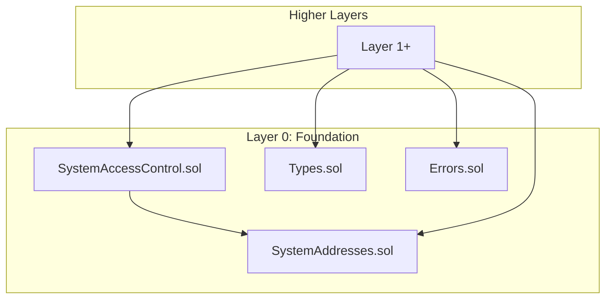

# Foundation Layer Specification

## Overview

The Foundation layer provides the bedrock for all Gravity system contracts. It contains no dependencies on other layers
and exports pure data types, constants, and utility functions that higher layers build upon.

## Design Goals

1. **Zero Dependencies**: No external imports beyond Solidity built-ins
2. **Compile-time Constants**: All system addresses are inlined at compile time (~3 gas vs ~2100 gas for SLOAD)
3. **Gas Efficient**: No storage reads for address lookups
4. **Type Safety**: Strong typing for all domain concepts
5. **Unified Error Handling**: Consistent custom errors across all contracts
6. **Microsecond Time**: All timestamps use `uint64` microseconds (consistent with Aptos/Timestamp contract)

---

## Architecture

```
src/foundation/
├── SystemAddresses.sol      # Compile-time address constants (library)
├── SystemAccessControl.sol  # Access control free functions
├── Types.sol                # Core data types (structs, enums)
└── Errors.sol               # Custom errors (library)
```

### Dependency Graph


```mermaid
graph TD
    subgraph Layer0[Layer 0: Foundation]
        SA[SystemAddresses.sol]
        SAC[SystemAccessControl.sol]
        T[Types.sol]
        E[Errors.sol]
    end
    
    SAC --> SA
    
    subgraph HigherLayers[Higher Layers]
        L1[Layer 1+]
    end
    
    L1 --> SA
    L1 --> SAC
    L1 --> T
    L1 --> E
```

---

## Contract: `SystemAddresses.sol`

A library containing compile-time constants for all Gravity system addresses. Addresses are segmented into ranges
by layer (consensus engine, runtime, staking/validator, governance, oracle, precompiles) and are reserved at genesis.

### Address Ranges

| Range        | Purpose                                   |
| ------------ | ----------------------------------------- |
| `0x1625F0xxx` | Consensus engine contracts / caller       |
| `0x1625F1xxx` | Runtime configurations                    |
| `0x1625F2xxx` | Staking & validator                       |
| `0x1625F3xxx` | Governance                                |
| `0x1625F4xxx` | Oracle                                    |
| `0x1625F5xxx` | Precompiles                               |

### Address Table

| Constant                       | Address                                        | Description                                     |
| ------------------------------ | ---------------------------------------------- | ----------------------------------------------- |
| `SYSTEM_CALLER`                | `0x0000000000000000000000000001625F0000`       | VM/runtime system caller                        |
| `GENESIS`                      | `0x0000000000000000000000000001625F0001`       | Genesis initialization contract                 |
| `TIMESTAMP`                    | `0x0000000000000000000000000001625F1000`       | On-chain time oracle                            |
| `STAKE_CONFIG`                 | `0x0000000000000000000000000001625F1001`       | Staking configuration parameters                |
| `VALIDATOR_CONFIG`             | `0x0000000000000000000000000001625F1002`       | Validator config parameters                     |
| `RANDOMNESS_CONFIG`            | `0x0000000000000000000000000001625F1003`       | DKG threshold configuration                     |
| `GOVERNANCE_CONFIG`            | `0x0000000000000000000000000001625F1004`       | Governance voting parameters                    |
| `EPOCH_CONFIG`                 | `0x0000000000000000000000000001625F1005`       | Epoch interval configuration                    |
| `VERSION_CONFIG`               | `0x0000000000000000000000000001625F1006`       | Protocol major-version marker                   |
| `CONSENSUS_CONFIG`             | `0x0000000000000000000000000001625F1007`       | Consensus parameters (BCS-serialized bytes)     |
| `EXECUTION_CONFIG`             | `0x0000000000000000000000000001625F1008`       | VM execution parameters (BCS-serialized bytes)  |
| `ORACLE_TASK_CONFIG`           | `0x0000000000000000000000000001625F1009`       | Continuous oracle task registry                 |
| `ON_DEMAND_ORACLE_TASK_CONFIG` | `0x0000000000000000000000000001625F100A`       | On-demand oracle request-type registry          |
| `STAKING`                      | `0x0000000000000000000000000001625F2000`       | Staking factory (StakePool deployer)            |
| `VALIDATOR_MANAGER`            | `0x0000000000000000000000000001625F2001`       | Validator set management                        |
| `DKG`                          | `0x0000000000000000000000000001625F2002`       | Distributed Key Generation                      |
| `RECONFIGURATION`              | `0x0000000000000000000000000001625F2003`       | Epoch lifecycle management                      |
| `BLOCK`                        | `0x0000000000000000000000000001625F2004`       | Block prologue/epilogue handler                 |
| `PERFORMANCE_TRACKER`          | `0x0000000000000000000000000001625F2005`       | Validator performance tracker                   |
| `GOVERNANCE`                   | `0x0000000000000000000000000001625F3000`       | Governance contract                             |
| `NATIVE_ORACLE`                | `0x0000000000000000000000000001625F4000`       | Native oracle                                   |
| `JWK_MANAGER`                  | `0x0000000000000000000000000001625F4001`       | JWK management for keyless auth                 |
| `ORACLE_REQUEST_QUEUE`         | `0x0000000000000000000000000001625F4002`       | On-demand oracle request queue                  |
| `NATIVE_MINT_PRECOMPILE`       | `0x0000000000000000000000000001625F5000`       | Native G token mint precompile                  |
| `BLS_POP_VERIFY_PRECOMPILE`    | `0x0000000000000000000000000001625F5001`       | BLS12-381 PoP verification precompile           |

### Implementation

See `src/foundation/SystemAddresses.sol` for the authoritative list. Each constant is `address internal constant`
and inlined at compile time.

### Gas Comparison

| Approach              | Gas Cost                           |
| --------------------- | ---------------------------------- |
| Compile-time constant | ~3 gas (PUSH opcode, inlined)      |
| Immutable storage     | ~100 gas                           |
| SLOAD (mapping)       | ~2100 gas (cold) / ~100 gas (warm) |
| External call + SLOAD | ~2600+ gas                         |

---

## Contract: `SystemAccessControl.sol`

Free functions for access control that can be imported and used directly. No inheritance required.

### Errors

```solidity
/// @notice Caller is not the allowed address
/// @param caller The actual msg.sender
/// @param allowed The expected address
error NotAllowed(address caller, address allowed);

/// @notice Caller is not in the allowed set
/// @param caller The actual msg.sender
/// @param allowed The array of allowed addresses
error NotAllowedAny(address caller, address[] allowed);
```

### Implementation

```solidity
// SPDX-License-Identifier: MIT
pragma solidity ^0.8.30;

import {SystemAddresses} from "./SystemAddresses.sol";

/// @notice Caller is not the allowed address
error NotAllowed(address caller, address allowed);

/// @notice Caller is not in the allowed set
error NotAllowedAny(address caller, address[] allowed);

/// @notice Reverts if msg.sender is not the allowed address
/// @param allowed The single allowed address
function requireAllowed(address allowed) view {
    if (msg.sender != allowed) {
        revert NotAllowed(msg.sender, allowed);
    }
}

/// @notice Reverts if msg.sender is not one of the two allowed addresses
/// @param a1 First allowed address
/// @param a2 Second allowed address
function requireAllowed(address a1, address a2) view {
    if (msg.sender != a1 && msg.sender != a2) {
        address[] memory allowed = new address[](2);
        allowed[0] = a1;
        allowed[1] = a2;
        revert NotAllowedAny(msg.sender, allowed);
    }
}

/// @notice Reverts if msg.sender is not one of the three allowed addresses
/// @param a1 First allowed address
/// @param a2 Second allowed address
/// @param a3 Third allowed address
function requireAllowed(address a1, address a2, address a3) view {
    if (msg.sender != a1 && msg.sender != a2 && msg.sender != a3) {
        address[] memory allowed = new address[](3);
        allowed[0] = a1;
        allowed[1] = a2;
        allowed[2] = a3;
        revert NotAllowedAny(msg.sender, allowed);
    }
}

/// @notice Reverts if msg.sender is not one of the four allowed addresses
/// @param a1 First allowed address
/// @param a2 Second allowed address
/// @param a3 Third allowed address
/// @param a4 Fourth allowed address
function requireAllowed(address a1, address a2, address a3, address a4) view {
    if (msg.sender != a1 && msg.sender != a2 && msg.sender != a3 && msg.sender != a4) {
        address[] memory allowed = new address[](4);
        allowed[0] = a1;
        allowed[1] = a2;
        allowed[2] = a3;
        allowed[3] = a4;
        revert NotAllowedAny(msg.sender, allowed);
    }
}

/// @notice Reverts if msg.sender is not in the allowed array
/// @param allowed Array of allowed addresses
function requireAllowedAny(address[] memory allowed) view {
    uint256 len = allowed.length;
    for (uint256 i; i < len;) {
        if (msg.sender == allowed[i]) return;
        unchecked { ++i; }
    }
    revert NotAllowedAny(msg.sender, allowed);
}
```

---

## Contract: `Types.sol`

Core data structures used across Gravity system contracts. These are defined as user-defined types, structs, and enums
that can be imported without inheritance.

### Staking Types

```solidity
/// @notice Stake position for governance voting
/// @dev Anyone can stake tokens and participate in governance.
///      All timestamps are in microseconds (from Timestamp contract).
struct StakePosition {
    /// @notice Staked token amount
    uint256 amount;
    /// @notice Lockup expiration timestamp (microseconds)
    uint64 lockedUntil;
    /// @notice When stake was first deposited (microseconds)
    uint64 stakedAt;
}
```

### Validator Types

```solidity
/// @notice Validator lifecycle status
enum ValidatorStatus {
    INACTIVE,           // 0: Not in validator set
    PENDING_ACTIVE,     // 1: Queued to join next epoch
    ACTIVE,             // 2: Currently validating
    PENDING_INACTIVE    // 3: Queued to leave next epoch
}

/// @notice Validator consensus info (packed for consensus engine)
struct ValidatorConsensusInfo {
    /// @notice Validator identity address
    address validator;
    /// @notice BLS public key for consensus
    bytes consensusPubkey;
    /// @notice Proof of possession for BLS key
    bytes consensusPop;
    /// @notice Voting power derived from bond
    uint256 votingPower;
    /// @notice Index in active validator array of an epoch
    uint64 validatorIndex;
    /// @notice Network addresses for P2P communication
    bytes networkAddresses;
    /// @notice Fullnode addresses for sync
    bytes fullnodeAddresses;
}

/// @notice Full validator record
/// @dev Owner / operator / voter roles are sourced from the StakePool (the validator's
///      bond-holding pool), not stored on the record. All timestamps are microseconds.
struct ValidatorRecord {
    /// @notice Immutable validator identity address (the StakePool address)
    address validator;
    /// @notice Display name (max 31 bytes)
    string moniker;
    /// @notice Current lifecycle status
    ValidatorStatus status;

    // === Bond Management ===
    /// @notice Current validator bond amount (voting power snapshot at epoch boundary)
    uint256 bond;

    // === Consensus Key Material ===
    /// @notice BLS consensus public key
    bytes consensusPubkey;
    /// @notice Proof of possession for BLS key
    bytes consensusPop;
    /// @notice Network addresses for P2P
    bytes networkAddresses;
    /// @notice Fullnode addresses
    bytes fullnodeAddresses;

    // === Fee Distribution ===
    /// @notice Current fee recipient address
    address feeRecipient;
    /// @notice Pending fee recipient (applied next epoch)
    address pendingFeeRecipient;

    // === Optional External Staking Pool ===
    /// @notice Address of IValidatorStakingPool (address(0) if none)
    address stakingPool;

    // === Indexing ===
    /// @notice Index in active validator array (only valid when ACTIVE/PENDING_INACTIVE)
    uint64 validatorIndex;

    // === Pending Consensus Key Rotation (V3.5 audit fix D2-3) ===
    /// @notice Pending BLS consensus public key (applied at next epoch boundary).
    ///         Empty bytes mean no pending rotation.
    bytes pendingConsensusPubkey;
    /// @notice Pending proof of possession for the pending BLS key
    bytes pendingConsensusPop;
}
```

> Note: unbond accounting (`pendingUnbond`, `unbondAvailableAt`) and the `owner` / `operator`
> fields were removed in favor of the StakePool-centric model — roles and bond state live on
> the `StakePool` that represents the validator. See [staking.spec.md](./staking.spec.md).

### Governance Types

```solidity
/// @notice Governance proposal lifecycle state
enum ProposalState {
    PENDING,    // 0: Voting active
    SUCCEEDED,  // 1: Passed, ready to execute
    FAILED,     // 2: Did not pass
    EXECUTED,   // 3: Already executed
    CANCELLED   // 4: Cancelled
}

/// @notice Governance proposal
/// @dev All timestamps are in microseconds (from Timestamp contract).
struct Proposal {
    /// @notice Unique proposal identifier
    uint64 id;
    /// @notice Address that created the proposal
    address proposer;
    /// @notice Hash of execution script/payload
    bytes32 executionHash;
    /// @notice IPFS/URL to proposal metadata
    string metadataUri;
    /// @notice When proposal was created (microseconds)
    uint64 creationTime;
    /// @notice When voting ends (microseconds)
    uint64 expirationTime;
    /// @notice Minimum votes required for quorum
    uint128 minVoteThreshold;
    /// @notice Total yes votes
    uint128 yesVotes;
    /// @notice Total no votes
    uint128 noVotes;
    /// @notice Whether proposal has been resolved
    bool isResolved;
    /// @notice When proposal was resolved (microseconds)
    uint64 resolutionTime;
}
```

See `src/foundation/Types.sol` for the authoritative definitions.

---

## Contract: `Errors.sol`

Custom errors organized by domain. Using custom errors instead of require strings saves gas and provides structured
error data. See `src/foundation/Errors.sol` for the authoritative definitions — the library groups errors into
Staking-factory, StakePool, Validator, Reconfiguration, Governance, Timestamp, Config, RandomnessConfig, DKG,
NativeOracle, VersionConfig, ValidatorManagement, ValidatorConfig, GovernanceConfig, EpochConfig,
Consensus/ExecutionConfig, JWK-manager, Role-change, and General sections.

Notable errors that pinned-down behavior of the system:

| Error                                  | Meaning                                                               |
| -------------------------------------- | --------------------------------------------------------------------- |
| `NonceNotSequential`                   | Oracle nonces must be `currentNonce + 1` (no gaps)                    |
| `ExecutionFailed(uint64, bytes)`       | Governance execute() includes revert reason in the error              |
| `ProposalNotResolved`                  | execute() must be preceded by explicit resolve()                      |
| `TooManyProposalTargets`               | Governance proposals are capped at `MAX_PROPOSAL_TARGETS = 100`       |
| `InvalidProposalId`                    | Sentinel 0 is reserved — IDs start at 1                               |
| `HasPendingWithdrawals`                | StakePool staker role cannot change while withdrawals are unclaimed   |
| `RoleChangeDelayTooShort`              | StakePool per-role timelock delays have a minimum                     |
| `RoleChangeTooEarly` / `NoPendingRoleChange` / `NotPendingRole` / `RoleAlreadySet` | 2-step propose/accept timelock guards |
| `InvalidAutoEvictThresholdPct`         | `autoEvictThresholdPct` must be in 0–100                              |
| `TooManyPendingBuckets`                | StakePool withdrawal buckets are capped at 1,000                      |
| `WithdrawalWouldBreachMinimumBond`     | Unstake rejected if it drops an active validator's bond below minimum |

---

## Usage Patterns

### Importing Address Constants

```solidity
import {SystemAddresses} from "../foundation/SystemAddresses.sol";

contract MyContract {
    function getTimestampContract() external pure returns (address) {
        return SystemAddresses.TIMESTAMP; // Inlined at compile time, ~3 gas
    }
}
```

### Access Control with Modifiers

```solidity
import {SystemAddresses} from "../foundation/SystemAddresses.sol";
import {requireAllowed} from "../foundation/SystemAccessControl.sol";

contract ValidatorManager {
    // Define modifiers as one-liners wrapping free functions
    modifier onlySystemCaller() {
        requireAllowed(SystemAddresses.SYSTEM_CALLER);
        _;
    }

    modifier onlyGovernance() {
        requireAllowed(SystemAddresses.GOVERNANCE);
        _;
    }

    // Allow multiple callers
    modifier onlySystemOrReconfiguration() {
        requireAllowed(SystemAddresses.SYSTEM_CALLER, SystemAddresses.RECONFIGURATION);
        _;
    }

    function updateValidator() external onlySystemCaller {
        // Only VM/runtime can call
    }

    function setConfig() external onlyGovernance {
        // Only timelock (governance) can call
    }
}
```

### Inline Access Control (No Modifier)

```solidity
import {SystemAddresses} from "../foundation/SystemAddresses.sol";
import {requireAllowed} from "../foundation/SystemAccessControl.sol";

contract EmergencyController {
    function emergencyAction() external {
        // Inline check for multiple allowed callers
        requireAllowed(
            SystemAddresses.SYSTEM_CALLER,
            SystemAddresses.GENESIS,
            SystemAddresses.GOVERNANCE
        );
        // ... emergency logic
    }
}
```

### Using Types

```solidity
import {ValidatorRecord, ValidatorStatus, StakePosition} from "../foundation/Types.sol";

contract Staking {
    mapping(address => StakePosition) public stakes;

    function getStake(address staker) external view returns (StakePosition memory) {
        return stakes[staker];
    }
}
```

### Using Errors

```solidity
import {Errors} from "../foundation/Errors.sol";

contract ValidatorRegistry {
    function withdraw(address validator) external {
        if (!exists[validator]) {
            revert Errors.ValidatorNotFound(validator);
        }
        // ...
    }
}
```

---

## Security Considerations

1. **Compile-time Addresses**: All system addresses are constants, eliminating storage manipulation attacks
2. **No State**: Pure libraries with no storage or state to exploit
3. **Detailed Errors**: Access control errors include caller and expected addresses for debugging
4. **No Inheritance Required**: Free functions avoid inheritance-related vulnerabilities
5. **Immutable After Genesis**: System addresses cannot be changed post-deployment

---

## Testing Requirements

### Unit Tests

1. **SystemAddresses**
   - Verify all address constants match expected values
   - Verify addresses are non-zero and unique

2. **SystemAccessControl**
   - Test `requireAllowed(address)` with valid/invalid caller
   - Test `requireAllowed(a1, a2)` with valid/invalid callers
   - Test `requireAllowed(a1, a2, a3)` with valid/invalid callers
   - Test `requireAllowed(a1, a2, a3, a4)` with valid/invalid callers
   - Test `requireAllowedAny(address[])` with various array sizes
   - Verify error messages contain correct caller and allowed addresses

3. **Types**
   - Verify struct memory layouts
   - Test enum value mappings

4. **Errors**
   - Verify all errors can be thrown and caught
   - Verify error parameters are correctly encoded

### Fuzz Tests

1. **SystemAccessControl**
   - Fuzz `requireAllowedAny()` with random arrays
   - Fuzz with random callers against fixed allowed addresses

### Gas Benchmarks

1. Measure gas cost of address constant access vs alternatives
2. Measure gas cost of `requireAllowed()` overloads

---

## Future Extensibility

- **Address Allocation**: The current address set may be extended in the future as new system contracts are needed.
- **Adding New Addresses**: Requires a **hardfork**. System addresses are compile-time constants, so adding new addresses
  means recompiling and redeploying all dependent contracts as part of a coordinated network upgrade.

