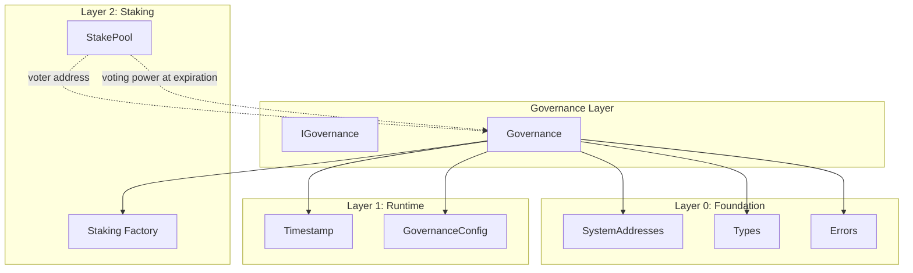

# Governance Layer Specification

## Overview

The Governance layer provides on-chain governance for Gravity blockchain. It enables stake holders to create proposals,
vote on them, and execute approved changes to the system. Voting power is derived from the Staking module, where each
StakePool's voting power is controlled by its designated `voter` address.

This design is inspired by Aptos's `aptos_governance.move` module but adapted for EVM with the following key differences:

- Batch execution model (multiple targets/datas in a single proposal)
- Hash-verified execution (like a multisig)
- Partial voting support (can split voting power across yes/no)
- Stake pool's `voter` address controls voting (delegation pattern)
- Authorized executor pattern for execution
- Atomicity guard for flash loan protection

### Contracts

| Contract              | Purpose                                      |
| --------------------- | -------------------------------------------- |
| `GovernanceConfig.sol`| Governance configuration parameters          |
| `IGovernance.sol`     | Governance interface                         |
| `Governance.sol`      | Main governance implementation               |

---

## Design Philosophy

### Key Principles

1. **Stake-Based Voting** — Voting power comes from StakePools via the Staking factory
2. **Delegated Voting** — The pool's `voter` address casts votes using pool's voting power
3. **Voting Power at Expiration** — Voting power is calculated at proposal's expiration time, inherently requiring sufficient lockup
4. **Hash-Verified Execution** — Proposals store execution hash; executor provides matching calldata
5. **Partial Voting** — Can vote with a portion of available voting power
6. **Batch Execution** — Single proposal can execute multiple calls atomically
7. **Authorized Executors** — Only whitelisted addresses can execute proposals
8. **Atomicity Guard** — Flash loan protection prevents vote-and-resolve in same timestamp

### Lock Semantics for Voting

Voting power is derived from locked stake. The `lockedUntil` timestamp is **inclusive**:

- A pool has voting power at time T when `lockedUntil >= T` (locked through that time)
- A pool has zero voting power at time T when `lockedUntil < T` (already unlocked)

Since voting power is calculated at `expirationTime`, a pool's lockup must extend through the proposal's expiration to have voting power.

### What This Layer Does

- Creates and manages governance proposals with batch execution
- Tracks votes and voting power usage per (pool, proposal)
- Resolves proposals when voting conditions are met
- Executes approved proposals with hash verification
- Manages authorized executors

### What This Layer Does NOT Do

- Staking/unstaking (handled by Staking module)
- Epoch management (handled by Reconfiguration module)
- Automatic reconfiguration (manual trigger required)

---

## Architecture

```
src/governance/
├── GovernanceConfig.sol  # Configuration parameters
├── IGovernance.sol       # Interface
└── Governance.sol        # Main implementation
```

### Dependency Graph



---

## System Addresses

| Constant            | Address                                    | Description                  |
| ------------------- | ------------------------------------------ | ---------------------------- |
| `GOVERNANCE_CONFIG` | `0x0000000000000000000000000001625F2026`   | Governance config contract   |
| `GOVERNANCE`        | `0x0000000000000000000000000001625F2014`   | Governance contract          |

---

## Proposal Lifecycle

```
┌─────────────────────────────────────────────────────────────────────────────┐
│                         PROPOSAL LIFECYCLE                                   │
└─────────────────────────────────────────────────────────────────────────────┘

                              ┌──────────────┐
                   create     │              │
                 ─────────────▶│   PENDING    │
                              │  (voting)    │
                              └──────┬───────┘
                                     │
                    ┌────────────────┼────────────────┐
                    │                                 │
                    ▼                                 ▼
             ┌───────────┐                     ┌───────────┐
             │  voting   │                     │  voting   │
             │  period   │                     │  period   │
             │  ends +   │                     │  ends +   │
             │  passes   │                     │  fails    │
             └─────┬─────┘                     └─────┬─────┘
                   │                                 │
                   ▼                                 ▼
             ┌───────────┐                     ┌───────────┐
             │ SUCCEEDED │                     │  FAILED   │
             │           │                     │           │
             └─────┬─────┘                     └───────────┘
                   │
                   ▼
            ┌────────────┐
            │  execute   │
            │  (hash     │
            │ verified,  │
            │ executor   │
            │  only)     │
            └─────┬──────┘
                  ▼
            ┌───────────┐
            │ EXECUTED  │
            └───────────┘
```

### Proposal States

| State     | Description                                    |
| --------- | ---------------------------------------------- |
| PENDING   | Voting is active                               |
| SUCCEEDED | Passed (yesVotes > noVotes, quorum met)        |
| FAILED    | Did not pass                                   |
| EXECUTED  | Already executed                               |
| CANCELLED | Cancelled (reserved for future use)            |

---

## Contract: `GovernanceConfig.sol`

### Purpose

Configuration parameters for governance. Initialized at genesis, updatable via governance (GOVERNANCE).

### System Address

| Constant            | Address                                    | Description              |
| ------------------- | ------------------------------------------ | ------------------------ |
| `GOVERNANCE_CONFIG` | `0x0000000000000000000000000001625F2026`   | Governance configuration |

### State Variables

```solidity
/// @notice Minimum total votes (yes + no) required for quorum
uint128 public minVotingThreshold;

/// @notice Minimum voting power required to create a proposal
uint256 public requiredProposerStake;

/// @notice Duration of voting period in microseconds
uint64 public votingDurationMicros;

/// @notice Whether contract has been initialized
bool private _initialized;
```

### Interface

```solidity
interface IGovernanceConfig {
    // === Events ===
    event ConfigUpdated(bytes32 indexed param, uint256 oldValue, uint256 newValue);

    // === View Functions ===
    function minVotingThreshold() external view returns (uint128);
    function requiredProposerStake() external view returns (uint256);
    function votingDurationMicros() external view returns (uint64);

    // === Initialization ===
    function initialize(
        uint128 _minVotingThreshold,
        uint256 _requiredProposerStake,
        uint64 _votingDurationMicros
    ) external;

    // === Setters (GOVERNANCE only) ===
    function setMinVotingThreshold(uint128 _minVotingThreshold) external;
    function setRequiredProposerStake(uint256 _requiredProposerStake) external;
    function setVotingDurationMicros(uint64 _votingDurationMicros) external;
}
```

### Access Control

| Function                         | Allowed Callers    |
| -------------------------------- | ------------------ |
| All view functions               | Anyone             |
| `initialize()`                   | GENESIS only       |
| All setters                      | GOVERNANCE only    |

### Validation Rules

| Parameter                    | Validation                                   |
| ---------------------------- | -------------------------------------------- |
| `votingDurationMicros`       | Must be > 0                                  |

---

## Contract: `Governance.sol`

### Purpose

Main governance contract handling proposal creation, voting, resolution, and execution.
Uses `Ownable2Step` pattern for owner management and executor authorization.

### State Variables

```solidity
/// @notice Next proposal ID to be assigned
uint64 public nextProposalId = 1;

/// @notice Mapping of proposal ID to Proposal struct
mapping(uint64 => Proposal) internal _proposals;

/// @notice Voting power used per pool per proposal: pool => proposalId => used power
mapping(address => mapping(uint64 => uint128)) public usedVotingPower;

/// @notice Whether a proposal has been executed
mapping(uint64 => bool) public executed;

/// @notice Last vote time for each proposal (for atomicity guard / flash loan protection)
/// @dev Resolution must happen in a later timestamp than the last vote
mapping(uint64 => uint64) public lastVoteTime;

/// @notice Set of authorized executors
EnumerableSet.AddressSet private _executors;
```

### Interface

```solidity
interface IGovernance {
    // === Events ===
    event ProposalCreated(
        uint64 indexed proposalId,
        address indexed proposer,
        address indexed stakePool,
        bytes32 executionHash,
        string metadataUri
    );

    event VoteCast(
        uint64 indexed proposalId,
        address indexed voter,
        address indexed stakePool,
        uint128 votingPower,
        bool support
    );

    event ProposalResolved(uint64 indexed proposalId, ProposalState state);

    event ProposalExecuted(
        uint64 indexed proposalId,
        address indexed executor,
        address[] targets,
        bytes[] datas
    );

    event ExecutorAdded(address indexed executor);
    event ExecutorRemoved(address indexed executor);

    // === View Functions ===
    function getProposal(uint64 proposalId) external view returns (Proposal memory);
    function getProposalState(uint64 proposalId) external view returns (ProposalState);
    function getRemainingVotingPower(address stakePool, uint64 proposalId) external view returns (uint128);
    function canResolve(uint64 proposalId) external view returns (bool);
    function getExecutionHash(uint64 proposalId) external view returns (bytes32);
    function getNextProposalId() external view returns (uint64);
    function isExecuted(uint64 proposalId) external view returns (bool);
    function isExecutor(address account) external view returns (bool);
    function getExecutors() external view returns (address[] memory);
    function getExecutorCount() external view returns (uint256);
    function getLastVoteTime(uint64 proposalId) external view returns (uint64);

    // === Proposal Management ===
    function createProposal(
        address stakePool,
        address[] calldata targets,
        bytes[] calldata datas,
        string calldata metadataUri
    ) external returns (uint64 proposalId);

    function vote(
        address stakePool,
        uint64 proposalId,
        uint128 votingPower,
        bool support
    ) external;

    function batchVote(
        address[] calldata stakePools,
        uint64 proposalId,
        bool support
    ) external;

    function batchPartialVote(
        address[] calldata stakePools,
        uint64 proposalId,
        uint128 votingPower,
        bool support
    ) external;

    function resolve(uint64 proposalId) external;

    function execute(
        uint64 proposalId,
        address[] calldata targets,
        bytes[] calldata datas
    ) external;

    function computeExecutionHash(
        address[] calldata targets,
        bytes[] calldata datas
    ) external pure returns (bytes32);

    // === Executor Management ===
    function addExecutor(address executor) external;
    function removeExecutor(address executor) external;
}
```

### Function Specifications

#### `createProposal(address stakePool, address[] targets, bytes[] datas, string metadataUri)`

Create a new governance proposal with batch execution support.

**Access Control:** Caller must be the pool's `voter` address

**Behavior:**

1. Verify `targets.length == datas.length` (revert with `ProposalArrayLengthMismatch` if not)
2. Verify `targets.length > 0` (revert with `EmptyProposalBatch` if empty)
3. Verify `stakePool` is a valid pool via `Staking.isPool()`
4. Verify `msg.sender == StakePool.voter`
5. Calculate `expirationTime = now + votingDurationMicros`
6. Get voting power at expiration time via `Staking.getPoolVotingPower(stakePool, expirationTime)`
7. Revert if voting power < `requiredProposerStake`
8. Compute execution hash: `keccak256(abi.encode(targets, datas))`
9. Create proposal with:
   - `id = nextProposalId++`
   - `proposer = msg.sender`
   - `executionHash = executionHash`
   - `creationTime = now`
   - `expirationTime = now + votingDurationMicros`
   - `minVoteThreshold = config.minVotingThreshold()`
10. Emit `ProposalCreated` event
11. Return `proposalId`

**Notes:**

- Voting power is calculated at `expirationTime`, not current time
- This inherently checks that the pool's lockup extends through the voting period
- If `lockedUntil < expirationTime`, voting power will be 0 (lockup expires before voting ends)
- If `lockedUntil >= expirationTime`, voting power equals the pool's effective stake

**Errors:**

- `ProposalArrayLengthMismatch(targetsLen, datasLen)` — Array lengths don't match
- `EmptyProposalBatch()` — No targets provided
- `InvalidPool(stakePool)` — Pool not created by Staking factory
- `NotDelegatedVoter(expected, actual)` — Caller is not pool's voter
- `InsufficientVotingPower(required, actual)` — Not enough stake (includes lockup too short case)

---

#### `vote(address stakePool, uint64 proposalId, uint128 votingPower, bool support)`

Cast a vote on a proposal using a stake pool's voting power.

**Access Control:** Caller must be the pool's `voter` address

**Behavior:**

1. Verify proposal exists and is PENDING
2. Verify voting period not ended (`now < expirationTime`)
3. Verify proposal not already resolved
4. Verify `stakePool` is a valid pool via `Staking.isPool()`
5. Verify `msg.sender == StakePool.voter`
6. Calculate remaining voting power via `getRemainingVotingPower(stakePool, proposalId)`
7. **Cap voting power at remaining** (if `votingPower > remaining`, use `remaining`)
8. If capped voting power is 0, return early (no-op)
9. Update `usedVotingPower[stakePool][proposalId] += votingPower`
10. Update votes: if `support` then `yesVotes += votingPower` else `noVotes += votingPower`
11. Update `lastVoteTime[proposalId] = now` (atomicity guard)
12. Emit `VoteCast` event

**Notes:**

- Voting power is calculated at the proposal's `expirationTime`, not current time
- This inherently checks that the pool's lockup extends through the voting period
- **Voting power is silently capped** at remaining power (no revert for overflow)
- If remaining power is 0, the vote is silently skipped

**Errors:**

- `ProposalNotFound(proposalId)` — Proposal doesn't exist
- `VotingPeriodEnded(expirationTime)` — Voting has ended
- `ProposalAlreadyResolved(proposalId)` — Proposal already resolved
- `InvalidPool(stakePool)` — Pool not created by Staking factory
- `NotDelegatedVoter(expected, actual)` — Caller is not pool's voter

---

#### `batchVote(address[] stakePools, uint64 proposalId, bool support)`

Vote with full remaining voting power from multiple stake pools.

**Access Control:** Caller must be the voter for all pools

**Behavior:**

1. For each pool in `stakePools`:
   - Call internal vote with `type(uint128).max` (uses all remaining power)

**Notes:**

- Uses `type(uint128).max` to indicate "use all remaining power"
- Pools with zero remaining power are silently skipped
- Reverts on first invalid pool or unauthorized voter

---

#### `batchPartialVote(address[] stakePools, uint64 proposalId, uint128 votingPower, bool support)`

Vote with specified voting power from multiple stake pools.

**Access Control:** Caller must be the voter for all pools

**Behavior:**

1. For each pool in `stakePools`:
   - Call internal vote with specified `votingPower`
   - Power is capped at remaining for each pool

**Notes:**

- Same `votingPower` amount is attempted from each pool
- Actual power used may differ per pool (capped at remaining)
- Pools with zero remaining power are silently skipped

---

#### `resolve(uint64 proposalId)`

Resolve a proposal after voting ends.

**Access Control:** Anyone

**Behavior:**

1. Verify proposal exists
2. Revert if already resolved (`isResolved == true`)
3. Check voting period has ended: `now >= expirationTime`
4. **Atomicity guard**: If `lastVoteTime[proposalId] > 0` and `now <= lastVoteTime`, revert with `ResolutionCannotBeAtomic`
5. Mark as resolved: `isResolved = true`, `resolutionTime = now`
6. Emit `ProposalResolved` event with computed state

**Notes:**

- The atomicity guard prevents flash loan attacks where someone:
  1. Borrows tokens
  2. Stakes them
  3. Votes
  4. Resolves the proposal
  5. Unstakes and repays
  All in the same transaction (same timestamp)

**Errors:**

- `ProposalNotFound(proposalId)` — Proposal doesn't exist
- `ProposalAlreadyResolved(proposalId)` — Already resolved
- `VotingPeriodNotEnded(expirationTime)` — Can't resolve yet
- `ResolutionCannotBeAtomic(lastVoteTime)` — Resolution in same timestamp as last vote

---

#### `execute(uint64 proposalId, address[] targets, bytes[] datas)`

Execute an approved proposal.

**Access Control:** Authorized executors only (managed by owner)

**Behavior:**

1. Verify `targets.length == datas.length` (revert with `ProposalArrayLengthMismatch` if not)
2. Verify `targets.length > 0` (revert with `EmptyProposalBatch` if empty)
3. Verify proposal exists
4. Revert if already executed
5. Get proposal state; revert if not SUCCEEDED
6. Compute hash: `keccak256(abi.encode(targets, datas))`
7. Revert if hash != `proposal.executionHash`
8. Mark as executed: `executed[proposalId] = true` (CEI pattern)
9. For each (target, data) pair:
   - Call `target` with `data`
   - Revert if call fails
10. Emit `ProposalExecuted` event

**Notes:**

- All calls are executed atomically — if any fails, entire execution reverts
- CEI pattern: state updated before external calls

**Errors:**

- `NotExecutor(caller)` — Caller is not an authorized executor
- `ProposalArrayLengthMismatch(targetsLen, datasLen)` — Array lengths don't match
- `EmptyProposalBatch()` — No targets provided
- `ProposalNotFound(proposalId)` — Proposal doesn't exist
- `ProposalAlreadyExecuted(proposalId)` — Already executed
- `ProposalNotSucceeded(proposalId)` — Proposal didn't pass
- `ExecutionHashMismatch(expected, actual)` — Hash doesn't match
- `ExecutionFailed(proposalId)` — External call failed

---

#### `computeExecutionHash(address[] targets, bytes[] datas)`

Compute the execution hash for a batch of calls.

**Access Control:** Anyone (pure function)

**Behavior:**

1. Return `keccak256(abi.encode(targets, datas))`

**Notes:**

- Useful for off-chain computation before creating proposals

---

#### `getProposalState(uint64 proposalId)`

Get the current state of a proposal.

**Behavior:**

1. If proposal doesn't exist, revert with `ProposalNotFound`
2. If `executed[proposalId] == true`, return `EXECUTED`
3. If `isResolved == true`:
   - If `yesVotes > noVotes && yesVotes + noVotes >= minVoteThreshold`, return `SUCCEEDED`
   - Else return `FAILED`
4. If `now < expirationTime`, return `PENDING`
5. Else (voting ended, not resolved):
   - If `yesVotes > noVotes && yesVotes + noVotes >= minVoteThreshold`, return `SUCCEEDED`
   - Else return `FAILED`

---

#### `getRemainingVotingPower(address stakePool, uint64 proposalId)`

Get remaining voting power for a pool on a proposal.

**Behavior:**

1. Revert if proposal doesn't exist
2. Get pool's voting power at proposal's `expirationTime` via `Staking.getPoolVotingPower(stakePool, expirationTime)`
3. Get `used = usedVotingPower[stakePool][proposalId]`
4. If `poolVotingPower <= used`, return 0
5. Return `poolVotingPower - used`

**Notes:**

- Voting power is calculated at the proposal's expiration time, not current time
- If pool's lockup expires before proposal expiration, voting power will be 0
- This makes lockup checking implicit rather than explicit

---

#### `canResolve(uint64 proposalId)`

Check if a proposal can be resolved.

**Behavior:**

1. Return `false` if proposal doesn't exist or already resolved
2. Return `false` if `now < expirationTime`
3. Atomicity guard: If `lastVoteTime[proposalId] > 0` and `now <= lastVoteTime`, return `false`
4. Return `true`

---

### Executor Management

#### `addExecutor(address executor)`

Add an address to the authorized executors set.

**Access Control:** Owner only

**Behavior:**

1. Add `executor` to the executors set
2. If added (was not already present), emit `ExecutorAdded`

---

#### `removeExecutor(address executor)`

Remove an address from the authorized executors set.

**Access Control:** Owner only

**Behavior:**

1. Remove `executor` from the executors set
2. If removed (was present), emit `ExecutorRemoved`

---

#### `isExecutor(address account)`

Check if an address is an authorized executor.

---

#### `getExecutors()`

Get all authorized executors.

---

#### `getExecutorCount()`

Get the number of authorized executors.

---

## Access Control Summary

| Contract          | Function                | Allowed Callers               |
| ----------------- | ----------------------- | ----------------------------- |
| GovernanceConfig  | `initialize()`          | GENESIS only (once)           |
| GovernanceConfig  | All setters             | GOVERNANCE only               |
| GovernanceConfig  | All view functions      | Anyone                        |
| Governance        | `createProposal()`      | Pool's voter address          |
| Governance        | `vote()`                | Pool's voter address          |
| Governance        | `batchVote()`           | Pool's voter address (all)    |
| Governance        | `batchPartialVote()`    | Pool's voter address (all)    |
| Governance        | `resolve()`             | Anyone                        |
| Governance        | `execute()`             | **Authorized executors only** |
| Governance        | `addExecutor()`         | Owner only                    |
| Governance        | `removeExecutor()`      | Owner only                    |
| Governance        | All view functions      | Anyone                        |

---

## Errors

The following errors are used by governance contracts:

### Existing Errors (in Errors.sol)

| Error                                          | When                                                      |
| ---------------------------------------------- | --------------------------------------------------------- |
| `ProposalNotFound(uint64 proposalId)`          | Proposal doesn't exist                                    |
| `VotingPeriodEnded(uint64 expirationTime)`     | Voting has ended                                          |
| `VotingPeriodNotEnded(uint64 expirationTime)`  | Voting hasn't ended yet                                   |
| `ProposalAlreadyResolved(uint64 proposalId)`   | Proposal already resolved                                 |
| `ExecutionHashMismatch(bytes32, bytes32)`      | Execution hash doesn't match                              |
| `InsufficientVotingPower(uint256, uint256)`    | Not enough voting power (includes lockup too short case)  |
| `InvalidPool(address pool)`                    | Pool not created by Staking factory                       |

### Governance-Specific Errors

| Error                                               | When                                                |
| --------------------------------------------------- | --------------------------------------------------- |
| `NotDelegatedVoter(address expected, address actual)` | Caller is not pool's voter                        |
| `NotExecutor(address caller)`                       | Caller is not an authorized executor                |
| `ProposalNotSucceeded(uint64 proposalId)`           | Proposal didn't pass                                |
| `ProposalAlreadyExecuted(uint64 proposalId)`        | Proposal already executed                           |
| `ExecutionFailed(uint64 proposalId)`                | External call failed                                |
| `EmptyProposalBatch()`                              | No targets in proposal batch                        |
| `ProposalArrayLengthMismatch(uint256, uint256)`     | targets.length != datas.length                      |
| `ResolutionCannotBeAtomic(uint64 lastVoteTime)`     | Resolution in same timestamp as last vote           |
| `InvalidVotingDuration()`                           | Voting duration is zero                             |

---

## Time Convention

All time values use **microseconds** (uint64), consistent with the Timestamp contract:

| Contract          | Parameter               | Unit          |
| ----------------- | ----------------------- | ------------- |
| GovernanceConfig  | `votingDurationMicros`  | microseconds  |
| Governance        | `Proposal.creationTime` | microseconds  |
| Governance        | `Proposal.expirationTime`| microseconds |
| Governance        | `Proposal.resolutionTime`| microseconds |
| Governance        | `lastVoteTime`          | microseconds  |

---

## Security Considerations

### From Aptos

1. **Voting Power at Expiration**: Voting power is calculated at proposal's expiration time, inherently requiring lockup to extend past voting period
2. **Double Vote Prevention**: Track voting power used per (pool, proposal) to prevent double voting
3. **Minimum Proposer Stake**: Require minimum voting power to create proposals (spam prevention)
4. **Execution Hash Verification**: Exact match required between stored hash and provided calldata

### Additional Solidity Considerations

5. **Reentrancy**: Use checks-effects-interactions pattern for `execute()` function
6. **Integer Overflow**: Solidity 0.8+ built-in protection
7. **Access Control**: Verify caller is pool's voter, not just any address
8. **External Call Safety**: Handle failed external calls in `execute()`
9. **Atomicity Guard**: Prevent flash loan attacks by requiring resolution after last vote timestamp
10. **Executor Authorization**: Only whitelisted addresses can execute proposals

---

## Usage Patterns

### Creating a Proposal

```solidity
// 1. User has a StakePool with sufficient voting power and lockup
// 2. User is the pool's voter (or has been delegated voting rights)

// 3. Prepare batch execution
address[] memory targets = new address[](1);
targets[0] = STAKE_CONFIG_ADDRESS;

bytes[] memory datas = new bytes[](1);
datas[0] = abi.encodeWithSignature("setMinimumStake(uint256)", 1 ether);

// 4. Optionally compute hash off-chain for verification
bytes32 executionHash = governance.computeExecutionHash(targets, datas);

// 5. Create proposal
uint64 proposalId = governance.createProposal(
    myStakePool,
    targets,
    datas,
    "ipfs://QmProposalMetadata"
);
```

### Voting on a Proposal

```solidity
// Vote with full remaining power
uint128 remaining = governance.getRemainingVotingPower(myStakePool, proposalId);
governance.vote(myStakePool, proposalId, remaining, true); // support = true

// Or vote with partial power
governance.vote(myStakePool, proposalId, 100 ether, false); // against

// Batch vote with multiple pools (full power)
address[] memory pools = new address[](2);
pools[0] = pool1;
pools[1] = pool2;
governance.batchVote(pools, proposalId, true);

// Batch partial vote (same amount from each pool)
governance.batchPartialVote(pools, proposalId, 50 ether, true);
```

### Resolving and Executing

```solidity
// After voting period ends
governance.resolve(proposalId);

// Execute the approved proposal (only authorized executors)
address[] memory targets = new address[](1);
targets[0] = STAKE_CONFIG_ADDRESS;

bytes[] memory datas = new bytes[](1);
datas[0] = abi.encodeWithSignature("setMinimumStake(uint256)", 1 ether);

governance.execute(proposalId, targets, datas);
```

### Managing Executors (Owner Only)

```solidity
// Add an executor
governance.addExecutor(trustedAddress);

// Remove an executor
governance.removeExecutor(oldExecutor);

// Check executor status
bool isAuth = governance.isExecutor(someAddress);
address[] memory allExecutors = governance.getExecutors();
```

---

## Testing Requirements

### Unit Tests

1. **GovernanceConfig**
   - Initialize with valid parameters
   - Revert on double initialization
   - Revert on invalid parameters (zero duration)
   - All setters work with GOVERNANCE caller
   - All setters revert with non-GOVERNANCE caller

2. **Proposal Creation**
   - Create with valid pool and sufficient stake at expiration time
   - Create with batch arrays (multiple targets/datas)
   - Revert if not pool's voter
   - Revert if insufficient voting power at expiration time (includes lockup too short)
   - Revert if arrays empty (`EmptyProposalBatch`)
   - Revert if array lengths mismatch (`ProposalArrayLengthMismatch`)

3. **Voting**
   - Vote with full power
   - Vote with partial power
   - Vote caps power at remaining (no revert for overflow)
   - Skip silently when no remaining power
   - Revert if not pool's voter
   - Revert if voting period ended
   - Revert if proposal already resolved

4. **Batch Voting**
   - `batchVote` uses full power from all pools
   - `batchPartialVote` uses specified power from each pool
   - Power capped at remaining per pool
   - Emits events for each pool
   - Reverts on invalid pool or unauthorized voter

5. **Resolution**
   - Resolve after voting period
   - Revert if can't resolve yet
   - Revert if already resolved
   - Atomicity guard: revert if `now <= lastVoteTime`
   - Allow resolution when no votes (lastVoteTime == 0)

6. **Execution**
   - Execute with matching hash
   - Execute batch (multiple calls)
   - Revert if hash mismatch
   - Revert if not succeeded
   - Revert if already executed
   - Revert if not authorized executor
   - Handle failed external calls (atomic rollback)
   - Revert on empty arrays
   - Revert on mismatched arrays

7. **Executor Management**
   - Add executor emits event
   - Remove executor emits event
   - No event if adding existing executor
   - No event if removing non-executor
   - Only owner can add/remove

8. **Atomicity Guard (Flash Loan Protection)**
   - `lastVoteTime` recorded on each vote
   - `lastVoteTime` updates on subsequent votes
   - Cannot resolve in same timestamp as last vote
   - Can resolve after time advances
   - Proposals with no votes can be resolved

### Fuzz Tests

1. Various voting power distributions
2. Edge cases around lockup boundaries
3. Partial voting amounts
4. Multiple pools voting on same proposal
5. Batch voting with varying pool counts

### Invariant Tests

1. `usedVotingPower[pool][proposal] <= pool.votingPower` for all pools
2. `executed[proposalId]` implies `isResolved && state == SUCCEEDED`
3. `yesVotes + noVotes <= sum of all pool voting powers`
4. `lastVoteTime[proposalId] > 0` implies at least one vote was cast

---

## Future Extensions

- **Timelock**: Add delay between resolution and execution
- **Cancellation**: Allow proposer to cancel pending proposals
- **Delegation Registry**: Track vote delegation across proposals
- **Quadratic Voting**: Alternative voting power calculation
- **Multi-sig Executor**: Require multiple executors to approve execution
