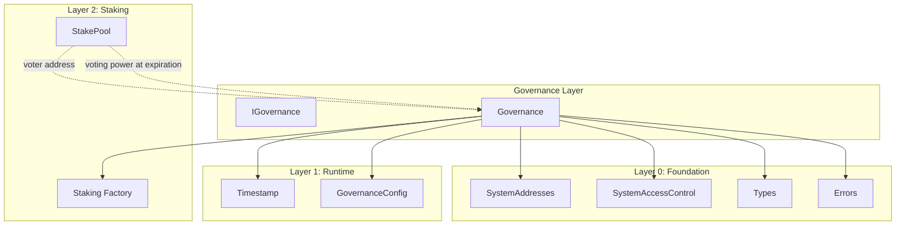

# Governance Layer Specification

## Overview

The Governance layer provides on-chain governance for Gravity blockchain. It enables stake holders to create proposals,
vote on them, and execute approved changes to the system. Voting power is derived from the Staking module, where each
StakePool's voting power is controlled by its designated `voter` address.

This design is inspired by Aptos's `aptos_governance.move` module but adapted for EVM with the following key differences:

- Hash-verified execution model (like a multisig)
- Partial voting support (can split voting power across yes/no)
- Stake pool's `voter` address controls voting (delegation pattern)
- Early resolution when sufficient votes are cast

### Contracts

| Contract              | Purpose                                      |
| --------------------- | -------------------------------------------- |
| `GovernanceConfig.sol`| Governance configuration parameters          |
| `IGovernance.sol`     | Governance interface                         |
| `Governance.sol`      | Main governance implementation               |

---

## Design Philosophy

### Key Principles

1. **Stake-Based Voting** — Voting power comes from StakePools via the Staking factory
2. **Delegated Voting** — The pool's `voter` address casts votes using pool's voting power
3. **Voting Power at Expiration** — Voting power is calculated at proposal's expiration time, inherently requiring sufficient lockup
4. **Hash-Verified Execution** — Proposals store execution hash; executor provides matching calldata
5. **Partial Voting** — Can vote with a portion of available voting power
6. **Early Resolution** — Can resolve before voting ends if sufficient votes are cast

### What This Layer Does

- Creates and manages governance proposals
- Tracks votes and voting power usage per (pool, proposal)
- Resolves proposals when voting conditions are met
- Executes approved proposals with hash verification

### What This Layer Does NOT Do

- Staking/unstaking (handled by Staking module)
- Epoch management (handled by Reconfiguration module)
- Automatic reconfiguration (manual trigger required)

---

## Architecture

```
src/governance/
├── GovernanceConfig.sol  # Configuration parameters
├── IGovernance.sol       # Interface
└── Governance.sol        # Main implementation
```

### Dependency Graph



---

## System Addresses

| Constant            | Address                                    | Description                  |
| ------------------- | ------------------------------------------ | ---------------------------- |
| `GOVERNANCE_CONFIG` | `0x0000000000000000000000000001625F2026`   | Governance config contract   |
| `GOVERNANCE`        | `0x0000000000000000000000000001625F2014`   | Governance contract          |

---

## Proposal Lifecycle

```
┌─────────────────────────────────────────────────────────────────────────────┐
│                         PROPOSAL LIFECYCLE                                   │
└─────────────────────────────────────────────────────────────────────────────┘

                              ┌──────────────┐
                   create     │              │
                 ─────────────▶│   PENDING    │
                              │  (voting)    │
                              └──────┬───────┘
                                     │
                    ┌────────────────┼────────────────┐
                    │                │                │
                    ▼                ▼                ▼
             ┌───────────┐    ┌───────────┐    ┌───────────┐
             │  voting   │    │  early    │    │  voting   │
             │  period   │    │resolution │    │  period   │
             │  ends +   │    │ threshold │    │  ends +   │
             │  passes   │    │   met     │    │  fails    │
             └─────┬─────┘    └─────┬─────┘    └─────┬─────┘
                   │                │                │
                   ▼                ▼                ▼
             ┌───────────┐    ┌───────────┐    ┌───────────┐
             │ SUCCEEDED │    │ SUCCEEDED │    │  FAILED   │
             │           │    │           │    │           │
             └─────┬─────┘    └─────┬─────┘    └───────────┘
                   │                │
                   └────────┬───────┘
                            ▼
                     ┌───────────┐
                     │  execute  │
                     │  (hash    │
                     │  verified)│
                     └─────┬─────┘
                           ▼
                     ┌───────────┐
                     │ EXECUTED  │
                     └───────────┘
```

### Proposal States

| State     | Description                                    |
| --------- | ---------------------------------------------- |
| PENDING   | Voting is active                               |
| SUCCEEDED | Passed (yesVotes > noVotes, quorum met)        |
| FAILED    | Did not pass                                   |
| EXECUTED  | Already executed                               |
| CANCELLED | Cancelled (reserved for future use)            |

---

## Contract: `GovernanceConfig.sol`

### Purpose

Configuration parameters for governance. Initialized at genesis, updatable via governance (GOVERNANCE).

### System Address

| Constant            | Address                                    | Description              |
| ------------------- | ------------------------------------------ | ------------------------ |
| `GOVERNANCE_CONFIG` | `0x0000000000000000000000000001625F2026`   | Governance configuration |

### State Variables

```solidity
/// @notice Minimum total votes (yes + no) required for quorum
uint128 public minVotingThreshold;

/// @notice Minimum voting power required to create a proposal
uint256 public requiredProposerStake;

/// @notice Duration of voting period in microseconds
uint64 public votingDurationMicros;

/// @notice Threshold for early resolution (basis points, e.g., 5000 = 50%)
uint128 public earlyResolutionThresholdBps;

/// @notice Whether contract has been initialized
bool private _initialized;
```

### Interface

```solidity
interface IGovernanceConfig {
    // === Events ===
    event ConfigUpdated(bytes32 indexed param, uint256 oldValue, uint256 newValue);

    // === View Functions ===
    function minVotingThreshold() external view returns (uint128);
    function requiredProposerStake() external view returns (uint256);
    function votingDurationMicros() external view returns (uint64);
    function earlyResolutionThresholdBps() external view returns (uint128);

    // === Initialization ===
    function initialize(
        uint128 _minVotingThreshold,
        uint256 _requiredProposerStake,
        uint64 _votingDurationMicros,
        uint128 _earlyResolutionThresholdBps
    ) external;

    // === Setters (GOVERNANCE only) ===
    function setMinVotingThreshold(uint128 _minVotingThreshold) external;
    function setRequiredProposerStake(uint256 _requiredProposerStake) external;
    function setVotingDurationMicros(uint64 _votingDurationMicros) external;
    function setEarlyResolutionThresholdBps(uint128 _earlyResolutionThresholdBps) external;
}
```

### Access Control

| Function                         | Allowed Callers    |
| -------------------------------- | ------------------ |
| All view functions               | Anyone             |
| `initialize()`                   | GENESIS only       |
| All setters                      | GOVERNANCE only    |

### Validation Rules

| Parameter                    | Validation                                   |
| ---------------------------- | -------------------------------------------- |
| `votingDurationMicros`       | Must be > 0                                  |
| `earlyResolutionThresholdBps`| Must be <= 10000 (100%)                      |

---

## Contract: `Governance.sol`

### Purpose

Main governance contract handling proposal creation, voting, resolution, and execution.

### State Variables

```solidity
/// @notice Next proposal ID to be assigned
uint64 public nextProposalId;

/// @notice Mapping of proposal ID to Proposal struct
mapping(uint64 => Proposal) internal _proposals;

/// @notice Voting power used per (pool, proposal): keccak256(pool, proposalId) => used power
mapping(bytes32 => uint128) public usedVotingPower;

/// @notice Whether a proposal has been executed
mapping(uint64 => bool) public executed;

/// @notice Whether contract has been initialized
bool private _initialized;
```

### Interface

```solidity
interface IGovernance {
    // === Events ===
    event ProposalCreated(
        uint64 indexed proposalId,
        address indexed proposer,
        address indexed stakePool,
        bytes32 executionHash,
        string metadataUri
    );

    event VoteCast(
        uint64 indexed proposalId,
        address indexed voter,
        address indexed stakePool,
        uint128 votingPower,
        bool support
    );

    event ProposalResolved(uint64 indexed proposalId, ProposalState state);

    event ProposalExecuted(
        uint64 indexed proposalId,
        address indexed executor,
        address target,
        bytes data
    );

    // === View Functions ===
    function getProposal(uint64 proposalId) external view returns (Proposal memory);
    function getProposalState(uint64 proposalId) external view returns (ProposalState);
    function getRemainingVotingPower(address stakePool, uint64 proposalId) external view returns (uint128);
    function canResolve(uint64 proposalId) external view returns (bool);
    function getExecutionHash(uint64 proposalId) external view returns (bytes32);

    // === Proposal Management ===
    function createProposal(
        address stakePool,
        bytes32 executionHash,
        string calldata metadataUri
    ) external returns (uint64 proposalId);

    function vote(
        address stakePool,
        uint64 proposalId,
        uint128 votingPower,
        bool support
    ) external;

    function resolve(uint64 proposalId) external;

    function execute(
        uint64 proposalId,
        address target,
        bytes calldata data
    ) external;
}
```

### Function Specifications

#### `createProposal(address stakePool, bytes32 executionHash, string metadataUri)`

Create a new governance proposal.

**Access Control:** Caller must be the pool's `voter` address

**Behavior:**

1. Verify `stakePool` is a valid pool via `Staking.isPool()`
2. Verify `msg.sender == StakePool.voter`
3. Calculate `expirationTime = now + votingDurationMicros`
4. Get voting power at expiration time via `Staking.getPoolVotingPower(stakePool, expirationTime)`
5. Revert if voting power < `requiredProposerStake`
6. Create proposal with:
   - `id = nextProposalId++`
   - `proposer = msg.sender`
   - `executionHash = executionHash`
   - `creationTime = now`
   - `expirationTime = now + votingDurationMicros`
   - `minVoteThreshold = config.minVotingThreshold()`
7. Emit `ProposalCreated` event
8. Return `proposalId`

**Notes:**

- Voting power is calculated at `expirationTime`, not current time
- This inherently checks that the pool's lockup extends past voting period (if lockup expires before expiration, voting power will be 0)

**Errors:**

- `InvalidPool(stakePool)` — Pool not created by Staking factory
- `NotDelegatedVoter(expected, actual)` — Caller is not pool's voter
- `InsufficientVotingPower(required, actual)` — Not enough stake (includes lockup too short case)

---

#### `vote(address stakePool, uint64 proposalId, uint128 votingPower, bool support)`

Cast a vote on a proposal using a stake pool's voting power.

**Access Control:** Caller must be the pool's `voter` address

**Behavior:**

1. Verify proposal exists and is PENDING
2. Verify `stakePool` is a valid pool via `Staking.isPool()`
3. Verify `msg.sender == StakePool.voter`
4. Calculate remaining voting power via `getRemainingVotingPower(stakePool, proposalId)`
5. Revert if `votingPower > remaining`
6. Update `usedVotingPower[key] += votingPower`
7. Update votes: if `support` then `yesVotes += votingPower` else `noVotes += votingPower`
8. Emit `VoteCast` event

**Notes:**

- Voting power is calculated at the proposal's `expirationTime`, not current time
- This inherently checks that the pool's lockup extends past voting period
- If lockup expires before proposal expiration, voting power will be 0

**Errors:**

- `ProposalNotFound(proposalId)` — Proposal doesn't exist
- `VotingPeriodEnded(expirationTime)` — Voting has ended
- `InvalidPool(stakePool)` — Pool not created by Staking factory
- `NotDelegatedVoter(expected, actual)` — Caller is not pool's voter
- `VotingPowerOverflow(requested, remaining)` — Trying to use more power than available

---

#### `resolve(uint64 proposalId)`

Resolve a proposal after voting ends or early threshold is met.

**Access Control:** Anyone

**Behavior:**

1. Verify proposal exists
2. Revert if already resolved (`isResolved == true`)
3. Check if can resolve:
   - Voting period ended: `now >= expirationTime`, OR
   - Early resolution: yes or no votes exceed `earlyResolutionThreshold`
4. Revert if neither condition met
5. Mark as resolved: `isResolved = true`, `resolutionTime = now`
6. Emit `ProposalResolved` event with computed state

**Errors:**

- `ProposalNotFound(proposalId)` — Proposal doesn't exist
- `ProposalAlreadyResolved(proposalId)` — Already resolved
- `VotingPeriodNotEnded(expirationTime)` — Can't resolve yet

---

#### `execute(uint64 proposalId, address target, bytes data)`

Execute an approved proposal.

**Access Control:** Anyone

**Behavior:**

1. Verify proposal exists and is resolved
2. Get proposal state; revert if not SUCCEEDED
3. Revert if already executed
4. Compute hash: `keccak256(abi.encodePacked(target, data))`
5. Revert if hash != `proposal.executionHash`
6. Mark as executed: `executed[proposalId] = true`
7. Call `target` with `data`
8. Revert if call fails
9. Emit `ProposalExecuted` event

**Errors:**

- `ProposalNotFound(proposalId)` — Proposal doesn't exist
- `ProposalNotSucceeded(proposalId)` — Proposal didn't pass
- `ProposalAlreadyExecuted(proposalId)` — Already executed
- `ExecutionHashMismatch(expected, actual)` — Hash doesn't match

---

#### `getProposalState(uint64 proposalId)`

Get the current state of a proposal.

**Behavior:**

1. If proposal doesn't exist, revert with `ProposalNotFound`
2. If `executed[proposalId] == true`, return `EXECUTED`
3. If `isResolved == true`:
   - If `yesVotes > noVotes && yesVotes + noVotes >= minVoteThreshold`, return `SUCCEEDED`
   - Else return `FAILED`
4. If `now < expirationTime`, return `PENDING`
5. Else (voting ended, not resolved):
   - If `yesVotes > noVotes && yesVotes + noVotes >= minVoteThreshold`, return `SUCCEEDED`
   - Else return `FAILED`

---

#### `getRemainingVotingPower(address stakePool, uint64 proposalId)`

Get remaining voting power for a pool on a proposal.

**Behavior:**

1. Revert if proposal doesn't exist
2. Get pool's voting power at proposal's `expirationTime` via `Staking.getPoolVotingPower(stakePool, expirationTime)`
3. Calculate key: `keccak256(abi.encodePacked(stakePool, proposalId))`
4. Get `used = usedVotingPower[key]`
5. Return `poolVotingPower - used`

**Notes:**

- Voting power is calculated at the proposal's expiration time, not current time
- If pool's lockup expires before proposal expiration, voting power will be 0
- This makes lockup checking implicit rather than explicit

---

#### `canResolve(uint64 proposalId)`

Check if a proposal can be resolved.

**Behavior:**

1. Return `false` if proposal doesn't exist or already resolved
2. Return `true` if `now >= expirationTime`
3. Calculate early threshold: `totalStaked * earlyResolutionThresholdBps / 10000`
4. Return `true` if `yesVotes >= threshold` or `noVotes >= threshold`
5. Return `false` otherwise

---

## Access Control Summary

| Contract          | Function                | Allowed Callers               |
| ----------------- | ----------------------- | ----------------------------- |
| GovernanceConfig  | `initialize()`          | GENESIS only (once)           |
| GovernanceConfig  | All setters             | GOVERNANCE only               |
| GovernanceConfig  | All view functions      | Anyone                        |
| Governance        | `createProposal()`      | Pool's voter address          |
| Governance        | `vote()`                | Pool's voter address          |
| Governance        | `resolve()`             | Anyone                        |
| Governance        | `execute()`             | Anyone                        |
| Governance        | All view functions      | Anyone                        |

---

## Errors

The following errors are used by governance contracts:

### Existing Errors (in Errors.sol)

| Error                                          | When                                                      |
| ---------------------------------------------- | --------------------------------------------------------- |
| `ProposalNotFound(uint64 proposalId)`          | Proposal doesn't exist                                    |
| `VotingPeriodEnded(uint64 expirationTime)`     | Voting has ended                                          |
| `VotingPeriodNotEnded(uint64 expirationTime)`  | Voting hasn't ended yet                                   |
| `ProposalAlreadyResolved(uint64 proposalId)`   | Proposal already resolved                                 |
| `ExecutionHashMismatch(bytes32, bytes32)`      | Execution hash doesn't match                              |
| `InsufficientVotingPower(uint256, uint256)`    | Not enough voting power (includes lockup too short case)  |
| `InvalidPool(address pool)`                    | Pool not created by Staking factory                       |

### New Errors (to add)

| Error                                          | When                                        |
| ---------------------------------------------- | ------------------------------------------- |
| `NotDelegatedVoter(address expected, actual)`  | Caller is not pool's voter                  |
| `VotingPowerOverflow(uint128 req, uint128 rem)`| Using more power than remaining             |
| `ProposalNotSucceeded(uint64 proposalId)`      | Proposal didn't pass                        |
| `ProposalAlreadyExecuted(uint64 proposalId)`   | Proposal already executed                   |
| `InvalidVotingDuration()`                      | Voting duration is zero                     |
| `InvalidEarlyResolutionThreshold(uint128)`     | Threshold > 10000 bps                       |
| `ExecutionFailed(uint64 proposalId)`           | External call failed                        |

---

## Time Convention

All time values use **microseconds** (uint64), consistent with the Timestamp contract:

| Contract          | Parameter               | Unit          |
| ----------------- | ----------------------- | ------------- |
| GovernanceConfig  | `votingDurationMicros`  | microseconds  |
| Governance        | `Proposal.creationTime` | microseconds  |
| Governance        | `Proposal.expirationTime`| microseconds |
| Governance        | `Proposal.resolutionTime`| microseconds |

---

## Security Considerations

### From Aptos

1. **Voting Power at Expiration**: Voting power is calculated at proposal's expiration time, inherently requiring lockup to extend past voting period
2. **Double Vote Prevention**: Track voting power used per (pool, proposal) to prevent double voting
3. **Minimum Proposer Stake**: Require minimum voting power to create proposals (spam prevention)
4. **Execution Hash Verification**: Exact match required between stored hash and provided calldata

### Additional Solidity Considerations

5. **Reentrancy**: Use checks-effects-interactions pattern for `execute()` function
6. **Integer Overflow**: Solidity 0.8+ built-in protection
7. **Access Control**: Verify caller is pool's voter, not just any address
8. **External Call Safety**: Handle failed external calls in `execute()`

---

## Usage Patterns

### Creating a Proposal

```solidity
// 1. User has a StakePool with sufficient voting power and lockup
// 2. User is the pool's voter (or has been delegated voting rights)

// 3. Compute execution hash off-chain
bytes memory data = abi.encodeWithSignature("setMinimumStake(uint256)", 1 ether);
bytes32 executionHash = keccak256(abi.encodePacked(STAKE_CONFIG_ADDRESS, data));

// 4. Create proposal
uint64 proposalId = governance.createProposal(
    myStakePool,
    executionHash,
    "ipfs://QmProposalMetadata"
);
```

### Voting on a Proposal

```solidity
// Vote with full remaining power
uint128 remaining = governance.getRemainingVotingPower(myStakePool, proposalId);
governance.vote(myStakePool, proposalId, remaining, true); // support = true

// Or vote with partial power
governance.vote(myStakePool, proposalId, 100 ether, false); // against
```

### Resolving and Executing

```solidity
// After voting period ends or early threshold met
governance.resolve(proposalId);

// Execute the approved proposal
governance.execute(
    proposalId,
    STAKE_CONFIG_ADDRESS,
    abi.encodeWithSignature("setMinimumStake(uint256)", 1 ether)
);
```

---

## Testing Requirements

### Unit Tests

1. **GovernanceConfig**
   - Initialize with valid parameters
   - Revert on double initialization
   - Revert on invalid parameters (zero duration, threshold > 10000)
   - All setters work with TIMELOCK caller
   - All setters revert with non-TIMELOCK caller

2. **Proposal Creation**
   - Create with valid pool and sufficient stake at expiration time
   - Revert if not pool's voter
   - Revert if insufficient voting power at expiration time (includes lockup too short)

3. **Voting**
   - Vote with full power
   - Vote with partial power
   - Revert on double vote (using same power twice)
   - Revert if not pool's voter
   - Revert if insufficient voting power at expiration time
   - Revert if voting period ended

4. **Resolution**
   - Resolve after voting period
   - Early resolve when threshold met
   - Revert if can't resolve yet
   - Revert if already resolved

5. **Execution**
   - Execute with matching hash
   - Revert if hash mismatch
   - Revert if not succeeded
   - Revert if already executed
   - Handle failed external calls

### Fuzz Tests

1. Various voting power distributions
2. Edge cases around lockup boundaries
3. Partial voting amounts
4. Multiple pools voting on same proposal

### Invariant Tests

1. `usedVotingPower[pool][proposal] <= pool.votingPower` for all pools
2. `executed[proposalId]` implies `isResolved && state == SUCCEEDED`
3. `yesVotes + noVotes <= sum of all pool voting powers`

---

## Future Extensions

- **Multi-step Proposals**: Chain multiple execution steps
- **Timelock**: Add delay between resolution and execution
- **Cancellation**: Allow proposer to cancel pending proposals
- **Delegation Registry**: Track vote delegation across proposals
- **Quadratic Voting**: Alternative voting power calculation

