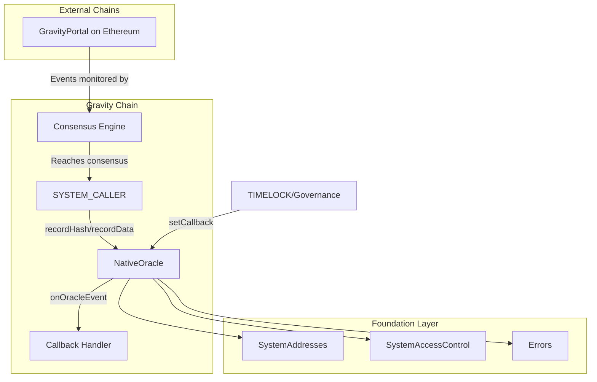

# Native Oracle Specification

## Overview

The Native Oracle module stores and verifies data from external sources, enabling Gravity smart contracts to access
validated information from other blockchains and real-world systems. The oracle is powered by the Gravity validator
consensus—information is only accepted after validators reach consensus on its validity.

**Supported data sources include:**

- **Blockchains**: Ethereum, other EVM chains (events, state roots, etc.)
- **Real-world state**: JWK keys (Google, Apple, etc.), DNS records, and other verifiable data

## Design Goals

1. **Consensus-Gated**: Only SYSTEM_CALLER (consensus engine) can record data after validators agree
2. **Storage Flexibility**: Hash-only mode (storage-efficient) or data mode (direct access)
3. **Callback Support**: Optional callbacks for event-driven processing
4. **Governance Control**: Callback registration requires governance approval (TIMELOCK)
5. **Failure Tolerance**: Callback failures do NOT revert oracle recording
6. **Source Isolation**: Independent sync tracking per source

---

## Architecture

```
src/oracle/
├── INativeOracle.sol  # Interface with events, errors, and data structures
└── NativeOracle.sol   # Core implementation
```

### System Address

| Constant | Address | Description |
|----------|---------|-------------|
| `NATIVE_ORACLE` | `0x0000000000000000000000000001625F2023` | Native Oracle contract |

### Dependency Graph



---

## Storage Modes

The Native Oracle supports two storage modes to balance efficiency and accessibility:

### 1. Hash Storage Mode (Storage-Efficient)

Stores only the hash of verified data. When verifying, users provide the original data (pre-image) as transaction
calldata (much cheaper than storage), and the contract hashes it to recover and verify against the stored hash.

**Use cases:**

- Cross-chain event verification (deposits, withdrawals)
- Large data where calldata is cheaper than storage
- Cost-sensitive applications

**Verification flow:**

```
User transaction calldata: original_data
Contract execution: keccak256(original_data) == stored_hash
```

### 2. Data Storage Mode (Direct Access)

Stores the full data on-chain, allowing smart contracts to access it directly without user input.

**Use cases:**

- JWK keys (for signature verification)
- DNS records (for use cases like zkEmail that rely on reading DNS records on-chain)
- Any data that contracts need to read directly without user providing pre-image

---

## Data Structures

### DataRecord

```solidity
struct DataRecord {
    bool exists;       // Whether this record exists
    uint128 syncId;    // Sync ID when this was recorded (for ordering)
    bytes data;        // Empty for hash-only mode, populated for data mode
}
```

### SyncStatus

```solidity
struct SyncStatus {
    bool initialized;      // Whether this source has been initialized
    uint128 latestSyncId;  // Latest sync ID (block height, timestamp, etc.)
}
```

### EventType

```solidity
enum EventType {
    BLOCKCHAIN,  // Cross-chain events (Ethereum, BSC, etc.)
    JWK,         // JWK key providers (Google, Apple, etc.)
    DNS,         // DNS records
    CUSTOM       // Custom/extensible sources
}
```

---

## Contract: `NativeOracle.sol`

### Constants

```solidity
/// @notice Gas limit for callback execution
/// @dev Prevents malicious callbacks from consuming excessive gas
uint256 public constant CALLBACK_GAS_LIMIT = 500_000;
```

### State Variables

```solidity
/// @notice Data records: hash => DataRecord
mapping(bytes32 => DataRecord) private _dataRecords;

/// @notice Sync status per source: sourceName => SyncStatus
mapping(bytes32 => SyncStatus) private _syncStatus;

/// @notice Callback handlers: sourceName => callback contract
mapping(bytes32 => address) private _callbacks;

/// @notice Total number of records stored
uint256 private _totalRecords;

/// @notice Whether the contract has been initialized
bool private _initialized;
```

### Interface

```solidity
interface INativeOracle {
    // ========== Initialization ==========
    function initialize() external;

    // ========== Recording (Consensus Only) ==========
    function recordHash(bytes32 dataHash, bytes32 sourceName, uint128 syncId, bytes calldata payload) external;
    function recordData(bytes32 dataHash, bytes32 sourceName, uint128 syncId, bytes calldata payload) external;
    function recordHashBatch(bytes32[] calldata dataHashes, bytes32 sourceName, uint128 syncId, bytes[] calldata payloads) external;
    function recordDataBatch(bytes32[] calldata dataHashes, bytes32 sourceName, uint128 syncId, bytes[] calldata payloads) external;

    // ========== Callback Management (Governance Only) ==========
    function setCallback(bytes32 sourceName, address callback) external;
    function getCallback(bytes32 sourceName) external view returns (address);

    // ========== Verification ==========
    function verifyHash(bytes32 dataHash) external view returns (bool exists, DataRecord memory record);
    function verifyPreImage(bytes calldata preImage) external view returns (bool exists, DataRecord memory record);
    function getData(bytes32 dataHash) external view returns (bytes memory data);

    // ========== Sync Status ==========
    function getSyncStatus(bytes32 sourceName) external view returns (SyncStatus memory);
    function isSyncedPast(bytes32 sourceName, uint128 syncId) external view returns (bool);

    // ========== Statistics ==========
    function getTotalRecords() external view returns (uint256);
    function isInitialized() external view returns (bool);

    // ========== Helpers ==========
    function computeSourceName(EventType eventType, bytes32 sourceId) external pure returns (bytes32);
}
```

---

## Function Specifications

### `initialize()`

Initialize the oracle contract at genesis.

**Access Control**: GENESIS only

**Behavior**:
1. Set `_initialized = true`

**Reverts**:
- `AlreadyInitialized` - Contract already initialized

---

### `recordHash(dataHash, sourceName, syncId, payload)`

Record a hash (hash-only mode, storage-efficient).

**Access Control**: SYSTEM_CALLER only

**Parameters**:
- `dataHash` - The hash of the data being recorded
- `sourceName` - The source identifier (hash of eventType + sourceId)
- `syncId` - The sync ID (block height, timestamp, etc.) - must be > current
- `payload` - The event payload (for callback, not stored)

**Behavior**:
1. Validate syncId is strictly increasing for this source
2. Store record with `exists = true`, `syncId`, empty data
3. Increment total records (if new hash)
4. Emit `HashRecorded` event
5. Invoke callback (if registered) with gas limit

**Reverts**:
- `OracleNotInitialized` - Contract not initialized
- `SyncIdNotIncreasing` - syncId <= current syncId for source

---

### `recordData(dataHash, sourceName, syncId, payload)`

Record data (data mode, direct access).

**Access Control**: SYSTEM_CALLER only

**Parameters**: Same as `recordHash`

**Behavior**:
1. Validate syncId is strictly increasing for this source
2. Store record with `exists = true`, `syncId`, `data = payload`
3. Increment total records (if new hash)
4. Emit `DataRecorded` event
5. Invoke callback (if registered) with gas limit

---

### `recordHashBatch(dataHashes, sourceName, syncId, payloads)`

Batch record multiple hashes from the same source.

**Access Control**: SYSTEM_CALLER only

**Behavior**:
1. Validate array lengths match
2. Update sync status once for entire batch
3. Record each hash and invoke callback

**Reverts**:
- `ArrayLengthMismatch` - Array lengths don't match

---

### `setCallback(sourceName, callback)`

Register a callback handler for a source.

**Access Control**: TIMELOCK (governance) only

**Parameters**:
- `sourceName` - The source identifier
- `callback` - The callback contract address (address(0) to unregister)

**Behavior**:
1. Update callback mapping
2. Emit `CallbackSet` event

---

### `verifyHash(dataHash)`

Verify a hash exists and get its record.

**Access Control**: Anyone

**Returns**:
- `exists` - True if the hash is recorded
- `record` - The data record (data field empty if hash-only mode)

---

### `verifyPreImage(preImage)`

Verify pre-image matches a recorded hash.

**Access Control**: Anyone

**Behavior**:
1. Compute `keccak256(preImage)`
2. Look up record

**Returns**:
- `exists` - True if hash(preImage) is recorded
- `record` - The data record

---

## Callback Interface

```solidity
interface IOracleCallback {
    /// @notice Called when an oracle event is recorded
    /// @dev Callback failures are caught - they do NOT revert the oracle recording.
    ///      Callbacks are invoked with limited gas (CALLBACK_GAS_LIMIT = 500,000).
    function onOracleEvent(bytes32 dataHash, bytes calldata payload) external;
}
```

### Callback Execution (Failure-Tolerant)

```solidity
function _invokeCallback(bytes32 sourceName, bytes32 dataHash, bytes calldata payload) internal {
    address callback = _callbacks[sourceName];
    if (callback == address(0)) return;

    // Try to call the callback with limited gas
    // This prevents malicious callbacks from:
    // 1. Consuming excessive gas
    // 2. Blocking oracle updates by reverting
    try IOracleCallback(callback).onOracleEvent{gas: CALLBACK_GAS_LIMIT}(dataHash, payload) {
        emit CallbackSuccess(sourceName, dataHash, callback);
    } catch (bytes memory reason) {
        emit CallbackFailed(sourceName, dataHash, callback, reason);
    }
}
```

---

## Source Name Convention

Sources are identified by a `bytes32` hash computed from event type and source ID:

```solidity
sourceName = keccak256(abi.encode(eventType, sourceId))
```

| Event Type | Source ID | Example sourceName |
|------------|-----------|-------------------|
| BLOCKCHAIN | `keccak256("ethereum")` | `keccak256(abi.encode(EventType.BLOCKCHAIN, keccak256("ethereum")))` |
| BLOCKCHAIN | `keccak256("bsc")` | `keccak256(abi.encode(EventType.BLOCKCHAIN, keccak256("bsc")))` |
| JWK | `keccak256("google")` | `keccak256(abi.encode(EventType.JWK, keccak256("google")))` |
| DNS | `keccak256("txt")` | `keccak256(abi.encode(EventType.DNS, keccak256("txt")))` |

### Sync ID Semantics

The `syncId` (uint128) meaning depends on source type:

| Source Type | syncId Meaning | Example |
|-------------|---------------|---------|
| Blockchain | Block number | `19000000` (Ethereum block) |
| JWK | Unix timestamp | `1704067200` (2024-01-01 00:00:00) |
| DNS | Unix timestamp | `1704067200` |
| Custom | Sequence number | `1`, `2`, `3`, ... |

**Invariant**: `syncId` must be strictly increasing for each source.

---

## Events

```solidity
/// @notice Emitted when a hash is recorded (hash-only mode)
event HashRecorded(bytes32 indexed dataHash, bytes32 indexed sourceName, uint128 syncId);

/// @notice Emitted when data is recorded (data mode)
event DataRecorded(bytes32 indexed dataHash, bytes32 indexed sourceName, uint128 syncId, uint256 dataLength);

/// @notice Emitted when sync status is updated
event SyncStatusUpdated(bytes32 indexed sourceName, uint128 previousSyncId, uint128 newSyncId);

/// @notice Emitted when a callback is registered or updated
event CallbackSet(bytes32 indexed sourceName, address indexed oldCallback, address indexed newCallback);

/// @notice Emitted when a callback succeeds
event CallbackSuccess(bytes32 indexed sourceName, bytes32 indexed dataHash, address indexed callback);

/// @notice Emitted when a callback fails (tx continues)
event CallbackFailed(bytes32 indexed sourceName, bytes32 indexed dataHash, address indexed callback, bytes reason);
```

---

## Errors

```solidity
/// @notice Sync ID must be strictly increasing for each source
error SyncIdNotIncreasing(bytes32 sourceName, uint128 currentSyncId, uint128 providedSyncId);

/// @notice Batch arrays have mismatched lengths
error ArrayLengthMismatch(uint256 hashesLength, uint256 payloadsLength);

/// @notice Data record not found for the given hash
error DataRecordNotFound(bytes32 dataHash);

/// @notice Oracle contract has not been initialized
error OracleNotInitialized();
```

---

## Access Control Matrix

| Function | Allowed Callers |
|----------|-----------------|
| `initialize()` | GENESIS only |
| `recordHash()` | SYSTEM_CALLER only |
| `recordData()` | SYSTEM_CALLER only |
| `recordHashBatch()` | SYSTEM_CALLER only |
| `recordDataBatch()` | SYSTEM_CALLER only |
| `setCallback()` | TIMELOCK only |
| All view/pure functions | Anyone |

---

## Security Considerations

1. **Consensus Required**: All oracle data requires validator consensus via SYSTEM_CALLER
2. **Callback Gas Limit**: Callbacks are invoked with limited gas (`CALLBACK_GAS_LIMIT = 500,000`) to prevent DOS
3. **Callback Failure Tolerance**: Callback failures are caught - they do NOT revert oracle recording
4. **Sync ID Ordering**: Prevents replay attacks and ensures data freshness
5. **Source Isolation**: Each source has independent sync tracking and callback
6. **No Overwrites**: Once recorded, only syncId can be updated (not replaced)
7. **Governance Callback Control**: Only TIMELOCK can register callbacks

---

## Invariants

1. **Sync ID Monotonicity**: For each source, `latestSyncId` only increases
2. **Record Existence**: If `exists == true`, record was written by SYSTEM_CALLER
3. **Total Count**: `_totalRecords` equals count of unique hashes recorded
4. **Callback Safety**: Callback failures never affect oracle state

---

## Usage Patterns

### Recording Cross-Chain Events

```solidity
// Consensus engine records Ethereum event
bytes memory payload = abi.encode(sender, nonce, messageBody);
bytes32 dataHash = keccak256(payload);
bytes32 sourceName = oracle.computeSourceName(EventType.BLOCKCHAIN, keccak256("ethereum"));

vm.prank(SYSTEM_CALLER);
oracle.recordHash(dataHash, sourceName, blockNumber, payload);
```

### Verifying Event with Pre-Image

```solidity
function verifyDeposit(bytes calldata payload) external view returns (bool) {
    (bool exists, ) = oracle.verifyPreImage(payload);
    return exists;
}
```

### Storing and Accessing JWK Data

```solidity
// Record JWK (data mode)
bytes memory jwkData = abi.encode(kid, kty, alg, e, n);
bytes32 dataHash = keccak256(jwkData);
bytes32 sourceName = oracle.computeSourceName(EventType.JWK, keccak256("google"));

vm.prank(SYSTEM_CALLER);
oracle.recordData(dataHash, sourceName, timestamp, jwkData);

// Later: access JWK directly
bytes memory storedJwk = oracle.getData(dataHash);
```

---

## Testing Requirements

### Unit Tests (39 tests implemented)

1. **Initialization**
   - [x] Initialize correctly
   - [x] Revert when not GENESIS
   - [x] Revert when already initialized

2. **Hash Recording**
   - [x] Record single hash
   - [x] Verify hash exists
   - [x] Multiple sources independent
   - [x] Revert when not SYSTEM_CALLER
   - [x] Revert when not initialized
   - [x] Revert when syncId not increasing

3. **Data Recording**
   - [x] Record data with payload
   - [x] Retrieve data directly
   - [x] Revert when not SYSTEM_CALLER

4. **Batch Operations**
   - [x] Batch hash recording
   - [x] Batch data recording
   - [x] Array length validation

5. **Callbacks**
   - [x] Register callback
   - [x] Unregister callback
   - [x] Callback invoked on record
   - [x] Callback failure doesn't revert
   - [x] Gas limit enforced
   - [x] Callback invoked for batch

6. **Verification**
   - [x] Verify pre-image
   - [x] isSyncedPast
   - [x] getData empty for hash mode

7. **Fuzz Tests**
   - [x] Random payloads and syncIds
   - [x] SyncId ordering enforcement
   - [x] Multiple records count

8. **Event Tests**
   - [x] HashRecorded event
   - [x] DataRecorded event
   - [x] SyncStatusUpdated event
   - [x] CallbackSet event
   - [x] CallbackSuccess event
   - [x] CallbackFailed event

---

## Future Extensions

1. **JWK Registry**: Dedicated module for managing JWK keys with patch support
2. **Blockchain Event Router**: Route events by sender to application handlers
3. **G Token Bridge**: Native token bridge using oracle for cross-chain deposits
4. **DNS Verification**: On-chain DNS record verification for zkEmail and similar use cases

