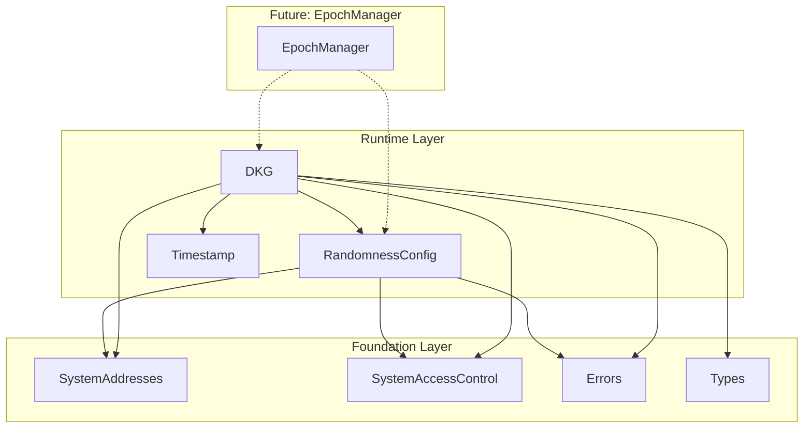

# Randomness Layer Specification

## Overview

The Randomness layer provides on-chain infrastructure for Distributed Key Generation (DKG) and randomness configuration. It consists of two contracts:

- **RandomnessConfig.sol** — Configuration parameters for DKG thresholds with pending config pattern
- **DKG.sol** — DKG session lifecycle management for epoch transitions

These contracts are **pure service contracts** that will be orchestrated by `EpochManager` during epoch transitions.

## Design Goals

1. **Epoch-Boundary Updates**: Configuration changes apply at epoch boundaries (not immediately)
2. **On/Off Support**: Randomness can be disabled via governance (ConfigVariant.Off)
3. **DKG Session Management**: Clear lifecycle for DKG sessions (start → finish)
4. **Event-Driven**: Emit events for consensus engine to listen (DKGStartEvent)
5. **Separation of Concerns**: Config storage separate from session management

---

## Architecture



### Dependency Graph

```
src/runtime/
├── RandomnessConfig.sol   # DKG threshold configuration
├── DKG.sol                # DKG session management
├── Timestamp.sol          # Time oracle (existing)
├── StakingConfig.sol      # Staking parameters (existing)
└── ValidatorConfig.sol    # Validator parameters (existing)
```

---

## Contract: `RandomnessConfig.sol`

### System Address

| Constant | Address | Description |
|----------|---------|-------------|
| `RANDOMNESS_CONFIG` | `0x0000000000000000000000000001625F2024` | Randomness configuration |

### Types

```solidity
/// @notice Configuration variant enum
enum ConfigVariant {
    Off,    // Randomness disabled
    V2      // Enabled with thresholds
}

/// @notice V2 configuration data with DKG thresholds
/// @dev All thresholds are fixed-point values (value / 2^64)
struct ConfigV2Data {
    uint64 secrecyThreshold;           // Min stake ratio to keep secret
    uint64 reconstructionThreshold;     // Min stake ratio to reveal
    uint64 fastPathSecrecyThreshold;   // Threshold for fast path
}

/// @notice Complete randomness configuration
struct RandomnessConfigData {
    ConfigVariant variant;
    ConfigV2Data configV2;
}
```

### Threshold Meaning

| Threshold | Purpose | Typical Value |
|-----------|---------|---------------|
| `secrecyThreshold` | Min stake to keep randomness secret | 50% (2^63) |
| `reconstructionThreshold` | Min stake to reveal randomness | 66% |
| `fastPathSecrecyThreshold` | For optimistic fast path | 66% |

### State Variables

```solidity
/// @notice Current active configuration
RandomnessConfigData private _currentConfig;

/// @notice Pending configuration for next epoch
RandomnessConfigData private _pendingConfig;

/// @notice Whether a pending configuration exists
bool public hasPendingConfig;

/// @notice Whether the contract has been initialized
bool private _initialized;
```

### Interface

```solidity
interface IRandomnessConfig {
    // ========== Initialization ==========
    
    /// @notice Initialize with config (genesis only)
    function initialize(RandomnessConfigData calldata config) external;
    
    // ========== View Functions ==========
    
    /// @notice Check if randomness is enabled
    function enabled() external view returns (bool);
    
    /// @notice Get current config
    function getCurrentConfig() external view returns (RandomnessConfigData memory);
    
    /// @notice Get pending config if any
    function getPendingConfig() external view returns (bool hasPending, RandomnessConfigData memory config);
    
    /// @notice Check if initialized
    function isInitialized() external view returns (bool);
    
    // ========== Governance (TIMELOCK only) ==========
    
    /// @notice Set config for next epoch
    function setForNextEpoch(RandomnessConfigData calldata newConfig) external;
    
    // ========== Epoch Transition (EPOCH_MANAGER only) ==========
    
    /// @notice Apply pending config at epoch boundary
    function applyPendingConfig() external;
    
    // ========== Config Builders (Pure) ==========
    
    /// @notice Create Off config
    function newOff() external pure returns (RandomnessConfigData memory);
    
    /// @notice Create V2 config
    function newV2(uint64 secrecy, uint64 reconstruction, uint64 fastPath) 
        external pure returns (RandomnessConfigData memory);
}
```

### Events

```solidity
/// @notice Emitted when configuration is applied at epoch boundary
event RandomnessConfigUpdated(ConfigVariant indexed oldVariant, ConfigVariant indexed newVariant);

/// @notice Emitted when pending configuration is set by governance
event PendingRandomnessConfigSet(ConfigVariant indexed variant);

/// @notice Emitted when pending configuration is cleared
event PendingRandomnessConfigCleared();
```

### Access Control

| Function | Caller | Rationale |
|----------|--------|-----------|
| `initialize()` | GENESIS | One-time initialization |
| `enabled()` | Anyone | Read-only |
| `getCurrentConfig()` | Anyone | Read-only |
| `getPendingConfig()` | Anyone | Read-only |
| `isInitialized()` | Anyone | Read-only |
| `setForNextEpoch()` | TIMELOCK | Governance only |
| `applyPendingConfig()` | EPOCH_MANAGER | Epoch transition only |
| `newOff()`, `newV2()` | Anyone | Pure functions |

### Validation Rules

1. **V2 Config**: `reconstructionThreshold >= secrecyThreshold`
2. **Off Config**: No validation required

---

## Contract: `DKG.sol`

### System Address

| Constant | Address | Description |
|----------|---------|-------------|
| `DKG` | `0x0000000000000000000000000001625F2025` | DKG session management |

### Types

```solidity
/// @notice Essential DKG session info stored on-chain
/// @dev Full metadata including validator sets is emitted in events only
struct DKGSessionInfo {
    uint64 dealerEpoch;                    // Epoch of dealers
    ConfigVariant configVariant;           // Config variant used
    uint64 dealerCount;                    // Number of dealers
    uint64 targetCount;                    // Number of targets
    uint64 startTimeUs;                    // Start timestamp (microseconds)
    bytes transcript;                      // DKG output (set on completion)
}

/// @notice Full DKG session metadata (for events only)
/// @dev Not stored on-chain to avoid dynamic array storage issues
struct DKGSessionMetadata {
    uint64 dealerEpoch;                               // Epoch of dealers
    RandomnessConfigData randomnessConfig;            // Config for session
    ValidatorConsensusInfo[] dealerValidatorSet;      // Current validators
    ValidatorConsensusInfo[] targetValidatorSet;      // Next epoch validators
}
```

**Design Note**: Full validator arrays are emitted in events only (via `DKGSessionMetadata`) and not stored in contract state. This avoids Solidity storage limitations with dynamic arrays containing nested structs. The consensus engine receives full metadata from events, while the contract tracks essential info (`DKGSessionInfo`).

### State Variables

```solidity
/// @notice In-progress DKG session info (if any)
DKGSessionInfo private _inProgress;

/// @notice Last completed DKG session info (if any)
DKGSessionInfo private _lastCompleted;

/// @notice Whether an in-progress session exists
bool public hasInProgress;

/// @notice Whether a last completed session exists
bool public hasLastCompleted;

/// @notice Whether the contract has been initialized
bool private _initialized;
```

### Interface

```solidity
interface IDKG {
    // ========== Initialization ==========
    
    /// @notice Initialize the DKG contract (genesis only)
    function initialize() external;
    
    // ========== Session Management (EPOCH_MANAGER only) ==========
    
    /// @notice Start a new DKG session
    /// @dev Emits DKGStartEvent with full metadata for consensus engine
    function start(
        uint64 dealerEpoch,
        RandomnessConfigData calldata randomnessConfig,
        ValidatorConsensusInfo[] calldata dealerValidatorSet,
        ValidatorConsensusInfo[] calldata targetValidatorSet
    ) external;
    
    /// @notice Complete DKG session with transcript
    function finish(bytes calldata transcript) external;
    
    /// @notice Clear incomplete session (no-op if none)
    function tryClearIncompleteSession() external;
    
    // ========== View Functions ==========
    
    /// @notice Check if DKG is in progress
    function isInProgress() external view returns (bool);
    
    /// @notice Get incomplete session info if any
    function getIncompleteSession() external view returns (
        bool hasSession, 
        DKGSessionInfo memory info
    );
    
    /// @notice Get last completed session info if any
    function getLastCompletedSession() external view returns (
        bool hasSession, 
        DKGSessionInfo memory info
    );
    
    /// @notice Get dealer epoch from session info
    function sessionDealerEpoch(DKGSessionInfo calldata info) external pure returns (uint64);
    
    /// @notice Check if initialized
    function isInitialized() external view returns (bool);
}
```

### Events

```solidity
/// @notice Emitted when DKG session starts
/// @dev Consensus engine listens for this to begin off-chain DKG.
///      Contains full metadata including validator sets.
event DKGStartEvent(
    uint64 indexed dealerEpoch, 
    uint64 startTimeUs, 
    DKGSessionMetadata metadata
);

/// @notice Emitted when DKG session completes
event DKGCompleted(uint64 indexed dealerEpoch, bytes32 transcriptHash);

/// @notice Emitted when incomplete session is cleared
event DKGSessionCleared(uint64 indexed dealerEpoch);
```

### Access Control

| Function | Caller | Rationale |
|----------|--------|-----------|
| `initialize()` | GENESIS | One-time initialization |
| `start()` | EPOCH_MANAGER | Start transition |
| `finish()` | EPOCH_MANAGER | Complete transition |
| `tryClearIncompleteSession()` | EPOCH_MANAGER | Cleanup stale sessions |
| View functions | Anyone | Read-only |

### Session Lifecycle

```
                        start()
                        (EPOCH_MANAGER)
┌──────────────┐ ─────────────────────────────────▶ ┌──────────────┐
│   No Active  │                                    │  In Progress │
│   Session    │                                    │              │
└──────────────┘                                    └──────┬───────┘
       ▲                                                   │
       │                                      finish(transcript)
       │                                      (EPOCH_MANAGER)
       │                                                   │
       │         tryClearIncompleteSession()               ▼
       └──────────────────────────────────────────  ┌──────────────┐
                                                    │  Completed   │
                                                    └──────────────┘
```

---

## Coordination with EpochManager (Future)

These contracts will be called by `EpochManager` during epoch transitions:

```
EpochManager.checkAndStartTransition()
    │
    ├─► RandomnessConfig.getCurrentConfig()
    ├─► ValidatorManager.getCurrentConsensusInfos()
    ├─► ValidatorManager.getNextConsensusInfos()
    ├─► DKG.tryClearIncompleteSession()
    └─► DKG.start(epoch, config, dealers, targets)
        └─► Emits DKGStartEvent

[OFF-CHAIN: Consensus engine runs DKG]

EpochManager.finishTransition(dkgResult)
    │
    ├─► DKG.finish(dkgResult)
    ├─► DKG.tryClearIncompleteSession()
    ├─► RandomnessConfig.applyPendingConfig()
    ├─► currentEpoch++
    └─► ValidatorManager.onNewEpoch()
```

---

## Errors

### RandomnessConfig Errors

```solidity
/// @notice Randomness config has not been initialized
error RandomnessNotInitialized();

/// @notice Randomness config has already been initialized
error RandomnessAlreadyInitialized();

/// @notice Invalid randomness configuration
error InvalidRandomnessConfig(string reason);

/// @notice No pending randomness config to apply
error NoPendingRandomnessConfig();
```

### DKG Errors

```solidity
/// @notice DKG session is already in progress
error DKGInProgress();

/// @notice No DKG session is in progress
error DKGNotInProgress();

/// @notice DKG contract has not been initialized
error DKGNotInitialized();
```

---

## Security Considerations

1. **Access Control**: Only authorized contracts can modify state
2. **Single Orchestrator**: Only EpochManager manages DKG sessions
3. **Epoch Binding**: Sessions are tied to specific epochs
4. **Threshold Validation**: Reconstruction >= secrecy enforced
5. **Pending Pattern**: Config changes delayed to epoch boundary
6. **Event Verification**: Hash transcript in events for verification

---

## Invariants

1. At most one DKG session in progress at any time
2. `reconstructionThreshold >= secrecyThreshold` for V2 configs
3. Config changes only take effect at epoch boundaries
4. Only EPOCH_MANAGER can start/finish DKG sessions
5. Completed sessions have non-empty transcripts

---

## Testing Requirements

### Unit Tests

**RandomnessConfig:**
- Initialization (Off, V2, invalid configs)
- Config queries (enabled, getCurrentConfig, getPendingConfig)
- Governance updates (setForNextEpoch, overwrite pending)
- Epoch transition (applyPendingConfig, no-op when no pending)
- Config builders (newOff, newV2)
- Access control (unauthorized callers)
- Events (all events emitted correctly)

**DKG:**
- Initialization
- Session start (success, already in progress)
- Session finish (success, not in progress)
- Session clear (with session, without session)
- View functions (incomplete/completed sessions)
- Multi-session lifecycle
- Access control
- Events

### Fuzz Tests

- Random threshold values (valid and invalid)
- Random transcript data
- Random validator counts
- Random epoch numbers

### Integration Tests (Future)

- Full epoch transition flow with DKG
- Config updates across multiple epochs
- Validator set changes during DKG

---

## Future Extensibility

1. **PerBlockRandomness**: Add per-block seed storage (updated in block prologue)
2. **Randomness API**: Add random number generation functions (u64_range, etc.)
3. **ConfigV3**: New config variants can be added without breaking changes
4. **DKG Verification**: Add transcript verification logic

