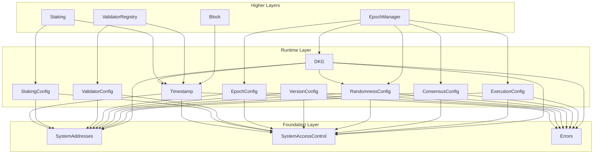

# Runtime Layer Specification

## Overview

The Runtime layer provides mutable parameters and time infrastructure that all higher layers depend on. It contains
nine contracts organized into three categories:

**Time Infrastructure:**
- **Timestamp.sol** — On-chain time oracle with microsecond precision

**Simple Config Contracts:**
- **StakingConfig.sol** — Governance staking configuration parameters
- **ValidatorConfig.sol** — Validator registry configuration parameters
- **EpochConfig.sol** — Epoch timing configuration
- **VersionConfig.sol** — Protocol version tracking

**Epoch-Boundary Config Contracts (Pending Pattern):**
- **RandomnessConfig.sol** — DKG threshold parameters for on-chain randomness
- **ConsensusConfig.sol** — Consensus parameters (opaque bytes)
- **ExecutionConfig.sol** — VM execution parameters (opaque bytes)

**DKG Management:**
- **DKG.sol** — Distributed Key Generation session lifecycle

## Design Goals

1. **Microsecond Time**: All timestamps use `uint64` microseconds (consistent with Aptos)
2. **Single Source of Truth**: Timestamp contract is the authoritative time source
3. **Governance-Controlled**: Config parameters can only be changed via GOVERNANCE
4. **Genesis Initialization**: Configs are initialized once during genesis
5. **Gas Efficient**: Simple storage patterns, no complex computations
6. **Epoch-Boundary Application**: Some configs use pending pattern for safe epoch transitions

---

## Architecture

```
src/runtime/
├── Timestamp.sol         # On-chain time oracle
├── StakingConfig.sol     # Governance staking parameters
├── ValidatorConfig.sol   # Validator registry parameters
├── EpochConfig.sol       # Epoch interval configuration
├── VersionConfig.sol     # Protocol version (monotonic)
├── RandomnessConfig.sol  # DKG threshold parameters
├── ConsensusConfig.sol   # Consensus parameters (opaque)
├── ExecutionConfig.sol   # VM execution parameters (opaque)
└── DKG.sol               # DKG session management
```

### Dependency Graph



---

## Contract: `Timestamp.sol`

The Timestamp contract provides the authoritative on-chain time source for all Gravity system contracts. Time is stored
in microseconds and updated by the Block contract during block prologue.

### System Address

| Constant | Address | Description |
|----------|---------|-------------|
| `TIMESTAMP` | `0x0000000000000000000000000001625F2017` | On-chain time oracle |

### State Variables

```solidity
/// @notice Current Unix timestamp in microseconds
uint64 public microseconds;

/// @notice Conversion factor from seconds to microseconds
uint64 public constant MICRO_CONVERSION_FACTOR = 1_000_000;
```

### Interface

```solidity
/// @title Timestamp
/// @notice On-chain time oracle with microsecond precision
/// @dev Updated by Block contract during block prologue. Supports NIL blocks.
contract Timestamp {
    /// @notice Get current time in microseconds
    function nowMicroseconds() external view returns (uint64);

    /// @notice Get current time in seconds (convenience helper)
    function nowSeconds() external view returns (uint64);

    /// @notice Update the global time
    /// @dev Only callable by BLOCK contract. Supports NIL blocks.
    function updateGlobalTime(address proposer, uint64 timestamp) external;
}
```

### Time Update Rules

| Block Type | Condition | Rule | Error on Violation |
|------------|-----------|------|-------------------|
| Normal Block | `proposer != SYSTEM_CALLER` | `timestamp > microseconds` | `TimestampMustAdvance` |
| NIL Block | `proposer == SYSTEM_CALLER` | `timestamp == microseconds` | `TimestampMustEqual` |

### Access Control

| Function | Allowed Callers |
|----------|-----------------|
| `nowMicroseconds()` | Anyone |
| `nowSeconds()` | Anyone |
| `updateGlobalTime()` | BLOCK only |

---

## Contract: `StakingConfig.sol`

Configuration parameters for governance staking. Anyone can stake tokens to participate in governance voting.

### System Address

| Constant | Address | Description |
|----------|---------|-------------|
| `STAKE_CONFIG` | `0x0000000000000000000000000001625F2011` | Staking configuration |

### Parameters

| Parameter | Type | Description | Constraints |
|-----------|------|-------------|-------------|
| `minimumStake` | `uint256` | Minimum stake for governance participation | >= 0 |
| `lockupDurationMicros` | `uint64` | Lockup duration in microseconds | > 0 |
| `minimumProposalStake` | `uint256` | Minimum stake to create governance proposals | >= 0 |

### Access Control

| Function | Allowed Callers |
|----------|-----------------|
| All view functions | Anyone |
| `initialize()` | GENESIS only (once) |
| All setters | GOVERNANCE only |

---

## Contract: `ValidatorConfig.sol`

Configuration parameters for the validator registry. Controls validator bonding, set size limits, and join/leave rules.

### System Address

| Constant | Address | Description |
|----------|---------|-------------|
| `VALIDATOR_CONFIG` | `0x0000000000000000000000000001625F2015` | Validator configuration |

### Parameters

| Parameter | Type | Description | Constraints |
|-----------|------|-------------|-------------|
| `minimumBond` | `uint256` | Minimum bond to join validator set | > 0 |
| `maximumBond` | `uint256` | Maximum bond per validator | >= minimumBond |
| `unbondingDelayMicros` | `uint64` | Unbonding delay in microseconds | > 0 |
| `allowValidatorSetChange` | `bool` | Whether validators can join/leave post-genesis | - |
| `votingPowerIncreaseLimitPct` | `uint64` | Max % of voting power that can join per epoch | 1-50 |
| `maxValidatorSetSize` | `uint256` | Maximum number of validators in the set | 1-65536 |

### Constants

```solidity
uint64 public constant MAX_VOTING_POWER_INCREASE_LIMIT = 50;
uint256 public constant MAX_VALIDATOR_SET_SIZE = 65536;
```

---

## Contract: `EpochConfig.sol`

Configuration for epoch timing. Determines how long each epoch lasts.

### System Address

| Constant | Address | Description |
|----------|---------|-------------|
| `EPOCH_CONFIG` | `0x0000000000000000000000000001625F2027` | Epoch configuration |

### Parameters

| Parameter | Type | Description | Constraints |
|-----------|------|-------------|-------------|
| `epochIntervalMicros` | `uint64` | Epoch duration in microseconds | > 0 |

### Interface

```solidity
/// @title EpochConfig
/// @notice Configuration parameters for epoch timing
contract EpochConfig {
    /// @notice Epoch duration in microseconds
    uint64 public epochIntervalMicros;

    /// @notice Initialize the epoch configuration
    /// @dev Can only be called once by GENESIS
    function initialize(uint64 _epochIntervalMicros) external;

    /// @notice Update epoch interval
    /// @dev Only callable by GOVERNANCE
    function setEpochIntervalMicros(uint64 _epochIntervalMicros) external;

    /// @notice Check if initialized
    function isInitialized() external view returns (bool);
}
```

### Access Control

| Function | Allowed Callers |
|----------|-----------------|
| `epochIntervalMicros()` | Anyone |
| `isInitialized()` | Anyone |
| `initialize()` | GENESIS only (once) |
| `setEpochIntervalMicros()` | GOVERNANCE only |

---

## Contract: `VersionConfig.sol`

Protocol version tracking. Used to coordinate upgrades and gate new features.

### System Address

| Constant | Address | Description |
|----------|---------|-------------|
| `VERSION_CONFIG` | `0x0000000000000000000000000001625F2028` | Version configuration |

### Parameters

| Parameter | Type | Description | Constraints |
|-----------|------|-------------|-------------|
| `majorVersion` | `uint64` | Protocol major version number | Monotonically increasing |

### Interface

```solidity
/// @title VersionConfig
/// @notice Configuration for protocol versioning
contract VersionConfig {
    /// @notice Major protocol version number
    uint64 public majorVersion;

    /// @notice Initialize the version configuration
    /// @dev Can only be called once by GENESIS
    function initialize(uint64 _majorVersion) external;

    /// @notice Update major version
    /// @dev Only callable by GOVERNANCE. Version must be strictly greater.
    function setMajorVersion(uint64 _majorVersion) external;

    /// @notice Check if initialized
    function isInitialized() external view returns (bool);
}
```

### Access Control

| Function | Allowed Callers |
|----------|-----------------|
| `majorVersion()` | Anyone |
| `isInitialized()` | Anyone |
| `initialize()` | GENESIS only (once) |
| `setMajorVersion()` | GOVERNANCE only |

### Validation Rules

- `setMajorVersion()`: New version must be strictly greater than current (`newVersion > majorVersion`)

---

## Contract: `RandomnessConfig.sol`

Configuration for on-chain randomness (DKG thresholds). Uses the pending config pattern for safe epoch transitions.

### System Address

| Constant | Address | Description |
|----------|---------|-------------|
| `RANDOMNESS_CONFIG` | `0x0000000000000000000000000001625F2024` | Randomness configuration |

### Configuration Variants

```solidity
enum ConfigVariant { Off, V2 }

struct ConfigV2Data {
    uint64 secrecyThreshold;       // Min stake ratio to keep secret
    uint64 reconstructionThreshold; // Min stake ratio to reveal
    uint64 fastPathSecrecyThreshold; // Fast path threshold
}

struct RandomnessConfigData {
    ConfigVariant variant;
    ConfigV2Data configV2;
}
```

### Interface

```solidity
/// @title RandomnessConfig
/// @notice DKG threshold parameters for on-chain randomness
contract RandomnessConfig {
    /// @notice Check if randomness is enabled
    function enabled() external view returns (bool);

    /// @notice Get current active configuration
    function getCurrentConfig() external view returns (RandomnessConfigData memory);

    /// @notice Get pending configuration if any
    function getPendingConfig() external view returns (bool hasPending, RandomnessConfigData memory);

    /// @notice Initialize the configuration
    function initialize(RandomnessConfigData calldata config) external;

    /// @notice Set configuration for next epoch
    function setForNextEpoch(RandomnessConfigData calldata newConfig) external;

    /// @notice Apply pending configuration at epoch boundary
    function applyPendingConfig() external;
}
```

### Access Control

| Function | Allowed Callers |
|----------|-----------------|
| View functions | Anyone |
| `initialize()` | GENESIS only (once) |
| `setForNextEpoch()` | GOVERNANCE only |
| `applyPendingConfig()` | EPOCH_MANAGER only |

---

## Contract: `ConsensusConfig.sol`

Consensus parameters stored as opaque bytes. Uses the pending config pattern for safe epoch transitions.

### System Address

| Constant | Address | Description |
|----------|---------|-------------|
| `CONSENSUS_CONFIG` | `0x0000000000000000000000000001625F2029` | Consensus configuration |

### Interface

```solidity
/// @title ConsensusConfig
/// @notice Consensus parameters as opaque bytes (BCS-serialized)
contract ConsensusConfig {
    /// @notice Get current active configuration
    function getCurrentConfig() external view returns (bytes memory);

    /// @notice Get pending configuration if any
    function getPendingConfig() external view returns (bool hasPending, bytes memory);

    /// @notice Whether a pending configuration exists
    function hasPendingConfig() external view returns (bool);

    /// @notice Initialize the configuration
    function initialize(bytes calldata config) external;

    /// @notice Set configuration for next epoch
    function setForNextEpoch(bytes calldata newConfig) external;

    /// @notice Apply pending configuration at epoch boundary
    function applyPendingConfig() external;
}
```

### Access Control

| Function | Allowed Callers |
|----------|-----------------|
| View functions | Anyone |
| `initialize()` | GENESIS only (once) |
| `setForNextEpoch()` | GOVERNANCE only |
| `applyPendingConfig()` | EPOCH_MANAGER only |

### Validation Rules

- Config bytes cannot be empty (length must be > 0)

---

## Contract: `ExecutionConfig.sol`

VM execution parameters stored as opaque bytes. Uses the pending config pattern for safe epoch transitions.

### System Address

| Constant | Address | Description |
|----------|---------|-------------|
| `EXECUTION_CONFIG` | `0x0000000000000000000000000001625F202A` | Execution configuration |

### Interface

```solidity
/// @title ExecutionConfig
/// @notice VM execution parameters as opaque bytes (BCS-serialized)
contract ExecutionConfig {
    /// @notice Get current active configuration
    function getCurrentConfig() external view returns (bytes memory);

    /// @notice Get pending configuration if any
    function getPendingConfig() external view returns (bool hasPending, bytes memory);

    /// @notice Whether a pending configuration exists
    function hasPendingConfig() external view returns (bool);

    /// @notice Initialize the configuration
    function initialize(bytes calldata config) external;

    /// @notice Set configuration for next epoch
    function setForNextEpoch(bytes calldata newConfig) external;

    /// @notice Apply pending configuration at epoch boundary
    function applyPendingConfig() external;
}
```

### Access Control

| Function | Allowed Callers |
|----------|-----------------|
| View functions | Anyone |
| `initialize()` | GENESIS only (once) |
| `setForNextEpoch()` | GOVERNANCE only |
| `applyPendingConfig()` | EPOCH_MANAGER only |

### Validation Rules

- Config bytes cannot be empty (length must be > 0)

---

## Contract: `DKG.sol`

Manages Distributed Key Generation session lifecycle for epoch transitions. The consensus engine listens for 
`DKGStartEvent` to begin off-chain DKG.

### System Address

| Constant | Address | Description |
|----------|---------|-------------|
| `DKG` | `0x0000000000000000000000000001625F2025` | DKG session management |

### Session Info

```solidity
struct DKGSessionInfo {
    uint64 dealerEpoch;                           // Epoch of dealers
    RandomnessConfig.ConfigVariant configVariant; // Randomness config variant
    uint64 dealerCount;                           // Number of dealers
    uint64 targetCount;                           // Number of targets
    uint64 startTimeUs;                           // Start time (microseconds)
    bytes transcript;                             // DKG transcript (on completion)
}
```

### Interface

```solidity
/// @title DKG
/// @notice Distributed Key Generation session management
contract DKG {
    /// @notice Start a new DKG session
    function start(
        uint64 dealerEpoch,
        RandomnessConfig.RandomnessConfigData calldata randomnessConfig,
        ValidatorConsensusInfo[] calldata dealerValidatorSet,
        ValidatorConsensusInfo[] calldata targetValidatorSet
    ) external;

    /// @notice Complete a DKG session with transcript
    function finish(bytes calldata transcript) external;

    /// @notice Clear an incomplete session
    function tryClearIncompleteSession() external;

    /// @notice Check if a session is in progress
    function isInProgress() external view returns (bool);

    /// @notice Get incomplete session info
    function getIncompleteSession() external view returns (bool, DKGSessionInfo memory);

    /// @notice Get last completed session info
    function getLastCompletedSession() external view returns (bool, DKGSessionInfo memory);
}
```

### Access Control

| Function | Allowed Callers |
|----------|-----------------|
| View functions | Anyone |
| `start()` | EPOCH_MANAGER only |
| `finish()` | EPOCH_MANAGER only |
| `tryClearIncompleteSession()` | EPOCH_MANAGER only |

---

## Design Patterns

### Simple Config Pattern

Used by: `StakingConfig`, `ValidatorConfig`, `EpochConfig`, `VersionConfig`

```solidity
// Initialize at genesis
function initialize(...) external {
    requireAllowed(SystemAddresses.GENESIS);
    if (_initialized) revert AlreadyInitialized();
    // Set values
    _initialized = true;
}

// Update via governance
function setParameter(value) external {
    requireAllowed(SystemAddresses.GOVERNANCE);
    // Validate and update
    emit ConfigUpdated(...);
}
```

### Pending Config Pattern

Used by: `RandomnessConfig`, `ConsensusConfig`, `ExecutionConfig`

```solidity
// Stage change for next epoch
function setForNextEpoch(newConfig) external {
    requireAllowed(SystemAddresses.GOVERNANCE);
    _pendingConfig = newConfig;
    hasPendingConfig = true;
}

// Apply at epoch boundary
function applyPendingConfig() external {
    requireAllowed(SystemAddresses.EPOCH_MANAGER);
    if (!hasPendingConfig) return; // No-op
    _currentConfig = _pendingConfig;
    hasPendingConfig = false;
    delete _pendingConfig;
}
```

---

## Time Convention

**All time values in Gravity use microseconds (uint64).**

| Contract | Parameter | Unit |
|----------|-----------|------|
| Timestamp | `microseconds` | microseconds |
| StakingConfig | `lockupDurationMicros` | microseconds |
| ValidatorConfig | `unbondingDelayMicros` | microseconds |
| EpochConfig | `epochIntervalMicros` | microseconds |
| DKG | `startTimeUs` | microseconds |

### Conversion

```solidity
uint64 constant MICRO_CONVERSION_FACTOR = 1_000_000;

// Microseconds to seconds
uint64 seconds = microseconds / MICRO_CONVERSION_FACTOR;

// Seconds to microseconds
uint64 microseconds = seconds * MICRO_CONVERSION_FACTOR;
```

---

## System Addresses Summary

| Contract | Address |
|----------|---------|
| `STAKE_CONFIG` | `0x...1625F2011` |
| `VALIDATOR_CONFIG` | `0x...1625F2015` |
| `TIMESTAMP` | `0x...1625F2017` |
| `RANDOMNESS_CONFIG` | `0x...1625F2024` |
| `DKG` | `0x...1625F2025` |
| `EPOCH_CONFIG` | `0x...1625F2027` |
| `VERSION_CONFIG` | `0x...1625F2028` |
| `CONSENSUS_CONFIG` | `0x...1625F2029` |
| `EXECUTION_CONFIG` | `0x...1625F202A` |

---

## Errors

### Timestamp Errors

```solidity
error TimestampMustAdvance(uint64 proposed, uint64 current);
error TimestampMustEqual(uint64 proposed, uint64 current);
```

### Config Errors

```solidity
error AlreadyInitialized();
error InvalidLockupDuration();
error InvalidUnbondingDelay();
error InvalidMinimumBond();
error InvalidVotingPowerIncreaseLimit(uint64 value);
error InvalidValidatorSetSize(uint256 value);
error MinimumBondExceedsMaximum(uint256 minimum, uint256 maximum);
error InvalidEpochInterval();
error EpochConfigNotInitialized();
error EpochConfigAlreadyInitialized();
error VersionMustIncrease(uint64 current, uint64 proposed);
error VersionNotInitialized();
error VersionAlreadyInitialized();
error ConsensusConfigNotInitialized();
error ConsensusConfigAlreadyInitialized();
error ExecutionConfigNotInitialized();
error ExecutionConfigAlreadyInitialized();
error EmptyConfig();
```

### Randomness Config Errors

```solidity
error RandomnessNotInitialized();
error RandomnessAlreadyInitialized();
error InvalidRandomnessConfig(string reason);
```

### DKG Errors

```solidity
error DKGInProgress();
error DKGNotInProgress();
```

---

## Security Considerations

1. **Access Control**: All config setters are restricted to GOVERNANCE to prevent unauthorized changes
2. **Initialization Guard**: Config contracts can only be initialized once during genesis
3. **Validation**: All parameter changes are validated against constraints before applying
4. **Time Monotonicity**: Timestamp can only advance forward (except for NIL blocks)
5. **Version Monotonicity**: Protocol version can only increase, never decrease
6. **Epoch-Boundary Application**: Sensitive configs use pending pattern for atomic epoch transitions
7. **No Overflow**: `uint64` microseconds won't overflow until year ~586,000

---

## Testing Summary

| Contract | Tests |
|----------|-------|
| Timestamp | 25 |
| StakingConfig | 26 |
| ValidatorConfig | 54 |
| EpochConfig | 15 |
| VersionConfig | 19 |
| RandomnessConfig | 30 |
| ConsensusConfig | 27 |
| ExecutionConfig | 27 |
| DKG | 19 |
| **Total** | **242** |

---

## Future Extensibility

- **Config Buffer**: Pattern already established with pending configs
- **Snapshots**: Time-based snapshots for governance voting power can build on Timestamp
- **Additional Parameters**: New config parameters can be added via governance proposals
- **Gas Schedule**: Can be added as opaque bytes config following ConsensusConfig pattern
