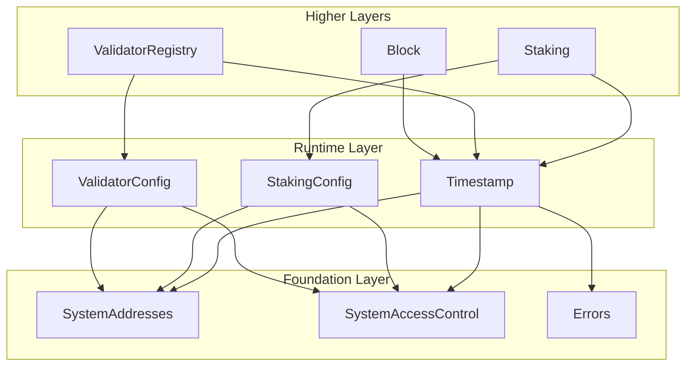

# Runtime Layer Specification

## Overview

The Runtime layer provides mutable parameters and time infrastructure that all higher layers depend on. It contains
three contracts:

- **Timestamp.sol** — On-chain time oracle with microsecond precision
- **StakingConfig.sol** — Governance staking configuration parameters
- **ValidatorConfig.sol** — Validator registry configuration parameters

## Design Goals

1. **Microsecond Time**: All timestamps use `uint64` microseconds (consistent with Aptos)
2. **Single Source of Truth**: Timestamp contract is the authoritative time source
3. **Governance-Controlled**: Config parameters can only be changed via TIMELOCK (governance)
4. **Genesis Initialization**: Configs are initialized once during genesis
5. **Gas Efficient**: Simple storage patterns, no complex computations

---

## Architecture

```
src/runtime/
├── Timestamp.sol       # On-chain time oracle
├── StakingConfig.sol   # Governance staking parameters
└── ValidatorConfig.sol # Validator registry parameters
```

### Dependency Graph



---

## Contract: `Timestamp.sol`

The Timestamp contract provides the authoritative on-chain time source for all Gravity system contracts. Time is stored
in microseconds and updated by the Block contract during block prologue.

### System Address

| Constant | Address | Description |
|----------|---------|-------------|
| `TIMESTAMP` | `0x0000000000000000000000000001625F2017` | On-chain time oracle |

### State Variables

```solidity
/// @notice Current Unix timestamp in microseconds
uint64 public microseconds;

/// @notice Conversion factor from seconds to microseconds
uint64 public constant MICRO_CONVERSION_FACTOR = 1_000_000;
```

### Interface

```solidity
// SPDX-License-Identifier: MIT
pragma solidity ^0.8.30;

/// @title Timestamp
/// @notice On-chain time oracle with microsecond precision
/// @dev Updated by Block contract during block prologue. Supports NIL blocks.
contract Timestamp {
    /// @notice Current Unix timestamp in microseconds
    uint64 public microseconds;

    /// @notice Conversion factor for seconds to microseconds
    uint64 public constant MICRO_CONVERSION_FACTOR = 1_000_000;

    /// @notice Emitted when global time is updated
    /// @param proposer Block proposer address
    /// @param oldTimestamp Previous timestamp (microseconds)
    /// @param newTimestamp New timestamp (microseconds)
    event GlobalTimeUpdated(
        address indexed proposer,
        uint64 oldTimestamp,
        uint64 newTimestamp
    );

    /// @notice Get current time in microseconds
    /// @return Current timestamp in microseconds
    function nowMicroseconds() external view returns (uint64);

    /// @notice Get current time in seconds (convenience helper)
    /// @return Current timestamp in seconds
    function nowSeconds() external view returns (uint64);

    /// @notice Update the global time
    /// @dev Only callable by BLOCK contract. Supports NIL blocks.
    /// @param proposer The block proposer address
    /// @param timestamp New timestamp in microseconds
    function updateGlobalTime(address proposer, uint64 timestamp) external;
}
```

### Time Update Rules

| Block Type | Condition | Rule | Error on Violation |
|------------|-----------|------|-------------------|
| Normal Block | `proposer != SYSTEM_CALLER` | `timestamp > microseconds` | `TimestampMustAdvance` |
| NIL Block | `proposer == SYSTEM_CALLER` | `timestamp == microseconds` | `TimestampMustEqual` |

### Access Control

| Function | Allowed Callers |
|----------|-----------------|
| `nowMicroseconds()` | Anyone |
| `nowSeconds()` | Anyone |
| `updateGlobalTime()` | BLOCK only |

### Implementation Notes

1. **No Initialize Function**: The contract starts with `microseconds = 0`. The first `updateGlobalTime` call sets the
   initial time.
2. **NIL Block Detection**: When `proposer == SYSTEM_CALLER`, the block is a NIL block and time must not advance.
3. **Event Emission**: `GlobalTimeUpdated` is emitted on every successful update, including NIL blocks.

---

## Contract: `StakingConfig.sol`

Configuration parameters for governance staking. Anyone can stake tokens to participate in governance voting.

### System Address

| Constant | Address | Description |
|----------|---------|-------------|
| `STAKE_CONFIG` | `0x0000000000000000000000000001625F2011` | Staking configuration |

### Parameters

| Parameter | Type | Description | Constraints |
|-----------|------|-------------|-------------|
| `minimumStake` | `uint256` | Minimum stake for governance participation | >= 0 |
| `lockupDurationMicros` | `uint64` | Lockup duration in microseconds | > 0 |
| `minimumProposalStake` | `uint256` | Minimum stake to create governance proposals | >= minimumStake |

### Interface

```solidity
// SPDX-License-Identifier: MIT
pragma solidity ^0.8.30;

/// @title StakingConfig
/// @notice Configuration parameters for governance staking
/// @dev Initialized at genesis, updatable via governance (TIMELOCK)
contract StakingConfig {
    /// @notice Minimum stake amount for governance participation
    uint256 public minimumStake;

    /// @notice Lockup duration in microseconds
    uint64 public lockupDurationMicros;

    /// @notice Minimum stake required to create governance proposals
    uint256 public minimumProposalStake;

    /// @notice Emitted when a configuration parameter is updated
    /// @param param Parameter name hash
    /// @param oldValue Previous value
    /// @param newValue New value
    event ConfigUpdated(bytes32 indexed param, uint256 oldValue, uint256 newValue);

    /// @notice Initialize the staking configuration
    /// @dev Can only be called once by GENESIS
    /// @param _minimumStake Minimum stake for governance participation
    /// @param _lockupDurationMicros Lockup duration in microseconds
    /// @param _minimumProposalStake Minimum stake to create proposals
    function initialize(
        uint256 _minimumStake,
        uint64 _lockupDurationMicros,
        uint256 _minimumProposalStake
    ) external;

    /// @notice Update minimum stake
    /// @dev Only callable by TIMELOCK (governance)
    /// @param _minimumStake New minimum stake value
    function setMinimumStake(uint256 _minimumStake) external;

    /// @notice Update lockup duration
    /// @dev Only callable by TIMELOCK (governance)
    /// @param _lockupDurationMicros New lockup duration in microseconds
    function setLockupDurationMicros(uint64 _lockupDurationMicros) external;

    /// @notice Update minimum proposal stake
    /// @dev Only callable by TIMELOCK (governance)
    /// @param _minimumProposalStake New minimum proposal stake value
    function setMinimumProposalStake(uint256 _minimumProposalStake) external;
}
```

### Access Control

| Function | Allowed Callers |
|----------|-----------------|
| `minimumStake()` | Anyone |
| `lockupDurationMicros()` | Anyone |
| `minimumProposalStake()` | Anyone |
| `initialize()` | GENESIS only (once) |
| `setMinimumStake()` | TIMELOCK only |
| `setLockupDurationMicros()` | TIMELOCK only |
| `setMinimumProposalStake()` | TIMELOCK only |

### Validation Rules

1. **Initialize**: `_lockupDurationMicros > 0`
2. **setLockupDurationMicros**: `_lockupDurationMicros > 0`
3. **setMinimumProposalStake**: No constraint (can be >= or < minimumStake based on governance decision)

---

## Contract: `ValidatorConfig.sol`

Configuration parameters for the validator registry. Controls validator bonding, set size limits, and join/leave rules.

### Parameters

| Parameter | Type | Description | Constraints |
|-----------|------|-------------|-------------|
| `minimumBond` | `uint256` | Minimum bond to join validator set | > 0 |
| `maximumBond` | `uint256` | Maximum bond per validator | >= minimumBond |
| `unbondingDelayMicros` | `uint64` | Unbonding delay in microseconds | > 0 |
| `allowValidatorSetChange` | `bool` | Whether validators can join/leave post-genesis | - |
| `votingPowerIncreaseLimitPct` | `uint64` | Max % of voting power that can join per epoch | 1-50 |
| `maxValidatorSetSize` | `uint256` | Maximum number of validators in the set | > 0, <= 65536 |

### Constants

```solidity
/// @notice Maximum allowed voting power increase limit (50%)
uint64 public constant MAX_VOTING_POWER_INCREASE_LIMIT = 50;

/// @notice Maximum allowed validator set size
uint256 public constant MAX_VALIDATOR_SET_SIZE = 65536;
```

### Interface

```solidity
// SPDX-License-Identifier: MIT
pragma solidity ^0.8.30;

/// @title ValidatorConfig
/// @notice Configuration parameters for validator registry
/// @dev Initialized at genesis, updatable via governance (TIMELOCK)
contract ValidatorConfig {
    /// @notice Maximum allowed voting power increase limit (50%)
    uint64 public constant MAX_VOTING_POWER_INCREASE_LIMIT = 50;

    /// @notice Maximum allowed validator set size
    uint256 public constant MAX_VALIDATOR_SET_SIZE = 65536;

    /// @notice Minimum bond to join validator set
    uint256 public minimumBond;

    /// @notice Maximum bond per validator (caps voting power)
    uint256 public maximumBond;

    /// @notice Unbonding delay in microseconds
    uint64 public unbondingDelayMicros;

    /// @notice Whether validators can join/leave post-genesis
    bool public allowValidatorSetChange;

    /// @notice Max % of voting power that can join per epoch (1-50)
    uint64 public votingPowerIncreaseLimitPct;

    /// @notice Maximum number of validators in the set
    uint256 public maxValidatorSetSize;

    /// @notice Emitted when a configuration parameter is updated
    event ConfigUpdated(bytes32 indexed param, uint256 oldValue, uint256 newValue);

    /// @notice Emitted when allowValidatorSetChange is updated
    event ValidatorSetChangeAllowedUpdated(bool oldValue, bool newValue);

    /// @notice Initialize the validator configuration
    /// @dev Can only be called once by GENESIS
    function initialize(
        uint256 _minimumBond,
        uint256 _maximumBond,
        uint64 _unbondingDelayMicros,
        bool _allowValidatorSetChange,
        uint64 _votingPowerIncreaseLimitPct,
        uint256 _maxValidatorSetSize
    ) external;

    /// @notice Update minimum bond
    /// @dev Only callable by TIMELOCK (governance)
    function setMinimumBond(uint256 _minimumBond) external;

    /// @notice Update maximum bond
    /// @dev Only callable by TIMELOCK (governance)
    function setMaximumBond(uint256 _maximumBond) external;

    /// @notice Update unbonding delay
    /// @dev Only callable by TIMELOCK (governance)
    function setUnbondingDelayMicros(uint64 _unbondingDelayMicros) external;

    /// @notice Update allow validator set change flag
    /// @dev Only callable by TIMELOCK (governance)
    function setAllowValidatorSetChange(bool _allow) external;

    /// @notice Update voting power increase limit
    /// @dev Only callable by TIMELOCK (governance)
    function setVotingPowerIncreaseLimitPct(uint64 _votingPowerIncreaseLimitPct) external;

    /// @notice Update max validator set size
    /// @dev Only callable by TIMELOCK (governance)
    function setMaxValidatorSetSize(uint256 _maxValidatorSetSize) external;
}
```

### Access Control

| Function | Allowed Callers |
|----------|-----------------|
| All view functions | Anyone |
| `initialize()` | GENESIS only (once) |
| All setters | TIMELOCK only |

### Validation Rules

| Function | Validation |
|----------|------------|
| `initialize()` | `_minimumBond > 0`, `_maximumBond >= _minimumBond`, `_unbondingDelayMicros > 0`, `_votingPowerIncreaseLimitPct > 0 && <= 50`, `_maxValidatorSetSize > 0 && <= 65536` |
| `setMinimumBond()` | `_minimumBond > 0`, `_minimumBond <= maximumBond` |
| `setMaximumBond()` | `_maximumBond >= minimumBond` |
| `setUnbondingDelayMicros()` | `_unbondingDelayMicros > 0` |
| `setVotingPowerIncreaseLimitPct()` | `_votingPowerIncreaseLimitPct > 0 && <= 50` |
| `setMaxValidatorSetSize()` | `_maxValidatorSetSize > 0 && <= 65536` |

---

## Errors

The following errors are defined in `Errors.sol` (Foundation layer) and used by Runtime contracts:

### Timestamp Errors

```solidity
/// @notice Timestamp must advance for normal blocks
error TimestampMustAdvance(uint64 proposed, uint64 current);

/// @notice Timestamp must equal current for NIL blocks
error TimestampMustEqual(uint64 proposed, uint64 current);
```

### Config Errors (to be added)

```solidity
/// @notice Contract has already been initialized
error AlreadyInitialized();

/// @notice Invalid configuration value
error InvalidConfigValue(bytes32 param, uint256 value);

/// @notice Lockup duration must be greater than zero
error InvalidLockupDuration();

/// @notice Unbonding delay must be greater than zero
error InvalidUnbondingDelay();

/// @notice Voting power increase limit out of range (1-50)
error InvalidVotingPowerIncreaseLimit(uint64 value);

/// @notice Validator set size out of range
error InvalidValidatorSetSize(uint256 value);

/// @notice Minimum bond must be less than or equal to maximum bond
error MinimumBondExceedsMaximum(uint256 minimum, uint256 maximum);
```

---

## Time Convention

**All time values in Gravity use microseconds (uint64).**

| Contract | Parameter | Unit |
|----------|-----------|------|
| Timestamp | `microseconds` | microseconds |
| StakingConfig | `lockupDurationMicros` | microseconds |
| ValidatorConfig | `unbondingDelayMicros` | microseconds |
| Types.sol | `StakePosition.lockedUntil` | microseconds |
| Types.sol | `StakePosition.stakedAt` | microseconds |
| Types.sol | `ValidatorRecord.unbondAvailableAt` | microseconds |
| Types.sol | `Proposal.creationTime` | microseconds |
| Types.sol | `Proposal.expirationTime` | microseconds |
| Types.sol | `Proposal.resolutionTime` | microseconds |

### Conversion

```solidity
uint64 constant MICRO_CONVERSION_FACTOR = 1_000_000;

// Microseconds to seconds
uint64 seconds = microseconds / MICRO_CONVERSION_FACTOR;

// Seconds to microseconds
uint64 microseconds = seconds * MICRO_CONVERSION_FACTOR;
```

---

## Usage Patterns

### Reading Current Time

```solidity
import {SystemAddresses} from "../foundation/SystemAddresses.sol";

interface ITimestamp {
    function nowMicroseconds() external view returns (uint64);
    function nowSeconds() external view returns (uint64);
}

contract MyContract {
    function getCurrentTime() external view returns (uint64) {
        return ITimestamp(SystemAddresses.TIMESTAMP).nowMicroseconds();
    }
}
```

### Reading Config Values

```solidity
import {SystemAddresses} from "../foundation/SystemAddresses.sol";

interface IStakingConfig {
    function lockupDurationMicros() external view returns (uint64);
    function minimumStake() external view returns (uint256);
}

contract Staking {
    function stake() external payable {
        IStakingConfig config = IStakingConfig(SystemAddresses.STAKE_CONFIG);
        uint64 lockupDuration = config.lockupDurationMicros();
        uint256 minStake = config.minimumStake();
        // ...
    }
}
```

---

## Security Considerations

1. **Access Control**: All config setters are restricted to TIMELOCK (governance) to prevent unauthorized changes
2. **Initialization Guard**: Config contracts can only be initialized once during genesis
3. **Validation**: All parameter changes are validated against constraints before applying
4. **Time Monotonicity**: Timestamp can only advance forward (except for NIL blocks which maintain current time)
5. **No Overflow**: `uint64` microseconds won't overflow until year ~586,000

---

## Testing Requirements

### Unit Tests

1. **Timestamp**
   - Normal block time advancement
   - NIL block time equality
   - Revert on time going backwards (normal block)
   - Revert on time mismatch (NIL block)
   - Access control (only BLOCK can update)
   - `nowSeconds()` conversion accuracy

2. **StakingConfig**
   - Initialize with valid parameters
   - Revert on double initialization
   - Revert on invalid lockup duration (0)
   - All setters work with TIMELOCK caller
   - All setters revert with non-TIMELOCK caller
   - Events emitted correctly

3. **ValidatorConfig**
   - Initialize with valid parameters
   - Revert on double initialization
   - All parameter constraints validated
   - All setters work with TIMELOCK caller
   - All setters revert with non-TIMELOCK caller
   - Events emitted correctly

### Fuzz Tests

1. **Timestamp**
   - Fuzz timestamp values for normal block advancement
   - Fuzz conversion accuracy (microseconds <-> seconds)

2. **StakingConfig**
   - Fuzz parameter updates with valid ranges

3. **ValidatorConfig**
   - Fuzz parameter updates with valid ranges
   - Fuzz boundary conditions (min/max bond relationships)

---

## Future Extensibility

- **Config Buffer**: For parameters that need epoch-boundary application, a ConfigBuffer pattern can be added
- **Snapshots**: Time-based snapshots for governance voting power can build on Timestamp
- **Additional Parameters**: New config parameters can be added via governance proposals


