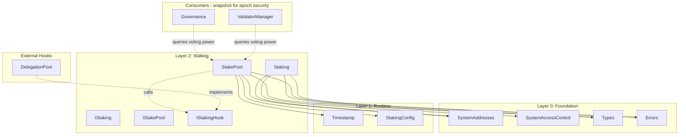

# Staking Layer Specification

## Overview

The Staking layer (Layer 2) provides generic staking infrastructure for Gravity. It is **decoupled from validator
management** — anyone can create a StakePool for any purpose (governance voting, delegation, validator bonding, etc.).

This design is inspired by Aptos's `stake.move` module but adapted for EVM with the following key differences:

- Individual StakePool contracts deployed via CREATE2 (not resources under addresses)
- Hook callback system for extensibility (delegation pools, custom logic)
- Staking is NOT validator-specific — validators use staking as a building block

### Contracts

| Contract           | Purpose                                       |
| ------------------ | --------------------------------------------- |
| `IStaking.sol`     | Factory interface                             |
| `Staking.sol`      | Factory that creates StakePools via CREATE2   |
| `IStakePool.sol`   | Individual pool interface                     |
| `StakePool.sol`    | Individual pool implementation                |
| `IStakingHook.sol` | Optional callback interface for extensibility |

---

## Design Philosophy

### Key Principles

1. **Anyone Can Create a Pool** — No permission required to create a StakePool
2. **Simple Lockup Model** — Single stake amount + lockup timestamp; immediate effect on voting power
3. **No Epoch Processing** — Staking layer is stateless w.r.t. epochs; consumers (e.g., ValidatorManager) snapshot if needed
4. **Role Separation** — Owner / Operator / Voter (like Aptos)
5. **Hook Extensibility** — Optional callbacks for delegation pools, rewards, etc.

### What This Layer Does

- Creates and manages individual StakePool contracts
- Tracks stake with lockup-based voting power (immediate effect)
- Provides voting power queries based on locked stake
- Enables extensibility via hook callbacks

### What Consumers Do (Not This Layer)

- **ValidatorManager** snapshots voting power at epoch boundaries for consensus security
- **Governance** may snapshot voting power at proposal creation

### What This Layer Does NOT Do

- Epoch-based stake transitions (no `onNewEpoch` processing)
- Voting power snapshots (consumers like ValidatorManager handle this)
- Validator management (handled by ValidatorManager in Layer 3)
- Governance voting logic (handled by Voting contract separately)
- Rewards distribution (consensus layer responsibility)
- Delegation accounting (external hook implementations)

---

## Architecture

```
src/staking/
├── IStaking.sol       # Factory interface
├── Staking.sol        # Factory implementation
├── IStakePool.sol     # Individual pool interface
├── StakePool.sol      # Individual pool implementation
└── IStakingHook.sol   # Optional callback interface
```

### Dependency Graph



---

## System Addresses

| Constant  | Address                                  | Description                |
| --------- | ---------------------------------------- | -------------------------- |
| `STAKING` | `0x0000000000000000000000000001625F2012` | StakePool factory contract |

---

## Simple Lockup Model

Each StakePool uses a simple lockup-based model with **immediate effect** on voting power:

```
┌─────────────────────────────────────────────────────────────────────────────┐
│                         STAKE STATE MODEL                                    │
└─────────────────────────────────────────────────────────────────────────────┘

                              ┌──────────────┐
                     addStake │              │
                   ──────────▶│    STAKE     │
                              │   (amount)   │
                              └──────┬───────┘
                                     │
                    ┌────────────────┼────────────────┐
                    │                │                │
                    ▼                ▼                ▼
             ┌───────────┐    ┌───────────┐    ┌───────────┐
             │  LOCKED   │    │ UNLOCKING │    │ UNLOCKED  │
             │           │    │           │    │           │
             │ lockedUntil│    │ lockedUntil│    │ lockedUntil│
             │  > now    │    │ > now but  │    │  <= now   │
             │           │    │ unlock     │    │           │
             │           │    │ requested  │    │           │
             └───────────┘    └───────────┘    └───────────┘
                    │                │                │
                    │                │                │
            Voting Power:     Voting Power:    Voting Power:
               stake            stake               0
                                                    │
                                                    ▼
                                              withdraw()
```

### State Variables

| Variable          | Type    | Description                            |
| ----------------- | ------- | -------------------------------------- |
| `stake`           | uint256 | Total staked amount                    |
| `lockedUntil`     | uint64  | Lockup expiration (microseconds)       |
| `unlockRequested` | uint256 | Amount requested to unlock (optional)  |

### Voting Power Calculation

```
votingPower = (lockedUntil > now) ? stake : 0
```

- **Immediate effect**: Stake changes affect voting power immediately
- **Lockup protection**: Only locked stake counts for voting power
- **Consumers snapshot**: ValidatorManager/Governance can snapshot at epoch/proposal creation for security

### State Transitions

**On `addStake(amount)`:**

- Increases `stake` by `amount` immediately
- Extends `lockedUntil` to `max(current, now + minLockupDuration)`
- Voting power increases immediately

**On `unlock(amount)`:**

- Sets `unlockRequested = amount` (marks intent to withdraw)
- Voting power unchanged until lockup expires
- Does NOT move stake to a separate bucket

**On `withdraw(amount)`:**

- Requires `lockedUntil <= now` (lockup expired)
- Decreases `stake` by `amount`
- Transfers tokens to owner

**On `increaseLockup(duration)`:**

- Extends `lockedUntil` by `duration`
- Voting power restored if it was zero (lockup was expired)

---

## Contract: `Staking.sol` (Factory)

### Purpose

Factory contract that creates individual StakePool contracts via CREATE2. Provides registry of all pools for queries.
**Security-critical:** Only pools created by this factory should be trusted by validators.

### State Variables

```solidity
/// @notice Array of all StakePool addresses
address[] internal _allPools;

/// @notice Mapping to check if an address is a valid pool (SECURITY CRITICAL)
mapping(address => bool) internal _isPool;

/// @notice Counter for CREATE2 salt (increments with each pool created)
uint256 public poolNonce;
```

### Interface

```solidity
interface IStaking {
    // === Events ===
    event PoolCreated(address indexed creator, address indexed pool, address indexed owner, uint256 poolIndex);

    // === Pool Registry (View) ===
    function isPool(address pool) external view returns (bool);
    function getPool(uint256 index) external view returns (address);
    function computePoolAddress(uint256 nonce) external view returns (address);
    function getAllPools() external view returns (address[] memory);
    function getPoolCount() external view returns (uint256);
    function getPoolNonce() external view returns (uint256);
    function getMinimumStake() external view returns (uint256);

    // === Pool Status Queries (for Validators) ===
    function getPoolVotingPower(address pool) external view returns (uint256);
    function getPoolStake(address pool) external view returns (uint256);
    function getPoolOwner(address pool) external view returns (address);
    function getPoolVoter(address pool) external view returns (address);
    function getPoolOperator(address pool) external view returns (address);
    function getPoolLockedUntil(address pool) external view returns (uint64);
    function isPoolLocked(address pool) external view returns (bool);

    // === State-Changing Functions ===
    function createPool(address owner) external payable returns (address pool);
}
```

### Function Specifications

#### `isPool(address pool)` — **SECURITY CRITICAL**

Check if an address is a valid pool created by this factory.

**Behavior:**

- Returns `true` if `_isPool[pool]` is true
- Returns `false` otherwise

**Security Note:** Validators MUST use this function to verify pools before trusting their voting power.
Only pools that return `true` should be used in consensus calculations.

#### `createPool(address owner)`

Create a new StakePool with specified owner. Anyone can create multiple pools.

**Behavior:**

1. Revert if `msg.value < minimumStake` (prevents spam)
2. Increment `poolNonce`
3. Compute deterministic address via CREATE2 (salt = `poolNonce`)
4. Deploy new StakePool contract with `owner` and initial stake (`msg.value`)
5. Add to `_allPools` array
6. Set `_isPool[pool] = true` (registers as valid pool)
7. Emit `PoolCreated` event with creator, pool, owner, and pool index
8. Return pool address

**Notes:**

- Anyone can call this function (no restriction on caller)
- Anyone can create multiple pools (no limit per address)
- The `owner` parameter sets who controls the pool
- Initial stake (`msg.value`) becomes the pool's stake immediately
- `minimumStake` is configured in `StakingConfig`

#### `computePoolAddress(uint256 nonce)`

Compute the deterministic address for a pool at given nonce without deploying.

**Behavior:**

- Uses CREATE2 address calculation with `nonce` as salt
- Returns the address that would be deployed for that nonce

#### Pool Status Query Functions

All pool status query functions revert with `InvalidPool(pool)` if the pool address is not valid.

| Function | Returns |
| --- | --- |
| `getPoolVotingPower(pool)` | Pool's voting power (stake if locked, 0 if unlocked) |
| `getPoolStake(pool)` | Pool's total staked amount |
| `getPoolOwner(pool)` | Pool's owner address |
| `getPoolVoter(pool)` | Pool's delegated voter address |
| `getPoolOperator(pool)` | Pool's operator address |
| `getPoolLockedUntil(pool)` | Pool's lockup expiration (microseconds) |
| `isPoolLocked(pool)` | Whether pool's stake is locked |

---

## Contract: `StakePool.sol`

### Purpose

Individual stake pool contract. Each user who wants to stake creates their own StakePool.

### State Variables

```solidity
/// @notice Address of the Staking factory
address public immutable FACTORY;

/// @notice Owner address (controls funds, can set operator/voter)
address public owner;

/// @notice Operator address (can operate pool for validator integration)
address public operator;

/// @notice Delegated voter address (votes in governance using this pool's stake)
address public voter;

/// @notice Total staked amount
uint256 public stake;

/// @notice Lockup expiration timestamp (microseconds)
uint64 public lockedUntil;

/// @notice Optional hook contract for callbacks
address public hook;
```

### Interface

```solidity
interface IStakePool {
    // === Events ===
    event StakeAdded(address indexed pool, uint256 amount);
    event StakeWithdrawn(address indexed pool, uint256 amount);
    event LockupIncreased(address indexed pool, uint64 oldLockedUntil, uint64 newLockedUntil);
    event OperatorChanged(address indexed pool, address oldOperator, address newOperator);
    event VoterChanged(address indexed pool, address oldVoter, address newVoter);
    event HookChanged(address indexed pool, address oldHook, address newHook);

    // === View Functions ===
    function getOwner() external view returns (address);
    function getOperator() external view returns (address);
    function getVoter() external view returns (address);
    function getStake() external view returns (uint256);
    function getVotingPower() external view returns (uint256);
    function getLockedUntil() external view returns (uint64);
    function getRemainingLockup() external view returns (uint64);
    function isLocked() external view returns (bool);
    function getHook() external view returns (address);

    // === Owner Functions ===
    function addStake() external payable;
    function withdraw(uint256 amount) external;
    function increaseLockup(uint64 durationMicros) external;
    function setOperator(address newOperator) external;
    function setVoter(address newVoter) external;
    function setHook(address newHook) external;
}
```

### Role Separation

Following Aptos's design, three roles control different aspects of a StakePool:

| Role         | Controlled By      | Can Do                                                              |
| ------------ | ------------------ | ------------------------------------------------------------------- |
| **Owner**    | `owner` address    | Add/unlock/withdraw stake, set operator/voter/hook, increase lockup |
| **Operator** | `operator` address | Reserved for validator operations (future integration)              |
| **Voter**    | `voter` address    | Cast governance votes using pool's voting power                     |

Initially, all three roles default to the pool creator (owner).

### Function Specifications

#### `addStake()`

Add native tokens to the stake pool. Voting power increases immediately.

**Access Control:** Only `owner`

**Behavior:**

1. Revert if `msg.value == 0`
2. Increase `stake` by `msg.value`
3. Update lockup: `lockedUntil = max(lockedUntil, now + minLockupDuration)`
4. Call hook if set: `hook.onStakeAdded(msg.value)`
5. Emit `StakeAdded` event

#### `withdraw(uint256 amount)`

Withdraw stake. Only allowed when lockup has expired.

**Access Control:** Only `owner`

**Behavior:**

1. Revert if `lockedUntil > now` (lockup not expired)
2. Revert if `amount == 0`
3. Revert if `amount > stake`
4. Decrease `stake` by `amount`
5. Call hook if set: `hook.onStakeWithdrawn(amount)`
6. Transfer `amount` to `owner`
7. Emit `StakeWithdrawn` event

#### `increaseLockup(uint64 durationMicros)`

Extend lockup by a specified duration to maintain or restore voting power.

**Access Control:** Only `owner`

**Behavior:**

1. Revert if `durationMicros < minLockupDuration` (from StakingConfig)
2. Calculate `newLockedUntil = lockedUntil + durationMicros`
3. Revert if `newLockedUntil <= lockedUntil` (overflow protection)
4. Update `lockedUntil = newLockedUntil`
5. Call hook if set: `hook.onLockupIncreased(newLockedUntil)`
6. Emit `LockupIncreased` event

**Notes:**

- The `durationMicros` parameter specifies how much time to ADD to the current lockup
- Must be at least `minLockupDuration` (configured in StakingConfig)
- This is additive: extends from current `lockedUntil`, not from `now`
- Can be used to restore voting power if lockup has expired

#### `setOperator(address newOperator)`

Change the operator address.

**Access Control:** Only `owner`

**Behavior:**

1. Store old operator
2. Set `operator = newOperator`
3. Emit `OperatorChanged` event

#### `setVoter(address newVoter)`

Change the delegated voter address.

**Access Control:** Only `owner`

**Behavior:**

1. Store old voter
2. Set `voter = newVoter`
3. Emit `VoterChanged` event

#### `setHook(address newHook)`

Set or change the hook contract for callbacks.

**Access Control:** Only `owner`

**Behavior:**

1. Store old hook
2. Set `hook = newHook`
3. Emit `HookChanged` event

#### `getVotingPower()`

Returns current voting power. Immediate effect based on lockup status.

**Behavior:**

- Returns `stake` if `lockedUntil > now` (locked)
- Returns `0` if `lockedUntil <= now` (unlocked)

#### `isLocked()`

Check if pool's stake is currently locked.

**Behavior:**

- Returns `true` if `lockedUntil > now`
- Returns `false` otherwise

---

## Contract: `IStakingHook.sol`

### Purpose

Optional callback interface for extensibility. Hook contracts can implement custom logic that executes during stake
lifecycle events.

### Interface

```solidity
interface IStakingHook {
    /// @notice Called when stake is added to the pool
    /// @param amount Amount of stake added
    function onStakeAdded(uint256 amount) external;

    /// @notice Called when stake is withdrawn
    /// @param amount Amount of stake withdrawn
    function onStakeWithdrawn(uint256 amount) external;

    /// @notice Called when lockup is increased
    /// @param newLockedUntil New lockup expiration timestamp
    function onLockupIncreased(uint64 newLockedUntil) external;
}
```

### Use Cases

Hooks are set by pool owners for their own custom logic:

1. **Delegation Pool** — Pool owner runs a delegation service; hook tracks delegator shares and distributes rewards proportionally among delegators
2. **Staking Vault** — DeFi protocol uses hook to mint/burn liquid staking tokens when users stake/withdraw
3. **Notification Service** — Pool owner wants external contract notified of stake changes for analytics or integrations
4. **Vesting Contract** — Employer creates pool for employee; hook enforces vesting schedule on withdrawals

---

## Epoch Security (Consumer Responsibility)

The staking module itself has **no epoch processing**. Stake changes take effect immediately.

For epoch-based security (e.g., preventing flash-loan attacks on consensus), **consumers snapshot voting power**:

```
┌─────────────────────────────────────────────────────────────────────────────┐
│                      CONSUMER SNAPSHOT PATTERN                               │
└─────────────────────────────────────────────────────────────────────────────┘

  ValidatorManager                              StakePool(s)
       │                                             │
       │ At epoch boundary:                          │
       │ snapshot voting power for each validator    │
       │─────────────────────────────────────────────▶│
       │                                             │
       │            getVotingPower()                 │
       │◀─────────────────────────────────────────────│
       │                                             │
       │ Store snapshot for epoch N                  │
       │ Use snapshot for consensus this epoch       │
       │                                             │
```

### Why This Design

1. **Scalability** — No O(n) iteration over all pools at epoch boundary
2. **Simplicity** — Staking is stateless w.r.t. epochs
3. **Flexibility** — Different consumers can snapshot at different times (epoch start, proposal creation, etc.)
4. **Security** — ValidatorManager snapshots ensure consensus uses stable voting power

---

## Lockup Model

### Lockup Configuration

Lockup parameters are configured in `StakingConfig`:

- `minLockupDuration` — Minimum lockup extension allowed (e.g., 14 days in microseconds)
- `maxLockupDuration` — Maximum total lockup allowed (e.g., 365 days in microseconds)

### Lockup Behavior

1. **On createPool**: `lockedUntil = now + minLockupDuration` (initial lockup)
2. **On addStake**: `lockedUntil = max(current, now + minLockupDuration)` (extends if needed)
3. **On increaseLockup(duration)**: `lockedUntil = lockedUntil + duration` (additive, duration >= minLockupDuration)

### Lockup and Withdrawals

- Withdrawals require `lockedUntil <= now` (lockup expired)
- Owner can re-lock by calling `increaseLockup()` to restore voting power
- No automatic lockup renewal — owner must explicitly extend

---

## Access Control

| Contract  | Function                     | Allowed Callers         |
| --------- | ---------------------------- | ----------------------- |
| Staking   | createPool                   | Anyone (with min stake) |
| Staking   | view functions               | Anyone                  |
| StakePool | addStake/withdraw            | Owner only              |
| StakePool | increaseLockup               | Owner only              |
| StakePool | setOperator/setVoter/setHook | Owner only              |
| StakePool | view functions               | Anyone                  |

---

## Time Convention

All time values use **microseconds** (uint64), consistent with the Timestamp contract:

- `StakePool.lockedUntil` — microseconds
- `StakingConfig.lockupDurationMicros` — microseconds

---

## Errors

The following errors from `Errors.sol` are used:

### Staking Factory Errors

| Error                                                   | When                                     |
| ------------------------------------------------------- | ---------------------------------------- |
| `InsufficientStakeForPoolCreation(uint256 sent, uint256 required)` | msg.value < minimumStake on createPool |
| `PoolIndexOutOfBounds(uint256 index, uint256 total)`    | Querying pool at invalid index           |
| `InvalidPool(address pool)`                              | Pool status query on non-factory pool   |

### StakePool Errors

| Error                                                     | When                                        |
| --------------------------------------------------------- | ------------------------------------------- |
| `ZeroAmount()`                                            | addStake/withdraw with 0                    |
| `NotOwner(address caller, address owner)`                 | Non-owner calling owner-only function       |
| `LockupNotExpired(uint64 lockedUntil, uint64 now)`        | Withdraw while still locked                 |
| `LockupDurationTooShort(uint64 provided, uint64 minimum)` | increaseLockup duration < minLockupDuration |
| `LockupOverflow(uint64 current, uint64 addition)`         | increaseLockup would overflow lockedUntil   |
| `InsufficientStake(uint256 requested, uint256 available)` | Withdraw more than available                |

---

## Usage Patterns

### Creating a StakePool and Staking

```solidity
// 1. Create a stake pool with initial stake (must meet minimum)
address pool = staking.createPool{value: 100 ether}(msg.sender);

// 2. Add more stake later (voting power increases immediately)
IStakePool(pool).addStake{value: 50 ether}();

// 3. Check voting power (150 ether if locked)
uint256 power = IStakePool(pool).getVotingPower();

// 4. Delegate voting to another address
IStakePool(pool).setVoter(delegatee);

// 5. Extend lockup by 30 days (must be >= minLockupDuration)
IStakePool(pool).increaseLockup(30 days * 1_000_000); // microseconds

// 6. Wait for lockup to expire, then withdraw
// (voting power becomes 0 when lockup expires)
IStakePool(pool).withdraw(50 ether);
```

### Creating Multiple Pools

```solidity
// Anyone can create multiple pools
address pool1 = staking.createPool{value: 100 ether}(msg.sender);
address pool2 = staking.createPool{value: 100 ether}(msg.sender);
address pool3 = staking.createPool{value: 100 ether}(someOtherOwner);

// Each pool has a unique address based on poolNonce
// Pool addresses are deterministic: computePoolAddress(nonce)
```

### Setting Up a Delegation Pool

```solidity
// 1. Create stake pool with initial stake
address pool = staking.createPool{value: 100 ether}(msg.sender);

// 2. Deploy delegation hook
DelegationHook hook = new DelegationHook(pool);

// 3. Set hook on pool
IStakePool(pool).setHook(address(hook));

// 4. Now delegators interact with hook contract
hook.delegate{value: 10 ether}();
```

### Validator Creating a Pool for Bonding

```solidity
// Validator creates their own pool for bonding
address validatorPool = staking.createPool{value: minBond}(msg.sender);

// Validator can add more stake later
IStakePool(validatorPool).addStake{value: additionalBond}();

// ValidatorManager queries the pool's voting power for consensus
uint256 bondAmount = IStakePool(validatorPool).getVotingPower();
```

---

## Testing Requirements

### Unit Tests

1. **Staking Factory**

   - createPool creates new pool with initial stake
   - createPool reverts if msg.value < minimumStake
   - createPool allows same owner to create multiple pools
   - computePoolAddress matches deployed address for given nonce
   - poolNonce increments correctly

2. **StakePool**

   - addStake increases stake and extends lockup
   - addStake voting power increases immediately
   - withdraw works only when lockup expired
   - withdraw reverts when locked
   - getVotingPower returns stake when locked, 0 when unlocked
   - increaseLockup extends by specified duration
   - increaseLockup reverts if duration < minLockupDuration
   - Role separation (owner/operator/voter)
   - Hook callbacks fire correctly

3. **Lockup Model**
   - Voting power = stake when locked
   - Voting power = 0 when lockup expires
   - Lockup extended on addStake
   - Lockup extended on increaseLockup

### Fuzz Tests

1. Various stake amounts
2. Various lockup durations
3. Multiple pools with concurrent operations

### Invariant Tests

1. `votingPower == (lockedUntil > now ? stake : 0)` for each pool
2. Withdrawals only succeed when `lockedUntil <= now`
3. Lockup only increases, never decreases (except by time passing)

---

## Security Considerations

1. **Reentrancy** — All withdrawals use checks-effects-interactions pattern
2. **Flash Loan Protection** — Lockup period prevents flash-stake attacks for governance
3. **Epoch Security** — ValidatorManager snapshots voting power at epoch boundaries for consensus
4. **Integer Overflow** — Solidity 0.8+ built-in protection
5. **CREATE2 Collision** — Salt is poolNonce, deterministic and unique
6. **Hook Trust** — Hooks are set by owner; malicious hooks can't steal funds (only receive callbacks)
7. **Role Separation** — Clear separation prevents unauthorized operations
8. **Immediate Effect Trade-off** — Stake changes are immediate; consumers must snapshot for epoch-based security

---

## Future Extensions

- **Operator Functions** — Expose operator-callable functions for validator integration
- **Partial Voting** — Split voting power across multiple votes
- **Commission** — Built-in commission support for delegation pools via hooks
- **Time-Weighted Voting** — Bonus voting power for longer lockup periods
