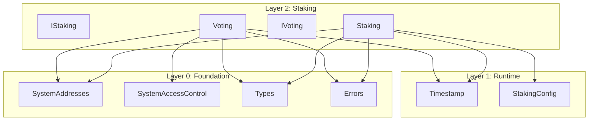

# Staking Layer Specification

## Overview

The Staking layer (Layer 2) provides governance staking and voting infrastructure for Gravity. It includes two core
contracts:

- **Staking.sol** — Generic governance staking (anyone can stake tokens to participate in governance)
- **Voting.sol** — Generic proposal/vote/resolve engine for governance

## Design Philosophy

### Key Principles

1. **Anyone Can Stake** — Unlike validator-only staking, governance staking is open to all token holders
2. **Lockup-Only Model** — Stake lockup serves as the unbonding protection (no separate unbonding period)
3. **Voting Power = Locked Stake** — Only locked stake counts for voting power
4. **Generic Voting Engine** — Voting.sol is a reusable primitive for governance proposals

### What We Do

- Governance staking with lockup periods
- Voting power calculation based on locked stake
- Proposal creation, voting, and resolution
- Early resolution when threshold is exceeded

### What We Don't Do

- Validator bonding (handled by ValidatorManager in Layer 3)
- Delegation (external — validators implement their own staking pools)
- Rewards distribution (consensus layer responsibility)

---

## Architecture

```
src/staking/
├── IStaking.sol    # Interface for governance staking
├── Staking.sol     # Implementation
├── IVoting.sol     # Interface for voting engine
└── Voting.sol      # Implementation
```

### Dependency Graph



---

## System Addresses

| Constant | Address | Description |
|----------|---------|-------------|
| `STAKING` | `0x0000000000000000000000000001625F2012` | Governance staking contract |
| `VOTING` | `0x0000000000000000000000000001625F2014` | Voting engine contract |

---

## Contract: `Staking.sol`

### Purpose

Generic staking contract for governance participation. Anyone can stake native tokens to gain voting power.

### Lockup-Only Model

The key design decision is the **lockup-only** unstake model:

1. **Staking** creates/extends lockup to `now + lockupDurationMicros`
2. **Voting power** = stake amount **only if** `lockedUntil > now`
3. **Unstake/withdraw** only allowed when `lockedUntil <= now`

This is simpler than a two-step model (request → wait → claim) while still providing:
- Protection against flash-unstake after voting
- Predictable voting power (locked stake = voting power)

### State Variables

```solidity
/// @notice Mapping of staker address to their stake position
mapping(address => StakePosition) internal _stakes;

/// @notice Total staked tokens across all stakers
uint256 public totalStaked;
```

### StakePosition Struct

```solidity
struct StakePosition {
    uint256 amount;        // Staked token amount
    uint64 lockedUntil;    // Lockup expiration (microseconds)
    uint64 stakedAt;       // When stake was first deposited (microseconds)
}
```

### Interface

```solidity
interface IStaking {
    // === Events ===
    event Staked(address indexed staker, uint256 amount, uint64 lockedUntil);
    event Unstaked(address indexed staker, uint256 amount);
    event LockupExtended(address indexed staker, uint64 newLockedUntil);

    // === View Functions ===
    function getStake(address staker) external view returns (StakePosition memory);
    function getVotingPower(address staker) external view returns (uint256);
    function getTotalStaked() external view returns (uint256);
    function isLocked(address staker) external view returns (bool);

    // === State-Changing Functions ===
    function stake() external payable;
    function unstake(uint256 amount) external;
    function withdraw() external;
    function extendLockup() external;
}
```

### Function Specifications

#### `stake()`

Stake native tokens for governance participation.

**Behavior:**
1. Revert if `msg.value == 0`
2. If new position, set `stakedAt = now`
3. Add `msg.value` to `amount`
4. Extend `lockedUntil` to `max(current, now + lockupDuration)`
5. Update `totalStaked`
6. Emit `Staked` event

#### `unstake(uint256 amount)`

Withdraw a specific amount (only when lockup expired).

**Behavior:**
1. Revert if no stake position
2. Revert if `amount == 0`
3. Revert if `amount > stake.amount`
4. Revert if `lockedUntil > now`
5. Decrease stake amount
6. Update `totalStaked`
7. Transfer tokens to caller
8. Emit `Unstaked` event

#### `withdraw()`

Convenience function to withdraw entire stake.

**Behavior:**
- Same as `unstake(stake.amount)`

#### `extendLockup()`

Extend lockup to maintain voting power.

**Behavior:**
1. Revert if no stake position
2. Calculate `newLockedUntil = now + lockupDuration`
3. Revert if `newLockedUntil <= current lockedUntil`
4. Update `lockedUntil`
5. Emit `LockupExtended` event

#### `getVotingPower(address staker)`

Returns voting power for governance.

**Behavior:**
- Returns `stake.amount` if `lockedUntil > now`
- Returns `0` if lockup expired or no position

---

## Contract: `Voting.sol`

### Purpose

Generic proposal/vote/resolve engine used by governance contracts.

### State Variables

```solidity
/// @notice Next proposal ID to be assigned
uint64 public nextProposalId;

/// @notice Mapping of proposal ID to proposal data
mapping(uint64 => Proposal) internal _proposals;

/// @notice Early resolution threshold
uint128 public earlyResolutionThreshold;
```

### Proposal Struct

```solidity
struct Proposal {
    uint64 id;
    address proposer;
    bytes32 executionHash;
    string metadataUri;
    uint64 creationTime;        // microseconds
    uint64 expirationTime;      // microseconds
    uint128 minVoteThreshold;
    uint128 yesVotes;
    uint128 noVotes;
    bool isResolved;
    uint64 resolutionTime;      // microseconds
}
```

### Interface

```solidity
interface IVoting {
    // === Events ===
    event ProposalCreated(uint64 indexed proposalId, address indexed proposer, bytes32 executionHash);
    event VoteCast(uint64 indexed proposalId, address indexed voter, bool support, uint128 votingPower);
    event ProposalResolved(uint64 indexed proposalId, ProposalState state);

    // === View Functions ===
    function getProposal(uint64 proposalId) external view returns (Proposal memory);
    function getProposalState(uint64 proposalId) external view returns (ProposalState);
    function isVotingClosed(uint64 proposalId) external view returns (bool);
    function canBeResolvedEarly(uint64 proposalId) external view returns (bool);
    function getNextProposalId() external view returns (uint64);
    function getEarlyResolutionThreshold() external view returns (uint128);

    // === State-Changing Functions ===
    function createProposal(
        address proposer,
        bytes32 executionHash,
        string calldata metadataUri,
        uint128 minVoteThreshold,
        uint64 votingDurationMicros
    ) external returns (uint64 proposalId);

    function vote(uint64 proposalId, address voter, uint128 votingPower, bool support) external;
    function resolve(uint64 proposalId) external returns (ProposalState);
    function setEarlyResolutionThreshold(uint128 threshold) external;
}
```

### ProposalState Enum

```solidity
enum ProposalState {
    PENDING,    // 0: Voting active
    SUCCEEDED,  // 1: Passed, ready to execute
    FAILED,     // 2: Did not pass
    EXECUTED,   // 3: Already executed (resolved + passed)
    CANCELLED   // 4: Cancelled
}
```

### Function Specifications

#### `createProposal(...)`

Create a new governance proposal.

**Behavior:**
1. Assign next proposal ID
2. Create proposal with given parameters
3. Set `creationTime = now`
4. Set `expirationTime = now + votingDurationMicros`
5. Emit `ProposalCreated` event
6. Return proposal ID

#### `vote(...)`

Cast a vote on a proposal.

**Behavior:**
1. Revert if proposal doesn't exist
2. Revert if voting is closed
3. Add `votingPower` to `yesVotes` or `noVotes` based on `support`
4. Emit `VoteCast` event

#### `resolve(uint64 proposalId)`

Resolve a proposal after voting ends.

**Behavior:**
1. Revert if proposal doesn't exist
2. Revert if already resolved
3. Revert if voting period not ended AND not eligible for early resolution
4. Mark as resolved
5. Set `resolutionTime = now`
6. Emit `ProposalResolved` event
7. Return final state

#### `getProposalState(...)`

Determine current proposal state.

**Logic:**
1. If resolved and passed: `EXECUTED`
2. If resolved and failed: `FAILED`
3. If not expired: `PENDING`
4. If expired and passed: `SUCCEEDED`
5. If expired and failed: `FAILED`

**Pass Condition:**
- `yesVotes > noVotes` AND `yesVotes + noVotes >= minVoteThreshold`

---

## Access Control

| Contract | Function | Allowed Callers |
|----------|----------|-----------------|
| Staking | stake/unstake/withdraw/extendLockup | Anyone |
| Staking | view functions | Anyone |
| Voting | createProposal | Anyone (via governance contract) |
| Voting | vote | Anyone (via governance contract) |
| Voting | resolve | Anyone |
| Voting | setEarlyResolutionThreshold | TIMELOCK only |

---

## Time Convention

All time values use **microseconds** (uint64), consistent with the Timestamp contract:

- `StakePosition.lockedUntil` — microseconds
- `StakePosition.stakedAt` — microseconds
- `Proposal.creationTime` — microseconds
- `Proposal.expirationTime` — microseconds
- `Proposal.resolutionTime` — microseconds
- `votingDurationMicros` parameter — microseconds

---

## Errors

The following errors from `Errors.sol` are used:

### Staking Errors

| Error | When |
|-------|------|
| `ZeroAmount()` | stake/unstake with 0 |
| `NoStakePosition(address)` | unstake/withdraw/extend with no stake |
| `InsufficientStake(required, actual)` | unstake more than available |
| `LockupNotExpired(lockedUntil, currentTime)` | unstake/withdraw before lockup expires |

### Voting Errors

| Error | When |
|-------|------|
| `ProposalNotFound(proposalId)` | accessing non-existent proposal |
| `VotingPeriodEnded(expirationTime)` | voting after expiration |
| `VotingPeriodNotEnded(expirationTime)` | resolving before expiration |
| `ProposalAlreadyResolved(proposalId)` | resolving twice |

---

## Usage Patterns

### Staking for Governance

```solidity
// 1. Stake tokens
staking.stake{value: 100 ether}();

// 2. Check voting power
uint256 power = staking.getVotingPower(msg.sender); // 100 ether

// 3. Extend lockup to maintain voting power
staking.extendLockup();

// 4. After lockup expires, withdraw
staking.withdraw();
```

### Creating and Voting on Proposals

```solidity
// 1. Create proposal
uint64 proposalId = voting.createProposal(
    msg.sender,
    executionHash,
    "ipfs://...",
    100 ether,        // min threshold
    7 days * 1_000_000 // voting duration (microseconds)
);

// 2. Cast votes
voting.vote(proposalId, voter, votingPower, true); // yes vote

// 3. After voting ends, resolve
ProposalState state = voting.resolve(proposalId);
```

---

## Testing Requirements

### Unit Tests

1. **Staking**
   - Stake creates new position
   - Stake adds to existing position
   - Stake extends lockup
   - Voting power = stake when locked
   - Voting power = 0 when expired
   - Unstake works after lockup
   - Unstake reverts when locked
   - Withdraw works after lockup
   - ExtendLockup extends correctly

2. **Voting**
   - Create proposal assigns ID
   - Vote accumulates correctly
   - Proposal state transitions
   - Resolve works after expiration
   - Early resolution with threshold
   - Proper event emission

### Fuzz Tests

1. **Staking**
   - Various stake amounts
   - Multiple stakers
   - Unstake after lockup

2. **Voting**
   - Various vote thresholds
   - Multiple proposals
   - Various vote distributions

---

## Security Considerations

1. **Reentrancy** — `unstake()` and `withdraw()` use checks-effects-interactions pattern
2. **Voting Power Manipulation** — Only locked stake counts for voting
3. **Flash Loan Protection** — Lockup period prevents flash-stake attacks
4. **Integer Overflow** — Solidity 0.8+ built-in protection
5. **Access Control** — `setEarlyResolutionThreshold` restricted to TIMELOCK

---

## Future Extensions

- **Delegation** — Allow delegating voting power to another address
- **Vote Snapshots** — Snapshot voting power at proposal creation
- **Quadratic Voting** — Alternative voting power calculation
- **Time-Weighted Voting** — Bonus for longer lockup periods

