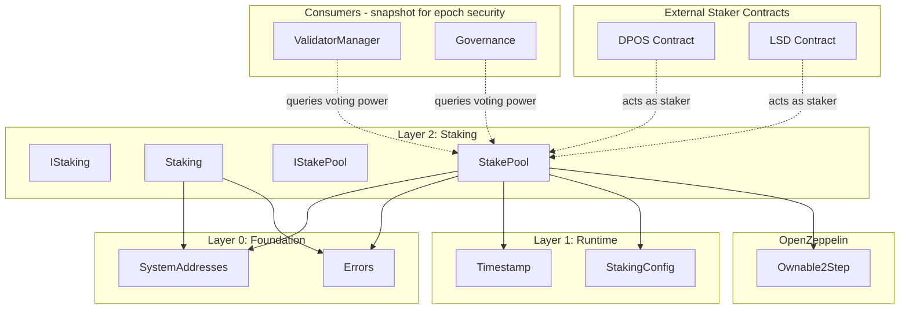
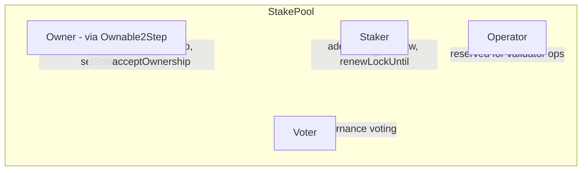

# Staking Layer Specification

## Overview

The Staking layer (Layer 2) provides generic staking infrastructure for Gravity. It is **decoupled from validator
management** — anyone can create a StakePool for any purpose (governance voting, delegation, validator bonding, etc.).

This design is inspired by Aptos's `stake.move` module but adapted for EVM with the following key differences:

- Individual StakePool contracts deployed via CREATE2 (not resources under addresses)
- Two-role separation (Owner/Staker) enables composable staking logic (DPOS, LSD, etc.)
- Staking is NOT validator-specific — validators use staking as a building block

### Contracts

| Contract         | Purpose                                     |
| ---------------- | ------------------------------------------- |
| `IStaking.sol`   | Factory interface                           |
| `Staking.sol`    | Factory that creates StakePools via CREATE2 |
| `IStakePool.sol` | Individual pool interface                   |
| `StakePool.sol`  | Individual pool implementation              |

---

## Design Philosophy

### Key Principles

1. **Anyone Can Create a Pool** — No permission required to create a StakePool
2. **Queue-Based Withdrawals** — Withdrawals are queued and become claimable when lockup expires
3. **Time-Parameterized Voting Power** — Voting power can be queried at any time T
4. **No Epoch Processing** — Staking layer is stateless w.r.t. epochs; consumers (e.g., ValidatorManager) snapshot if needed
5. **Two-Role Separation** — Owner (admin) / Staker (funds) / Operator / Voter
6. **Composable Staking** — Staker role can be a smart contract for DPOS, LSD, etc.

### What This Layer Does

- Creates and manages individual StakePool contracts
- Tracks stake with lockup-based voting power (immediate effect)
- Provides voting power queries based on locked stake
- Enables composable staking via the staker role

### What Consumers Do (Not This Layer)

- **ValidatorManager** snapshots voting power at epoch boundaries for consensus security
- **Governance** may snapshot voting power at proposal creation

### What This Layer Does NOT Do

- Epoch-based stake transitions (no `onNewEpoch` processing)
- Voting power snapshots (consumers like ValidatorManager handle this)
- Validator management (handled by ValidatorManager in Layer 3)
- Governance voting logic (handled by Voting contract separately)
- Rewards distribution (consensus layer responsibility)
- Delegation accounting (external staker contract implementations)

---

## Architecture

```
src/staking/
├── IStaking.sol       # Factory interface
├── Staking.sol        # Factory implementation
├── IStakePool.sol     # Individual pool interface
└── StakePool.sol      # Individual pool implementation (inherits Ownable2Step)
```

### Dependency Graph



---

## System Addresses

| Constant  | Address                                  | Description                |
| --------- | ---------------------------------------- | -------------------------- |
| `STAKING` | `0x0000000000000000000000000001625F2012` | StakePool factory contract |

---

## Two-Role Separation

Each StakePool implements a two-role separation pattern:



### Role Definitions

| Role       | Controlled By      | Can Do                                                          |
| ---------- | ------------------ | --------------------------------------------------------------- |
| **Owner**  | `Ownable2Step`     | Set voter/operator/staker, transfer ownership (2-step process)  |
| **Staker** | `staker` address   | Add stake, withdraw, renew lockup (can be a smart contract)     |
| **Operator** | `operator` address | Reserved for validator operations (future integration)          |
| **Voter**  | `voter` address    | Cast governance votes using pool's voting power                 |

### Ownership Transfer (Ownable2Step)

StakePool inherits from OpenZeppelin's `Ownable2Step` for secure ownership transfers:

1. Current owner calls `transferOwnership(newOwner)` — sets pending owner
2. New owner calls `acceptOwnership()` — completes transfer

This prevents accidental transfers to wrong addresses.

### Staker as Smart Contract

The staker role enables composable staking:

```solidity
// Example: DPOS contract as staker (queue-based withdrawals)
contract DPOSStaker {
    IStakePool public pool;
    mapping(address => uint256) public shares;
    mapping(address => uint256[]) public delegatorWithdrawals; // nonces
    
    function delegatedStake() external payable {
        // Track delegator shares
        shares[msg.sender] += msg.value;
        
        // Forward to pool (this contract is the staker)
        pool.addStake{value: msg.value}();
    }
    
    function requestDelegatedWithdraw(uint256 amount) external returns (uint256 nonce) {
        require(shares[msg.sender] >= amount);
        shares[msg.sender] -= amount;
        
        // Request withdrawal (queued until lockup expires)
        nonce = pool.requestWithdrawal(amount);
        delegatorWithdrawals[msg.sender].push(nonce);
    }
    
    function claimDelegatedWithdraw(uint256 nonce) external {
        // Claim and transfer to delegator
        pool.claimWithdrawal(nonce, msg.sender);
    }
}
```

---

## Queue-Based Withdrawal Model

Each StakePool uses a queue-based withdrawal model with time-parameterized voting power:

```
┌─────────────────────────────────────────────────────────────────────────────┐
│                      STAKE STATE MODEL (Queue-Based)                         │
└─────────────────────────────────────────────────────────────────────────────┘

                              ┌──────────────┐
                     addStake │              │
                   ──────────▶│    STAKE     │
                              │   (amount)   │
                              └──────┬───────┘
                                     │
                    ┌────────────────┼────────────────┐
                    │                                 │
                    ▼                                 ▼
             ┌───────────┐                     ┌───────────────┐
             │  LOCKED   │ requestWithdrawal  │   PENDING     │
             │           │ ─────────────────▶ │  WITHDRAWALS  │
             │ lockedUntil│                   │  (queue)      │
             │  > now    │                    └───────────────┘
             └───────────┘                           │
                    │                                │
            Voting Power:                    claimWithdrawal (when claimableTime <= now)
    stake - ineffectivePending                       │
                                                     ▼
                                              Tokens transferred
```

### State Variables

| Variable                  | Type                              | Description                                 |
| ------------------------- | --------------------------------- | ------------------------------------------- |
| `stake`                   | uint256                           | Total staked amount (includes pending)      |
| `lockedUntil`             | uint64                            | Lockup expiration (microseconds)            |
| `pendingWithdrawals`      | mapping(uint256 => PendingWithdrawal) | Pending withdrawal queue by nonce      |
| `withdrawalNonce`         | uint256                           | Next nonce to assign                        |
| `totalPendingWithdrawals` | uint256                           | Sum of all pending amounts                  |

### PendingWithdrawal Struct

```solidity
struct PendingWithdrawal {
    uint256 amount;       // Amount to withdraw
    uint64 claimableTime; // = lockedUntil at request time
}
```

### Voting Power Calculation

```solidity
function getVotingPower(uint64 atTime) returns (uint256) {
    if (lockedUntil <= atTime) return 0;
    
    // Calculate ineffective pending (where claimableTime - atTime < minLockupDuration)
    uint256 ineffective = _getIneffectivePendingAmountAt(atTime, minLockupDuration);
    
    if (ineffective >= stake) return 0;
    return stake - ineffective;
}
```

- **Time-parameterized**: Can query voting power at any time T
- **Pending withdrawals**: Reduce effective voting power when nearing claimable time
- **Lockup protection**: Main stake must be locked for any voting power

### State Transitions

**On `addStake(amount)` (staker only):**

- Increases `stake` by `amount` immediately
- Extends `lockedUntil` to `max(current, now + minLockupDuration)`
- Voting power increases immediately

**On `requestWithdrawal(amount)` (staker only):**

- Creates pending withdrawal entry with `claimableTime = lockedUntil`
- For validators: verifies effective stake after withdrawal >= minimumBond
- Increments `withdrawalNonce` and returns nonce
- Increases `totalPendingWithdrawals`
- Does NOT reduce `stake` until claimed

**On `claimWithdrawal(nonce, recipient)` (staker only):**

- Requires `claimableTime <= now` for the pending withdrawal
- Decreases `stake` by pending amount
- Decreases `totalPendingWithdrawals`
- Deletes pending entry
- Transfers tokens to specified `recipient`

**On `renewLockUntil(duration)` (staker only):**

- Extends `lockedUntil` by `duration`
- Validates result: `newLockedUntil >= now + minLockupDuration`
- Does NOT affect existing pending withdrawals

---

## Contract: `Staking.sol` (Factory)

### Purpose

Factory contract that creates individual StakePool contracts via CREATE2. Provides registry of all pools for queries.
**Security-critical:** Only pools created by this factory should be trusted by validators.

### State Variables

```solidity
/// @notice Array of all StakePool addresses
address[] internal _allPools;

/// @notice Mapping to check if an address is a valid pool (SECURITY CRITICAL)
mapping(address => bool) internal _isPool;

/// @notice Counter for CREATE2 salt (increments with each pool created)
uint256 public poolNonce;
```

### Interface

```solidity
interface IStaking {
    // === Events ===
    event PoolCreated(
        address indexed creator,
        address indexed pool,
        address indexed owner,
        address staker,
        uint256 poolIndex
    );

    // === Pool Registry (View) ===
    function isPool(address pool) external view returns (bool);
    function getPool(uint256 index) external view returns (address);
    function getAllPools() external view returns (address[] memory);
    function getPoolCount() external view returns (uint256);
    function getPoolNonce() external view returns (uint256);
    function getMinimumStake() external view returns (uint256);

    // === Pool Status Queries (for Validators) ===
    function getPoolVotingPower(address pool, uint64 atTime) external view returns (uint256);
    function getPoolVotingPowerNow(address pool) external view returns (uint256);
    function getPoolEffectiveStake(address pool, uint64 atTime) external view returns (uint256);
    function getPoolStake(address pool) external view returns (uint256);
    function getPoolOwner(address pool) external view returns (address);
    function getPoolStaker(address pool) external view returns (address);
    function getPoolVoter(address pool) external view returns (address);
    function getPoolOperator(address pool) external view returns (address);
    function getPoolLockedUntil(address pool) external view returns (uint64);
    function isPoolLocked(address pool) external view returns (bool);

    // === State-Changing Functions ===
    function createPool(
        address owner,
        address staker,
        address operator,
        address voter,
        uint64 lockedUntil
    ) external payable returns (address pool);

    // === System Functions ===
    function renewPoolLockup(address pool) external;
}
```

### Function Specifications

#### `isPool(address pool)` — **SECURITY CRITICAL**

Check if an address is a valid pool created by this factory.

**Behavior:**

- Returns `true` if `_isPool[pool]` is true
- Returns `false` otherwise

**Security Note:** Validators MUST use this function to verify pools before trusting their voting power.
Only pools that return `true` should be used in consensus calculations.

#### `createPool(owner, staker, operator, voter, lockedUntil)`

Create a new StakePool with all parameters specified explicitly.

**Behavior:**

1. Revert if `msg.value < minimumStake` (prevents spam)
2. Increment `poolNonce`
3. Compute deterministic address via CREATE2 (salt = `poolNonce`)
4. Deploy new StakePool contract with all parameters and initial stake (`msg.value`)
5. Pool constructor validates `lockedUntil >= now + minLockupDuration`
6. Add to `_allPools` array
7. Set `_isPool[pool] = true` (registers as valid pool)
8. Emit `PoolCreated` event
9. Return pool address

**Notes:**

- Anyone can call this function (no restriction on caller)
- Anyone can create multiple pools (no limit per address)
- All parameters must be explicitly provided (no defaults)
- `lockedUntil` must be valid: `>= now + minLockupDuration`
- Initial stake (`msg.value`) becomes the pool's stake immediately

#### Pool Status Query Functions

All pool status query functions revert with `InvalidPool(pool)` if the pool address is not valid.

| Function                            | Returns                                              |
| ----------------------------------- | ---------------------------------------------------- |
| `getPoolVotingPower(pool, atTime)`  | Pool's voting power at time T (accounts for pending) |
| `getPoolVotingPowerNow(pool)`       | Pool's current voting power (convenience function)   |
| `getPoolEffectiveStake(pool, atTime)`| Pool's effective stake at time T                    |
| `getPoolStake(pool)`                | Pool's total staked amount (includes pending)        |
| `getPoolOwner(pool)`                | Pool's owner address (from Ownable2Step)             |
| `getPoolStaker(pool)`               | Pool's staker address                                |
| `getPoolVoter(pool)`                | Pool's delegated voter address                       |
| `getPoolOperator(pool)`             | Pool's operator address                              |
| `getPoolLockedUntil(pool)`          | Pool's lockup expiration (microseconds)              |
| `isPoolLocked(pool)`                | Whether pool's stake is locked                       |

#### `renewPoolLockup(pool)` — System Function

Renew lockup for an active validator's stake pool.

**Access Control:** VALIDATOR_MANAGER only

**Behavior:**
1. Verify pool is valid via `_isPool[pool]`
2. Call `StakePool.systemRenewLockup()` on the pool
3. Pool sets `lockedUntil = now + lockupDurationMicros`

**Notes:**
- Called by ValidatorManagement during `onNewEpoch()` for each active validator
- Implements Aptos-style auto-renewal for active validators
- Ensures voting power never drops to zero due to lockup expiration

---

## Contract: `StakePool.sol`

### Purpose

Individual stake pool contract with two-role separation. Inherits from OpenZeppelin's `Ownable2Step` for ownership.

### State Variables

```solidity
/// @notice Address of the Staking factory
address public immutable FACTORY;

/// @notice Staker address (manages funds: stake/requestWithdrawal/claimWithdrawal)
address public staker;

/// @notice Operator address (reserved for validator operations)
address public operator;

/// @notice Delegated voter address (votes in governance using this pool's stake)
address public voter;

/// @notice Total staked amount (includes pending withdrawals until claimed)
uint256 public stake;

/// @notice Lockup expiration timestamp (microseconds)
uint64 public lockedUntil;

/// @notice Pending withdrawal requests by nonce
mapping(uint256 => PendingWithdrawal) public pendingWithdrawals;

/// @notice Next nonce to assign for withdrawal requests
uint256 public withdrawalNonce;

/// @notice Sum of all pending withdrawal amounts
uint256 public totalPendingWithdrawals;
```

### Interface

```solidity
interface IStakePool {
    // === Structs ===
    struct PendingWithdrawal {
        uint256 amount;
        uint64 claimableTime;  // = lockedUntil at request time
    }

    // === Events ===
    event StakeAdded(address indexed pool, uint256 amount);
    event WithdrawalRequested(address indexed pool, uint256 indexed nonce, uint256 amount, uint64 claimableTime);
    event WithdrawalClaimed(address indexed pool, uint256 indexed nonce, uint256 amount, address indexed recipient);
    event LockupRenewed(address indexed pool, uint64 oldLockedUntil, uint64 newLockedUntil);
    event OperatorChanged(address indexed pool, address oldOperator, address newOperator);
    event VoterChanged(address indexed pool, address oldVoter, address newVoter);
    event StakerChanged(address indexed pool, address oldStaker, address newStaker);

    // === View Functions ===
    function getStaker() external view returns (address);
    function getOperator() external view returns (address);
    function getVoter() external view returns (address);
    function getStake() external view returns (uint256);
    function getVotingPower(uint64 atTime) external view returns (uint256);
    function getVotingPowerNow() external view returns (uint256);
    function getEffectiveStake(uint64 atTime) external view returns (uint256);
    function getLockedUntil() external view returns (uint64);
    function getRemainingLockup() external view returns (uint64);
    function isLocked() external view returns (bool);
    function getPendingWithdrawal(uint256 nonce) external view returns (PendingWithdrawal memory);
    function getTotalPendingWithdrawals() external view returns (uint256);
    function getWithdrawalNonce() external view returns (uint256);

    // === Owner Functions (via Ownable2Step) ===
    function setOperator(address newOperator) external;
    function setVoter(address newVoter) external;
    function setStaker(address newStaker) external;

    // === Staker Functions ===
    function addStake() external payable;
    function requestWithdrawal(uint256 amount) external returns (uint256 nonce);
    function claimWithdrawal(uint256 nonce, address recipient) external;
    function renewLockUntil(uint64 durationMicros) external;

    // === System Functions ===
    function systemRenewLockup() external;
}
```

### Constructor

All parameters must be explicitly provided at pool creation:

```solidity
constructor(
    address _owner,
    address _staker,
    address _operator,
    address _voter,
    uint64 _lockedUntil
) payable Ownable(_owner) {
    // Validate lockedUntil >= now + minLockup
    uint64 now_ = ITimestamp(SystemAddresses.TIMESTAMP).nowMicroseconds();
    uint64 minLockup = IStakingConfig(SystemAddresses.STAKE_CONFIG).lockupDurationMicros();
    if (_lockedUntil < now_ + minLockup) {
        revert Errors.LockupDurationTooShort(_lockedUntil, now_ + minLockup);
    }
    
    staker = _staker;
    operator = _operator;
    voter = _voter;
    lockedUntil = _lockedUntil;
    stake = msg.value;
}
```

### Function Specifications

#### `addStake()` — Staker Only

Add native tokens to the stake pool. Voting power increases immediately.

**Access Control:** Only `staker`

**Behavior:**

1. Revert if `msg.value == 0`
2. Increase `stake` by `msg.value`
3. Update lockup: `lockedUntil = max(lockedUntil, now + minLockupDuration)`
4. Emit `StakeAdded` event

#### `requestWithdrawal(uint256 amount)` — Staker Only

Request a withdrawal. Creates a pending entry that can be claimed when lockup expires.

**Access Control:** Only `staker`

**Behavior:**

1. Revert if `amount == 0`
2. Revert if `amount > stake - totalPendingWithdrawals` (insufficient available)
3. **For validators**: Check effective stake after withdrawal >= minimumBond
4. Create pending withdrawal: `{amount, claimableTime: lockedUntil}`
5. Increment `withdrawalNonce` and return nonce
6. Increase `totalPendingWithdrawals` by `amount`
7. Emit `WithdrawalRequested` event

**Notes:**
- Active validators CAN request withdrawals if they maintain >= minimumBond
- `claimableTime = lockedUntil` at request time (lockup IS the waiting period)
- Pending withdrawals reduce voting power as they approach claimable time

#### `claimWithdrawal(uint256 nonce, address recipient)` — Staker Only

Claim a pending withdrawal and receive tokens.

**Access Control:** Only `staker`

**Behavior:**

1. Revert if pending withdrawal not found
2. Revert if `claimableTime > now` (not yet claimable)
3. Decrease `stake` by pending amount
4. Decrease `totalPendingWithdrawals` by pending amount
5. Delete pending entry
6. Emit `WithdrawalClaimed` event
7. Transfer tokens to `recipient`

**Security Note:** 
- Tokens are only transferred when claimed, not when requested
- `claimableTime = lockedUntil` ensures waiting period matches lockup

#### `renewLockUntil(uint64 durationMicros)` — Staker Only

Extend lockup by a specified duration to maintain or restore voting power.

**Access Control:** Only `staker`

**Behavior:**

1. Calculate `newLockedUntil = lockedUntil + durationMicros`
2. Revert if `newLockedUntil <= lockedUntil` (overflow protection)
3. Revert if `newLockedUntil < now + minLockupDuration` (result must be valid)
4. Update `lockedUntil = newLockedUntil`
5. Emit `LockupRenewed` event

**Notes:**

- The `durationMicros` parameter specifies how much time to ADD to the current lockup
- The **resulting** `newLockedUntil` must be `>= now + minLockupDuration`
- This allows small extensions when lockup is already far in the future
- Can be used to restore voting power if lockup has expired

#### `systemRenewLockup()` — System Function

Renew lockup for active validators (called by Staking factory during epoch transitions).

**Access Control:** Only Staking factory

**Behavior:**

1. Get current time and lockup duration from config
2. Calculate `newLockedUntil = now + lockupDurationMicros`
3. If `newLockedUntil > lockedUntil`, update lockup and emit `LockupRenewed` event

**Notes:**

- Called by `Staking.renewPoolLockup()` which is called by ValidatorManagement
- Implements Aptos-style auto-renewal for active validators
- Ensures voting power never drops to zero due to lockup expiration while validating

#### `setOperator(address newOperator)` — Owner Only

Change the operator address.

**Access Control:** Only `owner` (via Ownable2Step)

**Behavior:**

1. Store old operator
2. Set `operator = newOperator`
3. Emit `OperatorChanged` event

#### `setVoter(address newVoter)` — Owner Only

Change the delegated voter address.

**Access Control:** Only `owner` (via Ownable2Step)

**Behavior:**

1. Store old voter
2. Set `voter = newVoter`
3. Emit `VoterChanged` event

#### `setStaker(address newStaker)` — Owner Only

Change the staker address.

**Access Control:** Only `owner` (via Ownable2Step)

**Behavior:**

1. Store old staker
2. Set `staker = newStaker`
3. Emit `StakerChanged` event

#### `getVotingPower(uint64 atTime)`

Returns voting power at a specific time T. Accounts for pending withdrawals.

**Behavior:**

1. Return `0` if `lockedUntil <= atTime` (lockup expired at time T)
2. Calculate ineffective pending (where `claimableTime - atTime < minLockupDuration`)
3. Return `stake - ineffectivePending` (or 0 if result would be negative)

**Notes:**
- Pending withdrawals become "ineffective" (don't count toward voting power) when their remaining lockup is less than minLockupDuration
- Use `getVotingPowerNow()` for convenience to query current voting power

---

## Epoch Security (Consumer Responsibility)

The staking module itself has **no epoch processing**. Stake changes take effect immediately.

For epoch-based security (e.g., preventing flash-loan attacks on consensus), **consumers snapshot voting power**:

```
┌─────────────────────────────────────────────────────────────────────────────┐
│                      CONSUMER SNAPSHOT PATTERN                               │
└─────────────────────────────────────────────────────────────────────────────┘

  ValidatorManager                              StakePool(s)
       │                                             │
       │ At epoch boundary:                          │
       │ snapshot voting power for each validator    │
       │─────────────────────────────────────────────▶│
       │                                             │
       │            getVotingPower()                 │
       │◀─────────────────────────────────────────────│
       │                                             │
       │ Store snapshot for epoch N                  │
       │ Use snapshot for consensus this epoch       │
       │                                             │
```

### Why This Design

1. **Scalability** — No O(n) iteration over all pools at epoch boundary
2. **Simplicity** — Staking is stateless w.r.t. epochs
3. **Flexibility** — Different consumers can snapshot at different times (epoch start, proposal creation, etc.)
4. **Security** — ValidatorManager snapshots ensure consensus uses stable voting power

---

## Lockup Model

### Lockup Configuration

Lockup parameters are configured in `StakingConfig`:

- `lockupDurationMicros` — Minimum lockup duration (e.g., 14 days in microseconds)

### Lockup Behavior

1. **On createPool**: `lockedUntil` is provided by caller (must be `>= now + minLockupDuration`)
2. **On addStake**: `lockedUntil = max(current, now + minLockupDuration)` (extends if needed)
3. **On renewLockUntil(duration)**: `lockedUntil = lockedUntil + duration` (result must be `>= now + minLockupDuration`)

### Lockup and Withdrawals (Queue-Based)

- **Request Phase**: `requestWithdrawal(amount)` creates pending entry with `claimableTime = lockedUntil`
- **Claim Phase**: `claimWithdrawal(nonce, recipient)` transfers tokens when `claimableTime <= now`
- For active validators: can request withdrawal but must maintain >= minimumBond effective stake
- Pending withdrawals reduce voting power as they approach claimable time
- Staker can re-lock by calling `renewLockUntil()` (does NOT affect existing pending withdrawals)
- **For active validators**: Lockups are auto-renewed at each epoch boundary via `systemRenewLockup()`
- **For non-validators**: No automatic lockup renewal — staker must explicitly extend

---

## Access Control

| Contract  | Function                                        | Allowed Callers         |
| --------- | ----------------------------------------------- | ----------------------- |
| Staking   | createPool                                      | Anyone (with min stake) |
| Staking   | renewPoolLockup                                 | VALIDATOR_MANAGER only  |
| Staking   | view functions                                  | Anyone                  |
| StakePool | addStake/requestWithdrawal/claimWithdrawal/renewLockUntil | Staker only   |
| StakePool | systemRenewLockup                               | Staking factory only    |
| StakePool | setOperator/setVoter/setStaker                  | Owner only              |
| StakePool | transferOwnership                               | Owner only              |
| StakePool | acceptOwnership                                 | Pending owner only      |
| StakePool | view functions                                  | Anyone                  |

---

## Time Convention

All time values use **microseconds** (uint64), consistent with the Timestamp contract:

- `StakePool.lockedUntil` — microseconds
- `StakingConfig.lockupDurationMicros` — microseconds

---

## Errors

The following errors from `Errors.sol` are used:

### Staking Factory Errors

| Error                                                              | When                                   |
| ------------------------------------------------------------------ | -------------------------------------- |
| `InsufficientStakeForPoolCreation(uint256 sent, uint256 required)` | msg.value < minimumStake on createPool |
| `PoolIndexOutOfBounds(uint256 index, uint256 total)`               | Querying pool at invalid index         |
| `InvalidPool(address pool)`                                        | Pool status query on non-factory pool  |

### StakePool Errors

| Error                                                                | When                                                     |
| -------------------------------------------------------------------- | -------------------------------------------------------- |
| `ZeroAmount()`                                                       | addStake/requestWithdrawal with 0                        |
| `NotStaker(address caller, address staker)`                          | Non-staker calling staker-only function                  |
| `LockupDurationTooShort(uint64 provided, uint64 minimum)`            | renewLockUntil result < now + minLockupDuration          |
| `LockupOverflow(uint64 current, uint64 addition)`                    | renewLockUntil would overflow lockedUntil                |
| `InsufficientAvailableStake(uint256 requested, uint256 available)`   | requestWithdrawal exceeds available (stake - pending)    |
| `WithdrawalNotFound(uint256 nonce)`                                  | claimWithdrawal with invalid nonce                       |
| `WithdrawalNotClaimable(uint64 claimableTime, uint64 currentTime)`   | claimWithdrawal before claimableTime                     |
| `WithdrawalWouldBreachMinimumBond(uint256 effectiveAfter, uint256 minimumBond)` | Validator withdrawal would breach min bond |
| `OnlyStakingFactory(address caller)`                                 | systemRenewLockup called by non-factory                  |

---

## Usage Patterns

### Creating a StakePool and Staking

```solidity
// 1. Create a stake pool with all parameters (owner is also staker in this example)
uint64 lockUntil = uint64(block.timestamp * 1_000_000) + 30 days * 1_000_000;
address pool = staking.createPool{value: 100 ether}(
    msg.sender,  // owner
    msg.sender,  // staker
    msg.sender,  // operator
    msg.sender,  // voter
    lockUntil
);

// 2. Add more stake later (as staker, voting power increases immediately)
IStakePool(pool).addStake{value: 50 ether}();

// 3. Check voting power at current time (150 ether if locked)
uint256 power = IStakePool(pool).getVotingPowerNow();

// 4. Check voting power at a future time
uint64 futureTime = uint64(block.timestamp * 1_000_000) + 15 days * 1_000_000;
uint256 futurePower = IStakePool(pool).getVotingPower(futureTime);

// 5. Delegate voting to another address (as owner)
IStakePool(pool).setVoter(delegatee);

// 6. Extend lockup by 30 days (as staker)
IStakePool(pool).renewLockUntil(30 days * 1_000_000); // microseconds

// 7. Request a withdrawal (queued until lockup expires)
uint256 nonce = IStakePool(pool).requestWithdrawal(50 ether);

// 8. Wait for lockup to expire, then claim withdrawal (as staker)
IStakePool(pool).claimWithdrawal(nonce, msg.sender);
```

### Setting Up a DPOS Pool

```solidity
// 1. Deploy DPOS staker contract
DPOSStaker dposContract = new DPOSStaker();

// 2. Create stake pool with DPOS contract as staker
uint64 lockUntil = uint64(block.timestamp * 1_000_000) + 30 days * 1_000_000;
address pool = staking.createPool{value: 100 ether}(
    msg.sender,           // owner (admin control)
    address(dposContract), // staker (DPOS contract manages funds)
    msg.sender,           // operator
    address(dposContract), // voter (DPOS contract votes)
    lockUntil
);

// 3. Initialize DPOS contract with pool
dposContract.initialize(pool);

// 4. Delegators interact with DPOS contract
dposContract.delegate{value: 10 ether}();
```

### Validator Creating a Pool for Bonding

```solidity
// Validator creates their own pool for bonding
uint64 lockUntil = uint64(block.timestamp * 1_000_000) + 30 days * 1_000_000;
address validatorPool = staking.createPool{value: minBond}(
    msg.sender, // owner
    msg.sender, // staker
    msg.sender, // operator
    msg.sender, // voter
    lockUntil
);

// Validator can add more stake later (as staker)
IStakePool(validatorPool).addStake{value: additionalBond}();

// ValidatorManager queries the pool's voting power for consensus
uint256 bondAmount = IStakePool(validatorPool).getVotingPower();
```

---

## Testing Requirements

### Unit Tests

1. **Staking Factory**

   - createPool creates new pool with all parameters
   - createPool reverts if msg.value < minimumStake
   - createPool reverts if lockedUntil < now + minLockup
   - createPool allows same owner to create multiple pools
   - poolNonce increments correctly

2. **StakePool**

   - addStake increases stake and extends lockup (staker only)
   - addStake voting power increases immediately
   - withdraw works only when lockup expired (staker only)
   - withdraw sends to specified recipient
   - withdraw reverts when locked
   - getVotingPower returns stake when locked, 0 when unlocked
   - renewLockUntil extends by specified duration (staker only)
   - renewLockUntil validates result >= now + minLockupDuration
   - Role separation (owner/staker/operator/voter)
   - Ownable2Step transfer works correctly

3. **Lockup Model**
   - Voting power = stake when locked
   - Voting power = 0 when lockup expires
   - Lockup extended on addStake
   - Lockup extended on renewLockUntil

### Fuzz Tests

1. Various stake amounts
2. Various lockup durations
3. Multiple pools with concurrent operations

### Invariant Tests

1. `votingPower == (lockedUntil > now ? stake : 0)` for each pool
2. Withdrawals only succeed when `lockedUntil <= now`
3. Lockup only increases, never decreases (except by time passing)

---

## Security Considerations

1. **Reentrancy** — All withdrawals use checks-effects-interactions pattern
2. **Flash Loan Protection** — Lockup period prevents flash-stake attacks for governance
3. **Epoch Security** — ValidatorManager snapshots voting power at epoch boundaries for consensus
4. **Integer Overflow** — Solidity 0.8+ built-in protection
5. **CREATE2 Collision** — Salt is poolNonce, deterministic and unique
6. **Two-Step Ownership** — Ownable2Step prevents accidental ownership transfers
7. **Role Separation** — Clear separation between owner (admin) and staker (funds)
8. **Immediate Effect Trade-off** — Stake changes are immediate; consumers must snapshot for epoch-based security
9. **Queue-Based Withdrawals** — Withdrawals are queued; tokens only transferred when lockup expires
10. **Minimum Bond Protection** — Active validators must maintain >= minimumBond effective stake
11. **Lockup Auto-Renewal** — Active validators' lockups are auto-renewed at epoch boundaries
12. **Time-Parameterized Voting Power** — Allows accurate voting power queries at any point in time
13. **Pending Withdrawal Decay** — Pending withdrawals gradually reduce voting power as they approach claimable time

---

## Future Extensions

- **Operator Functions** — Expose operator-callable functions for validator integration
- **Partial Voting** — Split voting power across multiple votes
- **Time-Weighted Voting** — Bonus voting power for longer lockup periods
