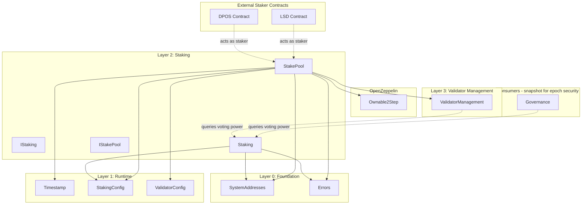
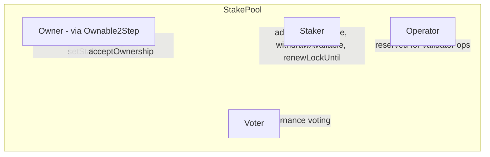

# Staking Layer Specification

## Overview

The Staking layer (Layer 2) provides generic staking infrastructure for Gravity. It is **decoupled from validator
management** — anyone can create a StakePool for any purpose (governance voting, delegation, validator bonding, etc.).

This design is inspired by Aptos's `stake.move` module but adapted for EVM with the following key differences:

- Individual StakePool contracts deployed via CREATE2 (not resources under addresses)
- Two-role separation (Owner/Staker) enables composable staking logic (DPOS, LSD, etc.)
- Staking is NOT validator-specific — validators use staking as a building block
- O(log n) bucket-based withdrawal model with prefix sums for efficient voting power queries

### Contracts

| Contract         | Purpose                                     |
| ---------------- | ------------------------------------------- |
| `IStaking.sol`   | Factory interface                           |
| `Staking.sol`    | Factory that creates StakePools via CREATE2 |
| `IStakePool.sol` | Individual pool interface                   |
| `StakePool.sol`  | Individual pool implementation              |

---

## Design Philosophy

### Key Principles

1. **Anyone Can Create a Pool** — No permission required to create a StakePool
2. **Bucket-Based Withdrawals** — Pending withdrawals aggregated into buckets sorted by lockedUntil
3. **Time-Parameterized Voting Power** — Voting power can be queried at any time T with O(log n) complexity
4. **No Epoch Processing** — Staking layer is stateless w.r.t. epochs; consumers (e.g., ValidatorManager) snapshot if needed
5. **Two-Role Separation** — Owner (admin) / Staker (funds) / Operator / Voter
6. **Composable Staking** — Staker role can be a smart contract for DPOS, LSD, etc.

### What This Layer Does

- Creates and manages individual StakePool contracts
- Tracks stake with lockup-based voting power (immediate effect)
- Provides voting power queries based on locked stake
- Enables composable staking via the staker role

### What Consumers Do (Not This Layer)

- **ValidatorManager** snapshots voting power at epoch boundaries for consensus security
- **Governance** may snapshot voting power at proposal creation

### What This Layer Does NOT Do

- Epoch-based stake transitions (no `onNewEpoch` processing)
- Voting power snapshots (consumers like ValidatorManager handle this)
- Validator management (handled by ValidatorManager in Layer 3)
- Governance voting logic (handled by Voting contract separately)
- Rewards distribution (consensus layer responsibility)
- Delegation accounting (external staker contract implementations)

---

## Architecture

```
src/staking/
├── IStaking.sol       # Factory interface
├── Staking.sol        # Factory implementation
├── IStakePool.sol     # Individual pool interface
└── StakePool.sol      # Individual pool implementation (inherits Ownable2Step)
```

### Dependency Graph



---

## System Addresses

| Constant  | Address                                  | Description                |
| --------- | ---------------------------------------- | -------------------------- |
| `STAKING` | `0x0000000000000000000000000001625F2012` | StakePool factory contract |

---

## Two-Role Separation

Each StakePool implements a two-role separation pattern:



### Role Definitions

| Role       | Controlled By      | Can Do                                                          |
| ---------- | ------------------ | --------------------------------------------------------------- |
| **Owner**  | `Ownable2Step`     | Set voter/operator/staker, transfer ownership (2-step process)  |
| **Staker** | `staker` address   | Add stake, unstake, withdraw, renew lockup (can be a contract)  |
| **Operator** | `operator` address | Reserved for validator operations (used by ValidatorManager)   |
| **Voter**  | `voter` address    | Cast governance votes using pool's voting power                 |

### Ownership Transfer (Ownable2Step)

StakePool inherits from OpenZeppelin's `Ownable2Step` for secure ownership transfers:

1. Current owner calls `transferOwnership(newOwner)` — sets pending owner
2. New owner calls `acceptOwnership()` — completes transfer

This prevents accidental transfers to wrong addresses.

### Staker as Smart Contract

The staker role enables composable staking:

```solidity
// Example: DPOS contract as staker (bucket-based withdrawals)
contract DPOSStaker {
    IStakePool public pool;
    mapping(address => uint256) public shares;
    
    function delegatedStake() external payable {
        // Track delegator shares
        shares[msg.sender] += msg.value;
        
        // Forward to pool (this contract is the staker)
        pool.addStake{value: msg.value}();
    }
    
    function requestDelegatedWithdraw(uint256 amount) external {
        require(shares[msg.sender] >= amount);
        shares[msg.sender] -= amount;
        
        // Unstake (creates pending bucket with current lockedUntil)
        pool.unstake(amount);
    }
    
    function claimDelegatedWithdraw(address recipient) external returns (uint256) {
        // Claim all available pending amounts
        return pool.withdrawAvailable(recipient);
    }
}
```

---

## Bucket-Based Withdrawal Model

Each StakePool uses a bucket-based withdrawal model with O(log n) voting power queries:

```
┌─────────────────────────────────────────────────────────────────────────────┐
│                      STAKE STATE MODEL (Bucket-Based)                        │
└─────────────────────────────────────────────────────────────────────────────┘

                              ┌──────────────┐
                     addStake │              │
                   ──────────▶│ activeStake  │
                              │   (amount)   │
                              └──────┬───────┘
                                     │
                    ┌────────────────┼────────────────┐
                    │                                 │
                    ▼                                 ▼
             ┌───────────┐                     ┌───────────────┐
             │  LOCKED   │   unstake()         │   PENDING     │
             │           │ ─────────────────▶  │   BUCKETS     │
             │ lockedUntil│                    │  (sorted by   │
             │  > now    │                     │  lockedUntil) │
             └───────────┘                     └───────────────┘
                    │                                 │
            Voting Power:                    withdrawAvailable()
    activeStake + effectivePending           (when now > lockedUntil + unbondingDelay)
                                                      │
                                                      ▼
                                              Tokens transferred
                                              (via claimedAmount pointer)
```

### State Variables

| Variable           | Type                  | Description                                    |
| ------------------ | --------------------- | ---------------------------------------------- |
| `activeStake`      | uint256               | Stake not in pending state                     |
| `lockedUntil`      | uint64                | Lockup expiration (microseconds)               |
| `_pendingBuckets`  | PendingBucket[]       | Sorted buckets with prefix-sum amounts         |
| `claimedAmount`    | uint256               | Cumulative amount claimed (claim pointer)      |

### PendingBucket Struct

```solidity
struct PendingBucket {
    uint64 lockedUntil;        // When this stake stops being effective
    uint256 cumulativeAmount;  // Prefix sum up to and including this bucket
}
```

### Voting Power Calculation

```solidity
function getVotingPower(uint64 atTime) returns (uint256) {
    // Voting power = activeStake + pending where lockedUntil > atTime
    return _getEffectiveStakeAt(atTime);
}

function _getEffectiveStakeAt(uint64 atTime) internal view returns (uint256) {
    // Find cumulative amount of pending that has become ineffective (lockedUntil <= atTime)
    uint256 ineffective = _getCumulativeAmountAtTime(atTime);  // O(log n) binary search
    
    // Subtract already claimed amount
    if (ineffective <= claimedAmount) {
        ineffective = 0;
    } else {
        ineffective -= claimedAmount;
    }
    
    // Calculate total pending
    uint256 totalPending = _pendingBuckets.length > 0 
        ? _pendingBuckets[len-1].cumulativeAmount - claimedAmount 
        : 0;
    
    if (ineffective >= totalPending) {
        return activeStake;
    }
    
    return activeStake + (totalPending - ineffective);
}
```

- **Time-parameterized**: Can query voting power at any time T
- **O(log n) complexity**: Binary search on sorted buckets with prefix sums
- **Pending effectiveness**: Pending stake is "effective" while lockedUntil > T

### Claiming Logic

Tokens become claimable when: `now > lockedUntil + unbondingDelay`

```solidity
function _getClaimableAmount() internal view returns (uint256) {
    uint64 now_ = ITimestamp(TIMESTAMP).nowMicroseconds();
    uint64 unbondingDelay = IStakingConfig(STAKE_CONFIG).unbondingDelayMicros();
    
    // lockedUntil must be < now - unbondingDelay for the bucket to be claimable
    if (now_ <= unbondingDelay) return 0;
    uint64 threshold = now_ - unbondingDelay;
    
    // Binary search for cumulative amount where lockedUntil <= threshold
    uint256 claimableCumulative = _getCumulativeAmountAtTime(threshold);
    
    if (claimableCumulative <= claimedAmount) return 0;
    return claimableCumulative - claimedAmount;
}
```

### State Transitions

**On `addStake(amount)` (staker only):**

- Increases `activeStake` by `amount` immediately
- Extends `lockedUntil` to `max(current, now + minLockupDuration)`
- Voting power increases immediately

**On `unstake(amount)` (staker only):**

- Reduces `activeStake` by `amount`
- Creates or merges into pending bucket with current `lockedUntil`
- For validators (ACTIVE or PENDING_INACTIVE): verifies `activeStake - amount >= minimumBond`
- Pending stake remains "effective" for voting until its lockedUntil passes

**On `withdrawAvailable(recipient)` (staker only):**

- Calculates claimable amount: buckets where `now > lockedUntil + unbondingDelay`
- Updates `claimedAmount` pointer (no bucket deletion needed)
- Transfers tokens to specified `recipient`
- Returns amount withdrawn

**On `unstakeAndWithdraw(amount, recipient)` (staker only):**

- Calls `unstake(amount)` then `withdrawAvailable(recipient)`
- Convenience function for users wanting to unstake and claim in one transaction

**On `renewLockUntil(duration)` (staker only):**

- Extends `lockedUntil` by `duration`
- Validates result: `newLockedUntil >= now + minLockupDuration`
- Does NOT affect existing pending buckets (they keep original lockedUntil)

---

## Contract: `Staking.sol` (Factory)

### Purpose

Factory contract that creates individual StakePool contracts via CREATE2. Provides registry of all pools for queries.
**Security-critical:** Only pools created by this factory should be trusted by validators.

### State Variables

```solidity
/// @notice Array of all StakePool addresses
address[] internal _allPools;

/// @notice Mapping to check if an address is a valid pool (SECURITY CRITICAL)
mapping(address => bool) internal _isPool;

/// @notice Counter for CREATE2 salt (increments with each pool created)
uint256 public poolNonce;
```

### Interface

```solidity
interface IStaking {
    // === Events ===
    event PoolCreated(
        address indexed creator,
        address indexed pool,
        address indexed owner,
        address staker,
        uint256 poolIndex
    );

    // === Pool Registry (View) ===
    function isPool(address pool) external view returns (bool);
    function getPool(uint256 index) external view returns (address);
    function getAllPools() external view returns (address[] memory);
    function getPoolCount() external view returns (uint256);
    function getPoolNonce() external view returns (uint256);
    function getMinimumStake() external view returns (uint256);

    // === Pool Status Queries (for Validators) ===
    function getPoolVotingPower(address pool, uint64 atTime) external view returns (uint256);
    function getPoolVotingPowerNow(address pool) external view returns (uint256);
    function getPoolEffectiveStake(address pool, uint64 atTime) external view returns (uint256);
    function getPoolActiveStake(address pool) external view returns (uint256);
    function getPoolTotalPending(address pool) external view returns (uint256);
    function getPoolOwner(address pool) external view returns (address);
    function getPoolStaker(address pool) external view returns (address);
    function getPoolVoter(address pool) external view returns (address);
    function getPoolOperator(address pool) external view returns (address);
    function getPoolLockedUntil(address pool) external view returns (uint64);
    function isPoolLocked(address pool) external view returns (bool);

    // === State-Changing Functions ===
    function createPool(
        address owner,
        address staker,
        address operator,
        address voter,
        uint64 lockedUntil
    ) external payable returns (address pool);

    // === System Functions ===
    function renewPoolLockup(address pool) external;
}
```

### Function Specifications

#### `isPool(address pool)` — **SECURITY CRITICAL**

Check if an address is a valid pool created by this factory.

**Behavior:**

- Returns `true` if `_isPool[pool]` is true
- Returns `false` otherwise

**Security Note:** Validators MUST use this function to verify pools before trusting their voting power.
Only pools that return `true` should be used in consensus calculations.

#### `createPool(owner, staker, operator, voter, lockedUntil)`

Create a new StakePool with all parameters specified explicitly.

**Behavior:**

1. Revert if `msg.value < minimumStake` (prevents spam)
2. Increment `poolNonce`
3. Compute deterministic address via CREATE2 (salt = `poolNonce`)
4. Deploy new StakePool contract with all parameters and initial stake (`msg.value`)
5. Pool constructor validates `lockedUntil >= now + minLockupDuration`
6. Add to `_allPools` array
7. Set `_isPool[pool] = true` (registers as valid pool)
8. Emit `PoolCreated` event
9. Return pool address

**Notes:**

- Anyone can call this function (no restriction on caller)
- Anyone can create multiple pools (no limit per address)
- All parameters must be explicitly provided (no defaults)
- `lockedUntil` must be valid: `>= now + minLockupDuration`
- Initial stake (`msg.value`) becomes the pool's activeStake immediately

#### Pool Status Query Functions

All pool status query functions revert with `InvalidPool(pool)` if the pool address is not valid.

| Function                            | Returns                                              |
| ----------------------------------- | ---------------------------------------------------- |
| `getPoolVotingPower(pool, atTime)`  | Pool's voting power at time T (accounts for pending) |
| `getPoolVotingPowerNow(pool)`       | Pool's current voting power (convenience function)   |
| `getPoolEffectiveStake(pool, atTime)`| Pool's effective stake at time T                    |
| `getPoolActiveStake(pool)`          | Pool's active stake (not including pending)          |
| `getPoolTotalPending(pool)`         | Pool's total pending withdrawal amount               |
| `getPoolOwner(pool)`                | Pool's owner address (from Ownable2Step)             |
| `getPoolStaker(pool)`               | Pool's staker address                                |
| `getPoolVoter(pool)`                | Pool's delegated voter address                       |
| `getPoolOperator(pool)`             | Pool's operator address                              |
| `getPoolLockedUntil(pool)`          | Pool's lockup expiration (microseconds)              |
| `isPoolLocked(pool)`                | Whether pool's stake is locked                       |

#### `renewPoolLockup(pool)` — System Function

Renew lockup for an active validator's stake pool.

**Access Control:** VALIDATOR_MANAGER only

**Behavior:**
1. Verify pool is valid via `_isPool[pool]`
2. Call `StakePool.systemRenewLockup()` on the pool
3. Pool sets `lockedUntil = now + lockupDurationMicros`

**Notes:**
- Called by ValidatorManagement during `onNewEpoch()` for each active validator
- Implements Aptos-style auto-renewal for active validators
- Ensures voting power never drops to zero due to lockup expiration

---

## Contract: `StakePool.sol`

### Purpose

Individual stake pool contract with O(log n) bucket-based withdrawals. Inherits from OpenZeppelin's `Ownable2Step` for ownership.

### State Variables

```solidity
/// @notice Address of the Staking factory
address public immutable FACTORY;

/// @notice Staker address (manages funds: stake/unstake/withdraw)
address public staker;

/// @notice Operator address (reserved for validator operations)
address public operator;

/// @notice Delegated voter address (votes in governance using this pool's stake)
address public voter;

/// @notice Active staked amount (not including pending withdrawals)
uint256 public activeStake;

/// @notice Lockup expiration timestamp (microseconds)
uint64 public lockedUntil;

/// @notice Pending withdrawal buckets sorted by lockedUntil (strictly increasing)
/// @dev Each bucket stores cumulativeAmount as prefix sum for O(log n) lookups
PendingBucket[] internal _pendingBuckets;

/// @notice Cumulative amount that has been claimed from pending buckets
/// @dev Acts as a claim pointer - no need to delete buckets
uint256 public claimedAmount;
```

### Interface

```solidity
interface IStakePool {
    // === Structs ===
    struct PendingBucket {
        uint64 lockedUntil;        // When this stake stops being effective
        uint256 cumulativeAmount;  // Prefix sum up to and including this bucket
    }

    // === Events ===
    event StakeAdded(address indexed pool, uint256 amount);
    event Unstaked(address indexed pool, uint256 amount, uint64 lockedUntil);
    event WithdrawalClaimed(address indexed pool, uint256 amount, address indexed recipient);
    event LockupRenewed(address indexed pool, uint64 oldLockedUntil, uint64 newLockedUntil);
    event OperatorChanged(address indexed pool, address oldOperator, address newOperator);
    event VoterChanged(address indexed pool, address oldVoter, address newVoter);
    event StakerChanged(address indexed pool, address oldStaker, address newStaker);

    // === View Functions ===
    function getStaker() external view returns (address);
    function getOperator() external view returns (address);
    function getVoter() external view returns (address);
    function getActiveStake() external view returns (uint256);
    function getTotalPending() external view returns (uint256);
    function getVotingPower(uint64 atTime) external view returns (uint256);
    function getVotingPowerNow() external view returns (uint256);
    function getEffectiveStake(uint64 atTime) external view returns (uint256);
    function getLockedUntil() external view returns (uint64);
    function getRemainingLockup() external view returns (uint64);
    function isLocked() external view returns (bool);
    function getPendingBucketCount() external view returns (uint256);
    function getPendingBucket(uint256 index) external view returns (PendingBucket memory);
    function getClaimedAmount() external view returns (uint256);
    function getClaimableAmount() external view returns (uint256);

    // === Owner Functions (via Ownable2Step) ===
    function setOperator(address newOperator) external;
    function setVoter(address newVoter) external;
    function setStaker(address newStaker) external;

    // === Staker Functions ===
    function addStake() external payable;
    function unstake(uint256 amount) external;
    function withdrawAvailable(address recipient) external returns (uint256 amount);
    function unstakeAndWithdraw(uint256 amount, address recipient) external returns (uint256 withdrawn);
    function renewLockUntil(uint64 durationMicros) external;

    // === System Functions ===
    function systemRenewLockup() external;
}
```

### Constructor

All parameters must be explicitly provided at pool creation:

```solidity
constructor(
    address _owner,
    address _staker,
    address _operator,
    address _voter,
    uint64 _lockedUntil
) payable Ownable(_owner) {
    FACTORY = msg.sender;
    
    // Validate lockedUntil >= now + minLockup
    uint64 now_ = ITimestamp(SystemAddresses.TIMESTAMP).nowMicroseconds();
    uint64 minLockup = IStakingConfig(SystemAddresses.STAKE_CONFIG).lockupDurationMicros();
    if (_lockedUntil < now_ + minLockup) {
        revert Errors.LockupDurationTooShort(_lockedUntil, now_ + minLockup);
    }
    
    staker = _staker;
    operator = _operator;
    voter = _voter;
    lockedUntil = _lockedUntil;
    activeStake = msg.value;
    
    emit StakeAdded(address(this), msg.value);
}
```

### Function Specifications

#### `addStake()` — Staker Only

Add native tokens to the stake pool. Voting power increases immediately.

**Access Control:** Only `staker`

**Behavior:**

1. Revert if `msg.value == 0`
2. Increase `activeStake` by `msg.value`
3. Update lockup: `lockedUntil = max(lockedUntil, now + minLockupDuration)`
4. Emit `StakeAdded` event

#### `unstake(uint256 amount)` — Staker Only

Unstake tokens (move from active stake to pending bucket).

**Access Control:** Only `staker`

**Behavior:**

1. Revert if `amount == 0`
2. Revert if `amount > activeStake` (insufficient available)
3. **For validators (ACTIVE or PENDING_INACTIVE)**: Check `activeStake - amount >= minimumBond`
4. Reduce `activeStake` by `amount`
5. Add to pending bucket with current `lockedUntil`:
   - If last bucket has same `lockedUntil`: merge (add to cumulativeAmount)
   - Otherwise: append new bucket with cumulative prefix sum
6. Emit `Unstaked` event

**Notes:**
- Active validators cannot reduce `activeStake` below `minimumBond`
- Combined with lockup auto-renewal at epoch boundaries, voting power is always >= minBond
- The pending amount is still "effective" for voting until its lockedUntil passes
- Tokens remain in contract until `withdrawAvailable()` is called after unbonding

#### `withdrawAvailable(address recipient)` — Staker Only

Withdraw all available pending stake.

**Access Control:** Only `staker`

**Behavior:**

1. Calculate claimable amount: buckets where `now > lockedUntil + unbondingDelay`
2. If claimable amount is 0, return 0
3. Update `claimedAmount` pointer (CEI pattern)
4. Emit `WithdrawalClaimed` event
5. Transfer tokens to `recipient`
6. Return amount withdrawn

**Notes:**
- Uses claim pointer model - O(log n) binary search, no bucket iteration
- Multiple pending buckets may be claimed in a single call
- Tokens are only transferred when claimed, not when unstaked

#### `unstakeAndWithdraw(uint256 amount, address recipient)` — Staker Only

Helper: unstake and withdraw in one call.

**Access Control:** Only `staker`

**Behavior:**

1. Call `_unstake(amount)` - moves amount from activeStake to pending bucket
2. Call `_withdrawAvailable(recipient)` - claims any previously pending amounts that have completed unbonding
3. Return amount actually withdrawn (may be 0 if nothing is claimable yet)

**Notes:**
- The newly unstaked amount is NOT immediately claimable (needs lockup + unbonding delay)
- Only previously pending amounts that have completed their waiting period are withdrawn

#### `renewLockUntil(uint64 durationMicros)` — Staker Only

Extend lockup by a specified duration to maintain or restore voting power.

**Access Control:** Only `staker`

**Behavior:**

1. Calculate `newLockedUntil = lockedUntil + durationMicros`
2. Revert if `newLockedUntil <= lockedUntil` (overflow protection)
3. Revert if `newLockedUntil < now + minLockupDuration` (result must be valid)
4. Update `lockedUntil = newLockedUntil`
5. Emit `LockupRenewed` event

**Notes:**

- The `durationMicros` parameter specifies how much time to ADD to the current lockup
- The **resulting** `newLockedUntil` must be `>= now + minLockupDuration`
- Does NOT affect existing pending buckets (they keep original lockedUntil)
- Can be used to restore voting power if lockup has expired

#### `systemRenewLockup()` — System Function

Renew lockup for active validators (called by Staking factory during epoch transitions).

**Access Control:** Only Staking factory

**Behavior:**

1. Get current time and lockup duration from config
2. Calculate `newLockedUntil = now + lockupDurationMicros`
3. If `newLockedUntil > lockedUntil`, update lockup and emit `LockupRenewed` event

**Notes:**

- Called by `Staking.renewPoolLockup()` which is called by ValidatorManagement
- Implements Aptos-style auto-renewal for active validators
- Ensures voting power never drops to zero due to lockup expiration while validating
- Does NOT affect existing pending buckets (they keep original lockedUntil)

#### `setOperator(address newOperator)` — Owner Only

Change the operator address.

**Access Control:** Only `owner` (via Ownable2Step)

**Behavior:**

1. Store old operator
2. Set `operator = newOperator`
3. Emit `OperatorChanged` event

#### `setVoter(address newVoter)` — Owner Only

Change the delegated voter address.

**Access Control:** Only `owner` (via Ownable2Step)

**Behavior:**

1. Store old voter
2. Set `voter = newVoter`
3. Emit `VoterChanged` event

#### `setStaker(address newStaker)` — Owner Only

Change the staker address.

**Access Control:** Only `owner` (via Ownable2Step)

**Behavior:**

1. Store old staker
2. Set `staker = newStaker`
3. Emit `StakerChanged` event

#### `getVotingPower(uint64 atTime)`

Returns voting power at a specific time T. Accounts for pending buckets.

**Behavior:**

1. Return effective stake at time T
2. Effective stake = activeStake + pending where lockedUntil > T
3. Uses O(log n) binary search on prefix-sum buckets

**Notes:**
- Pending buckets are "effective" while their lockedUntil > T
- Use `getVotingPowerNow()` for convenience to query current voting power

---

## Epoch Security (Consumer Responsibility)

The staking module itself has **no epoch processing**. Stake changes take effect immediately.

For epoch-based security (e.g., preventing flash-loan attacks on consensus), **consumers snapshot voting power**:

```
┌─────────────────────────────────────────────────────────────────────────────┐
│                      CONSUMER SNAPSHOT PATTERN                               │
└─────────────────────────────────────────────────────────────────────────────┘

  ValidatorManager                              StakePool(s)
       │                                             │
       │ At epoch boundary:                          │
       │ snapshot voting power for each validator    │
       │─────────────────────────────────────────────▶│
       │                                             │
       │            getVotingPower()                 │
       │◀─────────────────────────────────────────────│
       │                                             │
       │ Store snapshot for epoch N                  │
       │ Use snapshot for consensus this epoch       │
       │                                             │
```

### Why This Design

1. **Scalability** — No O(n) iteration over all pools at epoch boundary
2. **Simplicity** — Staking is stateless w.r.t. epochs
3. **Flexibility** — Different consumers can snapshot at different times (epoch start, proposal creation, etc.)
4. **Security** — ValidatorManager snapshots ensure consensus uses stable voting power

---

## Lockup Model

### Lockup Configuration

Lockup parameters are configured in `StakingConfig`:

- `lockupDurationMicros` — Minimum lockup duration (e.g., 14 days in microseconds)
- `unbondingDelayMicros` — Additional wait after lockup expires before withdrawal (e.g., 7 days)

### Lockup Behavior

1. **On createPool**: `lockedUntil` is provided by caller (must be `>= now + minLockupDuration`)
2. **On addStake**: `lockedUntil = max(current, now + minLockupDuration)` (extends if needed)
3. **On renewLockUntil(duration)**: `lockedUntil = lockedUntil + duration` (result must be `>= now + minLockupDuration`)

### Lockup and Withdrawals (Bucket-Based)

- **Unstake Phase**: `unstake(amount)` creates/merges pending bucket with current `lockedUntil`
- **Waiting Period**: Tokens wait in pending state until `now > lockedUntil + unbondingDelay`
- **Claim Phase**: `withdrawAvailable(recipient)` transfers all claimable tokens
- For active validators: can unstake but must maintain `activeStake >= minimumBond`
- Pending buckets are "effective" (count toward voting power) while `lockedUntil > now`
- Staker can re-lock by calling `renewLockUntil()` (does NOT affect existing pending buckets)
- **For active validators**: Lockups are auto-renewed at each epoch boundary via `systemRenewLockup()`
- **For non-validators**: No automatic lockup renewal — staker must explicitly extend

---

## Access Control

| Contract  | Function                                        | Allowed Callers         |
| --------- | ----------------------------------------------- | ----------------------- |
| Staking   | createPool                                      | Anyone (with min stake) |
| Staking   | renewPoolLockup                                 | VALIDATOR_MANAGER only  |
| Staking   | view functions                                  | Anyone                  |
| StakePool | addStake/unstake/withdrawAvailable/unstakeAndWithdraw/renewLockUntil | Staker only   |
| StakePool | systemRenewLockup                               | Staking factory only    |
| StakePool | setOperator/setVoter/setStaker                  | Owner only              |
| StakePool | transferOwnership                               | Owner only              |
| StakePool | acceptOwnership                                 | Pending owner only      |
| StakePool | view functions                                  | Anyone                  |

---

## Time Convention

All time values use **microseconds** (uint64), consistent with the Timestamp contract:

- `StakePool.lockedUntil` — microseconds
- `StakingConfig.lockupDurationMicros` — microseconds
- `StakingConfig.unbondingDelayMicros` — microseconds

---

## Errors

The following errors from `Errors.sol` are used:

### Staking Factory Errors

| Error                                                              | When                                   |
| ------------------------------------------------------------------ | -------------------------------------- |
| `InsufficientStakeForPoolCreation(uint256 sent, uint256 required)` | msg.value < minimumStake on createPool |
| `PoolIndexOutOfBounds(uint256 index, uint256 total)`               | Querying pool at invalid index         |
| `InvalidPool(address pool)`                                        | Pool status query on non-factory pool  |

### StakePool Errors

| Error                                                                | When                                                     |
| -------------------------------------------------------------------- | -------------------------------------------------------- |
| `ZeroAmount()`                                                       | addStake/unstake with 0                                  |
| `NotStaker(address caller, address staker)`                          | Non-staker calling staker-only function                  |
| `LockupDurationTooShort(uint64 provided, uint64 minimum)`            | renewLockUntil result < now + minLockupDuration          |
| `LockupOverflow(uint64 current, uint64 addition)`                    | renewLockUntil would overflow lockedUntil                |
| `InsufficientAvailableStake(uint256 requested, uint256 available)`   | unstake exceeds activeStake                              |
| `LockedUntilDecreased(uint64 previous, uint64 current)`              | Bucket lockedUntil decreased (internal invariant)        |
| `WithdrawalWouldBreachMinimumBond(uint256 activeStakeAfter, uint256 minimumBond)` | Validator unstake would reduce activeStake below min bond |
| `OnlyStakingFactory(address caller)`                                 | systemRenewLockup called by non-factory                  |
| `TransferFailed()`                                                   | ETH transfer failed during withdrawal                    |

---

## Usage Patterns

### Creating a StakePool and Staking

```solidity
// 1. Create a stake pool with all parameters (owner is also staker in this example)
uint64 lockUntil = uint64(block.timestamp * 1_000_000) + 30 days * 1_000_000;
address pool = staking.createPool{value: 100 ether}(
    msg.sender,  // owner
    msg.sender,  // staker
    msg.sender,  // operator
    msg.sender,  // voter
    lockUntil
);

// 2. Add more stake later (as staker, voting power increases immediately)
IStakePool(pool).addStake{value: 50 ether}();

// 3. Check voting power at current time
uint256 power = IStakePool(pool).getVotingPowerNow();

// 4. Check voting power at a future time
uint64 futureTime = uint64(block.timestamp * 1_000_000) + 15 days * 1_000_000;
uint256 futurePower = IStakePool(pool).getVotingPower(futureTime);

// 5. Delegate voting to another address (as owner)
IStakePool(pool).setVoter(delegatee);

// 6. Extend lockup by 30 days (as staker)
IStakePool(pool).renewLockUntil(30 days * 1_000_000); // microseconds

// 7. Unstake some amount (moves to pending bucket)
IStakePool(pool).unstake(50 ether);

// 8. Wait for lockup + unbonding delay, then withdraw available (as staker)
uint256 withdrawn = IStakePool(pool).withdrawAvailable(msg.sender);

// 9. Or combine unstake and withdraw in one call
uint256 withdrawn2 = IStakePool(pool).unstakeAndWithdraw(25 ether, msg.sender);
```

### Setting Up a DPOS Pool

```solidity
// 1. Deploy DPOS staker contract
DPOSStaker dposContract = new DPOSStaker();

// 2. Create stake pool with DPOS contract as staker
uint64 lockUntil = uint64(block.timestamp * 1_000_000) + 30 days * 1_000_000;
address pool = staking.createPool{value: 100 ether}(
    msg.sender,           // owner (admin control)
    address(dposContract), // staker (DPOS contract manages funds)
    msg.sender,           // operator
    address(dposContract), // voter (DPOS contract votes)
    lockUntil
);

// 3. Initialize DPOS contract with pool
dposContract.initialize(pool);

// 4. Delegators interact with DPOS contract
dposContract.delegate{value: 10 ether}();
```

### Validator Creating a Pool for Bonding

```solidity
// Validator creates their own pool for bonding
uint64 lockUntil = uint64(block.timestamp * 1_000_000) + 30 days * 1_000_000;
address validatorPool = staking.createPool{value: minBond}(
    msg.sender, // owner
    msg.sender, // staker
    msg.sender, // operator
    msg.sender, // voter
    lockUntil
);

// Validator can add more stake later (as staker)
IStakePool(validatorPool).addStake{value: additionalBond}();

// ValidatorManager queries the pool's voting power for consensus
uint64 now_ = timestamp.nowMicroseconds();
uint256 bondAmount = IStakePool(validatorPool).getVotingPower(now_);
```

---

## Testing Requirements

### Unit Tests

1. **Staking Factory**

   - createPool creates new pool with all parameters
   - createPool reverts if msg.value < minimumStake
   - createPool reverts if lockedUntil < now + minLockup
   - createPool allows same owner to create multiple pools
   - poolNonce increments correctly
   - isPool returns true only for factory-created pools

2. **StakePool**

   - addStake increases activeStake and extends lockup (staker only)
   - addStake voting power increases immediately
   - unstake moves funds to pending bucket (staker only)
   - unstake rejects if amount > activeStake
   - unstake for validators checks activeStake remains >= minimum bond
   - withdrawAvailable works when lockup + unbonding delay passed
   - withdrawAvailable returns 0 when nothing claimable
   - unstakeAndWithdraw combines both operations
   - getVotingPower returns correct value with pending buckets
   - renewLockUntil extends by specified duration (staker only)
   - renewLockUntil validates result >= now + minLockupDuration
   - Role separation (owner/staker/operator/voter)
   - Ownable2Step transfer works correctly

3. **Bucket Model**
   - Multiple unstakes create separate buckets with increasing lockedUntil
   - Same lockedUntil merges into existing bucket
   - Binary search finds correct cumulative amount
   - Claim pointer correctly tracks withdrawn amounts
   - Voting power calculation handles partial effectiveness

4. **Lockup Model**
   - Voting power = effective stake when locked
   - Effective stake decreases as pending buckets expire
   - Lockup extended on addStake
   - Lockup extended on renewLockUntil
   - systemRenewLockup updates lockup for active validators

### Fuzz Tests

1. Various stake amounts
2. Various lockup durations
3. Multiple pools with concurrent operations
4. Random sequences of unstake/withdraw operations

### Invariant Tests

1. `activeStake + totalPending == contract.balance + claimedAmount`
2. Pending buckets are always sorted by lockedUntil (strictly increasing)
3. Cumulative amounts are always increasing (prefix sums)
4. `claimedAmount` never exceeds total cumulative pending
5. Effective stake <= activeStake + totalPending

---

## Security Considerations

1. **Reentrancy** — All withdrawals use checks-effects-interactions pattern
2. **Flash Loan Protection** — Lockup period prevents flash-stake attacks for governance
3. **Epoch Security** — ValidatorManager snapshots voting power at epoch boundaries for consensus
4. **Integer Overflow** — Solidity 0.8+ built-in protection
5. **CREATE2 Collision** — Salt is poolNonce, deterministic and unique
6. **Two-Step Ownership** — Ownable2Step prevents accidental ownership transfers
7. **Role Separation** — Clear separation between owner (admin) and staker (funds)
8. **Immediate Effect Trade-off** — Stake changes are immediate; consumers must snapshot for epoch-based security
9. **Bucket-Based Withdrawals** — O(log n) efficiency with prefix sums, no iteration needed
10. **Minimum Bond Protection** — Active validators must maintain `activeStake >= minimumBond`
11. **Lockup Auto-Renewal** — Active validators' lockups are auto-renewed at epoch boundaries
12. **Time-Parameterized Voting Power** — Allows accurate voting power queries at any point in time
13. **Unbonding Delay** — Additional wait period after lockup expires before withdrawal
14. **Claim Pointer Model** — No bucket deletion needed, prevents storage slot manipulation attacks

---

## Changelog

### 2026-01-04: Bucket-Based Withdrawal Model

Updated specification to match the implemented O(log n) bucket-based withdrawal model:

**Withdrawal Model Change**
- Replaced queue-based nonce model with bucket-based prefix-sum model
- `requestWithdrawal(amount)` → `unstake(amount)`
- `claimWithdrawal(nonce, recipient)` → `withdrawAvailable(recipient)`
- Added `unstakeAndWithdraw(amount, recipient)` convenience function

**State Variable Changes**
- `stake` → `activeStake` (only tracks non-pending stake)
- `pendingWithdrawals` mapping → `_pendingBuckets` array
- `withdrawalNonce` → removed
- `totalPendingWithdrawals` → computed from buckets
- Added `claimedAmount` as claim pointer

**Struct Changes**
- `PendingWithdrawal { amount, claimableTime }` → `PendingBucket { lockedUntil, cumulativeAmount }`

**New Features**
- O(log n) voting power queries via binary search
- Buckets sorted by lockedUntil with prefix-sum cumulativeAmount
- Claim pointer model (no bucket deletion needed)
- Unbonding delay: additional wait after lockup expires

**Interface Changes**
- `getPoolStake()` → `getPoolActiveStake()`
- Added `getPoolTotalPending()`
- Added `getPendingBucketCount()`, `getPendingBucket()`, `getClaimedAmount()`, `getClaimableAmount()`

---

## Future Extensions

- **Operator Functions** — Expose operator-callable functions for validator integration
- **Partial Voting** — Split voting power across multiple votes
- **Time-Weighted Voting** — Bonus voting power for longer lockup periods
