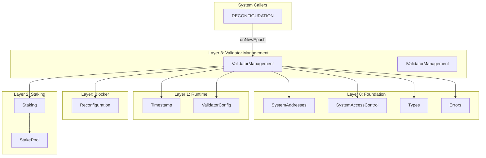

# Validator Management Layer Specification

## Overview

The Validator Management layer (Layer 3) provides validator lifecycle management for Gravity's consensus. It manages validator registration, activation/deactivation, and tracks the active validator set.

Key design principles:

1. **StakePool Integration**: Validators must have a StakePool with sufficient voting power to register
2. **ValidatorManager ↔ Staking Only**: ValidatorManager only interacts with the Staking factory contract, never StakePool directly
3. **Epoch-Based Transitions**: All status changes (PENDING_ACTIVE → ACTIVE, PENDING_INACTIVE → INACTIVE) happen at epoch boundaries
4. **Aptos-Style Index Assignment**: Validators get indices assigned at each epoch boundary for consensus protocol

---

## Core Invariant: Active Stake Minimum Bond Guarantee

> **CRITICAL INVARIANT**: For active validators (ACTIVE or PENDING_INACTIVE), `activeStake >= minimumBond` at all times.

This is the most important security property for validator staking. It ensures:

1. **Consensus Stability**: Validators cannot reduce their stake below the minimum bond while active
2. **Slashing Guarantee**: Sufficient stake is always locked and available for potential slashing
3. **Voting Power Integrity**: Combined with lockup auto-renewal, voting power remains stable and predictable

### Why ActiveStake (Not EffectiveStake)?

The previous design checked `effectiveStake at (now + minLockup) >= minBond`. This has a security flaw:

```
┌─────────────────────────────────────────────────────────────────────────────┐
│                    SECURITY FLAW IN PREVIOUS DESIGN                          │
└─────────────────────────────────────────────────────────────────────────────┘

  Scenario: minBond = 10 ETH, epoch duration > lockup duration
  
  1. Validator has activeStake = 20 ETH, lockedUntil = now + 7 days
  2. Validator unstakes 15 ETH → pending bucket created with lockedUntil = now + 7 days
  3. Check at (now + minLockup): pending is still "effective" ✓ passes
  4. Time passes... pending bucket's lockedUntil expires BEFORE next epoch
  5. At next epoch:
     - activeStake = 5 ETH (20 - 15 unstaked)
     - pending = 15 ETH but lockedUntil expired → ineffective (0 voting power)
     - effectiveStake = 5 ETH < minBond ✗
  6. But validator is already ACTIVE and STAYS ACTIVE!
  
  → The invariant is BROKEN between epochs
```

### The Fix: Check ActiveStake Directly

```
┌─────────────────────────────────────────────────────────────────────────────┐
│                    ACTIVE STAKE MINIMUM BOND GUARANTEE                       │
└─────────────────────────────────────────────────────────────────────────────┘

  For active validators (ACTIVE or PENDING_INACTIVE):
  
  activeStake >= minimumBond   (ALWAYS, at all times)
  
  On unstake():
    1. Check: activeStake - amount >= minimumBond
    2. If not → REVERT with WithdrawalWouldBreachMinimumBond
    3. Validator must leaveValidatorSet() first to withdraw below minBond
    
  Combined with:
    - Lockup auto-renewal at each epoch → voting power never drops to 0
    - activeStake >= minBond → baseline is always protected
    
  Result: Voting power is ALWAYS >= minBond for active validators
```

### How It Works with Lockup Auto-Renewal

```
┌─────────────────────────────────────────────────────────────────────────────┐
│                    COMBINED GUARANTEE                                        │
└─────────────────────────────────────────────────────────────────────────────┘

  activeStake >= minBond           (enforced on unstake)
           +
  lockedUntil auto-renewed         (at each epoch boundary)
           =
  votingPower >= minBond ALWAYS    (for active validators)

  Example:
  - Validator has activeStake = 15 ETH, pending = 5 ETH (lockedUntil expired)
  - At epoch boundary: lockup auto-renewed to now + minLockupDuration
  - Even though pending was ineffective, activeStake (15 ETH) >= minBond (10 ETH)
  - After renewal: votingPower = activeStake = 15 ETH ✓
  - Pending stake can be withdrawn after unbonding delay, but activeStake is protected
```

### Enforcement Points

| Check Point | Enforcement |
| --- | --- |
| **Registration** | Voting power at `now` must be ≥ `minimumBond` |
| **Join Validator Set** | Voting power at `now` must be ≥ `minimumBond` |
| **Epoch Activation** | Voting power at `now` must be ≥ `minimumBond` (or revert to INACTIVE) |
| **Unstake (ACTIVE/PENDING_INACTIVE)** | `activeStake - amount >= minimumBond` |
| **Epoch Renewal** | Lockup auto-renewed to `now + minLockupDuration` for all active validators |

### Simple and Robust

```solidity
// In StakePool._unstake():
if (validatorMgmt.isValidator(address(this))) {
    ValidatorStatus status = validatorMgmt.getValidatorStatus(address(this));
    if (status == ValidatorStatus.ACTIVE || status == ValidatorStatus.PENDING_INACTIVE) {
        uint256 minBond = IValidatorConfig(VALIDATOR_CONFIG).minimumBond();
        
        // Simple check: activeStake after unstake must be >= minBond
        if (activeStake - amount < minBond) {
            revert Errors.WithdrawalWouldBreachMinimumBond(activeStake - amount, minBond);
        }
    }
}
```

### Contracts

| Contract | Purpose |
| --- | --- |
| `IValidatorManagement.sol` | Interface definition |
| `ValidatorManagement.sol` | Validator lifecycle management |

---

## Architecture

```
src/staking/
├── IValidatorManagement.sol   # Interface
└── ValidatorManagement.sol    # Implementation
```

### Dependency Graph



---

## System Addresses

| Constant | Address | Description |
| --- | --- | --- |
| `VALIDATOR_MANAGER` | `0x0000000000000000000000000001625F2013` | Validator set management |
| `VALIDATOR_CONFIG` | `0x0000000000000000000000000001625F2015` | Validator configuration |

---

## Validator Lifecycle

```
                    registerValidator()
    ┌─────────────────────────────────────────┐
    │                                         ▼
    │    ┌──────────────┐   joinValidatorSet()   ┌────────────────┐
    │    │   INACTIVE   │ ─────────────────────▶ │ PENDING_ACTIVE │
    │    │  (no index)  │ ◀───────────────────── │   (no index)   │
    │    └──────────────┘   leaveValidatorSet()  └────────────────┘
    │           ▲           (cancel join)                │
    │           │                                        │ onNewEpoch()
    │           │                                        │ (assigns index)
    │           │                                        ▼
    │    ┌──────────────────┐                    ┌──────────────┐
    │    │ PENDING_INACTIVE │ ◀───────────────── │    ACTIVE    │
    │    │  (keeps index)   │   leaveValidatorSet() │  (has index) │
    │    └──────────────────┘                    └──────────────┘
    │           │
    │           │ onNewEpoch()
    │           │ (clears index)
    │           ▼
    └───── [INACTIVE]
              (no index)
```

### Status Definitions

| Status | Value | Description |
| --- | --- | --- |
| `INACTIVE` | 0 | Not in active validator set |
| `PENDING_ACTIVE` | 1 | Queued to join at next epoch |
| `ACTIVE` | 2 | Currently validating |
| `PENDING_INACTIVE` | 3 | Queued to leave at next epoch |

---

## Validator Index Assignment (Aptos-style)

Like Aptos, validator indices are assigned at each epoch boundary:

1. **Index Purpose**: Consensus protocol references validators by index (not address)
2. **When Assigned**: In `onNewEpoch()` when validators transition to ACTIVE
3. **Index Range**: 0 to (activeValidatorCount - 1)
4. **Re-assignment**: Indices are reassigned every epoch based on the new active set
5. **Storage**: `validatorIndex` field in `ValidatorRecord` (valid only when ACTIVE or PENDING_INACTIVE)

```
Epoch N:                    Epoch N+1:
┌─────────────────────┐     ┌─────────────────────┐
│ Validator A (idx 0) │     │ Validator C (idx 0) │  ← A left, C took idx 0
│ Validator B (idx 1) │     │ Validator B (idx 1) │  ← B kept idx 1
│ Validator C (idx 2) │     │ Validator D (idx 2) │  ← D joined at idx 2
└─────────────────────┘     └─────────────────────┘
```

---

## Contract: `ValidatorManagement.sol`

### Purpose

Manages validator registration, lifecycle transitions, and the active validator set. Validators must have a StakePool with sufficient voting power to register and participate in consensus.

### Key Constraint

**ValidatorManager ONLY calls the Staking factory contract**. It never calls StakePool contracts directly. All StakePool queries go through Staking's view functions:

- `Staking.isPool(pool)` - Verify pool is valid
- `Staking.getPoolVotingPower(pool, atTime)` - Get voting power at time T
- `Staking.getPoolOperator(pool)` - Get operator address
- `Staking.getPoolOwner(pool)` - Get owner address
- `Staking.renewPoolLockup(pool)` - Renew lockup for active validators

### Constants

```solidity
/// @notice Maximum moniker length in bytes
uint256 public constant MAX_MONIKER_LENGTH = 31;

/// @notice Precision factor for percentage calculations
uint256 internal constant PRECISION_FACTOR = 1e4;
```

### State Variables

```solidity
/// @notice Validator records by stakePool address
mapping(address => ValidatorRecord) internal _validators;

/// @notice Active validator addresses (ordered, index = validatorIndex)
address[] internal _activeValidators;

/// @notice Validators pending activation (will become ACTIVE at next epoch)
address[] internal _pendingActive;

/// @notice Validators pending deactivation (will become INACTIVE at next epoch)
address[] internal _pendingInactive;

/// @notice Current epoch number
uint64 public currentEpoch;

/// @notice Total voting power of active validators (snapshotted at epoch boundary)
uint256 public totalVotingPower;

/// @notice Whether the contract has been initialized
bool private _initialized;
```

### Interface

```solidity
interface IValidatorManagement {
    // === Events ===
    event ValidatorRegistered(address indexed stakePool, string moniker);
    event ValidatorJoinRequested(address indexed stakePool);
    event ValidatorActivated(address indexed stakePool, uint64 validatorIndex, uint256 votingPower);
    event ValidatorLeaveRequested(address indexed stakePool);
    event ValidatorDeactivated(address indexed stakePool);
    event ConsensusKeyRotated(address indexed stakePool, bytes newPubkey);
    event FeeRecipientUpdated(address indexed stakePool, address newRecipient);
    event EpochProcessed(uint64 epoch, uint256 activeCount, uint256 totalVotingPower);

    // === Registration ===
    function registerValidator(
        address stakePool,
        string calldata moniker,
        bytes calldata consensusPubkey,
        bytes calldata consensusPop,
        bytes calldata networkAddresses,
        bytes calldata fullnodeAddresses
    ) external;

    // === Lifecycle ===
    function joinValidatorSet(address stakePool) external;
    function leaveValidatorSet(address stakePool) external;
    
    // === Operator Functions ===
    function rotateConsensusKey(address stakePool, bytes calldata newPubkey, bytes calldata newPop) external;
    function setFeeRecipient(address stakePool, address newRecipient) external;
    
    // === Epoch Processing ===
    function onNewEpoch(uint64 newEpoch) external;
    
    // === View Functions ===
    function getValidator(address stakePool) external view returns (ValidatorRecord memory);
    function getActiveValidators() external view returns (ValidatorConsensusInfo[] memory);
    function getActiveValidatorByIndex(uint64 index) external view returns (ValidatorConsensusInfo memory);
    function getTotalVotingPower() external view returns (uint256);
    function getActiveValidatorCount() external view returns (uint256);
    function isValidator(address stakePool) external view returns (bool);
    function getValidatorStatus(address stakePool) external view returns (ValidatorStatus);
    function getCurrentEpoch() external view returns (uint64);
    function getPendingActiveValidators() external view returns (address[] memory);
    function getPendingInactiveValidators() external view returns (address[] memory);
}
```

---

## Function Specifications

### `registerValidator()`

Register a new validator with a stake pool.

**Access Control**: StakePool's operator only

**Parameters**:
- `stakePool` - Address of the stake pool (must be created by Staking factory)
- `moniker` - Display name (max 31 bytes)
- `consensusPubkey` - BLS public key for consensus
- `consensusPop` - Proof of possession for the BLS key
- `networkAddresses` - Network addresses for P2P
- `fullnodeAddresses` - Fullnode addresses

**Behavior**:
1. Verify `stakePool` is valid via `Staking.isPool(stakePool)`
2. Verify caller is operator via `Staking.getPoolOperator(stakePool)`
3. Verify validator doesn't already exist
4. Verify voting power >= `minimumBond` from ValidatorConfig
5. Verify moniker length <= 31 bytes
6. Create `ValidatorRecord` with status = INACTIVE
7. Set owner, operator, feeRecipient from stake pool
8. Emit `ValidatorRegistered` event

**Reverts**:
- `InvalidPool` - Pool not created by Staking factory
- `NotOperator` - Caller is not the pool's operator
- `ValidatorAlreadyExists` - Validator already registered
- `InsufficientBond` - Voting power below minimum
- `MonikerTooLong` - Moniker exceeds 31 bytes

---

### `joinValidatorSet()`

Request to join the active validator set.

**Access Control**: Validator's operator only

**Behavior**:
1. Verify no reconfiguration (epoch transition) is in progress
2. Verify validator exists and status is INACTIVE
3. Verify caller is operator
4. Verify `allowValidatorSetChange` is true
5. Verify voting power still meets minimum
6. Verify max validator set size won't be exceeded (activeValidators + pendingActive < maxSize)
7. Change status to PENDING_ACTIVE
8. Add to `_pendingActive` array
9. Emit `ValidatorJoinRequested` event

**Reverts**:
- `ReconfigurationInProgress` - Epoch transition in progress
- `ValidatorNotFound` - Validator not registered
- `NotOperator` - Caller is not the operator
- `InvalidStatus` - Validator not in INACTIVE status
- `ValidatorSetChangesDisabled` - Set changes not allowed
- `InsufficientBond` - Voting power dropped below minimum
- `MaxValidatorSetSizeReached` - At capacity

---

### `leaveValidatorSet()`

Request to leave the active validator set. Can also cancel a pending join request.

**Access Control**: Validator's operator only

**Behavior**:
1. Verify no reconfiguration (epoch transition) is in progress
2. Verify `allowValidatorSetChange` is true
3. Verify validator exists
4. Verify caller is operator
5. **If status is PENDING_ACTIVE** (cancel join request):
   - Remove from `_pendingActive` array
   - Change status to INACTIVE
   - Emit `ValidatorLeaveRequested` event
6. **If status is ACTIVE**:
   - Verify this is not the last active validator (consensus protection)
   - Change status to PENDING_INACTIVE
   - Add to `_pendingInactive` array
   - Emit `ValidatorLeaveRequested` event

**Reverts**:
- `ReconfigurationInProgress` - Epoch transition in progress
- `ValidatorSetChangesDisabled` - Set changes not allowed
- `ValidatorNotFound` - Validator not registered
- `NotOperator` - Caller is not the operator
- `InvalidStatus` - Validator not in ACTIVE or PENDING_ACTIVE status
- `CannotRemoveLastValidator` - Would leave validator set empty

---

### `onNewEpoch()`

Process epoch transition.

**Access Control**: RECONFIGURATION only

**Parameters**:
- `newEpoch` - The new epoch number to set

**Behavior**:
1. Process PENDING_INACTIVE → INACTIVE:
   - Clear validator index
   - Remove from `_activeValidators` array
   - Emit `ValidatorDeactivated` event
2. Process PENDING_ACTIVE → ACTIVE:
   - Check voting power increase limit
   - Validators exceeding limit remain pending
   - Validators below minimum revert to INACTIVE
   - Emit `ValidatorActivated` event
3. **Auto-renew lockups for active validators** (Aptos-style):
   - Call `Staking.renewPoolLockup(pool)` for each active validator
   - Ensures voting power never drops to zero due to lockup expiration
   - Matches Aptos `stake.move` lines 1435-1449
4. Apply pending fee recipient changes
5. Sync owner/operator from stake pools
6. Reassign indices (0 to n-1) for all active validators
7. Update epoch counter and total voting power
8. Emit `EpochProcessed` event

**Voting Power Limit**:
- New validators can only add up to `votingPowerIncreaseLimitPct`% of current total
- If limit is 20% and total is 100, max new power per epoch is 20
- Validators exceeding limit remain in PENDING_ACTIVE for next epoch

---

### `rotateConsensusKey()`

Rotate the validator's consensus key.

**Access Control**: Validator's operator only

**Behavior**:
1. Verify no reconfiguration (epoch transition) is in progress
2. Verify validator exists
3. Verify caller is operator
4. Update consensus pubkey and PoP (takes effect immediately)
5. Emit `ConsensusKeyRotated` event

**Reverts**:
- `ReconfigurationInProgress` - Epoch transition in progress
- `ValidatorNotFound` - Validator not registered
- `NotOperator` - Caller is not the operator

---

### `setFeeRecipient()`

Set a new fee recipient address.

**Access Control**: Validator's operator only

**Behavior**:
1. Verify no reconfiguration (epoch transition) is in progress
2. Verify validator exists
3. Verify caller is operator
4. Set `pendingFeeRecipient` (applied at next epoch)
5. Emit `FeeRecipientUpdated` event

**Reverts**:
- `ReconfigurationInProgress` - Epoch transition in progress
- `ValidatorNotFound` - Validator not registered
- `NotOperator` - Caller is not the operator

---

### View Functions

| Function | Description |
| --- | --- |
| `getValidator(stakePool)` | Get full validator record (reverts if not found) |
| `getActiveValidators()` | Get all active validators with consensus info |
| `getActiveValidatorByIndex(index)` | Get validator at specific index |
| `getTotalVotingPower()` | Get total voting power (snapshotted at epoch boundary) |
| `getActiveValidatorCount()` | Get count of active validators |
| `isValidator(stakePool)` | Check if pool is a registered validator (returns false for unregistered) |
| `getValidatorStatus(stakePool)` | Get validator status (reverts if not found) |
| `getCurrentEpoch()` | Get current epoch number |
| `getPendingActiveValidators()` | Get list of pending active validators |
| `getPendingInactiveValidators()` | Get list of pending inactive validators |

---

## Access Control Matrix

| Function | Allowed Callers |
| --- | --- |
| `registerValidator` | StakePool operator (verified via Staking) |
| `joinValidatorSet` | Validator's operator (verified via Staking) |
| `leaveValidatorSet` | Validator's operator (verified via Staking) |
| `rotateConsensusKey` | Validator's operator (verified via Staking) |
| `setFeeRecipient` | Validator's operator (verified via Staking) |
| `onNewEpoch` | RECONFIGURATION only |
| All view functions | Anyone |

---

## Voting Power Calculation

Voting power is calculated by querying the Staking contract:

```solidity
function _getValidatorVotingPower(address stakePool) internal view returns (uint256) {
    uint64 now_ = ITimestamp(SystemAddresses.TIMESTAMP).nowMicroseconds();
    uint256 power = IStaking(SystemAddresses.STAKING).getPoolVotingPower(stakePool, now_);
    uint256 maxBond = IValidatorConfig(SystemAddresses.VALIDATOR_CONFIG).maximumBond();
    return power > maxBond ? maxBond : power;
}
```

- Power is capped at `maximumBond` from ValidatorConfig
- Power is calculated at current time using time-parameterized voting power
- Only effective stake counts as voting power (activeStake + effective pending)

---

## Unstake Protection for Active Validators

Active validators (status ACTIVE or PENDING_INACTIVE) have unstake protection enforced at the StakePool level:

```solidity
// In StakePool._unstake():
IValidatorManagement validatorMgmt = IValidatorManagement(SystemAddresses.VALIDATOR_MANAGER);
if (validatorMgmt.isValidator(address(this))) {
    ValidatorStatus status = validatorMgmt.getValidatorStatus(address(this));
    if (status == ValidatorStatus.ACTIVE || status == ValidatorStatus.PENDING_INACTIVE) {
        uint256 minBond = IValidatorConfig(SystemAddresses.VALIDATOR_CONFIG).minimumBond();
        
        // Simple check: activeStake after unstake must be >= minBond
        if (activeStake - amount < minBond) {
            revert Errors.WithdrawalWouldBreachMinimumBond(activeStake - amount, minBond);
        }
    }
}
```

**Key Security Properties**:
1. Active validators cannot reduce `activeStake` below `minimumBond`
2. This is a simple, direct check on `activeStake` (not `effectiveStake`)
3. Combined with lockup auto-renewal at epoch boundaries, voting power is always >= minBond
4. Validators must call `leaveValidatorSet()` and wait for epoch transition to become INACTIVE before full withdrawal
5. Pending stake (already unstaked) can still be withdrawn after unbonding delay - only activeStake is protected

---

## Errors

| Error | When |
| --- | --- |
| `InvalidPool(address)` | Pool not created by Staking factory |
| `NotOperator(address, address)` | Caller is not the operator |
| `ValidatorNotFound(address)` | Validator not registered |
| `ValidatorAlreadyExists(address)` | Validator already registered |
| `InsufficientBond(uint256, uint256)` | Voting power below minimum |
| `InvalidStatus(uint8, uint8)` | Wrong status for operation |
| `MonikerTooLong(uint256, uint256)` | Moniker exceeds 31 bytes |
| `ValidatorSetChangesDisabled()` | Set changes not allowed |
| `MaxValidatorSetSizeReached(uint256)` | At validator set capacity |
| `ValidatorIndexOutOfBounds(uint64, uint64)` | Index >= active count |
| `ReconfigurationInProgress()` | Operation blocked during epoch transition |
| `CannotRemoveLastValidator()` | Would leave validator set empty (halt consensus) |

---

## Usage Patterns

### Creating and Registering a Validator

```solidity
// 1. Create a stake pool with sufficient bond
uint64 lockUntil = uint64(block.timestamp * 1_000_000) + 30 days * 1_000_000;
address pool = staking.createPool{value: 10 ether}(
    msg.sender,  // owner
    msg.sender,  // staker
    msg.sender,  // operator (required for validator registration)
    msg.sender,  // voter
    lockUntil
);

// 2. Register as validator (caller must be pool operator)
validatorManager.registerValidator(
    pool,
    "my-validator",
    consensusPubkey,
    consensusPop,
    networkAddresses,
    fullnodeAddresses
);

// 3. Request to join active set
validatorManager.joinValidatorSet(pool);

// 4. Wait for epoch transition - validator becomes ACTIVE
```

### Leaving the Validator Set

```solidity
// 1. Request to leave (must be ACTIVE or PENDING_ACTIVE)
validatorManager.leaveValidatorSet(pool);

// 2. Wait for epoch transition - validator becomes INACTIVE

// 3. Now staker can unstake without minimum bond restriction
IStakePool(pool).unstake(fullAmount);

// 4. Wait for lockup + unbonding delay, then withdraw
IStakePool(pool).withdrawAvailable(recipient);
```

### Canceling a Join Request

```solidity
// Validator in PENDING_ACTIVE status can cancel
validatorManager.leaveValidatorSet(pool);
// Status reverts to INACTIVE immediately (no epoch wait needed)
```

---

## Testing Requirements

### Unit Tests

1. **Registration**
   - Successful registration
   - Revert on invalid pool
   - Revert on non-operator caller
   - Revert on duplicate registration
   - Revert on insufficient bond
   - Revert on long moniker

2. **Join Validator Set**
   - Successful join request
   - Revert on non-INACTIVE status
   - Revert on disabled set changes
   - Revert on max size reached
   - Revert during reconfiguration

3. **Leave Validator Set**
   - Successful leave request from ACTIVE
   - Successful cancel from PENDING_ACTIVE
   - Revert on invalid status
   - Revert on last validator
   - Revert during reconfiguration

4. **Epoch Processing**
   - Activates pending validators
   - Deactivates pending inactive
   - Assigns indices correctly
   - Respects voting power limit
   - Updates total voting power
   - Renews lockups for active validators
   - Applies pending fee recipients
   - Syncs owner/operator from stake pools

5. **Operator Functions**
   - Rotate consensus key
   - Set fee recipient (applied at epoch)
   - Revert during reconfiguration

6. **Unstake Protection**
   - Active validator cannot unstake below minimum bond
   - PENDING_INACTIVE validator cannot unstake below minimum bond
   - INACTIVE validator can unstake fully

### Fuzz Tests

1. Various bond amounts
2. Multiple validators joining/leaving
3. Random epoch sequences

### Invariant Tests

1. **Active Stake Minimum Bond** (CRITICAL): For all active validators (ACTIVE or PENDING_INACTIVE), `activeStake >= minimumBond`
2. **Voting Power Guarantee**: After epoch renewal, for all active validators, `votingPower >= minimumBond`
3. Indices are always contiguous (0 to n-1)
4. Total voting power matches sum of individual powers
5. Only ACTIVE/PENDING_INACTIVE validators have valid indices
6. Status transitions follow defined state machine
7. Active validators' lockups are always ≥ `now` after epoch renewal

---

## Security Considerations

1. **Active Stake Minimum Bond** (CRITICAL): Active validators must maintain `activeStake >= minimumBond` at all times. This is enforced by a simple check on `activeStake - amount >= minBond` on every unstake operation. Combined with lockup auto-renewal, this guarantees voting power is always >= minBond.
2. **StakePool Validation**: Only pools created by Staking factory are accepted
3. **Operator Authorization**: All operations verify caller is the pool's operator via Staking contract
4. **Voting Power Limit**: Prevents rapid validator set takeover
5. **Epoch-Based Changes**: No immediate activation/deactivation (prevents flash-stake attacks)
6. **Index Consistency**: Indices are reassigned every epoch to maintain contiguity
7. **No Direct StakePool Calls**: All pool queries go through Staking factory
8. **Reconfiguration Guard**: Operations blocked during epoch transitions (Aptos `assert_reconfig_not_in_progress` pattern)
9. **Last Validator Protection**: Cannot remove the last active validator (would halt consensus)
10. **Leave Flexibility**: Validators can cancel join requests by leaving from PENDING_ACTIVE state
11. **Unstake Protection**: Active validators cannot reduce `activeStake` below `minimumBond` (simple direct check)
12. **Lockup Auto-Renewal**: Active validators have lockups auto-renewed at epoch boundaries (Aptos-style), ensuring voting power = activeStake
13. **Excessive Stake Protection**: Even stake exceeding maximumBond cannot cause voting power to exceed cap, but the full amount is still subject to unstake restrictions

---

## Changelog

### 2026-01-04: Security Fix - Active Stake Minimum Bond

**SECURITY FIX**: Changed from checking `effectiveStake at (now + minLockup)` to checking `activeStake` directly.

**The Problem (Previous Design)**
- Previous design checked `effectiveStake at (now + minLockup) >= minBond`
- This allowed a validator to unstake below minBond in activeStake as long as pending was "effective"
- If pending bucket's lockedUntil expired before the next epoch, effective stake would drop below minBond
- But the validator would remain ACTIVE with insufficient stake

**The Fix**
- Now checks `activeStake - amount >= minimumBond` directly
- This ensures activeStake (the baseline) is always >= minBond for active validators
- Combined with lockup auto-renewal at epoch boundaries, voting power is always >= minBond
- Simple, robust, no timing edge cases

**Changes**
- Updated Core Invariant section with new design and security flaw explanation
- Updated Unstake Protection section with simplified check
- Updated Security Considerations
- Updated Invariant Tests

### 2026-01-04: Specification Alignment

Updated specification to match the current implementation:

**Unstake Protection Clarification**
- Clarified that unstake protection is enforced in `StakePool._unstake()`, not a separate withdraw function
- Active validators (ACTIVE or PENDING_INACTIVE) cannot unstake below minimumBond effective stake
- The check considers effective stake at `(now + minLockup)` to ensure bond maintenance throughout lockup
- Added code example showing the actual implementation

**Voting Power Queries**
- Updated `_getValidatorVotingPower()` to show time-parameterized query using `getPoolVotingPower(pool, now_)`

**Interface Updates**
- `onNewEpoch(uint64 newEpoch)` now takes the new epoch number as a parameter

### 2026-01-03: Staking Security Enhancements

Added security mechanisms to protect active validators and match Aptos's staking behavior:

**Unstake Protection**
- Active validators (ACTIVE or PENDING_INACTIVE) cannot unstake below minimum bond
- Enforced in `StakePool._unstake()` by checking `ValidatorManagement.getValidatorStatus()`
- Validators must call `leaveValidatorSet()` and wait for epoch transition to become INACTIVE
- Error: `WithdrawalWouldBreachMinimumBond(effectiveAfter, minBond)`

**Lockup Auto-Renewal (Aptos-style)**
- Added `_renewActiveValidatorLockups()` called in `onNewEpoch()`
- Calls `Staking.renewPoolLockup(pool)` for each active validator
- Sets `lockedUntil = now + lockupDurationMicros`
- Ensures voting power never drops to zero due to lockup expiration
- Matches Aptos `stake.move` lines 1435-1449

**Excessive Stake Protection**
- Even stake amounts exceeding `maximumBond` cannot be withdrawn while active
- The entire stake is locked, not just the portion contributing to voting power
- Validators must leave the active set before any withdrawal

**New Functions Added**
- `Staking.renewPoolLockup(pool)` - Called by ValidatorManagement to renew lockups
- `StakePool.systemRenewLockup()` - Called by Staking factory for auto-renewal

### 2026-01-03: Aptos Security Parity

Added security checks to match Aptos's `stake.move` validator management:

**Reconfiguration Guard**
- Added `whenNotReconfiguring` modifier using `IReconfiguration.isTransitionInProgress()`
- Applied to: `joinValidatorSet()`, `leaveValidatorSet()`, `rotateConsensusKey()`, `setFeeRecipient()`
- Mirrors Aptos's `assert_reconfig_not_in_progress()` pattern
- Blocks operations during the entire DKG period (from `checkAndStartTransition` to `finishTransition`)

**Last Validator Protection**
- Added check in `leaveValidatorSet()` to prevent removing the last active validator
- Reverts with `CannotRemoveLastValidator` error
- Prevents consensus halt

**Leave from PENDING_ACTIVE**
- Extended `leaveValidatorSet()` to handle PENDING_ACTIVE status
- Allows validators to cancel their join request before activation
- Removes from pending queue and reverts status to INACTIVE
- Added `_removeFromPendingActive()` helper function

**allowValidatorSetChange for Leave**
- Added `allowValidatorSetChange` check to `leaveValidatorSet()` (was only on join)
- Matches Aptos behavior where both join and leave are gated by this config
